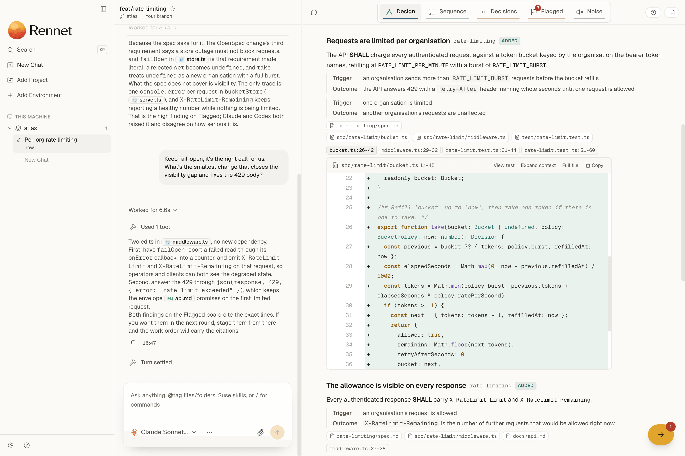

# Rennet

<p align="center"></p>

**Make code digestible.** Rennet is a local-first review app that turns a large, agent-written change into something you can read: grouped by intent, ordered for comprehension, with every claim tied to its source.

**For agentic engineers who stopped writing the code but still have to answer for it.** Not for vibe coders.

Coding agents now write changes faster than anyone can read them. Rennet spends machine effort to save your attention, running the review through the Claude Code and Codex you already have installed.

<p align="center">
  <picture>
    <source media="(prefers-color-scheme: dark)" srcset="apps/marketing/public/product/lens-design-dark.png">
    
  </picture>
</p>

**Website:** [rennet.dev](https://rennet.dev). **Documentation:** [docs.rennet.dev](https://docs.rennet.dev).

## Quickstart

Download the macOS app from [rennet.dev](https://rennet.dev), or run it from source:

```sh
corepack enable
pnpm install --frozen-lockfile
pnpm dev
```

Choose a Git repository in the desktop app. Rennet captures committed feature-branch changes, staged and unstaged changes, and nonignored untracked files without writing to the source repository.

## What Rennet does

Rennet is a **local-first** code review application. It turns local changes and GitHub pull requests into an ordered review with source evidence. The reviewer remains responsible for anything posted in their name.

The local daemon captures immutable patchsets, builds deterministic project context, and runs reviews through installed coding agents. Desktop and browser clients connect to the same daemon, and a native mobile client is in progress ([#383](https://github.com/rbutera/rennet/issues/383)). Team work can become a GitHub review. Your own branch can become an agent work order, a reviewed delta, and a pull request.

## Start here

- [Documentation map](./docs/README.md): every current user, developer, and decision page.
- [Using Rennet](./docs/using/index.md): the product, the review loop, and the shortest route through it.
- [Architecture overview](./docs/developing/concepts/architecture-overview.md): packages, processes, state, and live review paths.
- [Architecture contracts](./docs/developing/concepts/architecture-contracts.md): immutable patchsets, context, lineage, persistence, and publication.
- [Contracts and rulings](./docs/developing/decisions/contracts-and-rulings.md): the authority register and durable product decisions.
- [Dependency standard](./docs/developing/reference/dependency-standard.md): package, licence, toolchain, and ownership decisions.

## Repository shape

```text
apps/          Desktop, browser-hosting, mobile, documentation, and marketing apps
packages/      Protocol, prompts, core, adapters, server, client, UI kit, app UI, T3 chat mount, and theme
scripts/       Repository gates and maintenance tooling
tools/         Build tooling (the Nx cache proxy)
docs/          Canonical Markdown documentation and architecture decisions
brand/         Canonical brand assets, sources, and generated exports
openspec/      Accepted specs and the change proposals that produced them
vendor/        Vendored T3 Code snapshot, advanced with `pnpm t3:fold`
prototypes/    Non-authoritative interface experiments
site/          Frozen pre-launch site kept as design history, not deployed
spikes/        Isolated evidence probes, excluded from the workspace
```

## Current checks

```sh
pnpm check
pnpm architecture
pnpm e2e
pnpm exec nx run rennet-desktop:package-smoke
```

Nx runs and locally caches formatting, architecture checks, licence checks, lint, typechecking, unit tests, and builds across the workspace. The architecture and licence targets include failing controls that prove the checks can reject bad input. Electron E2E and Forge packaging are uncached because they exercise process and artifact boundaries.

## Privacy boundary

There is no Rennet backend. Selected harnesses or model providers may receive explicitly assembled code and context; Rennet records the assembled context rather than pretending the whole loop is offline. Never use client repositories, data, screenshots, or pull requests as fixtures without written authorization.

Rennet is licensed under [FSL-1.1-MIT](./LICENSE), the Functional Source License with an MIT future grant: source-available and free to read, run, modify, and redistribute for any purpose except building a competing product, with each release converting to the MIT licence two years after publication. Bundled third-party dependencies keep their own permissive licences; see [`THIRD-PARTY-LICENSES.md`](./THIRD-PARTY-LICENSES.md).
