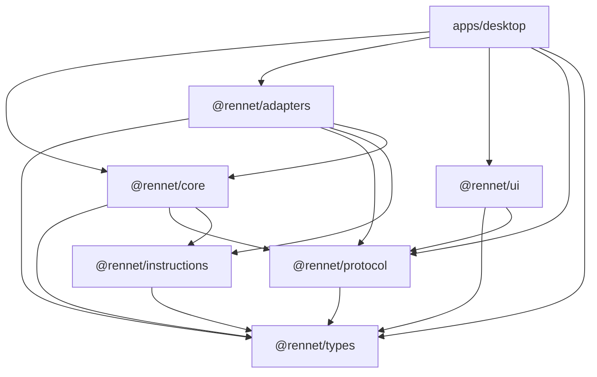
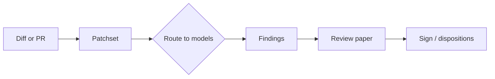

Rennet is a pnpm + Nx monorepo. The product is split into small packages under
`packages/*` with a single desktop application under `apps/desktop`. The
dependency arrows between packages are enforced by a boundary check
(`scripts/check-boundaries.mjs`) that runs as part of `pnpm check`, so the graph
below is not aspirational — a violation fails the build.

## Package dependency graph

Read the arrows as "depends on". `@rennet/types` sits at the bottom and depends
on nothing; everything is allowed to depend on it. `@rennet/core` is the review
engine; `@rennet/adapters` wraps the model harnesses; `@rennet/ui` renders the
review surface; `apps/desktop` composes them into the Electron app.

## The shape of a review

A review moves through a small number of stages, each with a clear boundary
between "what the model produced" and "what Rennet recorded".

- **Patchset** — the diff, digested into a structure Rennet can read and anchor
  threads against.
- **Route** — the patchset is planned across the configured set of model
  invocations.
- **Findings** — what the models reported, grouped by the file and flow they
  touch.
- **Paper** — the durable record of the review.
- **Sign** — your dispositions, recorded; nothing the model authored is treated
  as a decision until you make it one.

## Where to go next

- [Architecture contracts](/developing/concepts/architecture-contracts/) — the
  boundaries in detail.
- [Design doctrine](/developing/concepts/design-doctrine/) — the principles the
  code is written against.
- [Delivery order](/developing/reference/delivery-order/) — the sequence the
  product is built in.
