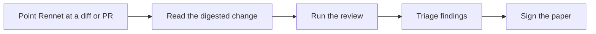

Rennet turns a change you need to review into something you can actually read,
runs it through models, and lets you sign off. This page is the end-to-end
shape; the [user journey](/using/guide/user-journey/) walks a real session.

## The loop

1. **Point Rennet at a change.** A local diff or a pull request.
2. **Read the digested change.** Rennet anchors the diff so findings attach to
   the file and flow they touch, not to a line number that has already moved.
3. **Run the review.** The change is routed across the configured set of models.
4. **Triage findings.** Findings are grouped, not dumped; you keep, dismiss, or
   act on each.
5. **Sign the paper.** Your dispositions are recorded. Nothing the model wrote
   is a decision until you make it one.

## What Rennet is not

Rennet is a review *harness*, not an autofix bot. It reads, routes, reports, and
records — it does not merge, push, or change your code on your behalf. See
[product and vision](/using/concepts/product-and-vision/) for the full framing.
