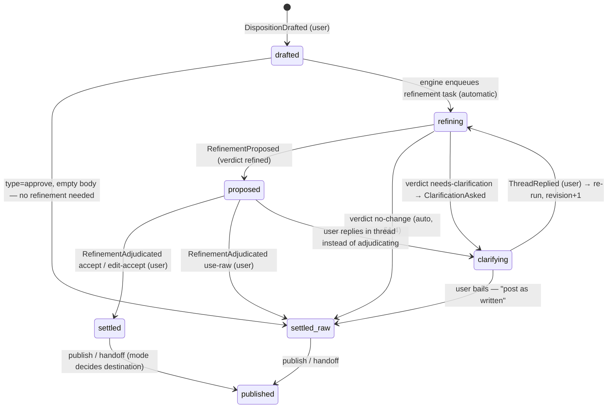

# Rennet Comment-Refinement Loop

> ⚠️ **RULE ZERO (CLAUDE.md, 2026-08-11) outranks this document.** No consent gates, no gates, no robustness for robustness' sake. The messy-in/clean-out loop, the refiner contract, and the clarification thread all stand; the passages carrying a ⛔ SUPERSEDED marker are void where they conflict.

*Design doc, 2026-08-06. Designs Rai's headline new feature (voice, 2026-08-06): when the user comments / requests-change / disapproves, the raw input is NOT what gets posted — an agent interprets and cleans it, asking inline clarifying questions when unclear, and the publish preview shows the cleaned, investigated version. "Write it messy → agent cleans it up → clean version lands on the PR." Extends Rennet Contracts and Rulings §2.1 (the disposition model + handoff loop), the Canvas Paradigm's L2 layer, and the publication contract (Architecture Contracts §9). Honours: MIT throughout, action-defined read state, smooth+quick, decisions-never-capped, roll-up/zoom, Q5 view+lens-at-request-time.*

**Headline recommendation up front: model refinement as a lifecycle on the existing disposition — the raw draft is immutable and user-sovereign, the refined form is a fleet-emitted, validator-admitted `refinement@1` document that becomes the *effective body* only through a user adjudication act (the R9 propose→adjudicate pattern the canvas contract already uses), and the publish/handoff sheet is the adjudication backstop so nothing unadjudicated ever leaves the machine. Refinement runs always, in the background, on the light tier; it never blocks the user's next disposition; clarification questions are the exception path (a `needs-clarification` verdict rendered into a per-disposition inline thread), not the default. The clarification thread is local machinery and is structurally excluded from publish — paper is what leaves the machine, and the paper is the effective body. Ship slice A (no thread: draft → background refine → sheet adjudication → publish/handoff) first; it already delivers the whole "messy in, clean out" promise.**

> ⛔ **SUPERSEDED 2026-08-11 by RULE ZERO (CLAUDE.md).** No consent gates, no gates, no robustness for robustness' sake. "The sheet is the adjudication backstop so nothing unadjudicated ever leaves" is a gate: the draft surfaces unsettled rows and offers one-act accept-all, and the user signs whenever they choose (see §4).

---

## 0. What the feature is, precisely

Three sentences, from Rai's verbatim intent:

1. **The raw disposition is a draft, not the artifact.** What posts to a PR, and what a coding harness receives in the handoff bundle, is a cleaned-up, investigated, properly-processed version.
2. **When the raw text is unclear, the agent asks — inline, anchored to that little diff** — a back-and-forth to clarify, suggest different approaches, or confirm "is this what you mean?", which the user approves.
3. **The user's view + lens context at the moment they wrote it is part of the input** (Q5): "requested a change while on the decisions lens" disambiguates what a terse comment means.

And one constraint that shapes everything: **smooth and quick.** The user is allowed to be lazy and messy *because* the loop exists; therefore the loop must never make disposing slower than not having it. Every design choice below is downstream of that.

---

## 1. Data model: the disposition grows a lifecycle

### 1.1 The extended shape (PROPOSAL)

Slice 1's `{anchor, type, body}` (Rennet Contracts and Rulings §2.1) becomes the *draft* of a richer object. One model, still — the mode still decides where it goes, never what it is:

```ts
interface Disposition {
  dispositionId: DispositionId          // minted at draft time (uuidv7, same as reviews)
  reviewId: ReviewId
  patchsetId: PatchsetId
  anchor: Anchor                        // line | range | chunk | fragment (verbs x anchors)
  type: 'approve' | 'request-change' | 'comment' | 'question'   // unchanged

  draft: {
    body: string                        // the user's raw text, VERBATIM, immutable forever
    viewContext: {                      // Q5: captured at the moment of the request
      canvasId: CanvasId                // which canvas / angle they were on
      lens: Angle                       // the active lens
      expandedCohorts?: CohortId[]
      selection?: Anchor | ElementId
    }
    at: ISOTimestamp
  }

  refinement?: {
    docId: DocId                        // the admitted refinement@1 document (§2)
    revision: number                    // increments on each re-run (after thread replies)
    proposedBody: string
    alternatives?: Alternative[]        // "suggest different approaches"
    evidence?: (Anchor | DocId)[]       // what the refiner consulted / verified
  }

  effective?: {
    body: string                        // THE artifact: what publishes / hands off
    basis: 'refined' | 'user-edited' | 'raw' | 'raw-no-change'
    adjudicatedAt: ISOTimestamp
  }

  thread: ThreadMessage[]               // §3 — inline clarification, oldest-first
  state: DispositionState               // §1.3
}

interface ThreadMessage {
  messageId: string
  author: 'user' | 'refiner'            // exactly two speakers in v1 (OQ3)
  body: string
  refinementDocId?: DocId               // agent messages cite the doc that produced them
  at: ISOTimestamp
}
```

### 1.2 The three sovereignty rules that make this consistent with L2

The Canvas Paradigm says L2 is user-sovereign: no agent, including the orchestrator, may write to it. Refinement puts agent-authored *text* adjacent to L2, so the boundary must be drawn exactly:

1. **The draft is untouchable.** No agent ever edits, rewrites, or deletes `draft.body`. It is the permanent record of what the user actually said — the audit trail for "what did I write vs what got posted", and the input every re-refinement starts from.
2. **A refinement is a proposal, never a write.** `RefinementProposed` attaches a *candidate*; it changes nothing about what would publish. This is the R9 / `canvas.propose` pattern verbatim: complete proposal, deterministic validation, user accepts/edits/dismisses. The invariant restated for this feature: ⭐ **nothing becomes the effective body without a user act.**
3. **The effective body is written only by adjudication** — a user action (`accept`, `edit-then-accept`, `use-raw`) or the one safe automatic case (§1.4, `raw-no-change`). Once effective and published, it is history (append-only, R32).

### 1.3 State machine



Notes on the shape:

- **`drafted` is a complete, publishable disposition.** Refinement is an enhancement pass over a finished act, not a gate on the act. If the refiner never runs (budget exhausted, model down), the disposition degrades to `settled_raw` at the sheet — the loop failing means *worse prose*, never *lost review work*.
- **"Post as written" is a permanently available escape hatch on every disposition in every state.** The user can always bail out of refinement, and out of a clarification thread, in one click. This is what keeps the loop from ever becoming a chore: the agent asks, the user is free not to answer.
- **The thread never blocks the next disposition.** The user dispositions hunk after hunk; refinements and questions accumulate quietly and are dealt with inline if the user feels like it, or at the sheet if not (§4).

### 1.4 Read state and the two automatic transitions

⭐ **Read state attaches at `DispositionDrafted`, not at adjudication.** Read is action-defined (OQ4 / correction 5), and the sovereign action is the user judging the code — which happens when they write the draft. A pending refinement must not leave code "unread" that the user has already judged; otherwise the totality guarantee would report false unread residue whenever the refiner is slow, and the loop would be gating the one thing it must never gate.

Two transitions need no user act, and only these two:

- **`approve` with an empty body** skips the machinery entirely — there is nothing to refine. The overwhelmingly common act (approve, move on) costs exactly what it costs today: zero.
- **Verdict `no-change`** (the raw text was already clear and correct): the engine settles the disposition with `basis: 'raw-no-change'`. Safe because nothing agent-authored is being adopted — the text that publishes is byte-identical to what the user wrote. Anything else — any proposed change of even one word — requires the user act.

### 1.5 New events (additive; no existing event changes)

Consistent with the shipped event-sourced core (`foldReview`, receipts, `payloadDigest` idempotency — `packages/core/src/index.ts`) and R17's append-only doctrine:

| Event | Emitter | Payload (sketch) |
|---|---|---|
| `DispositionDrafted` | user command | `{dispositionId, anchor, type, body, viewContext}` — creates read state |
| `RefinementProposed` | engine, on validator admit | `{dispositionId, refinementDocId, revision}` — the ONLY path by which agent text attaches |
| `ClarificationAsked` | engine, on `needs-clarification` admit | `{dispositionId, threadMessageId, refinementDocId}` |
| `ThreadReplied` | user command | `{dispositionId, threadMessageId, body}` — triggers re-run at revision+1 |
| `RefinementAdjudicated` | user command | `{dispositionId, outcome: 'accept' \| 'edit-accept' + body \| 'use-raw'}` — writes `effective` |
| `DispositionSettledRaw` | engine (no-change) or user (bail-out) | `{dispositionId, basis}` |
| `DispositionWithdrawn` | user command | `{dispositionId}` — draft, thread, refinements all withdrawn together |

Patchset advance mid-loop rides the existing machinery: lineage carry (R8) moves the whole disposition — draft, thread, refinement state — when the anchor carries `exact`; ambiguity fails closed and the disposition surfaces as `orphaned` in the sheet, never silently dropped (same family as decisions-never-capped: every disposition reachable, always).

---

## 2. Who refines: a fleet-family task, not the orchestrator

### 2.1 The decision

**The refiner is a light-tier, fleet-shaped task that emits one validated document type, `refinement@1`.** It is *not* the orchestrator session, and it is not a new peer-agent protocol. Three reasons, same weights as the knowledge-agent decision in [[Rennet Orchestrator Context Access]] §3:

1. **Smooth+quick requires independence from the conversation.** Thirty dispositions in a review means thirty refinements. Firing those through the orchestrator session would spam its context, serialize behind whatever it is discussing, and make refinement latency depend on whether a conversation is even open. An engine-triggered background task per disposition runs the moment the draft lands, in parallel, whether or not the orchestrator session exists.
2. **It is the same shape as everything already trusted.** Fleet agents have exactly one operation — emit RSP documents; the knowledge agent emits `answer` documents; the refiner emits `refinement` documents. Validator admits, engine acts on the admitted doc. Zero new fabrication surface, zero new actor category in the interaction contract, and the routing matrix (DSL §5.2) gains one row, exactly as it gained `answer`.
3. **Upgradeable behind the contract.** v1 can be a single light-tier call (raw text + view context + anchored hunk + nearby L1 → refined body). If that proves too shallow for "suggest different approaches", the implementation grows (more retrieval, heavier tier on demand) with the document contract byte-identical — the same argument that put the knowledge agent behind `context.ask`.

The **orchestrator's role is read-only in v1**: `canvas.thread(dispositionId)` (already specced in `canvasOps@2`) lets it read any clarification thread plus the current refined form, so it can answer "what's outstanding on this hunk?" honestly. Whether it also gets a thread *write* is deliberately deferred (OQ3).

### 2.2 The refiner's contract

| Aspect | Contract |
|---|---|
| **Trigger** | Engine, automatically, on `DispositionDrafted` with a non-empty body, and on `ThreadReplied`. Never user-initiated ceremony, never orchestrator-initiated |
| **Input** | `draft.body` (verbatim), `draft.viewContext` (Q5 — the lens disambiguates: a terse "why?" on the decisions lens means something different than on the noise lens), the anchored hunk with surrounding context, L1 elements anchored at/near the target, the thread so far (on re-runs), disposition `type` |
| **Has access to** (read-only, same substrate as the knowledge agent) | `diff.read`/`diff.search` scope, snapshot shards (`context.map`), learned knowledge, the admitted RSP corpus for this review. This is what makes the output "investigated", not just copyedited — it can check whether the concern the user gestured at is real and cite where |
| **Does NOT have** | Canvas ops, L2 writes, the user↔orchestrator conversation, any write path. It emits a document; the engine does the rest |
| **Output** | One `refinement@1` document (§2.3), byte-capped, provenance-carrying |
| **Routing** | Light tier default; spend appears in `run.ledger` like all analysis spend. No per-refinement ceremony (same ledger-only stance as `context.ask`) |
| **Latency target** | Low single-digit seconds. Irrelevant to user flow (it never blocks), relevant to how often the user sees proposals arrive while still reviewing |

### 2.3 `refinement@1` — the document (PROPOSAL)

Smallest sibling of `answer` in the validator family:

```ts
{
  docType: 'refinement@1',
  dispositionId: DispositionId,
  basedOn: { draftDigest: string, threadWatermark: number, revision: number },
      // pins exactly what was refined; a reply that lands mid-run makes the
      // result visibly stale rather than silently misattached
  verdict: 'refined' | 'needs-clarification' | 'no-change',
  refinedBody?: string,                  // required iff verdict=refined
  alternatives?: [{ label: string, body: string }],   // "different approaches", optional, small
  question?: { text: string, options?: string[] },    // required iff needs-clarification
  evidence: (Anchor | DocId)[],          // what it consulted; may be empty for pure copyedit
  confidence: 'high' | 'medium' | 'low',
  provenance: { model, tier, inputsDigest }            // DSL §2.2 shape
}
```

Validator rules worth stating: `refinedBody` must not be byte-identical to the draft (that is `no-change`); a `needs-clarification` with no question is rejected; evidence anchors must resolve (same evidence-validity rule E2 measures for `answer`). **An honest `needs-clarification` is a first-class success** — the schema makes asking cheap, exactly as `unanswered` does for the knowledge agent.

### 2.4 The trigger policy, settled

| Disposition | Refinement |
|---|---|
| `approve`, empty body | never — skips the machinery (§1.4) |
| `approve` with body, `comment`, `question`, `request-change` | **always**, background, light tier |
| Clarification question to the user | **only** on a `needs-clarification` verdict — the exception path, because a question spends the user's attention and the governing principle is minimising exactly that |

**Recommendation: the behaviour is hard-baked** (one opinionated flow, correction-7 family), with the per-disposition "post as written" bypass as the only lever. Not a per-project setting, not a confidence slider. The product essence Rai stated — the user is *allowed* to be lazy and messy because the agent cleans up — argues the loop is identity, not option. Flagged as OQ1 because a global kill-switch is defensible and cheap.

---

## 3. The inline clarification thread

### 3.1 Mechanics

The thread is **per-disposition, anchored where the disposition is anchored** — Rai's "a back-and-forth around that little diff", literally. It renders inline under the disposition on whatever canvas the anchor projects to.

- On a `needs-clarification` verdict, the engine appends the refiner's question to the thread (`ClarificationAsked`) and the disposition badge shows it. The question may carry options ("Did you mean (a) extract this into the adapter, (b) just rename it?") — options make answering one tap, which is the smooth+quick form of a question.
- The user replies in the thread (or taps an option — same event). `ThreadReplied` re-triggers the refiner at revision+1 with the thread as added input.
- On a `refined` verdict the proposal renders **next to the draft** with accept / edit / dismiss-use-raw affordances — the `canvas.propose` interaction pattern, reused, not reinvented.
- The user may keep talking instead of adjudicating ("actually also make it handle the null case") — each reply is another re-run. The loop converges because the user holds both exits: accept, or post-as-written.
- **No bound on rounds is enforced** — but the refiner asks at most one question per run, and the escape hatch is always visible. In practice the sheet (§4) ends every loop that conversation didn't.

### 3.2 What the thread is not

- **Not published. Ever.** Only the effective body leaves the machine. The thread joins private events in the structurally-excluded-from-publish class (Rennet Contracts and Rulings: "private events structurally excluded from publish, proven by noninterference tests" — the thread gets the same test). The prepare step (§9.2) records canonical outbound bytes; thread bytes are simply never among them.
- **Not the orchestrator conversation.** It is scoped machinery between the user and the refinement task, mediated by documents. The orchestrator can read it (`canvas.thread`) and discuss it in the main conversation; in v1 it does not speak in it (OQ3).
- **Not persistent chrome.** Settled threads collapse to a one-line "refined ✓ (view history)" affordance; the zoom principle applies — the history is always reachable, never in the way.

---

## 4. The sheet is the backstop: adjudication at any altitude

> **v3 note ([[Rennet Collation Draft Canvas]], accepted 2026-08-08).** The editable adjudication surface called "the sheet" throughout this section is now the **collation draft canvas**: the raw-to-refined adjudication happens there, still yours and still editable, and the frozen **paper** downstream is sign-only (it carries the human's signed verdict, derived from the dispositions and user-overridable). Read "sheet" below as "collation draft canvas" for where you adjudicate; the §4.1 / §4.2 publish mechanics are unchanged.

The publish sheet (someone-else's-PR mode) and the handoff sheet (own-branch mode) already exist as the inspect-before-anything-leaves surface (R33, Contracts §9). The refinement loop lands there naturally, and the roll-up/zoom principle dictates the form:

- The sheet lists every disposition **showing its effective-body candidate**: accepted text where adjudicated, the proposed refined text where not, the raw draft where refinement failed or was bailed. Per row, a compact **raw → refined toggle/diff** — zoom in to see exactly what changed, zoom out to trust the roll-up.
- **Bulk adjudication is one act** (Q4: bulk allowed): "Accept all refined versions (12)" — with per-row opt-out, per-row edit, per-row use-raw. Approve the roll-up or partials of it; the user picks the altitude.
- **Unadjudicated proposals block publish/handoff the way the sheet already blocks on incomplete ingestion** — not by nagging during review, but by the sheet refusing to be signed while a row is unsettled. One rule, both modes (OQ4 confirms or overrides). Settling all rows is at worst one bulk act, so the gate costs one click, not thirty.

> ⛔ **SUPERSEDED 2026-08-11 by RULE ZERO (CLAUDE.md).** No consent gates, no gates, no robustness for robustness' sake. The draft shows unsettled rows plainly and offers accept-all in one act, but it never refuses to be signed — signing is the user's call, and what they sign is what goes.
- `needs-clarification` threads still open at sheet time render as rows with the question visible and two affordances: answer now, or post-as-written. Nothing is ever silently dropped or silently posted raw.

### 4.1 Destination A: someone else's PR (publish)

- The **prepare** step records the effective bodies as the canonical outbound bytes (§9.2 unchanged in shape). The GitHub review posts the clean text as the user's own comment — first person, their voice, their identity. ⭐ **No AI-attribution markers on posted comments** (consistent with the frozen "no AI-attribution trailers, ever"; OQ5 confirms).
- Anchor degradation ledger, sign, one idempotent submit pinned to the reviewed head — all unchanged. The refinement loop changes *which bytes*, never *how they leave*.

### 4.2 Destination B: your own branch (handoff)

- The handoff bundle items carry the effective body as the instruction to the coding harness — and here refinement pays twice: a cleaned, investigated instruction with **`evidence` anchors riding along as context** is a materially better coding-agent prompt than the raw "this is ugly, fix pls". The refiner has already located the thing the user gestured at; the bundle hands the coding harness the location.
- Everything downstream is Rennet Contracts and Rulings §2.1 unchanged: batched bundle → new patchset → delta re-review; approved unchanged hunks stay approved. The safety line holds: the human disposed (draft), the human adopted the wording (adjudication), the agent addresses dispositions and nothing else.

---

## 5. Slices

**Slice A — minimal shippable, delivers the whole headline promise:**
- Disposition lifecycle fields (`draft` with viewContext, `refinement`, `effective`, `state`) + the five core events (no thread events).
- Refiner as one light-tier call; verdicts `refined`/`no-change` only (a would-be clarification degrades to `refined` at `confidence: low` — visibly marked in the sheet).
- Adjudication **at the sheet only**: raw→refined diff per row, bulk accept, per-row edit/use-raw. Both destinations.
- No inline thread, no re-runs, no orchestrator involvement.
- *This is "write it messy → clean version lands on the PR", complete.* Cut line chosen because the sheet already exists as a surface and the validator already exists as a gate — slice A is mostly one doc type, one task trigger, and one sheet column.

**Slice B — the conversation:** `needs-clarification` verdict + thread + `ThreadReplied` re-runs + inline accept/edit on the canvas (not just the sheet) + `canvas.thread` live. This is the "back-and-forth around that little diff".

**Slice C — depth:** `alternatives` (different approaches, rendered as a choice), evidence-into-handoff-bundle, orchestrator thread participation (if OQ3 says yes), per-cohort bulk refinement summaries, E-series measurements (below).

**Measure before building past B** (same empiricism as the context-access doc): (E-r1) acceptance rate of refined bodies unedited — the loop's whole justification is this number being high; (E-r2) needs-clarification rate — if >20% the refiner is under-informed (feed it more context) or over-cautious (tune the verdict threshold); (E-r3) sheet-time vs inline adjudication ratio — decides how much inline UI slice B actually needs.

---

## OPEN QUESTIONS / DECISIONS for Rai

1. **Hard-baked always-on?** Refinement runs on every body-bearing disposition, no setting, with per-disposition "post as written" as the only lever (§2.4). Confirm — or want a global off-switch?
2. **Auto-settle on `no-change`** (§1.4): when the refiner proposes zero changes, the disposition settles as raw without a user act. Safe by construction (nothing agent-authored adopted). Confirm.
3. **Does the orchestrator get a voice in the clarification thread?** v1 says no: exactly two speakers (user, refiner), orchestrator reads via `canvas.thread`. The alternative — the orchestrator answering clarifications on the user's behalf from conversation context — is powerful and edges toward the agent adjudicating for the user. Recommend: not in v1; revisit with evidence.
4. **One gate rule for both destinations:** unadjudicated refinements block the sheet from signing, publish and handoff alike (at worst one bulk act to clear). Confirm — or should own-branch handoff be looser (it's private; raw going to your own coding agent is harmless)?

> ⛔ **SUPERSEDED 2026-08-11 by RULE ZERO (CLAUDE.md).** No consent gates, no gates, no robustness for robustness' sake. Questions 3 and 4 are closed toward capability: the orchestrator may speak in the clarification thread, and nothing blocks the sign in either mode.
5. **Voice and attribution of posted text:** refined comments post in the user's first-person voice, under their identity, with no AI-attribution marker (frozen-rule family). Confirm; and should the refiner preserve the user's tone or normalise to a house style? (Recommend: preserve tone — it should read as *you on a good day*, not as a bot.)
6. **Spend visibility:** refinement spend is ledger-only (`run.ledger`), no per-refinement ceremony — same stance as `context.ask`. Confirm.

## ⚠️ Where this reframes the plan

1. **Rennet Contracts and Rulings §2.1**: the disposition model grows the lifecycle — `body` becomes `draft.body` / `effective.body` with the refinement between them. "One model, two destinations" survives intact; what changes is that *both* destinations now consume the effective body. §2.1 should absorb §1 of this doc.
2. **Canvas Paradigm L2**: "no agent may write L2" gains its precise form: **nothing becomes the effective body without a user act** (§1.2). The refinement proposal is the existing `canvas.propose` adjudication pattern applied to disposition text. `canvas.read`'s already-written "raw draft + refined form" return shape is confirmed; L2's description should name the lifecycle.
3. **Publication contract (Contracts §9)**: the sheet gains the raw→refined column and the unadjudicated-rows-block-sign rule; canonical outbound bytes = effective bodies; the clarification thread joins the structurally-excluded-from-publish class **with a noninterference test** like private events have.
4. **Validator/doc-type family + routing matrix**: gain `refinement@1` and one routing row (light default) — the same additive move `answer` made.
5. **Read-state doctrine (OQ4)**: one clarifying sentence — read attaches at draft, not at adjudication (§1.4). Without it the totality guarantee misreports during pending refinements.
6. **`canvasOps@2`**: no orchestrator surface change needed for slices A–B beyond what's already specced (`canvas.thread` was written anticipating exactly this loop). OQ3=yes would add a single scoped `thread.reply` in a later version.
7. **Q5's resolution becomes storage, not just injection**: view+lens context is *captured into the draft* at request time, so re-runs seconds or minutes later still refine against what the user was looking at when they wrote it.
