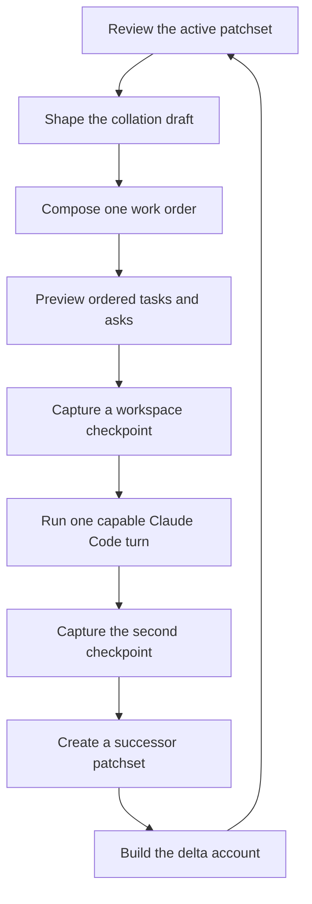
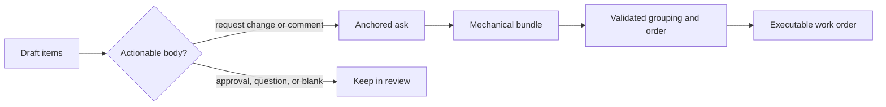
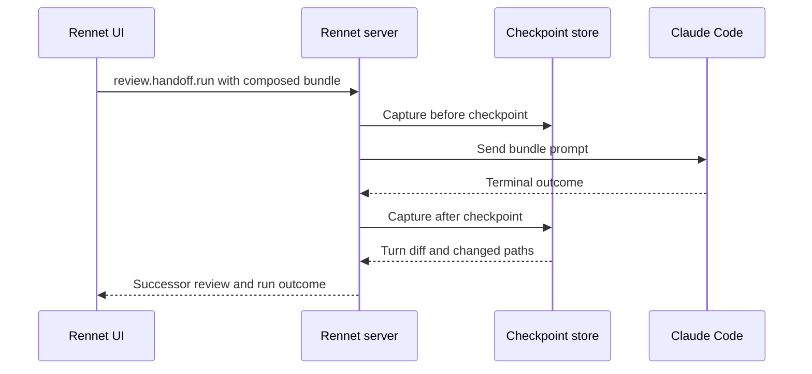

Agent handoff turns actionable items from an own-branch review into one coding
turn. Rennet previews the composed work order, runs it in the reviewed checkout,
captures every file the turn changed, and opens a delta review over a successor
patchset.

## The loop

The UI calls `review.handoff.compose` and `review.handoff.run` through its
`RennetBridge`. `@rennet/server` owns both commands. Core code constructs and
checks the bundle; adapters own the harness and Git checkpoint operations.

## Which draft items become asks

`handoffDispositions()` selects non-empty `request-change` and `comment` items
from the collation draft. It uses each item's effective body, so an adopted
refinement replaces the raw wording. Approvals and questions stay in the review
and never become edit instructions.

The mechanical bundle records:

- the review and patchset IDs;
- one anchored ask per selected disposition;
- bounded diff context for each ask;
- the exact effective instruction text;
- a digest over the ordered tasks.

`buildHandoffBundle()` owns this deterministic form. A model-backed composer may
group related asks and choose task order. It returns a partition of stable ask
IDs, not rewritten instruction bodies. `validateComposition()` requires every
known ask exactly once and rejects unknown or repeated IDs. If composition is
unavailable or invalid, the mechanical ordering remains usable.

The task title produced by the composer is preview metadata. Executable headings
come from the trusted file paths, and the executable prompt contains the
reviewer's instruction bodies verbatim.

## The run uses the previewed bundle

`review.handoff.run` accepts the composed bundle returned by
`review.handoff.compose`. The server recomputes its digest and prompt and checks
the active review and patchset before starting the turn. The run does not rebuild
a different bundle from raw dispositions.

The current handoff runner uses the Claude adapter. It starts one session at the
repository root with the harness's default tool set, including file writes and
shell commands. The prompt asks the coding agent to address the listed tasks and
leave commit and push to the later pull-request flow. That is a work instruction,
not a restricted tool profile.

A failed turn may still have changed files. The runner captures the second
checkpoint after either a successful or failed terminal outcome and returns the
turn diff and changed paths with the failure.

Repositories containing submodules are not supported by this runner. The server
returns a failed handoff before starting the turn because a child-repository edit
can leave the superproject gitlink unchanged and escape the checkpoint diff.

## Checkpoints isolate the turn

`GitCheckpointStore` uses a temporary Git index to snapshot tracked, deleted,
and non-ignored untracked files. It writes hidden
`refs/rennet/checkpoints/*` refs without moving `HEAD` or changing the user's
index.

The display diff and changed-path list come from separate Git operations.
`git diff --name-only -z` supplies the path list, so whitespace and quotes in a
path do not depend on parsing a human-readable patch header. Cleanup of the
temporary refs runs after the diff has been collected.

## Successor capture and delta account

The handoff does not modify the old patchset. After the turn, the review service
captures the checkout again and activates the new patchset as the successor.
The old patchset remains the comparison baseline.

The fold carries byte-proven dispositions, records orphaned ones, and builds a
deterministic delta account. The account classifies each prior ask as addressed,
partially addressed, or untouched. It also records changes beyond the asks and
links asks to the composed task that contained them. An optional model digest can
summarize those facts but cannot change them.

See [delta re-review and lineage](./delta-rereview-and-lineage.md) for the carry
rules and hunk-level account.

## Opening the pull request

After re-review, the own-branch preview contains the pull request title, body,
base, head branch, and draft flag. `publish.submitPr` verifies that its canonical
payload matches those fields and that the previewed head is the branch recorded
on the active patchset.

The server resolves one GitHub remote, pushes the named branch, and asks
`GitHubPrSubmissionAdapter` to reuse an open pull request for the same head and
base or create one. A detached `HEAD` has no branch to submit, so the command
returns an error before pushing.

## Code map

| Concern | Owner |
| --- | --- |
| Ask filtering and mechanical bundle | `packages/core/src/handoff-loop.ts` |
| Model partition, validation, and composed prompt | `packages/core/src/handoff-compose.ts` |
| Write-enabled harness turn | `packages/adapters/src/handoff-run-live.ts` |
| Workspace checkpoints | `packages/adapters/src/checkpoint-store.ts` |
| Handoff composition model turn | `packages/server/src/handoff-compose-live.ts` |
| Command routing and successor capture | `packages/server/src/dispatch.ts` |
| Per-project adapter composition | `packages/server/src/create-server.ts` |
| Draft selection, preview model, and client calls | `packages/app-ui/src/canvas/publish.ts`, `packages/app-ui/src/app.tsx` |
| Delta facts | `packages/core/src/delta-account.ts` |

The current precision limit is carry across changed code. Handoff uses the
deterministic file and span comparison described on the delta page; the separate
fuzzy occurrence matcher does not decide disposition carry.
