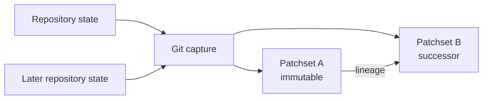

These contracts describe behavior that current code preserves. They protect the
truth of a review and the reviewer's authorship without restricting the coding
agent's ability to inspect, edit, test, commit, or push.

## Review identity and capture

A review targets an immutable patchset. Local Git capture writes the complete
reviewed working state—indexed, unstaged, and non-ignored untracked files—to a deterministic
Git tree through a temporary index seeded from the real index. It pins that tree
under `refs/rennet/review-trees/<tree-oid>` without moving the branch, HEAD, or
the real index. The patchset keeps `headOid` as the actual branch commit and
records the pinned tree separately as `reviewedTreeOid`.

The diff, file records, intent snapshots, repository inventory, and design
artifact reads all derive from the merge base and that one reviewed tree. A file
edited or deleted after capture therefore cannot change the review being
drafted. Each file record keeps the complete byte count even when visible content
is truncated. Binary files and submodules remain explicit capture states rather
than disappearing from the review.

Recapture adds a successor patchset. It never rewrites the patchset that prior
analysis, comments, and asks name.

Freshness compares the review's recorded Git and project-context identities with
the repository's current state. Regeneration performs a new capture and derives
a successor review state. The product does not present a mutated old artifact as
fresh.

## Repo Map and project context

The Repo Map combines deterministic project structure with evidence-backed
knowledge:

| Part | Contains | Identity |
|---|---|---|
| Project snapshot | Files, packages, entry points, exported symbols, identifier references, and dependencies | Pinned Git OID and content hashes |
| Knowledge layer | Project explanations, claims, evidence, confidence, and freshness | Project and source evidence |

Snapshots and knowledge are composed by the live server. Multi-repository
contexts refer to member maps and their pinned identities instead of flattening
all content into one document.

Project processing writes its canonical state beneath
`~/.rennet/projects/<escaped-path>/`. Promotion to `.rennet/map/` or
`.rennet/knowledge/` is explicit and never stages or commits those files.

An add-project run is one durable scout → structural-map → knowledge sequence.
Its stable command identity and per-repository checkpoints live in
`project-process.json` beside the snapshot. The coordinator persists each phase
before advancing, replays the latest state of each logical progress step, and
resumes the first incomplete checkpoint after a daemon restart. Only the terminal
`done` record carries the scope, file, confirmed, and rejected totals that the UI
may call ready.

## Provenance

Model-produced review documents use the Rennet Structured Protocol. The envelope
binds the document to its review, patchset, project context, instructions,
generator, and model. Evidence references point back to reviewed material.

The `inputDigest` binds the patchset and the offered occurrence and lineage
manifest used for that run. Validation rejects malformed envelopes or outputs
that claim occurrences outside the offered set. A validated document can still
express uncertainty; it cannot invent its input identity.

Deterministic artifacts record their source identities and generators too. The
distinction is how the result was produced, not whether provenance is required.

## Generations, carry, and the successor account

One visit to a review's boards over one patchset is a **generation**. The
patchset id identifies immutable content; the generation id identifies the visit,
so P0 → P1 → P0 produces two distinct P0 generations. Within a generation the
boards are live append-only logs: re-running a lens appends, and
board-native data on surviving element ids persists. When the code moves, the
generation **freezes** immutable and a successor generation is minted against
the successor patchset. Nothing is edited in place — append-then-freeze is the
only change mechanic, and the frozen generation stays readable as drill-down.

What survives into the successor generation is decided by evidence, never by
resemblance:

| What moves | Rule |
|---|---|
| Board content on an element id a regenerated lens keeps | Carried verbatim, with no delta stamp |
| Board-native data — marks, groupings, arrangement, notes — on a surviving element id | Carried with its element |
| An ask, thread, or highlight anchored into board prose | Re-anchored only by one exact quote match in the corresponding successor lens; zero or multiple matches preserve the thread as detached and suppress its stale highlight |
| A code ref whose cited bytes are identical, including through a Git-proven rename | Resolves against the successor patchset |
| A code ref whose cited content changed | Redrafted, and the section carries a `new` or `reworked` stamp |
| A code ref whose source is gone | Orphaned, kept with its reason rather than reattached nearby |

The fuzzy lineage matcher can describe a successor relationship, but similarity
never authorizes carry. This prevents a plausible match from impersonating
reviewed identity.

The **successor account** bridges the two generations. It deterministically
compares generation N with N+1 using the prior asks, carry result, patchsets, and
rename evidence. It is not the reviewer-facing round report. A landed coding
round produces that report through one separate classification turn over the
durable dispatched asks and exact worker receipt, then the host verifies every
claimed anchor against the measured diff. See [Delta and
generations](./delta-rereview-and-lineage.md).

## Review state and command persistence

The SQLite review store records commands and events in one transaction. A
successful command appends its events and receipt together, so retrying the same
command identity does not append the mutation twice. The current review is a
fold over its stored event history.

Conversation state is stored separately under
`~/.rennet/threads/<reviewId>.json`. A live turn has both a durable placeholder
and a server registry entry. Reattachment combines the stored thread with the
registry so a connected client can resume the body currently being generated.

Board event logs persist under `.rennet/boards/` in the review project — local
and ignored by default, never staged or committed. Each board is a
`schema.json` written once at creation plus an append-only `log.jsonl` with
contiguous sequence numbers; a batch of ops lands contiguously or not at all.
The embedded board service replays the log on restart, so a fresh process over
the same directory serves the identical element state. The board-level document
envelope, coverage, and validation results persist separately in the daemon's
board-meta store before the board is announced. `board.read` joins those two
durable halves. All element writes route through the adapters
`whiteboard-client`, the only writer of board ops.

A restarted round reuses a reserved report only when the exact report metadata
and board state reconstruct and pass the same changed-line verification again.
Partial lens boards are replaced as one attempt, not resumed element by element.
Recovery removes a partial board's metadata before clearing its element log. A
crash at either point therefore leaves the next retry able to repeat the cleanup;
it cannot treat elements scheduled for replacement as a completed board.

## Harness boundary

Rennet uses the user's installed coding harnesses. The Claude adapter invokes
`@anthropic-ai/claude-agent-sdk` with the user's installed Claude executable.
The Codex adapter invokes the installed Codex executable. Rennet does not bundle
its own harness binary or read provider credentials.

Model and harness traffic leaves the machine for the selected provider. Rennet
has no hosted backend. The review patchset, Repo Map, and local state remain
local except for the context deliberately supplied to an installed harness or
external service as part of a requested operation.

Coding-agent handoff is an acting path. The agent receives a digest-bound bundle,
works in the repository, and may write, test, commit, and push. Rennet then
captures the resulting repository state as a successor and presents a
deterministic successor account. The handoff does not grant model output permission
to rewrite the identity of the review it started from.

For a branch review, that identity includes the exact selected branch. The coding
worker runs from its captured head in a detached worktree, then Rennet advances
that branch. The successor range is pinned to the source patchset's base OID and
the durable landing receipt's worker OID; the branch names remain provenance, but
a concurrent ref move cannot enter the round result. The repository's
ambient checkout is not a substitute for the selected branch and remains untouched
when it names another branch. If the selected branch is checked out in this or a
sibling worktree, Rennet fast-forwards that checkout so its ref, index, and files
stay coherent; unrelated local edits remain in place, while Git reports an overlap
instead of partially landing it. An unmounted branch advances by compare-and-swap.
The durable landing receipt makes an interrupted or repeated landing idempotent.

The first work-order round resolves one enabled installed Claude Code or Codex
harness in the repository's execution locus and pins that provider to the durable
session. Later rounds resolve the same provider or fail explicitly; they do not
silently switch harnesses. Every modern round receipt records the exact harness and
version that executed its worker.

## Client projection

Loopback connections receive the private session protocol. Remote and mobile
connections receive a projected protocol assembled by the server. Projection
maps host paths and state into portable representations and restricts
shell-specific commands to the shell that can perform them.

Projection is bidirectional. The server validates and translates incoming
projected commands as well as outgoing state and events. Model-authored prose is
displayed as authored and is not treated as a host-state transport.

Board events and board projections are wrapped surfaces. The `boardEvent`
frame rides the existing push path: loopback connections receive raw frames,
projected connections receive frames passed through the projection seam, which
scrubs known-root and home-directory prefixes from every string the same way
it scrubs other free text. Board prose attributes are model-authored and get
only that blanket pass.

Live round report and lens-progress events have two protocol forms. Legacy
unscoped events remain readable for older callers. Current durable events carry
the operation id and operation revision together; a report event also carries
the already-validated report projection. The client first selects the newest
compatible operation revision, then the greatest sequence number inside that
revision. A daemon restart may reset the transport sequence, so sequence alone
cannot decide which attempt owns the screen.

## Outbound forge actions

The reviewer sees the exact outbound review or change-request payload before the
external mutation.

For someone else's pull or merge request, Rennet submits the previewed review.
A deterministic marker and forge read-back make retries idempotent. GitHub posts
one batched review. GitLab.com folds anchored comments into one review note and
uses the native approval endpoint for an approval. A forge capability tells the
core composer when the signed body must name the verdict. Each adapter then sends
that exact reviewed body without adding provider-only prose after preview. An
approving GitLab retry checks the current user's approval state: an existing
approval returns the reused marker receipt, while a note-only retry rechecks the
immutable head and performs the missing approval once.

When that live head differs, the refused review remains unchanged and receives no
publication receipt. **Review latest revision** first persists a new session for
the same provider-qualified pull or merge request, then archives the old session's
target claim and routes to the new preparation progress. An interrupted transfer
therefore leaves at least one live claimant. The fresh review owns a new patchset
and a newly composed payload at the new head; the refused review remains readable
at its original head and with its original bytes.

For the user's own branch, posting pushes the named branch to the effective push
remote and opens a GitHub pull request or GitLab.com merge request from the
previewed title and body. If an exact open request already exists for that source
and target branch in the repository, Rennet reuses it rather than opening a
duplicate. Each CLI runs in the repository's execution locus.

A retrospective review has no outbound post operation. Its findings and
conversation remain local.

## Package enforcement

The architecture checker enforces the package dependency graph described in
[Architecture overview](./architecture-overview.md). It also runs positive
controls that insert representative forbidden imports and require the checker to
fail. This proves the rule is being exercised rather than merely configured.

Nx cacheable targets declare the files, shared configuration, environment inputs,
and generated outputs that decide their results. Long-running and interactive
targets are not cacheable. See [Dependency
standard](../reference/dependency-standard.md) for package and toolchain rules.
