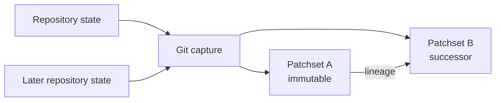

These contracts describe behavior that current code preserves. They protect the
truth of a review and the reviewer's authorship without restricting the coding
agent's ability to inspect, edit, test, commit, or push.

## Review identity and capture

A review targets an immutable patchset. Local Git capture records the merge-base
to current HEAD diff together with staged, unstaged, and untracked changes. Each
file record keeps the complete byte count even when the visible content is
truncated. Binary files and submodules remain explicit capture states rather
than disappearing from the review.

Recapture adds a successor patchset. It never rewrites the patchset that prior
analysis, comments, and dispositions name.

Freshness compares the review's recorded Git and project-context identities with
the repository's current state. Regeneration performs a new capture and derives
a successor review state. The product does not present a mutated old artifact as
fresh.

## Repo Map and project context

The Repo Map combines deterministic project structure with evidence-backed
knowledge:

| Part | Contains | Identity |
|---|---|---|
| Project snapshot | Files, packages, entry points, exported symbols, identifier references, and dependencies | Pinned Git OID and content hashes |
| Knowledge layer | Project explanations, claims, evidence, confidence, and freshness | Project and source evidence |

Snapshots and knowledge are composed by the live server. Multi-repository
contexts refer to member maps and their pinned identities instead of flattening
all content into one document.

Project processing writes its canonical state beneath
`~/.rennet/projects/<escaped-path>/`. Promotion to `.rennet/map/` or
`.rennet/knowledge/` is explicit and never stages or commits those files.

## Provenance

Model-produced review documents use the Rennet Structured Protocol. The envelope
binds the document to its review, patchset, project context, instructions,
generator, and model. Evidence references point back to reviewed material.

The `inputDigest` binds the patchset and the offered occurrence and lineage
manifest used for that run. Validation rejects malformed envelopes or outputs
that claim occurrences outside the offered set. A validated document can still
express uncertainty; it cannot invent its input identity.

Deterministic artifacts record their source identities and generators too. The
distinction is how the result was produced, not whether provenance is required.

## Occurrence lineage and disposition carry

Review dispositions belong to stable occurrences, not screen coordinates. A
successor patchset carries a disposition only when deterministic lineage proves
the occurrence is the same reviewed content.

Current carry behavior is exact:

| Successor relationship | Result |
|---|---|
| Same path and byte-identical path-grained occurrence | Carry disposition |
| Byte-identical span with deterministic rename identity | Carry disposition |
| Changed content | Reopen for review |
| Deleted or missing source occurrence | Orphan prior disposition |
| Similar text without exact identity | Do not carry |

The fuzzy matcher can suggest similarity, but similarity does not drive carry.
This prevents a plausible match from impersonating reviewed identity.

## Review state and command persistence

The SQLite review store records commands and events in one transaction. A
successful command appends its events and receipt together, so retrying the same
command identity does not append the mutation twice. The current review is a
fold over its stored event history.

Conversation state is stored separately under
`~/.rennet/threads/<reviewId>.json`. A live turn has both a durable placeholder
and a server registry entry. Reattachment combines the stored thread with the
registry so a connected client can resume the body currently being generated.

Board event logs persist under `.rennet/boards/` in the review project — local
and ignored by default, never staged or committed. Each board is a
`schema.json` written once at creation plus an append-only `log.jsonl` with
contiguous sequence numbers; a batch of ops lands contiguously or not at all.
The embedded board service replays the log on restart, so a fresh process over
the same directory serves the identical board. All board writes route through
the adapters `whiteboard-client` — the only writer of board ops.

## Harness boundary

Rennet uses the user's installed coding harnesses. The Claude adapter invokes
`@anthropic-ai/claude-agent-sdk` with the user's installed Claude executable.
The Codex adapter invokes the installed Codex executable. Rennet does not bundle
its own harness binary or read provider credentials.

Model and harness traffic leaves the machine for the selected provider. Rennet
has no hosted backend. The review patchset, Repo Map, and local state remain
local except for the context deliberately supplied to an installed harness or
external service as part of a requested operation.

Coding-agent handoff is an acting path. The agent receives a digest-bound bundle,
works in the repository, and may write, test, commit, and push. Rennet then
captures the resulting repository state as a successor and presents a
deterministic successor account. The handoff does not grant model output permission
to rewrite the identity of the review it started from.

## Client projection

Loopback connections receive the private session protocol. Remote and mobile
connections receive a projected protocol assembled by the server. Projection
maps host paths and state into portable representations and restricts
shell-specific commands to the shell that can perform them.

Projection is bidirectional. The server validates and translates incoming
projected commands as well as outgoing state and events. Model-authored prose is
displayed as authored and is not treated as a host-state transport.

Board events and board projections are wrapped surfaces. The `boardEvent`
frame rides the existing push path: loopback connections receive raw frames,
projected connections receive frames passed through the projection seam, which
scrubs known-root and home-directory prefixes from every string the same way
it scrubs other free text. Board prose attributes are model-authored and get
only that blanket pass.

## Posting to GitHub

The reviewer sees the exact outbound GitHub payload before the external
mutation.

For someone else's pull request, Rennet submits the previewed review. A
deterministic marker and GitHub read-back make retries idempotent. The renderer
does not construct a different review body after preview.

For the user's own branch, posting pushes the named branch and opens a pull
request from the previewed title and body. If an open pull request already exists
for that head branch, Rennet reuses it rather than opening a duplicate.

A retrospective review has no outbound post operation. Its findings and
conversation remain local.

## Package enforcement

The architecture checker enforces the package dependency graph described in
[Architecture overview](./architecture-overview.md). It also runs positive
controls that insert representative forbidden imports and require the checker to
fail. This proves the rule is being exercised rather than merely configured.

Nx cacheable targets declare the files, shared configuration, environment inputs,
and generated outputs that decide their results. Long-running and interactive
targets are not cacheable. See [Dependency
standard](../reference/dependency-standard.md) for package and toolchain rules.
