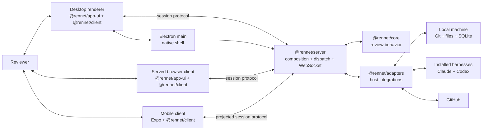

Rennet runs a local review service and connects several clients to it. The
service captures an immutable patchset, builds review artifacts, runs installed
coding harnesses, and performs Git and GitHub operations. Clients display and
control that work through the typed Rennet session protocol.

## Process topology

The `@rennet/server` package is the composition root. It constructs stores,
adapters, harnesses, the command dispatcher, a WebSocket listener, and the
embedded board service (`@wboard/server`) whose event logs live under
`.rennet/boards/` in the review project. Board writes route through the
adapters `whiteboard-client`, the only writer of board ops. The desktop app
supervises that server as a detached local daemon instead of running it inside
Electron.



The Electron main process owns windows, the static application menu, the
`app://` protocol, auto-update, tray behavior, and daemon supervision. Its
preload exposes only the small set of native facts and effects the renderer
needs: platform, version, WebSocket port, installed WSL distros, daemon
resolution for a chosen path, update readiness, and update application.
Project browsing runs entirely over the `fs.listDir` daemon RPC, so no native
directory-picker surface is exposed to the renderer.

The daemon serves the browser client as well as the WebSocket protocol. It binds
to loopback by default. A non-loopback bind is an explicit remote-access setup;
there is no Rennet relay or hosted Rennet backend. See [Remote
access](../../using/guides/remote-access.md) for the user-facing setup and egress
boundary.

## The daemon lifecycle

The desktop reads the daemon claim, verifies it through `/healthz`, and reuses a
healthy daemon. Otherwise it starts the server as a detached child and records
the new claim. The daemon removes its claim during graceful shutdown.

Startup does not wait for that. The desktop begins the daemon ensure and creates
its window immediately, so the shell paints while the daemon probes, spawns, and
comes up healthy. The window therefore cannot receive the WebSocket port as a
launch argument: the renderer asks for it over the `rennet:ws-port` IPC channel,
which ensures that data directory's daemon on demand and answers with its port.
Until it answers, the renderer's connection supervisor sits in `connecting` and
the app shows its ordinary pre-connection state. A daemon that never starts names
its cause and `daemon.log`, then the app quits. Every ask ensures afresh, so an
ask that follows a failed start re-probes instead of replaying that failure, and
the window recreated after update-apply recovery dials whichever daemon is
current. One exception: while a teardown is in flight — the tray's complete quit,
or the update handoff — the channel refuses the ask instead of ensuring, so the
renderer's reconnect cannot put a fresh daemon back on the bundle the installer
is about to replace. A failed apply restores the data directory, and the next ask
ensures again.

Starts and stops for one data directory are serialized. Concurrent ensures fold
into a single probe and spawn, and a stop — the tray's complete quit, or the
update handoff below — never runs until the ensure ahead of it has spawned its
daemon and verified it healthy, so the installer is never handed a daemon that
started behind its back. Ensures fold only while no stop has been queued between
them; one that arrives after a stop waits for that stop and probes again, rather
than answering with a port the stop is about to kill.

Closing every desktop window leaves the tray process and daemon available. The
desktop's complete-quit action stops a daemon that the desktop owns.

Update application is the other intentional daemon-stop boundary. The packaged
daemon executes Electron's binary from inside the installed app bundle, so the
desktop must await its verified graceful stop before Squirrel can replace that
bundle. Both the renderer update action and the tray action share this one
ordered handoff. A failed stop leaves the app open and surfaces the failure. If
the native updater rejects after it has closed the windows, the same operation
restarts the daemon and recreates the window before reporting the error. A
download failure is also reported rather than discarded as updater noise. On
macOS, an out-of-bundle helper waits for ShipIt to replace the bundle and opens
the installed version, covering native installs that exit without relaunching.

## Clients and reconnection

The desktop renderer and served browser client both mount the same
`@rennet/app-ui` application. `@rennet/app-ui` composes screens from the
`@rennet/ui` primitive kit, a vendored shadcn/ui component set built on Base UI.
Each client provides a connection factory to `ConnectionHost`; `@rennet/app-ui`
does not import a transport or Node APIs.

`@rennet/client` supplies `WsRennetBridge` and `ConnectionSupervisor`. The
supervisor owns the `idle`, `connecting`, `online`, `offline`, and `error`
states, reconnects with bounded backoff, and restores registered progress and
ask-stream subscriptions after a reconnect. Progress registrations cover both
long-running project processing and per-repository pull-request fetches for the
project detail view.

The Expo mobile app uses `@rennet/client` and the portable protocol directly. It
has its own native UI rather than mounting `@rennet/app-ui`. Remote clients receive
the projected protocol: server-side projection translates or redacts host-only
state and commands before they cross the connection. Shell-specific operations,
such as the desktop directory picker and updater, remain native-shell features.

## Package boundaries

Repository architecture checks enforce these import directions:

```mermaid
flowchart LR
  theme[@rennet/theme]
  protocol[@rennet/protocol]
  prompts[@rennet/prompts]
  core[@rennet/core]
  adapters[@rennet/adapters]
  server[@rennet/server]
  ui["@rennet/ui<br/>primitive kit"]
  appui["@rennet/app-ui<br/>screens"]
  client[@rennet/client]

  prompts --> protocol
  core --> protocol
  core --> prompts
  adapters --> protocol
  adapters --> prompts
  adapters --> core
  server --> protocol
  server --> prompts
  server --> core
  server --> adapters
  ui --> protocol
  ui --> theme
  appui --> protocol
  appui --> theme
  appui --> ui
  client --> protocol
```

`@rennet/protocol` and `@rennet/theme` have no in-repository dependencies. The
`@rennet/ui` kit imports only `@rennet/protocol` and `@rennet/theme`; `@rennet/app-ui`
adds the kit. Only the desktop app imports Electron.
`scripts/check-boundaries.mjs` runs three positive controls that prove forbidden
imports fail: `@rennet/app-ui` importing `@rennet/core`, the `@rennet/ui` kit
importing `@rennet/core`, and `@rennet/server` importing Electron.

## Review flow

One review moves through the system as follows:

1. A client asks the server to create or open a review.
2. For a local review, the Git adapter captures the merge-base-to-HEAD diff plus
   staged, unstaged, and untracked changes. The capture records complete byte
   counts even when the visible payload must be truncated.
3. The server records an immutable patchset and derives review artifacts against
   that identity.
4. Deterministic analysis and drafting agents produce the Design, Sequence,
   Decisions, Flagged, and Noise lens boards for that generation.
5. The reviewer reads the boards, asks questions, stages asks, and previews any
   outbound review or change-request result.
6. The outbound action for a review submits the previewed review. The outbound
   action for an own-branch change pushes the named branch and opens or reuses
   its GitHub pull request or GitLab.com merge request, selected from the
   effective push remote.

Recapture creates a successor patchset. It does not mutate the patchset already
under review: the current generation of boards freezes and a successor
generation is minted. Board content whose element ids survive carries verbatim,
along with the board-native data on them; content whose cited code changed is
redrafted and stamped.

## Server composition and dispatch

`packages/server/src/create-server.ts` assembles the runtime. It supplies the
command implementations to the dispatch map in `packages/server/src/dispatch/`
(one module per command family, bound from the command registry), which validates
and routes protocol commands. This package also owns live orchestration, symbol
lookup, projected connections, ask streams, review reattachment, and daemon
lifecycle.

`@rennet/core` contains portable review logic, document validation, scheduling,
lineage, and state folds. `@rennet/adapters` implements
Git capture, GitHub calls, filesystem stores, SQLite persistence, Repo Map
generation, and coding-harness execution. Keeping composition in the server
lets the desktop, browser, mobile, and CLI paths use the same behavior.

## Persistence

Rennet stores different kinds of state at their natural scopes:

| Location | Contents |
|---|---|
| Daemon data directory (`~/.rennet`) | `rennet.sqlite`, project registry, daemon claim, and every other daemon-owned store |
| `<data dir>/client-settings.json` | Viewer preferences (appearance, keybindings) — the client rung |
| `<data dir>/daemon-settings.json` | This host's global settings rung (listener bind, tracker) |
| `~/.rennet/projects/<escaped-path>/` | Project snapshot, Repo Map shards and manifests, overlays, and context manifests |
| `~/.rennet/threads/<reviewId>.json` | Durable review conversation |
| Project `.rennet/map/` | Optional promoted context mirror |

Promotion writes the optional project mirror but does not stage or commit it.
The project's `.rennet/` directory remains local and ignored by default.

The SQLite review store persists commands and events transactionally. Reading a
review folds its event history into the current projection. Conversation files
are separate so completed messages and interrupted turns survive client or
desktop restarts.

## Live turns and reattachment

The server registers active model turns in `LiveTurnRegistry`. A reconnecting
client calls `review.reattach` and receives the durable thread plus any live
turn, including the body accumulated so far. A streaming placeholder recovered
from disk is marked interrupted unless the registry confirms that the turn is
still active. Completing a turn replaces its placeholder with the completed
message.

Daemon shutdown aborts all registered live turns. Closing a client or desktop
window does not stop a daemon that remains resident.

## Where to go next

- [Architecture contracts](./architecture-contracts.md) defines the correctness
  rules behind immutable capture, provenance, lineage, persistence, and posting.
- [The lens pipeline](./lens-pipeline.md) describes the five lens boards and how
  they are drafted.
- [Context assembly](./context-assembly.md) explains project context and
  selection-aware retrieval.
- [The Model Council](./model-council.md) explains model assignment.
