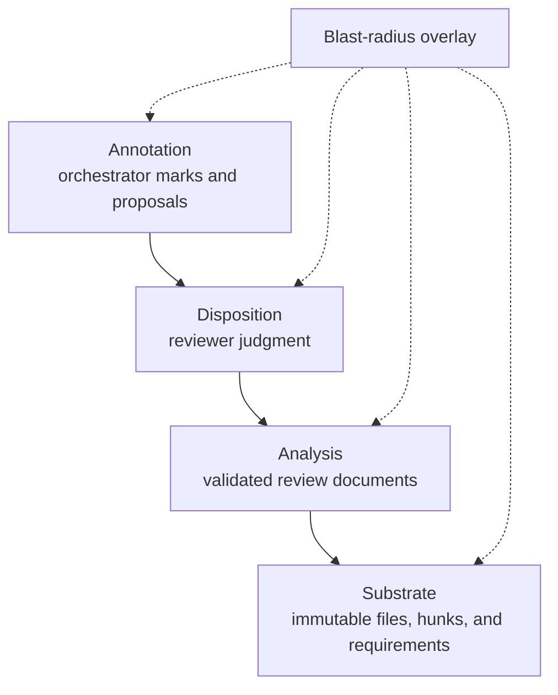

A canvas is one view of a review patchset. Rennet maintains five angles so each
surface can answer a distinct review question without changing the identity of
the code underneath it.

| Canvas | Question |
|---|---|
| Spec | What was this change meant to do, and where is each requirement covered? |
| Sequence | In what order should I read the change? |
| Decisions | Which implementation choices need judgment? |
| Flagged | What did automated review find? |
| Noise | What changed without earning attention from another lens? |

Blast radius is an overlay on these canvases. It is not a sixth ordering of the
patchset.

## Four layers

Every canvas projects four kinds of state:



The substrate anchors everything to the captured patchset. Analysis places
validated RSP documents over those anchors. Dispositions record the reviewer's
judgment. Annotations let the orchestrator point, focus, and propose without
changing review state by implication.

## Projection from review documents

`@rennet/core` projects document kinds to canvas angles:

| Document kind | Canvas |
|---|---|
| `spec.model` | Spec |
| `decomposition.proposal` | Sequence |
| `decision.record` | Decisions |
| `finding` | Flagged |
| `noise.patternProposal` and `noise.anomaly` | Noise |

Sequence uses an admitted decomposition proposal when one is valid. Otherwise a
deterministic floor produces a complete order so every captured hunk remains
represented. Flagged findings are ordered by high, medium, then low severity.

The specialized UI for each lens can render more structure than the generic
canvas projection. The shared projection supplies stable elements and anchors;
the lens renderer supplies its domain-specific presentation.

## Stable identities

A canvas belongs to one review, one patchset, and one angle. Its `canvasId` is a
hash of those three identities. An element key is derived from its source
document and an element discriminator or source anchor.

```text
canvasId = hash(reviewId, patchsetId, angle)
elementKey = derive(documentId, discriminator or anchor)
```

This keeps focus, dispositions, evidence, and conversations attached to the
same reviewed occurrence across clients. A successor patchset gets new canvas
identities and uses occurrence lineage to decide which prior dispositions can
carry.

## Actors

Four actors use the same address space:

| Actor | Role |
|---|---|
| Engine | Validates documents and projects durable state |
| Review runners | Produce analysis documents against offered occurrences |
| Orchestrator | Reads, focuses, annotates, and proposes through `canvasOps@2` |
| Reviewer | Reads code, asks questions, and records dispositions |

The orchestrator's `canvas.focus` result is presentational. The client may reveal
and highlight that target, but focus alone does not approve, reject, or edit the
review.

## The retrieval surface

`canvasOps@2` exposes these tools:

| Group | Tools |
|---|---|
| Canvas | `canvas.describe`, `canvas.view`, `canvas.focus`, `canvas.annotate`, `canvas.propose`, `canvas.recompute`, `canvas.read`, `canvas.thread` |
| Diff | `diff.read`, `diff.search`, `diff.structure` |
| Run | `run.ledger`, `run.provenance` |
| Context | `context.map`, `context.file`, `context.novelty`, `context.overview`, `context.symbol`, `context.references`, `context.knowledge`, `context.ask` |

Each reply contains `data` and `freshness`, plus evidence, totals, cursors, or a
truncation flag where the result needs them. The envelope lets a caller
distinguish an empty result from an incomplete one.

The production review backend currently returns the active static canvas from
`canvas.view`. Its generic response does not populate expanded cohorts or the
current selection. Selection-aware questions use the live server selection path
instead. The event-batching utility for continuous view updates exists in core,
but it is not the renderer's production feed.

## Collation

Canvas collation is deterministic. Given the same validated documents and
patchset, it produces the same element order and identities. It does not call a
model, inspect the working tree, or infer a new review result while rendering.

See [Review lenses](./review-lenses.md) for the behavior of each angle and
[Context assembly](./context-assembly.md) for the orchestrator's retrieval path.
