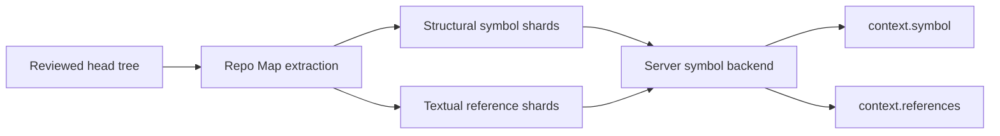

Rennet's live code-intelligence path answers two review questions: where an
exported name is declared, and where the same identifier text occurs. It uses the
deterministic Repo Map rather than a language server.

## Indexing and lookup

Project processing extracts structural symbols from supported TypeScript and
JavaScript files and writes textual identifier-reference shards. Both are tied to
a pinned Git object identity.

`packages/server/src/symbol-lookup-live.ts` builds the lookup backend for the
active review and pins it to the patchset's reviewed head OID. The result does not
include later uncommitted working-tree edits. `packages/server/src/dispatch.ts`
routes the protocol commands.

The symbol inspector combines:

- matching exported declarations;
- up to 200 textual identifier occurrences, with a truncation flag when more
  exist; and
- neighboring top-level symbols from the primary declaration's file.

The index uses content-addressed shards, so unchanged repository content can be
reused without changing its identity.

## Confidence

The response labels what the index actually proved:

| Result | Confidence | Meaning |
|---|---|---|
| One exported declaration | Exact, structural | One declaration with that exported name exists in the structural index |
| Several exported declarations | Guess, structural | The name alone leaves several candidates |
| Identifier occurrences | Guess, textual | The same identifier text appears at these sites |
| Missing or unreadable shard | Unavailable | The index cannot answer from the pinned data |

"Exact" is scoped to the structural index. It does not mean type-aware symbol
resolution. Textual references can include an unrelated name from another scope
and can miss a relationship that does not preserve the identifier text.

## Review integration

Review context reaches the same backend through `context.symbol` and
`context.references`. Responses carry freshness, evidence, totals, and
truncation where applicable. The UI symbol
inspector presents the definition candidates, references, and file neighbors
without upgrading textual evidence to semantic certainty.

The pinned head tree covers committed code in the reviewed patchset. Diff tools
remain the authority for staged, unstaged, and untracked changes captured on top
of that tree.

## The knowledge layer

Beside the structural index, the Repo Map stores model-generated knowledge
claims. `packages/core/src/knowledge/` generates them as a partitioned swarm:
`buildPartitions` slices the snapshot along detected scopes so every in-scope
file lands in exactly one slice, a light `partition-worker` council job emits
anchored claims per slice, and a heavy `map-verify` seat confirms hypotheses
against their cited spans and mints cross-cutting claims. Both jobs resolve
through the [Model Council](./model-council.md) like every other model path.
Claims that fail anchor resolution are dropped at mint time, so a stored claim
always cites spans that resolve against the snapshot. On a baseline advance,
only partitions containing changed paths re-run and untouched claims carry
forward.

The verify seat reads the swarm's hypotheses in fixed chunks (150 per turn,
several turns in flight) rather than one prompt over the whole repository: a
large repository mints thousands of claims, and a single prompt carrying all of
them exceeds the seat's context window and loses the entire run. The pass is
all-or-nothing — one failed chunk fails the whole run and leaves the stored set
untouched, rather than publishing an unadjudicated slice of the repository as if
the seat had read it — so the chunks still queued behind a failure are abandoned
instead of spending turns on a verdict already decided.

Chunking bounds what one turn can synthesize, so a final cross-boundary pass
runs over the chunks' own output: every chunk's cross-cutting claims, plus a
one-line summary of what each chunk covered, feed a single closing turn that
mints the claims spanning two chunks. That input is proportional to the number
of chunks, not the number of statements, which is what keeps it inside the
context window that the unchunked prompt overflowed. The pass is best-effort —
if the closing turn fails, the run keeps its chunk-local synthesis rather than
discarding a good map over a bonus turn.

One residual: the closing turn reads the chunks' claims, not their raw
hypotheses, so a pattern that only becomes visible in two individual hypotheses
on opposite sides of a boundary can still be missed. Cross-cutting coverage is
therefore near-repository-wide rather than exhaustive.

The pass runs in the background and reports its outcome — including the reason
it skipped or failed — on the project's build timeline, under a progress id
keyed to that project so one project's background work never appears on
another's. A failure that arrives as a thrown error is converted to the same
typed outcome and narrated on the same line as a reported one. The client
retains a project's background narration above the screen that shows it, so a
failure that happened while the reader was elsewhere is still there when they
open the project — a run is never silently absent, and never visible only to
whoever was watching.

## Current scope

The live index does not provide type-directed references, rename analysis,
call-hierarchy resolution, inferred types, or compiler diagnostics. Those
questions require different evidence than the current structural and textual
shards provide, so the UI reports the narrower result rather than presenting it
as language-service output.

See [Context assembly](./context-assembly.md) for retrieval and freshness and
[Architecture contracts](./architecture-contracts.md) for Repo Map identity.
