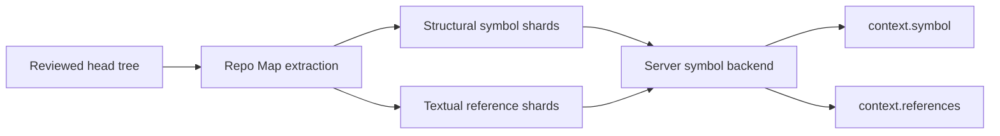

Rennet's live code-intelligence path answers two review questions: where an
exported name is declared, and where the same identifier text occurs. It uses the
deterministic Repo Map rather than a language server.

## Indexing and lookup

Project processing extracts structural symbols from supported TypeScript and
JavaScript files and writes textual identifier-reference shards. Both are tied to
a pinned Git object identity.

`packages/server/src/symbol-lookup-live.ts` builds the lookup backend for the
active review and pins it to the patchset's reviewed head OID. The result does not
include later uncommitted working-tree edits. `packages/server/src/dispatch.ts`
routes the protocol commands.

The symbol inspector combines:

- matching exported declarations;
- up to 200 textual identifier occurrences, with a truncation flag when more
  exist; and
- neighboring top-level symbols from the primary declaration's file.

The index uses content-addressed shards, so unchanged repository content can be
reused without changing its identity.

## Confidence

The response labels what the index actually proved:

| Result | Confidence | Meaning |
|---|---|---|
| One exported declaration | Exact, structural | One declaration with that exported name exists in the structural index |
| Several exported declarations | Guess, structural | The name alone leaves several candidates |
| Identifier occurrences | Guess, textual | The same identifier text appears at these sites |
| Missing or unreadable shard | Unavailable | The index cannot answer from the pinned data |

"Exact" is scoped to the structural index. It does not mean type-aware symbol
resolution. Textual references can include an unrelated name from another scope
and can miss a relationship that does not preserve the identifier text.

## Review integration

The orchestrator reaches the same backend through `context.symbol` and
`context.references`. Responses use the `canvasOps@2` envelope, including
freshness, evidence, totals, and truncation where applicable. The UI symbol
inspector presents the definition candidates, references, and file neighbors
without upgrading textual evidence to semantic certainty.

The pinned head tree covers committed code in the reviewed patchset. Diff tools
remain the authority for staged, unstaged, and untracked changes captured on top
of that tree.

## Current scope

The live index does not provide type-directed references, rename analysis,
call-hierarchy resolution, inferred types, or compiler diagnostics. Those
questions require different evidence than the current structural and textual
shards provide, so the UI reports the narrower result rather than presenting it
as language-service output.

See [Context assembly](./context-assembly.md) for retrieval and freshness and
[Architecture contracts](./architecture-contracts.md) for Repo Map identity.
