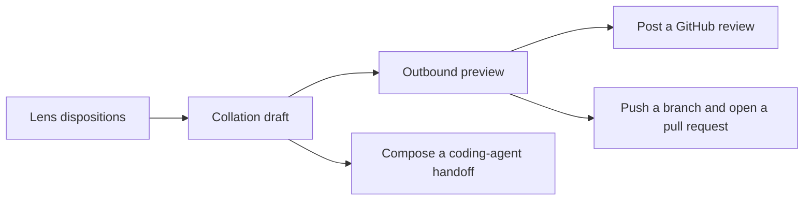
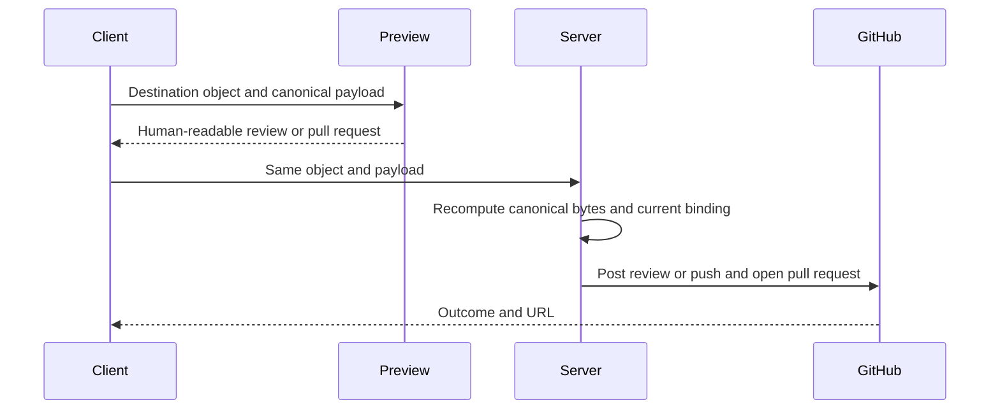

The collation draft gathers dispositions from every review lens into one ordered,
editable account. Rennet derives a destination-specific preview and canonical
payload from that draft, then sends the same payload through the server command
that performs the GitHub operation.

## One draft, two destinations

An own-branch review produces a pull request submission. A review of someone
else's pull request produces one batched GitHub review. Coding-agent handoff uses
the same draft but is a separate action and payload.

## The draft is ordered state

`CollationDraft` is an array of items. Each item has a stable ID, repository
path, optional line span and diff side, disposition type, raw body, optional
refined body, and staging state. Array order matters because it controls comment
and handoff order.

The draft supports these pure transforms:

| Action | Result |
| --- | --- |
| Reword | Replace the raw body and clear its stale refinement |
| Retype | Change the disposition type and clear its stale refinement |
| Move | Change item order |
| Merge | Join two raw bodies under the first item |
| Split | Add an empty sibling with the same path and type |
| Withdraw | Remove an item |
| Refine | Store a model-written alternative beside the raw body |

`effectiveBody()` chooses the refined text when present. `collationItems()`
projects the ordered draft back into disposition writes, and
`collationPayload()` serializes those writes in the same order.

## Staging decides what travels

The draft keeps local review state and outbound content together, so the staging
rules live in pure functions rather than CSS or button state.

| Disposition | Default behavior |
| --- | --- |
| `approve` | Always local |
| `request-change` | Always outbound |
| `comment` | Local unless staged |
| `question` | Local unless staged |

`itemLane()` ignores the staging flag for approvals and requested changes. Only
comments and questions are stageable. `publishedItems()` returns the outbound
subset in draft order, while `localItems()` returns its complement.

For a GitHub review, any outbound requested change produces a
`REQUEST_CHANGES` event. An outbound set containing only comments or questions
produces `COMMENT`. An empty outbound set produces no review.

## Destination-specific payloads

The two payloads have different shapes:

| Destination | Preview fields | Server command |
| --- | --- | --- |
| Existing pull request | Verdict and ordered file or line comments | `publish.review` |
| Own branch | Title, body, base, head branch, and draft flag | `publish.submitPr` |

For an existing pull request, `reviewComments()` maps each outbound item to a
GitHub comment. A span anchor becomes a line comment on the left or right diff
side. A path-only item has no line and the core publish builder folds it into the
review body while recording that conversion.

For an own branch, `composePrSubmission()` builds the submission from branch
context and the draft. The title and body remain editable before preview.
`prSubmissionPayload()` serializes the final submission fields in a fixed order.

The desktop and browser app build these projections in `@rennet/app-ui`. The mobile
app cannot import the DOM-bound draft package, so it calls `publish.compose` and
previews the exact comments or submission returned by the daemon.

The mobile composition path does not apply the UI draft's staging lanes. For a
pull request review, the daemon currently sorts every persisted disposition by
path and line and emits one comment per disposition. This can include approvals
and unstaged comment or question types that the desktop draft would keep local.
For an own-branch review, the daemon uses its PR-body drafting port when
available and otherwise returns the head branch as the title with an empty body.

## The payload and preview share one source

`publishTargetPayload()` derives bytes from the structured destination object.
`publishTargetAgrees()` checks that the preview mode and payload match that
object. The server independently reconstructs the canonical payload in
`@rennet/core` before performing egress.

Daemon-composed mobile payloads also carry a `compositionId` bound to the review,
active patchset, mode, and payload. The server recomputes this binding before
posting so a preview from an older revision cannot be applied to the current
review.

## GitHub review posting

`publish.review` resolves the stored review and its pull request target, checks
the canonical comment payload, rejects an empty comment set, and builds one
forge-neutral review post. The post contains line threads, a review-level body
for path-only comments, and a deterministic idempotency marker.

`GitHubPublishAdapter` looks for that marker before creating a review. A retry
can therefore return the review that already landed instead of posting a
duplicate. The command returns the constructed request, conversion ledger, and
GitHub outcome to the client.

## Own-branch submission

`publish.submitPr` checks the canonical submission payload, requires a named
branch, and confirms that the previewed head matches the active patchset. The
server resolves one GitHub remote, pushes that named branch, and submits the
title, body, base, head, and draft flag.

`GitHubPrSubmissionAdapter` reuses an open pull request with the same head and
base. If none exists, it creates one and returns its URL and number.

## Data boundaries

Internal conversations, model traces, and refinement history do not enter an
outbound payload unless their text has become an outbound draft item. The local
lane remains outside the GitHub review.

There is no hosted Rennet backend. GitHub receives the posted review or pull
request, and the selected harness provider receives the context used by model
turns. Remote clients reach the user's daemon over the configured private
network.

## Code map

| Concern | Owner |
| --- | --- |
| Ordered draft and editing transforms | `packages/app-ui/src/canvas/collation.ts` |
| Local and outbound lane rules | `packages/app-ui/src/canvas/staging.ts` |
| Desktop and browser destination projections | `packages/app-ui/src/canvas/publish.ts` |
| Shared draft and preview interaction | `packages/app-ui/src/app.tsx` |
| Protocol commands and payload schemas | `packages/protocol/src/index.ts` |
| Forge-neutral review and pull request payloads | `packages/core/src/publish-review.ts`, `packages/core/src/publish-submission.ts` |
| Daemon composition and command routing | `packages/server/src/create-server.ts`, `packages/server/src/dispatch.ts` |
| GitHub adapters | `packages/adapters/src/github-publish.ts`, `packages/adapters/src/github-pr-submission.ts` |
| Mobile preview and post flow | `apps/mobile/app/daemon/[daemonId]/review/[reviewId]/publish.tsx` |

See [comment refinement](./comment-refinement.md) for effective bodies and
[agent handoff](./agent-handoff.md) for the acting path.
