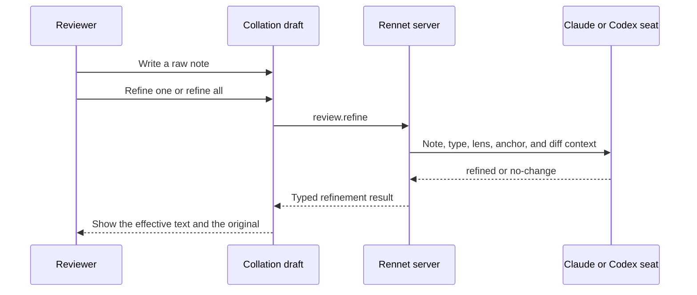
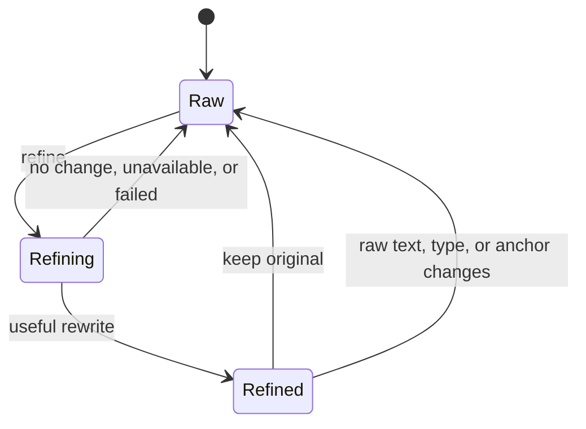

Comment refinement is a user-invoked model turn on the collation draft. It sends
the raw note, its disposition type, and bounded diff context to a Model Council
seat, then stores a useful rewrite beside the original.

## The live flow

The reviewer can refine one item or run **Refine all** across every eligible item.
Refinement is separate from the review pipeline and the orchestrator
conversation.



`review.refine` returns one of four states:

```ts
type RefinementResult =
  | { status: "refined"; refined: string; model: string }
  | { status: "no-change"; model: string }
  | { status: "unavailable"; reason: string }
  | { status: "failed"; reason: string }
```

There is no `refinement` RSP document on this path. Codex uses one constrained
executor turn. Claude uses a harness session with the same small output schema.
`packages/server/src/refine-comment-live.ts` maps both adapters into one
`RefinePort` result, and core applies the final result rules.

## Raw and refined text stay separate

A `CollationItem` has a `raw` body and an optional `refined` body.
`effectiveBody()` returns the refinement when present and the raw text otherwise.
The draft and outbound payload use that function, so every consumer makes the
same choice.



Core treats an empty `refined` result as a failure. If the returned body is
byte-identical to the trimmed raw note, it becomes `no-change`. A failed or
unavailable turn never copies the raw text into a value labeled as refined.

The UI binds an in-flight request to `itemRefineSignature()`, which covers the
raw body, disposition type, and full anchor. A reword, retype, re-anchor,
withdrawal, or replacement that changes this signature makes a late result
stale. Editing the raw body or type also clears an existing refinement.

## Grounding context

The request may include:

- the active lens;
- the repository-relative file path;
- the anchored line span and diff side;
- the matching unified-diff hunk.

`extractAnchoredDiff()` selects the hunk containing a span before applying the
8,000-byte ceiling. A path-only note receives a bounded file diff. If the file or
span cannot be found, the refiner works from the note and metadata instead of
guessing a different code location.

The prompt asks the model to preserve the reviewer's meaning, tone, and first
person. It may clarify a referent or make an ask concrete, but it must not add a
new concern. The draft remains editable after the result arrives, and Keep my
original removes the refinement.

## Assignment and failure

The server probes the Claude harness port and Codex executor for the review's
repository locus, then resolves the `comment-refinement` Model Council job. A
Codex assignment runs with the council model and effort. A Claude assignment
records the model reported by the session.

If no selected seat is available, the command returns `unavailable`. Process,
protocol, and structured-output errors return `failed`. In every case the raw
note remains the effective body unless a valid refinement was stored.

## Code map

| Concern | Owner |
| --- | --- |
| Prompt and result rules | `packages/core/src/refine-comment.ts` |
| Claude and Codex turn composition | `packages/server/src/refine-comment-live.ts` |
| Command schema | `packages/protocol/src/index.ts` |
| Raw, refined, signature, and effective body | `packages/app-ui/src/canvas/collation.ts` |
| Request lifecycle and stale-result check | `packages/app-ui/src/app.tsx` |

See [collation and publishing](./collation-and-publishing.md) for the draft and
its destination-specific payloads.
