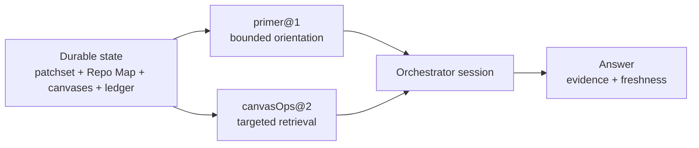

Rennet starts an orchestrator session with a small deterministic primer. The
orchestrator then retrieves code, review state, provenance, and project knowledge
through `canvasOps@2` instead of receiving a repository dump in its opening
prompt.

## The primer

`@rennet/core` builds `primer@1` deterministically and caps it at 4,096 bytes.
The stored SHA-256 digest identifies the exact primer used for a run.

The primer has six sections:

| Section | Contents |
|---|---|
| B1 | Review and patchset identity |
| B2 | Freshness summary, up to six rows plus a rollup |
| B3 | Canvas counts, up to five rows plus a rollup |
| B4 | Protocol card |
| B5 | Tool index derived from the registered `canvasOps@2` tools |
| B6 | Run headline |

The byte limit is part of the serialization contract. Rollups preserve omitted
counts when a section cannot include every row. A caller can therefore tell the
difference between a complete short list and a summarized larger one.

## Repo Map context

The Repo Map provides two kinds of context:

| Layer | Source | Claims |
|---|---|---|
| Project snapshot | Deterministic repository processing at a pinned Git OID | Files, packages, symbols, entry points, dependencies, and identifier occurrences |
| Knowledge | Background model enrichment with evidence and provenance | Project purpose, conventions, relationships, and explanations |

The layers remain separate because a structural fact and a model-derived
explanation have different evidence and confidence. Freshness travels with both.

Multi-repository contexts compose member maps by reference. The workspace records
member identities, pinned OIDs, fingerprints, cross-repository edges, and
freshness without inlining each member's complete map into one prompt.

## Retrieval tools

The tool index is generated from the actual registry, so the primer cannot drift
from the callable surface.

| Group | Tools |
|---|---|
| Canvas state | `canvas.describe`, `canvas.view`, `canvas.focus`, `canvas.annotate`, `canvas.propose`, `canvas.recompute`, `canvas.read`, `canvas.thread` |
| Diff | `diff.read`, `diff.search`, `diff.structure` |
| Runs | `run.ledger`, `run.provenance` |
| Project context | `context.map`, `context.file`, `context.novelty`, `context.overview`, `context.symbol`, `context.references`, `context.knowledge`, `context.ask` |

Tool replies contain `data` and `freshness`. They add evidence, totals, cursors,
and truncation flags when the result requires them. Callers can page or narrow a
large query without confusing a truncated answer with a complete one.

`diff.read` returns anchored patch content. `context.file` and the symbol tools
read the pinned repository context. `run.provenance` explains which generator,
model, instructions, and inputs produced an artifact. `canvas.thread` retrieves
the durable conversation attached to review state.

## Selection-aware questions

`context.ask` is a live server operation. The UI sends the current review
selection through the session protocol. `packages/server/src/review-ask-live.ts`
resolves that selection against the immutable patchset, assembles bounded context,
starts the orchestrator, and streams the answer back to subscribed clients.

Selection is an address, not prompt prose. The server resolves it to trusted
review state before constructing model context. This keeps a reconnecting desktop,
browser, or mobile client on the same review identity.

The generic `canvas.view` backend currently returns the active static canvas with
no populated expanded-cohort or selection state. Selection-aware asking does not
depend on that response; it uses the live server selection path. Core includes a
batcher for context-update events, but the renderer does not use it as a
continuous canvas feed.

## Context budget

The orchestrator moves from summary to detail:

1. Read identity, freshness, counts, and available tools from the primer.
2. Describe or view the relevant canvas.
3. Retrieve a cohort, element, hunk, file, symbol, or provenance record.
4. Narrow further when a reply reports truncation or a continuation cursor.
5. Answer from the retrieved evidence and state its freshness.

The server records the run and its primer digest in the ledger. This makes the
starting context inspectable without copying the entire retrieved conversation
into the primer.

## Freshness behavior

Project and review identities are checked before the server labels retrieved
context current. A changed repository can make stored context stale while the
review's immutable patchset remains readable. Regeneration creates a successor
capture and rebuilt artifacts; it does not silently retarget the existing review.

See [Code intelligence](./code-intelligence.md) for the structural symbol tools,
[The canvas model](./canvas-model.md) for canvas addressing, and [Architecture
contracts](./architecture-contracts.md) for provenance and freshness rules.
