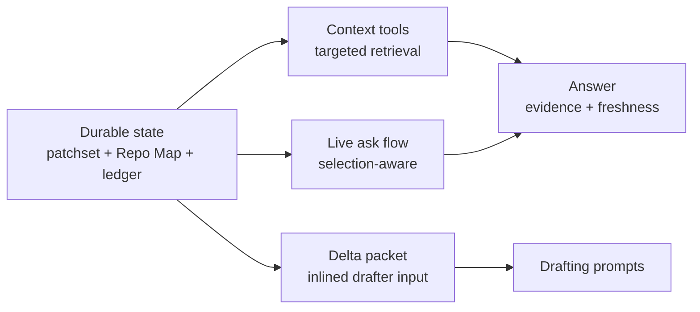

Rennet does not hand a model a repository dump. Review context is assembled on
demand: the server resolves a query or the current review selection against
durable state and returns bounded, freshness-tagged evidence.

## Repo Map context

The Repo Map provides two kinds of context:

| Layer | Source | Claims |
|---|---|---|
| Project snapshot | Deterministic repository processing at a pinned Git OID | Files, packages, symbols, entry points, dependencies, and identifier occurrences |
| Knowledge | Background model enrichment with evidence and provenance | Project purpose, conventions, relationships, and explanations |

The layers remain separate because a structural fact and a model-derived
explanation have different evidence and confidence. Freshness travels with both.

Multi-repository contexts compose member maps by reference. The workspace records
member identities, pinned OIDs, fingerprints, cross-repository edges, and
freshness without inlining each member's complete map into one prompt.

## Retrieval tools

The context tools read pinned project state and review provenance. Each tool has
a deterministic handler, so a caller cannot confuse a truncated answer with a
complete one.

| Group | Tools |
|---|---|
| Project context | `context.map`, `context.file`, `context.novelty`, `context.overview`, `context.symbol`, `context.references`, `context.knowledge`, `context.ask` |

Tool replies contain `data` and `freshness`. They add evidence, totals, cursors,
and truncation flags when the result requires them. Callers can page or narrow a
large query without confusing a truncated answer with a complete one.

`context.file` and the symbol tools read the pinned repository context.
`context.knowledge` returns evidence-backed project claims. Retrieval never
mutates review state.

## The Delta packet

Lens drafters do not retrieve their primary input through tools.
`buildDeltaPacket()` in `packages/core/src/delta/` assembles the drafters'
entire input from durable state: the patchset's file inventory (with typed
mode-change evidence where the diff carries one), the hunk index with stable
content-derived ids, blast-radius signals, deterministic noise
pre-classification, test-to-implementation counterpart hints, the knowledge
set, the bounded dossier, and — on re-review rounds — the successor account.
The packet is inlined into drafting prompts rather than fetched mid-draft, so
a drafter's evidence is pinned and reproducible. Facts that need the project
snapshot stay honestly absent from the packet: fan-in carries an explicit
not-assessed mark, ownership marks simply do not appear until dispatch
supplies the rules, and openspec artifacts enter at path grain with the full
parse running where the artifact text lives. The element differ lives in the
same folder but feeds lineage carry and the successor account, not the packet
directly. Raw payloads and follow-up questions stay behind the context tools
above.

## The related-context dossier

The dossier the packet carries is built in three stages, cheapest first. A
deterministic pass extracts issue references from the branch name, commit
subjects, and PR title and body — GitHub `#123` and `owner/repo#123` forms,
issue URLs, and tracker keys gated on a configured or repeatedly-seen project
prefix. `gh` then fetches each referenced GitHub issue or pull request (the
token stays inside `gh`; Rennet never reads it), and JIRA or Linear tickets are
fetched over their REST APIs from per-project config: a base URL and the *name*
of a token environment variable, read at call time and never stored. Last, the
`related-context-retrieval` Model Council seat (light tier) follows links one
hop and trims for relevance. A missing tracker config never blocks retrieval:
the result carries a typed missing-config fact, the answer becomes an ordinary
settings write, and the review proceeds meanwhile.

Retrieval fires in the background when a review opens and persists beside the
project snapshot under `~/.rennet/projects/`, keyed by review target and
patchset — a re-capture re-runs it, and re-review rounds re-run it per round.
Every item is structured (id, tracker, title, state, bounded body, acceptance
criteria, URL, provenance, fetched-at) and size-bounded, so the whole dossier
inlines verbatim into drafting prompts through the Delta packet. Full comment
threads and linked-ticket payloads persist beside the dossier for depth on
demand behind the context tools — they never enter the dossier itself.

## Selection-aware questions

`context.ask` is a live server operation. The UI sends the current review
selection through the session protocol. `packages/server/src/review-ask-live.ts`
resolves that selection against the immutable patchset, assembles bounded context,
and streams the answer back to subscribed clients.

Selection is an address, not prompt prose. The server resolves it to trusted
review state before constructing model context. This keeps a reconnecting desktop,
browser, or mobile client on the same review identity.

## Context budget

Retrieval moves from summary to detail:

1. Read identity, freshness, and available tools.
2. Retrieve a file, symbol, reference, or provenance record.
3. Narrow further when a reply reports truncation or a continuation cursor.
4. Answer from the retrieved evidence and state its freshness.

The server records the run in the ledger. This makes the retrieved context
inspectable without copying the entire conversation into durable state.

## Freshness behavior

Project and review identities are checked before the server labels retrieved
context current. A changed repository can make stored context stale while the
review's immutable patchset remains readable. Regeneration creates a successor
capture and rebuilt artifacts; it does not silently retarget the existing review.

See [Code intelligence](./code-intelligence.md) for the structural symbol tools
and [Architecture contracts](./architecture-contracts.md) for provenance and
freshness rules.
