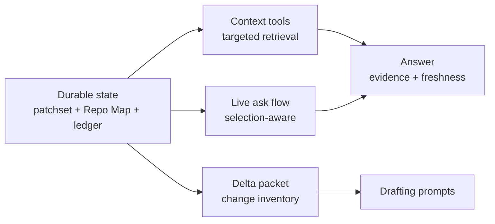

Rennet does not hand a model a repository dump. Review context is assembled on
demand: the server resolves a query or the current review selection against
durable state and returns bounded, freshness-tagged evidence.

## Repo Map context

The Repo Map provides two kinds of context:

| Layer | Source | Claims |
|---|---|---|
| Project snapshot | Deterministic repository processing at a pinned Git OID | Files, packages, symbols, entry points, dependencies, and identifier occurrences |

The map claims only what reading the tree proves. It carries no model-generated
explanation of the repository, so nothing in it needs a confidence label beyond
what the index itself resolved. Freshness travels with every answer.

Multi-repository contexts compose member maps by reference. The workspace records
member identities, pinned OIDs, fingerprints, cross-repository edges, and
freshness without inlining each member's complete map into one prompt.

## Retrieval tools

The context tools read pinned project state and review provenance. Each tool has
a deterministic handler, so a caller cannot confuse a truncated answer with a
complete one.

| Group | Tools |
|---|---|
| Project context | `context.map`, `context.file`, `context.novelty`, `context.overview`, `context.symbol`, `context.references` |

Tool replies contain `data` and `freshness`. They add evidence, totals, cursors,
and truncation flags when the result requires them. Callers can page or narrow a
large query without confusing a truncated answer with a complete one.

`context.file` and the symbol tools read the pinned repository context.
Retrieval never mutates review state.

## The Delta packet

`buildDeltaPacket()` in `packages/core/src/delta/` assembles what a lens drafter
is told about the change, from durable state: the reviewed range's identity
(base ref, base OID, head OID), the patchset's file inventory (with typed
mode-change evidence where the diff carries one), the hunk index with stable
content-derived ids, blast-radius signals, deterministic noise
pre-classification, test-to-implementation counterpart hints, the bounded
dossier, and — on re-review rounds — the successor account.

The packet is an **inventory, not the diff**. The hunk ids, headers, and spans
travel, because coverage is taught-or-skipped over those exact ids; the verbatim
hunk bodies do not. A drafter runs in the reviewed checkout, is told which
commits it is reviewing, and reads the content itself with `git diff`, `git log`,
file reads, and search. That is both cheaper and more honest than inlining a
serialized diff: the capture cap is 2 MB, far above what a prompt can carry, and
re-sending the whole diff every turn is what used to kill a lens on a large
branch. What the drafter cites is what it actually read.

The RSP noise seat is the one runner that still receives hunk lines, because its
validator culls its groups against the offered hunk ids. That payload is compact
JSON under a 256 KiB bound on the whole text: whole hunks in offered order until
the next would cross it, then a marker carrying the count of hunks left out. A
hunk the seat was not shown cannot be grouped and falls through to normal review;
the marker says so rather than pretending the seat can find it. The payload is
re-sent on each of its retries, so the bound is per attempt.

Ownership marks do not appear until dispatch supplies the rules, and openspec
artifacts enter at path grain with the full parse running where the artifact
text lives. The element differ lives in the same folder but feeds lineage carry
and the successor account, not the packet directly.

When the composition root can gate a fresh project snapshot at the patchset's
base OID, `assembleRoundCollation()` reads one snapshot-derived fact into the
packet: an edge-backed fan-in index for the blast radius.

### The fan-in signal

The same snapshot answers the blast radius's fan-in question — how many other
files depend on each changed file. Two availability rules keep a count from
becoming a claim the base cannot support. The **index** is supplied only when it
is genuinely populated, so an absent index stays a not-assessed mark rather than
a repo-wide zero. And each **file** is asked at its base-side path: a rename is
counted at the path it used to live under, and a path the base snapshot does not
carry at all — an added file, or one the file cap never indexed — gets its own
not-assessed mark. A zero here always means "checked, nothing depends on it".

## The related-context dossier

The dossier the packet carries is built in three stages, cheapest first. A
deterministic pass extracts issue references from the branch name, commit
subjects, and PR title and body — GitHub `#123` and `owner/repo#123` forms,
issue URLs, and tracker keys gated on a configured or repeatedly-seen project
prefix. `gh` then fetches each referenced GitHub issue or pull request (the
token stays inside `gh`; Rennet never reads it), and JIRA or Linear tickets are
fetched over their REST APIs from per-project config: a base URL and the *name*
of a token environment variable, read at call time and never stored. Last, the
`related-context-retrieval` Model Council seat (light tier) follows links one
hop and trims for relevance. A missing tracker config never blocks retrieval:
the result carries a typed missing-config fact, the answer becomes an ordinary
settings write, and the review proceeds meanwhile.

Retrieval fires in the background when a review opens and persists beside the
project snapshot under `~/.rennet/projects/`, keyed by review target and
patchset — a re-capture (new patchset) re-runs it. Per-round re-runs arrive
with round scheduling (planned). Every item is structured (id, tracker, title,
state, bounded body, acceptance criteria, URL, provenance, fetched-at) and
bounded twice — per item and dossier-wide, dropping whole items with the
omission recorded — so the dossier can inline verbatim through the Delta
packet's dossier seam; the drafting prompts that consume it arrive with round
scheduling (planned). Full comment threads and linked-ticket payloads persist
in the same store record for depth on demand — they never enter the dossier
itself, and the command binding that serves them to agents lands with dispatch
binding (planned).

## Selection-aware questions

`review.ask` is a live server operation. The UI sends the current review
selection through the session protocol. `packages/server/src/review-ask-live.ts`
resolves that selection against the immutable patchset, assembles bounded context,
and streams the answer back to subscribed clients.

Selection is an address, not prompt prose. The server resolves it to trusted
review state before constructing model context. This keeps a reconnecting desktop,
browser, or mobile client on the same review identity.

## Context budget

Retrieval moves from summary to detail:

1. Read identity, freshness, and available tools.
2. Retrieve a file, symbol, reference, or provenance record.
3. Narrow further when a reply reports truncation or a continuation cursor.
4. Answer from the retrieved evidence and state its freshness.

The server records the run in the ledger. This makes the retrieved context
inspectable without copying the entire conversation into durable state.

## Freshness behavior

Project and review identities are checked before the server labels retrieved
context current. A changed repository can make stored context stale while the
review's immutable patchset remains readable. Regeneration creates a successor
capture and rebuilt artifacts; it does not silently retarget the existing review.

See [Code intelligence](./code-intelligence.md) for the structural symbol tools
and [Architecture contracts](./architecture-contracts.md) for provenance and
freshness rules.
