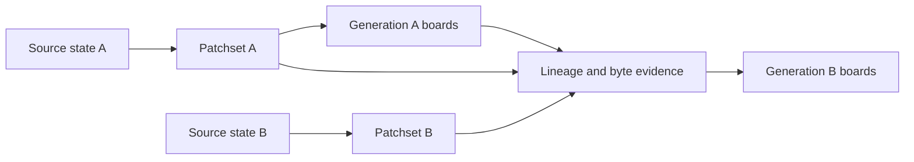
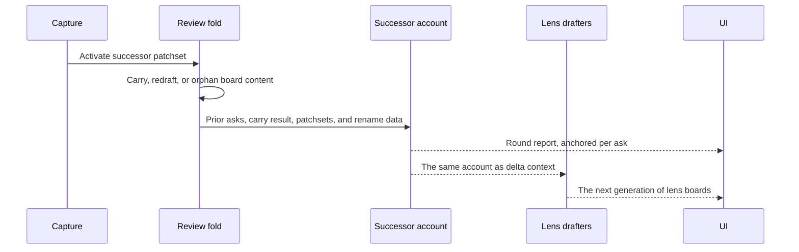

A review does not sit still: the branch moves, a work-order round lands
commits, and the code under the boards changes. This page describes the two
things Rennet keeps straight when that happens — **Delta**, the change-versus-
baseline context the drafting agents read, and the **successor account**, the
deterministic comparison of one generation of boards with the next.

The two used to share a name. They do not any more: Delta is context handed to
agents, and the successor account is an accounting handed to the reviewer.

## Patchsets stay immutable

A working tree, branch, or pull request head can change. A captured patchset
cannot. Recapture creates a successor instead of replacing the old input.



That is what keeps every mark attached to the material the reviewer actually
saw.

## Append-then-freeze

The boards for one review of one patchset are a **generation**. Inside a
generation the boards are live append-only logs: re-running a lens appends, and
board-native data on surviving element ids persists. When the code moves, the
whole generation freezes immutable and a successor generation is minted. The
frozen generation stays readable as drill-down; nothing is ever edited in
place.

## What carries

Carry is decided by evidence, never by resemblance.

| What moves | Rule |
|---|---|
| Board content on an element id a regenerated lens keeps | Carried verbatim, with no delta stamp |
| Board-native data — marks, groupings, arrangement, notes | Carried with the element id it sits on |
| An ask, thread, or highlight anchored into board prose | Re-anchored by quote match; a casualty stays visible in the Detached list |
| A code ref whose cited bytes are identical, including through a Git-proven rename | Resolves against the successor patchset |
| A code ref whose cited content changed | Redrafted, and its section carries a `new` or `reworked` stamp |
| A code ref whose source is gone | Orphaned, kept with its reason rather than reattached nearby |

## Occurrence lineage

An occurrence is a reviewable unit inside one patchset. Its ID is scoped to that
patchset. The lineage graph can describe a successor relationship as `exact`,
`one-to-one`, `move`, `split`, `merge`, `ambiguous`, or `terminated`.

These labels describe a relationship. They do not all authorize carry.
`AUTO_CARRY_LINEAGES` in `@rennet/protocol` contains only `exact`, and
`resolveAnchor()` reports whether the relationship carries state.

```mermaid
flowchart TD
  prior[Prior occurrence] --> class{Lineage class}
  class -->|exact| carry[Carry board content and read state]
  class -->|one-to-one, move, split, merge| redraft[Re-anchor where possible and redraft]
  class -->|ambiguous| uncertain[Keep uncertainty visible]
  class -->|terminated| orphan[Keep the old mark as orphaned]
```

`packages/core/src/lineage-matcher.ts` computes a graph from content, normalized
content, path, symbol, and surrounding context. It uses global matching and emits
ambiguity when competing candidates are too close. Its unit and measurement
tests exercise the classifier without client repositories.

The classifier is implemented, but the live carry path does not call it. It
remains a measured source of lineage data, not evidence that similar code has
already inherited a human judgment.

The synthetic corpus keeps the classifier's trade-offs executable. TP means a
correct carry, FP a wrong carry, and FN a missed carry.

| Class | Obs | Fixture pairs | TP | FP | FN | Fixture pass rate | Recall |
|---|---|---|---|---|---|---|---|
| `exact` | 21 | 7 | 21 | 0 | 0 | 100.0% | 100.0% |
| `move` | 5 | 4 | 4 | 2 | 1 | 66.7% | 80.0% |
| `one-to-one` | 6 | 5 | 6 | 0 | 0 | 100.0% | 100.0% |
| `split` | 1 | 1 | 1 | 0 | 0 | 100.0% | 100.0% |
| `merge` | 2 | 1 | 2 | 0 | 0 | 100.0% | 100.0% |
| `ambiguous` | 7 | 2 | 7 | 0 | 0 | 100.0% | 100.0% |
| `terminated` | 3 | 3 | 2 | 0 | 1 | 100.0% | 66.7% |

**Exact-only carry.** The fixture pass rate is 100.0% over 21 observations from 7 independent fixture pairs. The 95% Wilson lower bound is 84.5%. **Wrong carries under the live policy: 0.** This must remain 0.

**Move stays excluded.** Enabling `move` auto-carry would produce **2 wrong carries** on this corpus against 4 correct moves. One delete-plus-copy case reads as relocation, and one decoy keeps the old context and steals the lineage. `exact` carry safety rests on structure, not this synthetic-corpus pass rate. A byte-identical body at a unique body and path can only be mismatched by a SHA-256 collision. A duplicated body and path fails closed to `ambiguous`.

The measurement test pins this block verbatim. The corpus uses 19 synthetic
patchset pairs and no client code.

## The live carry path

The review fold in `packages/core/src/index.ts` compares deterministic file and
span evidence in the successor patchset:

- A byte-identical item at the same path carries.
- A changed item reopens and leaves the active set.
- A disappeared item moves to the orphaned set.
- A whole-file mark on a rename reopens.
- A span mark can carry through a Git-proven rename when its span bytes remain
  identical.

The distinction between the fuzzy graph and this byte comparison is deliberate
and visible in the code. Similarity can help describe a successor; it does not
stand in for byte evidence.

## The successor account

The successor account is the bridge from generation N to generation N+1. When a
successor patchset has prior asks, `buildSuccessorAccount()` builds it
deterministically. It records:

- `addressed`, `partially-addressed`, or `untouched` for each ask;
- changed paths not covered by an ask;
- new hunks outside the asked spans;
- handoff task attribution when present.

It has two consumers. The reviewer reads it as the round report — the greeting
that appears while the lens drafters regenerate. The drafters receive the same
account as delta context, which is why it is produced before they start.



At path grain, every changed path is either covered by an ask or listed beyond
the asks. When both patchsets are available, the account also compares hunks by
their added and deleted line bytes. Context and hunk line numbers do not define a
new hunk, so line-number drift alone does not appear as new work.

An unasked hunk is labeled `unasked-file` when no ask targeted its file, or
`asked-file` when the file was targeted but the hunk falls outside every asked
span. A truncated patch cannot support a complete hunk comparison, so that file
stays at path grain.

Handoff task attribution applies to asks, not hunks. One harness turn executes
the complete work order, so Rennet has no evidence that a particular task caused
a particular hunk.

## Delta marks

Composition stamps each touched section of a regenerated lens board `new` or
`reworked`; absence of a stamp means the section carried. The marks read as
unread state rather than as a changelog: a touched section opens expanded while
a carried section folds to its gist, so the board's own shape states what moved.
A small transient accent dot per touched section rolls up to the lens segment,
clears on interaction, and is replaced wholesale by the next round's stamps.

## Code map

| Concern | Owner |
| --- | --- |
| Lineage types and exact-only carry policy | `packages/protocol/src/domain.ts` |
| Anchor resolution over a lineage graph | `packages/protocol/src/delta/rsp.ts` |
| Generation, round record, and session shapes | `packages/protocol/src/session/model.ts` |
| Section delta stamps and the lens board projection | `packages/protocol/src/board/schema.ts`, `packages/protocol/src/board/lens-board.ts` |
| Fuzzy occurrence classifier | `packages/core/src/lineage-matcher.ts` |
| Live carry and successor fold | `packages/core/src/index.ts` |
| Path and hunk successor account | `packages/core/src/successor-account.ts` |
| Optional delta digest turn | `packages/server/src/delta-digest-live.ts` |
| Successor account rendering | `packages/app-ui/src/components/successor-account-panel.tsx` |

See [hand off and the exits](./handoff-and-exits.md) for the rounds loop that
mints each generation, and [architecture
contracts](./architecture-contracts.md) for the patchset invariants.
