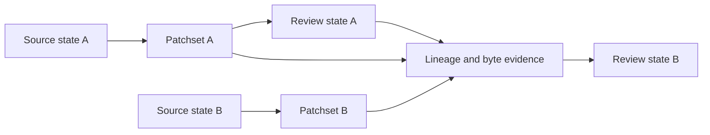
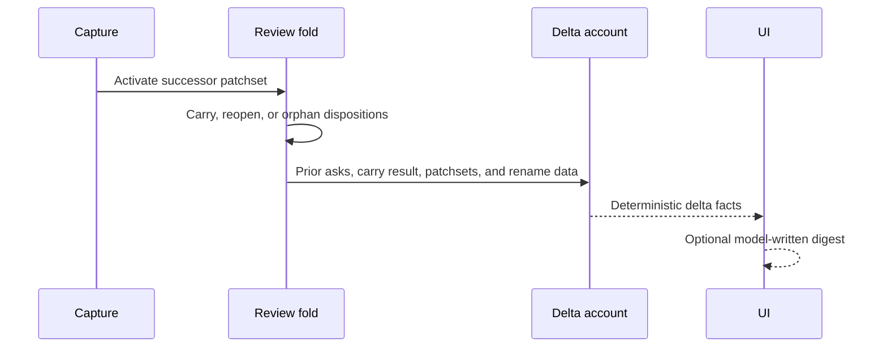

Delta re-review compares a reviewed patchset with its successor. Rennet keeps
both patchsets, carries state only when current evidence supports it, and shows
the rest as reopened or orphaned work.

## Patchsets stay immutable

A working tree, branch, or pull request head can change. A captured patchset
cannot. Re-review creates a successor instead of replacing the old input.



This keeps every disposition attached to the material the reviewer actually saw.

## Occurrence lineage

An occurrence is a reviewable unit inside one patchset. Its ID is scoped to that
patchset. The lineage graph can describe a successor relationship as `exact`,
`one-to-one`, `move`, `split`, `merge`, `ambiguous`, or `terminated`.

These labels describe a relationship. They do not all authorize carry.
`AUTO_CARRY_LINEAGES` in `@rennet/protocol` contains only `exact`, and
`resolveAnchor()` reports whether the relationship carries state.

```mermaid
flowchart TD
  prior[Prior occurrence] --> class{Lineage class}
  class -->|exact| carry[Carry analysis and read state]
  class -->|one-to-one, move, split, merge| reopen[Re-anchor where possible and reopen]
  class -->|ambiguous| uncertain[Keep uncertainty visible]
  class -->|terminated| orphan[Keep the old mark as orphaned]
```

`packages/core/src/lineage-matcher.ts` computes a graph from content, normalized
content, path, symbol, and surrounding context. It uses global matching and emits
ambiguity when competing candidates are too close. Its unit and measurement
tests exercise the classifier without client repositories.

The classifier is implemented, but the live disposition fold does not call it.
It remains a measured source of lineage data, not evidence that similar code has
already inherited a human judgment.

The synthetic corpus keeps the classifier's trade-offs executable. TP means a
correct carry, FP a wrong carry, and FN a missed carry.

| Class | Obs | Fixture pairs | TP | FP | FN | Fixture pass rate | Recall |
|---|---|---|---|---|---|---|---|
| `exact` | 21 | 7 | 21 | 0 | 0 | 100.0% | 100.0% |
| `move` | 5 | 4 | 4 | 2 | 1 | 66.7% | 80.0% |
| `one-to-one` | 6 | 5 | 6 | 0 | 0 | 100.0% | 100.0% |
| `split` | 1 | 1 | 1 | 0 | 0 | 100.0% | 100.0% |
| `merge` | 2 | 1 | 2 | 0 | 0 | 100.0% | 100.0% |
| `ambiguous` | 7 | 2 | 7 | 0 | 0 | 100.0% | 100.0% |
| `terminated` | 3 | 3 | 2 | 0 | 1 | 100.0% | 66.7% |

**Exact-only carry.** The fixture pass rate is 100.0% over 21 observations from 7 independent fixture pairs. The 95% Wilson lower bound is 84.5%. **Wrong carries under the live policy: 0.** This must remain 0.

**Move stays excluded.** Enabling `move` auto-carry would produce **2 wrong carries** on this corpus against 4 correct moves. One delete-plus-copy case reads as relocation, and one decoy keeps the old context and steals the lineage. `exact` carry safety rests on structure, not this synthetic-corpus pass rate. A byte-identical body at a unique body and path can only be mismatched by a SHA-256 collision. A duplicated body and path fails closed to `ambiguous`.

The measurement test pins this block verbatim. The corpus uses 19 synthetic
patchset pairs and no client code.

## Live disposition carry

The review fold uses `carryDispositionsByLineage()` in
`packages/core/src/index.ts`. This path compares deterministic file and span
evidence in the successor patchset.

- A byte-identical item at the same path carries.
- A changed item reopens and leaves the active disposition set.
- A disappeared item moves to the orphaned set.
- A whole-file disposition on a rename reopens.
- A span disposition can carry through a Git-proven rename when its span bytes
  remain identical.

The distinction between the fuzzy graph and this byte comparison is deliberate
and visible in the code. Similarity can help describe a successor; it does not
stand in for byte evidence when carrying a disposition.

## The delta account

When a successor has prior asks, `buildDeltaAccount()` creates a deterministic
account. It records:

- `addressed`, `partially-addressed`, or `untouched` for each ask;
- changed paths not covered by an ask;
- new hunks outside the asked spans;
- handoff task attribution when present.

The review fold stores carried dispositions and orphaned dispositions on the
successor review itself. The account uses that carry result to classify its asks.



At path grain, every changed path is either covered by an ask or listed beyond
the asks. When both patchsets are available, the account also compares hunks by
their added and deleted line bytes. Context and hunk line numbers do not define a
new hunk, so line-number drift alone does not appear as new work.

An unasked hunk is labeled `unasked-file` when no ask targeted its file, or
`asked-file` when the file was targeted but the hunk falls outside every asked
span. A truncated patch cannot support a complete hunk comparison, so that file
stays at path grain.

Handoff task attribution applies to asks, not hunks. One harness turn executes
the complete work order, so Rennet has no evidence that a particular task caused
a particular hunk.

## Code map

| Concern | Owner |
| --- | --- |
| Lineage types and exact-only carry policy | `packages/protocol/src/index.ts` |
| Anchor resolution over a lineage graph | `packages/protocol/src/rsp.ts` |
| Fuzzy occurrence classifier | `packages/core/src/lineage-matcher.ts` |
| Live disposition carry and successor fold | `packages/core/src/index.ts` |
| Path and hunk delta account | `packages/core/src/delta-account.ts` |
| Optional delta digest turn | `packages/server/src/delta-digest-live.ts` |
| Delta account rendering | `packages/app-ui/src/components/delta-account-panel.tsx` |

See [agent handoff](./agent-handoff.md) for the acting loop and
[architecture contracts](./architecture-contracts.md) for the patchset
invariants.
