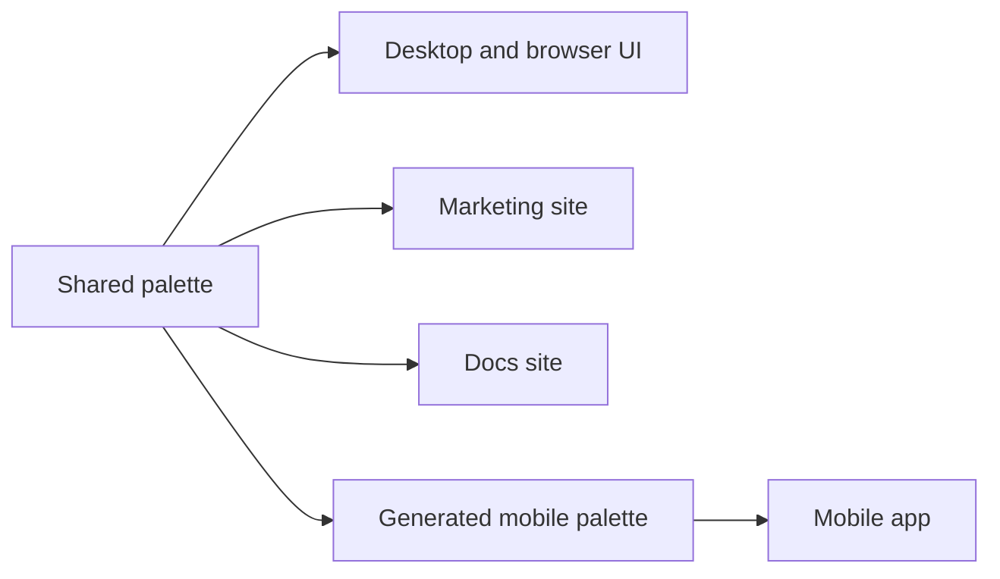
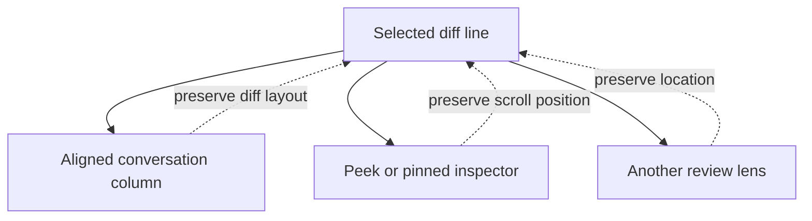
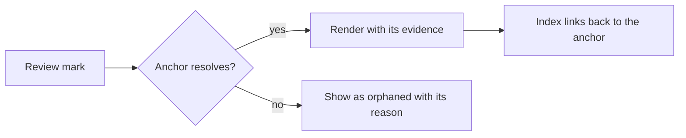

Rennet's interface keeps code readable, local review work distinct from outbound
content, and the reviewer's current position stable. `DESIGN.md` is the visual
authority; this page translates it into product behavior for contributors.

## One shared theme

`packages/theme/src/palette.css` is the source of color values for the product,
marketing site, docs site, and generated mobile palette. Product components use
semantic tokens from `packages/theme/src/theme.css` rather than raw colors.

The palette has complete light and dark schemes. Product and marketing surfaces
use `data-scheme="light|dark"`; the docs renderer maps the same tokens through
`data-theme`. An unstamped surface follows the operating-system preference.

The main color roles are:

| Token family | Use |
| --- | --- |
| Canvas, surface, raised | Opaque layout levels and reading areas |
| Accent | Links, focus, selection, primary actions, decisions, disagreement, and blast radius |
| Green | Added code and verified evidence |
| Danger | Destructive actions and errors |
| Diff add and delete | Source changes only |

Keep ordinary screens on the warm neutral ramp. Accent color points to something
the reviewer can act on or inspect. Color never carries meaning without text,
shape, or position.

## Theme packs

The Affineur's Bench palette in `palette.css` is the **default** theme, and it is
the one Rennet ships screenshots of. A viewer can select a bundled **theme pack**
instead: GitHub, One Dark Pro, Dracula, or Catppuccin Mocha. Each pack is one file,
`packages/theme/src/themes/<id>.css`, that re-binds every `--rn-*` colour token
under `[data-rn-theme="<id>"]` with complete light and dark scheme blocks. The
default stamps no attribute — absence of `data-rn-theme` is the Affineur's Bench.

A pack changes colour only; it never touches type, spacing, or radius, and it owes
the same contract as the default: every semantic role survives the mapping (accent,
evidence green, danger, diff add and delete, sheet, and the ground ramp), and every
ink and diff pair clears WCAG AA. `packages/theme/src/palette-sync.test.ts` fails on
a pack that drops a token (no partial packs), and `packages/theme/src/theme.test.ts`
runs the AA contract per pack per scheme. A pack translates an upstream palette's
spirit into Rennet's roles; where an upstream muted grey or accent falls short of
AA, the pack lifts it rather than copying the hex.

Syntax colour is a **separate axis**. By default code follows the active pack's own
`--rn-syn-*`; a viewer can instead pick a bundled **code theme**
(`packages/theme/src/code-themes/<id>.css`) that re-binds the syntax tokens
independently under `[data-rn-code-theme="<id>"]`. The marketing and docs sites stay
on the default theme — packs are an app-client feature.

## Surfaces stay opaque

The window uses one continuous canvas. Panels separate through small background
steps and one-pixel borders. Shadows belong to overlays such as menus, dialogs,
and popovers.

Code always sits on an opaque, high-contrast surface. The outbound preview has
its own sheet tokens and serif text, which distinguishes the result destined for
GitHub from the editable working view. Editing happens on the collation draft,
then the preview renders the resulting destination object.

## Typography has clear jobs

Rennet uses four type roles:

- Fraunces for product titles and display moments.
- Newsreader for review prose and model annotations.
- Geist for navigation, controls, labels, inputs, and metadata.
- Geist Mono for source code and exact technical values, over the platform
  monospace stack as fallback.

The desktop component ramp is `11, 12, 14, 16, 18, 20, 24` pixels at a 16-pixel
root, plus the front-door display size. Components express these through
Tailwind utilities from `text-2xs` through `text-2xl` and `text-display`. A
design-ramp test in each of `packages/ui` and `packages/app-ui` rejects
arbitrary text sizes, radii, and color escapes in that package's source.

## Keep the review position fixed

The selected diff line is the reviewer's place. Opening a thread, changing a
lens, or inspecting a symbol must not reflow the diff and move that line.

Conversation panels render in a sibling margin column and align through anchor
keys. The code view owns scrolling and virtualized rows. Focus requests scroll
to a resolved anchor; malformed or orphaned requests leave the current scroll
position unchanged.

## Keep marks at their evidence

A disposition, finding, conversation, or proposal belongs at the line, span,
chunk, requirement, or fragment it describes. Indexes may navigate to those
anchors, but they do not replace the anchored rendering.

Do not attach a mark to nearby code when its own anchor fails. Preserve the
content and show the unresolved state.

## Reduce density without losing content

The first view should make the change readable without hiding review material.
Group related changes, collapse secondary detail, and keep every part reachable.

- Noise remains a visible accounting of low-signal changes.
- Truncated or incomplete inputs are named where their effects appear.
- The user can move between review-wide summaries and exact hunks.
- Collapsing changes presentation, not the underlying account.

## Show useful progress

Long operations should say what Rennet is reading or producing. The progress
feed folds real processing events into repository blocks and links completed
artifacts when it has a valid anchor. Unknown event kinds may be skipped, but a
failure or unfinished stage must keep an explicit state.

A spinner is enough only before the first useful event arrives. Do not replace
available stage, count, or failure information with an indefinite animation.

## Keep controls terse

Controls should normally fit in four words. Review prose can be longer when the
meaning needs it.

- Use proportional type for interface controls and monospace for code.
- Use familiar icons for compact actions.
- Give unfamiliar icons a tooltip and accessible name.
- Use shared icon components for controls instead of emoji or text glyphs.
- Use the shared radius and color tokens instead of one-off values.

## Accessibility is part of the component

Every pointer action needs a keyboard route and visible focus. Controls need an
accessible name even when the visible label is only an icon. Both color schemes
must keep text contrast, code legibility, and status distinctions.

Respect reduced-motion preferences without removing state changes. Touch
surfaces use at least 44 by 44 pixel targets. A compact visual layout does not
justify a smaller interactive target.

## Show execution context

An in-project screen should show the active execution locus and mode where that
context affects behavior. The settings screen owns locus selection. Review and
model work run without per-turn confirmation UI.

The outbound preview has a different job. It names the GitHub destination and
shows the complete review or pull request that the server command will send.

## Review checklist

Before a UI change is done, check:

1. Does code remain opaque, readable, and stable while adjacent UI changes?
2. Does each review mark resolve to its evidence or an explicit orphan state?
3. Is hidden detail collapsed rather than discarded?
4. Does progress name real work and real failure states?
5. Do components use the shared palette, type ramp, radius scale, and icons?
6. Does the outbound preview match its canonical payload?
7. Can keyboard, touch, and reduced-motion users complete the same work?

## Code map

| Concern | Owner |
| --- | --- |
| Visual authority | `DESIGN.md` |
| Shared palette and Tailwind mappings | `packages/theme/src/palette.css`, `packages/theme/src/theme.css` |
| Theme packs and code themes | `packages/theme/src/themes/`, `packages/theme/src/code-themes/` |
| Desktop type and radius ramp | `packages/app-ui/DESIGN.md` |
| Vendored component kit | `packages/ui/src/components` |
| Rennet product components | `packages/app-ui/src/components` |
| Desktop and browser app state | `packages/app-ui/src/app.tsx` |
| Mobile theme projection | `apps/mobile/src/theme` |
| Palette and contrast checks | `packages/theme/src/theme.test.ts`, `packages/theme/src/palette-sync.test.ts` |
| Component ramp checks | `packages/ui/src/design-ramp.test.ts`, `packages/app-ui/src/design-ramp.test.ts` |

See [canvas model](./canvas-model.md) for review layers and
[collation and publishing](./collation-and-publishing.md) for the draft and
outbound preview.
