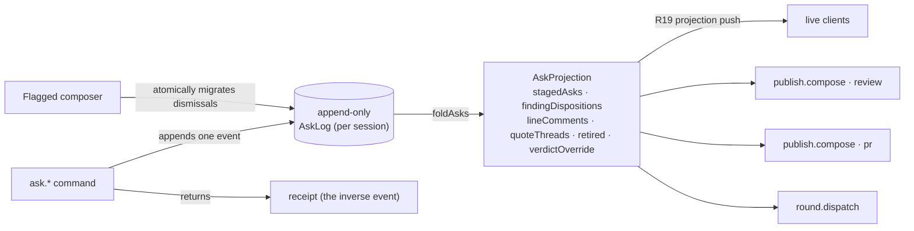

A review ends by leaving through an exit: the posted forge review, a dispatched
work-order round, or the pull or merge request. GitHub and GitLab.com support
intake, CI reads, review publication, and own-branch change-request submission.
Everything the reviewer concludes along the way gathers as asks, and Rennet keeps
every outbound document drafted as it goes.

There is nothing to choose between. The composed work order runs as **one turn on
the review's thread** in the [T3 Code sidecar](./t3code-sidecar.md)
(`packages/server/src/t3/handoff.ts`), full access, with the checkout as its working
directory; the turn's diff is T3's own checkpoint, and the delta re-review that
follows is unchanged.

The work order itself is **a file, not a prompt**. Before the run,
`review.handoff.run` writes the ordered, grouped, verbatim tasks — each with its
anchor and its diff fence — to `.rennet/context/<reviewId>/work-order.md` under the
session's **bound workspace**, and the turn's prompt names that path relative to it.
That is the same root the turn runs in, so the agent reads the order the way it reads
the rest of the checkout; written under the repository while the turn ran in a worktree,
the path would name a file that is not there. The bundle's `prompt` is that short pointer
text, and `verifyComposedBundle` still recomputes both it and the digest from `tasks`, so a
run still refuses an order nobody composed. The round worker is the one exception today:
it runs in a detached worktree the path would not resolve against, so its work order
is still sent inline until the round binds to the session's own root.

## The session is the durable root

A review lives in a **session** — the first-class durable object that owns the
harness cursor, the anchored threads, the **claim** on the target, and the one
**workspace** every turn it spawns runs in. Entering
a New-chat row that resolves to a branch or PR **mints a session and claims the
target in one act**; the branch and its pull request are one claimed thing, and
every other New-chat row resolving to that same target disappears while the
claim holds. Re-entering a row whose session is already live **reattaches** to
it — it never mints a second — and the drafting pipeline starts idempotently per
session, so a re-entry mid-generation never double-starts a round.

The claim **locks once boards exist**. A session with no target upgrades in
place when one binds, but once a generation has been minted the claim is
immutable — a new target requires a **new session**, not a rebind. A merged
target keeps its claim. **Archive is the only release**, a soft delete: nothing
else frees a claimed target, so one target has one session, and it persists
across restarts from its cursor rather than being re-minted per review.

A session is keyed by **the project it belongs to and the repository its work
runs in**. The project is the sidebar's grouping key, and both ways a session
comes into being — a New-chat row click and a round dispatched on a review
nobody entered — mint through the same mechanism on that same key, so a session
a round created appears under its project like any other. The repository root
rides alongside it because a workspace project holds several repositories: the
project alone cannot say which one a round ran in, and without the repository
two repositories sharing a branch name would collapse into a single rounds
ledger. A New-chat row cannot know a repository's path, so it carries the
repository's forge identity (`forge`, `owner`, and `name`) alongside the
existing `owner/name` label. The smart list, target claim, and session matcher
use that identity when both sides have it. A session saved before the field
existed falls back to the `owner/name` match, so it still reattaches instead of
offering a duplicate target. Two forges can therefore carry the same
`owner/name`, branch, and pull-request number without collapsing into one row
or session. Provider selection is also the server-side boundary for detailed CI
status, review publication, and change-request submission: each operation resolves
the provider from that repository identity, and an unregistered forge never
falls through to GitHub. GitHub rides `gh`-owned credentials. GitLab.com rides the
proven `glab` binary in the repository's execution environment for smart-list
reads, exact merge-request intake, pinned CI status, review notes or approvals,
and merge-request submission. A forge without the required installed and
authenticated tool fails with that repair instead of returning an empty list.
Self-managed GitLab and Bitbucket remain
[planned in #484](https://github.com/rbutera/rennet/issues/484).
A round dispatched on a target reads the same forge identity from the repository
it is about to run in, so it joins the session the click created instead of
starting a second one beside it. A detached HEAD has no branch to claim, so its
session is keyed by the review instead — and it is persisted like every other,
because a session the store does not hold is a session no surface can read back.

### One workspace per session

Beside the repository, a session records the one **workspace** it is bound to, and every
turn it spawns runs there: the six lens seats, the chat thread, the handoff thread and every
cold utility turn. The binding is decided once, from the review target — the reviewer's own
checkout when some worktree of the repository already has the reviewed branch out, a
Rennet-created worktree at `~/.rennet/worktrees/<repoKey>/<branch>` when nothing does, the
detached worktree at the reviewed head for a pull-request snapshot — and recorded as
`boundRoot`. A workspace that cannot be created fails the bind and records nothing rather
than falling back to the clone, which sits on another branch. Nothing re-decides a binding
afterwards, though a pull-request binding is re-pinned when a landed round advances the
reviewed head. A session with no recorded binding — created before the binding existed, or
one whose first bind threw — binds on its **next use**, whichever use that is: the read the
chat and handoff threads are created from binds, and so does the lease every review-scoped
turn takes. None of them answers the clone while the field is empty, because a thread's cwd
is fixed when it is created.

The coding round is the one child still outside this: it runs its own detached worktree per
operation and lands the result onto the branch. Moving it onto the bound workspace is a
separate change.

The workspace is where the session's `.rennet/context/<sessionId>/` directory lives, which
is what makes the relative paths in every prompt resolve: a turn's cwd and the root its
context was written under are the same thing by construction. The handoff run captures its
successor from that workspace too — it is where the agent wrote. The chat header's trail
names the bound workspace beside the branch, so a session drafting in a worktree rather than
the reviewer's own tree says so. Full detail:
[T3 Code sidecar](t3code-sidecar.md#session-bound-workspace).

Anchored threads keep their content in the session transcript; the boards and
the diff hold only anchor→thread references, so a code-line comment, a
prose-quote thread, and Explain all ride one mechanism.

## Asks

Everything gathers as **asks**: typed messages carrying an anchor, text, an
intent, and an exit lane, minted from findings, code-line comments, quote
threads, or plain conversation, each with provenance back to its source.

**Staging is the reviewer's act.** An ask is minted where the reviewer decides
one: a finding's control, a code-line comment, a highlighted span of board prose,
or a conclusion reached in the review's own conversation — its
[T3 Code thread](./t3code-sidecar.md), which fills the chat slot
(`packages/app-ui/src/chat/t3-chat-dock.tsx`, sending on `chat.t3Send`). The thread
holds no `app_*` tools today, so a conclusion drawn there is staged from the board,
the line, or the span it belongs to rather than by the thread itself. Every staging
act leaves an undecorated receipt at its source — a chip on the thread — and the
receipt is also the undo. Findings never auto-stage; staging records the reviewer's
judgment, not the lens output.

The **Hand off button is the live basket**: its count ticks as asks land, and
it carries a derived working state while a draft rework runs.

## The durable-asks backend

Asks are **durable host-side, per session**, and there is exactly **one storage
write path**: commands append one event to an append-only per-session log, while
the Flagged composer atomically appends a related migration batch. The current
ask state is the pure **fold** of that log — never a second stored copy.

- **The log is the only mutation.** `ask.stage` / `edit` / `retire` / `restore`
  / `quoteOpen` / `quoteReply` / `quoteClose` / `setVerdictOverride` /
  `setLineComment` / `clearLineComment` / `dismissFinding` /
  `restoreFinding` / `unstage` each append one event. The `ask.*` dispatch
  handlers are the reviewer-action writers; the one internal writer is Flagged
  composition, which clones uniquely reattached dismissal state onto successor
  findings in one atomic batch before the board is written. No path edits a
  projection in place. `ask.read` is the projection, and reads never write.
- **Receipt-is-undo.** Every reviewer command returns a **receipt** that is the
  inverse event — applying it restores the prior projection (stage↔unstage, edit↔the
  prior body, quote-reply↔drop-last, finding-dismiss↔finding-restore,
  override-set↔the prior value). Undo is just the next append, so it survives
  reload like any other write.
- **Reload survival.** The projection is `foldAsks(read())` over the on-disk
  log; a restarted host reads the same log and folds the identical projection.
  Staged asks, finding dispositions, line comments, quote threads, the retired
  ledger, and the verdict override all survive a kill. Nothing is
  client-derived — a reconnecting client reads the current projection, pushed
  on every append through the R19 projection (host paths routed through
  `toRepoReference`, prose through the blanket scrub; the ask projection adds
  no new leak).

Finding actions use that same projection. A finding's request-change ask
carries a `FindingRef` and its first captured `CodeRef` (patchset, path, side,
and full span); the old text anchor and side remain only as a compatibility
fallback for earlier logs. A dismissal records a finding disposition; restoring
it removes that disposition. Both use `(generation, Flagged board id, finding
id)`, so a reused element id in a successor generation or an abandoned draft
attempt cannot inherit the act. Discuss stores a
quote thread with the same generation anchor, then sends one anchored turn
through the live session while the client opens and focuses the existing chat
dock. The Flagged open count folds the immutable board state together with
staged finding asks and dispositions.

The projection is the single source every exit and finding overlay composes
from.

## Selection is the steering wheel

Board prose selection offers **Comment / Request changes / Explain**. Draft
prose selection offers **Revise / Drop / Explain** — revise takes a free-text
instruction anchored to the span, drop retires it, explain answers with
provenance (which comment or finding produced the sentence). Same highlight
mechanics and thread tooltips everywhere; steering instructions become the
span's inspectable history.

## The Hand off view

Hand off toggles a view over the main surface. The toggle itself is
target-aware and carries the staged-ask count: on a teammate PR it reads
**Write Review** (the review concludes, under the reviewer's name); on one's
own branch or PR it reads **Continue** (the rounds loop keeps going). Its
lanes depend on the entry mode:

- **Teammate PR** — one lane: *Post review*. Work orders are own-branch only.
- **Own branch** — one goal with two states, and the page's shape states
  which one holds: while asks remain the surface is **Changes** (one entry per
  ask, Dispatch Round) and the change request is a single muted destination
  line; when nothing is left to ask, the surface IS the change request — title,
  drafted description, and **Open Pull Request** or **Open Merge Request** for
  the resolved provider. **Dispatch Round** is live only when that set contains
  a comment or request-change the coding worker can address. Questions and
  approvals remain staged review notes; Rennet never turns them into code work.
  Primacy flips with the state; nothing explains the flip.
- **Retrospective** — no exits.

When the daemon **refuses to compose** an exit — a comment carrying a path that
would post outside the repository, or a detached HEAD with no branch to open a
change request from — the lane states that reason where the exit would have been and
carries on. There is nothing to dismiss and nothing to retry past: a refusal is a
fact about this review, not a step in a ceremony. What it replaces is worse than
the refusal itself, which is a Post Review that renders dead with no account of
why, or a Changes surface that simply never becomes the change request.

Round dispatch follows the same rule. The client waits for the daemon's
`dispatched` receipt before opening the run view. An honest `dispatched: false`
stays on Changes, names that no coding round started, and leaves every staged
review note intact.

## Living drafts

Rennet continuously redrafts every outbound document — the review text,
the work order, the change-request description — as the review progresses. Each
comment, dismissal, or thread conclusion queues a rework. A rework runs as a
**one-shot worker outside the interactive session**, and reworks are
**serialized per document** — two edits to one board queue behind each other so
their writes never race, while edits to different documents run in parallel. Those
workers own the initial structure and every model rework. The reviewer may also
save a direct block edit. Save appends one durable `ask.edit`, replaces that
block in the canonical ask projection, and invalidates the composed preview.
Reload, work-order dispatch, review preview, and review post all read that same
body. Editing and saving never posts; Post or Dispatch remains a separate act.
Conversation and highlighted spans remain the normal steering paths for broader
rewrites.

- Folding a staged ask into a draft is near-instant assembly; its only
  visibility is the affected block streaming in place. The **drafting
  activity feed** — a collapsed line expanding into full turn anatomy with
  the trigger queue — belongs to the long-running regeneration after a
  work-order round returns, and appears only there. The surface never locks.
- Stale content is removed and ledgered, never left and never silently
  dropped: a **Retired** drawer holds every retired block with its reason and
  round receipt, restorable with a click; a **Detached** list holds threads
  whose anchoring prose no longer exists.

A **span rework** (`review.reviseSpan`) is the concrete backing: a one-shot
worker reworks one staged ask's body per the reviewer's instruction, then lands
the result through the **same ask log** — it is an `ask.edit`, not a second
writer — so a reworked ask survives reload for free and its receipt reverses it
like any hand edit. The reworked span **re-anchors** across the regenerated body
by matching its quoted text (the shared lineage matcher, fail-closed: a span
that did not survive regeneration carries a null anchor rather than a wrong one).
Reworks on one review serialize behind a per-review promise tail; reworks on
different reviews overlap.

## The review's two strata

A GitHub review is one **review body** plus **line or range comments** pinned to diff
positions, and the draft mirrors that shape rather than flattening it. An ask
whose provenance carries a diff position — a finding's anchor, a code-line
comment — becomes a line or full-range comment, grouped by file with its citation. An ask
without one (a quote of board prose has no diff line to pin to) travels in
the review body. A path-only ask has
no diff position either, so it folds into the body the same way; the conversion
is recorded in a ledger returned to the client rather than happening silently.
When a provider cannot anchor a range, the complete `start–end` range folds into
the review body and the degradation ledger records that conversion; it never
narrows silently to one endpoint. The preview renders the exact forge body and threads that post. Provenance and
the degradation ledger remain visible beside that descriptor rather than being
inserted into it.

Captured provenance is resolved against the review's active patchset before it
becomes a line comment or work-order anchor. A base-side citation through a
rename keeps its old-side line and side but uses the changed file's current path.
A citation from another patchset is not reinterpreted through its old
`path:line` fallback: it becomes an unanchored review-body note and a file-level
work-order item instead of pointing at unrelated current code.

## Verdict and the approving review

Rennet proposes the verdict from the reviewer's durable acts, and the reviewer can
always flip it — there is no path that decides the verdict for them. A flip is
a durable write on the ask log (`ask.setVerdictOverride`) that recomposes the
preview, so the verdict on screen is the verdict that posts — there is no
separate verdict argument riding along at post time. An
approving review is a first-class flow, not an empty state: a drafted Approve
whose body is grounded in the active persisted boards, patchset, and durable
reviewer acts. Publication keeps the accepted contract: an exact-payload preview
and one direct Post — no holds, no consent ceremony.

The GitHub review event follows the outbound set: any outbound request-change
ask makes it `REQUEST_CHANGES`; comments and questions alone make it `COMMENT`.
With no asks, the grounded opener proposes `APPROVE`. A durable verdict override
always wins.

## One payload, one source

The preview and the post are the same object. `publish.compose` returns one
artifact (`opener`, line comments, body notes) and one exact forge descriptor
(`event`, `body`, `threads`). Before any egress the server reconstructs both in
`@rennet/core` and compares the descriptor exactly, so the renderer cannot build
a different body after preview. For a teammate review, the server derives the
pull-request target from the addressed review. For an own-branch exit,
`publish.compose` resolves the effective push URL and returns its
provider-qualified repository; the client can only round-trip that target. A
daemon-composed payload carries a `compositionId` bound to the review, active
patchset, canonical artifact, and either its review event or own-branch target.
A stale preview, changed verdict, or changed forge destination is refused as one
stale composition, not routed through a confirmation step.

The model-authored opener is content-addressed by the persisted evidence used to
draft it. Unchanged evidence reuses the exact stored bytes across remounts and
daemon restarts; changed boards, asks, patchset, or verdict draft a new opener.
That stability keeps the canonical payload and retry marker stable when a post
may have landed but its response was lost.

The post carries a deterministic idempotency marker. GitHub and GitLab check
for that marker before creating anything, so a retry after a lost response
returns the review that already landed instead of posting a second one. When no
matching review exists, the provider adapter reads the pull or merge request's
live head and refuses a moved head before its first mutation. A matching marker
proves a one-step provider operation already landed; a durable local receipt proves
the complete operation. Either wins over that freshness check. GitLab sends the
descriptor's reviewed body without adding provider-only prose after preview; when
GitLab needs the textual verdict, the core composer puts that label in the signed
descriptor first. On an approving retry, the marker proves only that the note
landed. The adapter also reads whether the current user approved. It returns the
reused receipt when approval already landed, or rechecks the immutable head and
performs the missing approval once.

After the provider returns a result, the daemon persists the publication receipt
by review and marker before it answers the client. `publish.receipt` reads that
record, including the canonical provider review URL, verdict, and line-comment
count. The Hand off lane hydrates it on mount, so a daemon or app restart returns
to the posted state rather than offering a second Post action.

The outbound payload holds only what the reviewer sent. Internal conversation,
model traces, and draft history never enter it unless their text became
outbound draft content. There is no hosted Rennet backend: of the exit
payload, the registered forge receives the review or change request (GitHub
reviews and pull requests, or GitLab.com merge requests), and the harness
provider receives model-turn context.

## The three exits, as built

Each exit composes from the durable ask projection, never from a private copy.

The projection is filled by the client, through one path. Every reviewer act on an
open review — staging an ask, saving a line comment, opening or replying to a quote
thread, retiring or restoring a draft block, setting the verdict — runs an `ask.*`
command against the review's ask log, whose session identifier **is** the review
identifier. The renderer's `review` store slice is the render-side cache of that
projection: `useAskLog` hydrates it from `ask.read` when the review opens and writes
each mutation through. The daemon's full-projection push folds into that same read, so a
server-authored cleanup — including a completed round consuming its exact asks — updates
an already-open review. Nothing an exit reads is client-derived, and a reload keeps the
reviewer's work because the daemon holds it.

The exits themselves:

- **The GitHub review** — `publish.compose(mode:"review")` folds the projection
  into the two strata: staged line or range asks and bare line comments become
  anchored comments in deterministic `(path, start line, end line)` order (an exact
  single-line ask wins over a
  bare comment there); pathless asks become body notes and retired asks stay local. The verdict follows
  the outbound set, and a set **verdict override wins** over the derived event.
  The composed artifact and forge descriptor pass unchanged to `publish.review`,
  which independently rebuilds them before posting. A completed publication is
  recorded durably before the command returns and reloaded by marker on remount.
- **The round work-order** — `round.dispatch` folds the addressed asks into
  **exactly one** work-order and hands it to the rounds runtime **serialized per
  session** (one round in flight; the second dispatch of the same asks coalesces
  onto the first rather than racing a second). A failed kick is evicted so an
  identical re-dispatch retries. A branch round lands on the branch selected by
  the New-chat row, never whichever branch happens to be checked out at the
  repository path. An unmounted selected branch advances atomically from its
  captured head; a selected branch checked out in this or a sibling worktree is
  fast-forwarded there so its ref, index, and files remain coherent. Unrelated
  local edits survive, while an overlapping edit leaves both the branch and
  checkout unchanged. A restart adopts the durable landing receipt instead of
  landing twice, and a no-op round does not invent a commit. Board
  **regeneration** is the tail of the same dispatch. Once the worker result is
  written to the durable dispatch record, the successor is captured from the
  persisted source base OID through the landed worker OID. The selected base and
  head branch names remain provenance, but later ref moves cannot change that
  round result. The round then assembles its collation from the active patchset
  and runs the drafting pipeline for real, minting a new generation and freezing
  the prior one. A failure after that commit point — no active patchset
  to regenerate over, or a regeneration that throws — closes the round's
  progress channel with a terminal failure and leaves the checkpoint evidence
  intact for a regeneration-only retry. Recovery also owns the earlier execution phases. If
  the daemon restarts while the coding worker is running, it reconstructs the
  worker's partial diff and changed-path evidence from the preserved detached
  worktree, records an actionable failed receipt, and never invokes that worker
  again. If the restart interrupts the configured gate, it runs the same gate
  command over that preserved worktree under the durable gate execution identity
  and continues only from the resulting receipt.
- **The pull or merge request** — `publish.compose(mode:"pr")` resolves the effective
  push URL before drafting and shows its provider-qualified repository on the
  preview. That target joins the canonical submission in a **stable derived
  `compositionId`**, so an unchanged draft re-raises the *same* publish-ready.
  As each round lands, the own-branch PR draft **re-composes and re-raises
  publish-ready idempotently** (PR-lane ripening). `publish.submitPr` resolves
  the destination again, refuses a provider or repository change before push,
  and gives the same resolved destination to both the named-remote push and the
  forge create operation. Opening remains idempotent by head and base, with an
  existing change request reused on re-submit.

Nothing here posts. Every exit drafts and previews; the branch push that opens a
pull or merge request is not publication, and a GitHub review egresses only when
Rai clicks Post.

## Opening the pull or merge request

The own-branch exit is one action. Before the preview appears, the server
resolves one registered forge destination from the effective push URL and names
its provider and repository beside the branch range. The composition binding
covers that exact target. On sign, the server verifies the previewed head against
the active patchset, resolves the destination again, and refuses any provider or
repository drift before mutation. The one resolved object then supplies both the
named remote to push and the repository passed to the forge adapter. GitHub opens
a pull request through its registered adapter; GitLab.com opens a merge request
through `glab` in the repository's own host or WSL environment. The UI follows
each provider's vocabulary and number marker: **Pull Request #42** or **Merge
Request !42**. If an open change request already exists for that head and base it
is reused; otherwise one is created from the previewed title and body. A detached
HEAD, unsupported remote, ambiguous push URL, or changed destination fails before
the push rather than sending something the preview did not describe. An unavailable
`glab` is discovered after the branch push but before merge-request creation; it
fails without borrowing a CLI from another host, and the Settings health row names
that host's repair.

## Rounds: the own-branch loop

1. Gather asks into *Changes*.
2. Dispatch — one round at a time, one worker in a detached worktree; asks
   gathered mid-run queue for the next round.
3. Watch the run live. Until the daemon answers, what the view shows is the
   *intent*: you asked for a round, and nothing has come back. The daemon's
   receipt is what promotes it, and a refused dispatch reads as the refusal it
   was, carrying the daemon's reason — a round that never started never reads as
   one under way. Dispatch takes over a dedicated run view (`/s/:slug/run`)
   that reads the durable operation receipt as the prep, worker, gate, commit,
   report-drafting, and report-verification phases settle. The visible commit
   step coarsens separate detached-commit, source-landing, and round-recording
   receipts; each remains its own restart boundary. The view is
   deep-linkable and cold: opening it mid-round reattaches to the newest durable
   receipt and never re-dispatches. The first round pins one enabled installed
   Claude Code or Codex harness to the session; later rounds use that exact harness,
   and the run receipt names its version. The durable `report-drafting` phase is
   coarse: it covers both the report classification and the whole lens
   regeneration call. It is the report's durable **handoff** that tells the two
   apart, so the phase projects as `handed-off` once that handoff exists and the
   visible label stops naming report drafting while the lens lanes are what is
   running. Operation-scoped progress refines that phase in the client.
   As soon as the host has read back and verified the durable report, the run route
   hands off to the report greeting while regeneration remains nonterminal. A cold
   reload on the board route reconstructs that greeting from the durable operation
   and report projection; it does not depend on the in-memory greeting arm. If the
   same operation later fails, the client returns to the existing run failure view
   instead of falling through to a board. Terminal completion first enters a
   resumable handback:
   Rennet records the stable Return turn, consumes the exact dispatched ask
   occurrences, and cleans up the round source before the durable operation
   records that the round has returned. Only that return receipt hands the UI
   back to the board surface. A second Dispatch received during handback is
   durably queued and replaces the prior operation without exposing round one's
   completion as the new run. A terminal failure stays on the run with its failure
   receipt and offers both **Return to Review** and **Retry**. Retry resumes the same
   operation from the exact failed checkpoint, preserving its worktree, asks, logs,
   and completed effect receipts. A failure after source landing retries only the
   recording or board-regeneration tail; it does not repeat worker edits, gates,
   commits, or board identities. Once a round has returned, the session row carries the durable
   ledger ordinal as *Round N is back*. The display transcript keeps every
   pre-round row and appends two stable lifecycle turns: the reviewer's
   *Dispatch it.* when the operation is claimed, then a receipt-derived
   *Round N is back* turn after verified completion. Recovery and repeated
   terminal drain reuse those row identities rather than duplicating them.
4. On completion the **round report** runs first. One provider-neutral,
   Council-routed classification turn receives the report prompt
   (`packages/prompts`, `src/prompts/report.md`), the successor patchset id, the
   durable asks, and the exact coding-turn receipt. The default assignment is
   Sonnet at low effort when Claude is available, including the dual-provider
   scenario, and Terra at low effort in Codex-only installs. Task and tier
   overrides remain authoritative.
   It verifies each ask against the round's diff rather than taking the worker's
   word, and returns only addressed / partial / untouched / beyond classifications
   with changed-line anchors. The host copies exact ask ids and text into a
   deterministic report board; this path has no generic board retry or
   post-process turn. Before completion, the host parses that report as a report board,
   requires exactly one non-beyond outcome for every dispatched ask, rejects
   duplicate or invented ask references, and resolves every addressed, partial,
   or beyond evidence anchor against the expected successor patchset and an
   exact added or deleted line in the worker's complete measured diff. A report
   cannot call an ask addressed by citing another file, an unchanged context
   line, a stale patchset, or a binary or mode-only change that has no
   line-addressable evidence. This verification runs before the successor
   generation, quote migrations, or real-generation ledger row are published;
   rejection leaves the pending placeholder and dispatched asks retryable.
   The report is one artifact with two consumers: the reviewer's greeting and
   additional round context for the lens drafters. It is separate from the
   deterministic successor account. A verified report is a sequencing boundary,
   not an approval or capability gate: lens fan-out starts after that artifact is
   readable. A failed or unavailable required report instead ends report drafting
   immediately with its exact reason; the host does not spend five lens turns on
   a generation that has no usable greeting.
5. The reviewer reads the report while the lens drafters regenerate in the
   background, their progress live beneath it — one lane per lens, streamed
   from the round's real progress, with the kicker reading *Regenerating the
   Boards* until the generation composes and *Regenerated the Boards* after.
   After the report verifies, all five lens lanes run concurrently and each
   settles from its own semantically accepted board, typed absence, or explicit
   failure. Sequence requires a reachable `order_step`; Decisions and Flagged
   require a reachable `decision` or `finding`, or their exact typed absence.
   A settled lane reads **carrying forward** or **reworked**; see
   [Carry-forward is a verdict, not a skip](#carry-forward-is-a-verdict-not-a-skip)
   for exactly what that claims. A drafter that produced neither an accepted board nor a
   typed absence settles its lane as **failed** carrying the reason — a lane left
   running after the round is over would read as "still working". The surface never locks, and it always
   ends: composing is terminal from wherever the round had got to, exactly as
   failing is, so a round that finishes can always say so even when an
   intermediate step never happened. The early greeting never exposes **View the
   New Boards** while regeneration or persisted verification is nonterminal.
   That control appears only after the durable operation reaches terminal
   `composed`; it is never a disabled button waiting to enable. A round where
   *every* drafter failed composes nothing, so it ends on
   a terminal failure carrying the drafters' reasons rather than offering a way
   to boards nobody wrote.

   A round that lands a successor patchset supplies explicit round context. The
   report receives the successor patchset id, exact dispatched asks, and exact
   worker receipt; the host keeps the prior generation and durable finding
   dispositions for composition. The round number is display and ledger data,
   not classifier input. If
   no report seat resolves or its draft fails, the round fails at that boundary
   before any lens starts and keeps the dispatched asks retryable. A coding turn
   that changes no code keeps the existing generation and records no report or
   addressed claim; it terminates as unchanged and consumes only the exact ask
   occurrences that turn handled. Dispatched intent alone is not evidence that
   work landed.
6. A round that lands code mints a **new generation** of lens boards, drafted delta-aware:
   unchanged sections carry forward, and the composition step stamps what it
   touched (`new` / `reworked`; absence = carried). The marks read as unread
   state: touched sections open expanded while carried sections fold to
   their gists — the board's own shape states the change — with a small
   transient accent dot per touched section that rolls up to the lens
   segment, clears on interaction, and is replaced wholesale next round.
   Generations are append-then-freeze: the prior generation's status moves
   from live to frozen and stays as drill-down while the successor is minted.
   The successor is one board visit, not a patchset bucket: returning to earlier
   content mints a fresh generation and never reopens that content's frozen visit.
   Scoped quote threads re-anchor only inside their corresponding successor
   lens, and only when their exact quoted text has one match. The durable thread
   keeps its messages while its target and generation advance. No match or more
   than one match changes its lifecycle to detached, keeps it visible in the
   Detached list, and suppresses the stale board highlight. Generic unscoped
   threads remain unscoped and are not guessed onto board prose.
   The host applies finding lifecycle after drafting and before it persists the
   successor boards. Flagged drops only a finding whose dispatched ask the
   report marks addressed, or one the reviewer dismissed, when that
   generation-and-board-scoped identity reattaches uniquely. An ambiguous match
   or a reference to another draft attempt detaches the disposition instead of
   hiding a different finding. A unique match clones the dismissal onto the
   successor reference before Flagged is written; the predecessor disposition
   remains bound to its exact frozen board. Sequence
   carries its earlier host chapters forward and appends one chronological
   **Round N · Addressed** chapter from the report's exact addressed asks. This
   composition produces the new boards; it never rewrites a frozen generation.
   The round's retrospective line counts the reworks the **report** verified
   against the round's own diff, not the asks that went out — a round can
   dispatch five asks and rework nothing, and the number has to be able to say
   so. A round whose report never drafted states no number rather than a zero it
   cannot stand behind. That line is a disclosure: opening it shows the round's
   **trigger queue** (the asks it dispatched, named by the words the report's
   outcomes recorded, and by their thread id when the report never accounted for
   one) and its **run** (the gate the round ran and the commit range the worker
   landed). Nothing there narrates what the drafters did: the per-lens carry and
   rework verdicts exist only while a round is live and are never persisted onto
   the record, so a settled round cannot recover them and does not pretend to.
7. Every completed round stays readable in the **rounds ledger** (`?view=rounds`)
   — a header control beside Map · Diff that exists exactly when a round has
   completed, never a disabled tab. One row per round; each opens that round's
   report, and each round pins its asks, observed worker HEAD range, checkpoint
   diff, frozen board generation, and the patchset generation it minted. Modern
   rows also pin one immutable run receipt: when the durable operation started,
   its exact branch or detached HEAD target, and the configured gate's command,
   duration, and project count (or the fact that no gate was configured). The
   first dispatch placeholder owns that receipt, including the exact coding harness
   and version that ran the worker; retry and regeneration
   reconciliation cannot rewrite it. Because
   #457 appends the new generation and freezes the old rather than overwriting, that frozen
   generation stays reachable through the generation switcher, so earlier
   reports never vanish.
   A round's **diff** is its own change, not the review's whole changeset: the
   checkpoint that brackets the round's coding turn measures it, the round
   record carries it, and the durable ledger keeps it when the regeneration
   record supersedes the dispatch placeholder — so an earlier round's diff is
   immutable, and a later round never rewrites it. **Round diff** opens it at
   `?view=diff&round=<round number>`. The round *number*, not its generation id:
   a round that dispatched a work order without regenerating boards carries the
   no-regeneration marker as its generation, so several rounds share one
   generation id and a generation cannot name a round back.
   A round that captured no diff of its own offers **no Round diff control at
   all**, the same absent-not-disabled rule the ledger tab itself follows.
   A past round's diff is **read-only**, and that is a correctness property, not
   a restraint. A line comment and a request-change ask are both keyed on
   `path:line`, and that keyspace belongs to the review's *active* patchset — but
   a round's diff is measured checkpoint-to-checkpoint, so the same coordinates
   name different code. Writing under them would surface a comment on the live
   diff over code nobody read, and would silently replace a live-diff ask staged
   at the same line. So the round surface carries no comment gutter and no
   selection toolbar, and does not paint the review's marks either — the read
   direction of the same mismatch.
8. Repeat until nothing is left to ask. The surface becomes the pull or merge
   request — one action pushes the branch and opens it, idempotently. After
   the change request exists, rounds continue identically; there is no
   self-review lane on one's own change request.

### The loop is unbounded; the submit is what ends it

The count of rounds is display and ledger data. It is never a terminator and
never a precondition. A dispatch needs exactly three things, none of which is
an ordinal: the review is the reviewer's **own** current-branch review, it is
**not retrospective**, and at least one staged ask is a **coding** ask
(`request-change` or `comment`).

So the loop refuses in exactly three shapes, all depth-blind:

- **A teammate PR or a retrospective review.** There is no round lane at all —
  a teammate PR's exit is *Post review*, and a retrospective review has no
  exits. The dispatch answers an empty work order and kicks nothing.
- **An exhausted ask queue.** Nothing staged, nothing to compose — and it
  reads identically before the first round and after the fiftieth.
- **A queue holding only non-coding asks.** A question is answered in
  conversation and an approval asks the worker to leave the code alone, so a
  queue of only those composes no task. The queue is not empty and the loop
  still declines; the asks stay staged rather than being consumed.

Two consequences are easy to get backwards.

- **A composed pull-request draft does not end the loop.** The draft is
  composed once nothing is left to ask, and it is held, not spent: staging one
  more ask takes the surface back to *Changes* with a live **Dispatch Round**,
  and draining that ask returns the same submission. Only the reviewer's
  submit click ends the loop.
- **The exit is available at zero rounds.** A review whose changes need
  nothing has a submit exit immediately; no round has to run first to unlock
  it.

Nothing — server dispatch, the prompts, client state, or UI copy — imposes or
implies a maximum. The guarantee is held by arbitrary-N machine tests rather
than by a fixed-depth journey, because a three-round journey only ever
disproves a cap of two. What those tests actually execute is worth stating
exactly, since the loop's landing step is external:

- **Dispatch and the submit exit are executed.** The tests drive the real
  `round.dispatch`, `publish.compose`, and `publish.submitPr` handlers over a
  real durable ask log, and prove every cycle emits the same *ordered*
  transitions — the ledger read, the compose, the worker kick, the ask drain —
  with the ordinal present only as data. The submit exit is composed and
  submitted at zero rounds and again on the Nth successor, and its bytes match.
- **Landing is fabricated.** A real coding agent commits and the runtime mints
  the successor patchset in another process; the test writes that round record
  and successor itself. That step is labelled as fixture-authored and excluded
  from the ordered proof, so the proof covers what the server emits, not what
  the fixture narrates. What ties them together is that each cycle's kick is
  asserted to walk from the previous cycle's successor.
- **The client half is a DOM test**, not the same machine: six rounds render
  as six rows, and each row opens its own report board rather than a shared
  one.

### Carry-forward is a verdict, not a skip

A round re-drafts **every** lens. "Carrying forward" is what the regeneration
*found*, not work it declined to do: the drafter ran, and its board came back
with nothing changed. Three separate honesty properties hold, and it is worth
keeping them apart.

- **The lane label is honest.** A settled lane's `carrying forward` / `reworked`
  verdict is read from the same delta stamps the composition step writes — the
  one signal, not a cheaper guess. A lens whose sections moved therefore cannot
  render "carrying forward"; that would be a lie about the change, and the
  regression test for it is the kind that has to be able to fail. The verdict is
  also *structural*: a lane's settled state carries it, so a lane cannot reach
  the reviewer looking settled with nothing to show for it. A lens whose board
  is drafted but not yet announced reads **drafted**, which is what it is.
- **The section grain is honest by construction.** Composition only marks a
  section carried when its whole subtree signature is unchanged, so the fold
  state a reviewer reads is a fact about content, never a summary someone
  computed twice and might have computed differently. Deletion counts: a stamp
  can only sit on a section that still exists, so removals are read separately
  and a round that only *deleted* sections is never "carrying forward" — it
  would be describing content that is no longer there.
- **The compute skip is deferred.** Not re-drafting an untouched lens at all
  would save real model spend, and it is a change to the pipeline rather than to
  the label — an explicit decision, not something to assume from the wording.
  Until it lands, a round's cost is six drafters every time.

One absence beside it is stated rather than smoothed over. A client talking to a
daemon older than itself gets no answer to the rounds reads at all; the surfaces
say that, with the daemon's own reason, rather than showing the empty ledger that
reads as "no rounds have completed".

The round report's **arrival** is live. After the report board and metadata have
landed, the host reads them back, re-runs the exact evidence verification, and
emits an operation-scoped event carrying the operation id, operation revision,
report board id, and validated report projection. That event makes the greeting
readable, settles the report's own progress row, and starts the visible lane
block while the coarse durable `report-drafting` phase continues. A client that
reconnects mid-fan-out reaches the same place from the durable snapshot alone,
because that phase projects its report as `handed-off`. Lens-progress events
carry the same operation identity, and each carries the generation's seat spend
so far on the same frame as its lane rows, so the surface can never show lanes
from one moment and a figure from another. The client chooses the newest
compatible operation revision before it
compares event sequence numbers, because a restarted daemon can reset its
transport sequence. Legacy unscoped report and lens events remain accepted only
for callers without a durable operation.

The durable round row pins that same exact report id.
`session.rounds` joins it on read to the persisted report metadata and whiteboard
state only when board id, session, and generation all match, then embeds the
report projection on that row. The client resolves the greeting and ledger from
the exact row naming the requested id. That projection is never written back to
the round store; an old row or a genuinely missing report remains honestly
absent.

On a partial retry, Rennet reconstructs the exact reserved report from its
metadata and element log, then runs the same evidence verification again. A
verified report is reused without another classifier turn. Every other reserved
partial board is scrubbed before re-drafting. Recovery removes its metadata
first and clears the board state second, so a crash cannot leave metadata that
promotes elements the next retry intends to replace. A malformed or
semantically invalid report follows that same scrub order before one fresh
classification attempt.

### What a round measures itself against

A round's diff comes from checkpoints, not from the worker's account of itself.
`GitCheckpointStore` snapshots tracked, deleted, and non-ignored untracked files
through a temporary Git index and hidden `refs/rennet/checkpoints/*` refs; HEAD
and the user's own index are never touched, and the temporary refs are cleaned
up once the diff has been collected. The changed-path list comes from
`git diff --name-only -z`, separate from the diff rendered for display.

The after-checkpoint is captured on either terminal outcome, so a failed turn
still returns its diff and changed paths — a crashed worker is not an empty
round. The round never modifies the patchset under review; that patchset stays
the baseline the successor is compared against.

The worker runs at the repository root with the harness's default tool set. Its
checkpoint diff and changed-path list are the work signal even when HEAD stays
unchanged; the rounds ledger records that evidence and the observed HEAD range.
Pushing and opening the pull or merge request remain the change-request exit's job.
Repositories containing submodules are unsupported
here — a gitlink can escape the checkpoint diff — and the run fails before it
starts rather than reporting a diff it cannot trust.
