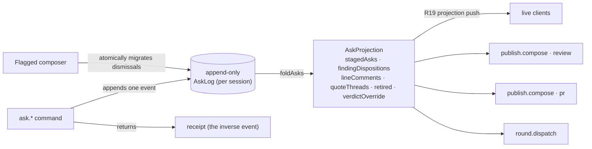

A review ends by leaving through an exit: the posted GitHub review, a
dispatched work-order round, or the pull request. Everything the reviewer
concludes along the way gathers as asks, and the orchestrator keeps every
outbound document drafted as it goes.

## The session is the durable root

A review lives in a **session** — the first-class durable object that owns the
harness cursor, the anchored threads, and the **claim** on the target. Entering
a New-chat row that resolves to a branch or PR **mints a session and claims the
target in one act**; the branch and its pull request are one claimed thing, and
every other New-chat row resolving to that same target disappears while the
claim holds. Re-entering a row whose session is already live **reattaches** to
it — it never mints a second — and the drafting pipeline starts idempotently per
session, so a re-entry mid-generation never double-starts a round.

The claim **locks once boards exist**. A session with no target upgrades in
place when one binds, but once a generation has been minted the claim is
immutable — a new target requires a **new session**, not a rebind. A merged
target keeps its claim. **Archive is the only release**, a soft delete: nothing
else frees a claimed target, so one target has one session, and it persists
across restarts from its cursor rather than being re-minted per review.

A session is keyed by **the project it belongs to and the repository its work
runs in**. The project is the sidebar's grouping key, and both ways a session
comes into being — a New-chat row click and a round dispatched on a review
nobody entered — mint through the same mechanism on that same key, so a session
a round created appears under its project like any other. The repository root
rides alongside it because a workspace project holds several repositories: the
project alone cannot say which one a round ran in, and without the repository
two repositories sharing a branch name would collapse into a single rounds
ledger. A New-chat row cannot know a repository's path, so it names the
repository by its `owner/name` identity instead — the same composite the smart
list already dedupes on — and two `main` branches in one workspace stay two
targets rather than one. A round dispatched on that target reads the same
`owner/name` back from the repository it is about to run in, so it joins the
session the click created instead of starting a second one beside it. A
detached HEAD has no branch to claim, so its session is keyed by the
review instead — and it is persisted like every other, because a session the
store does not hold is a session no surface can read back.

Anchored threads keep their content in the session transcript; the boards and
the diff hold only anchor→thread references, so a code-line comment, a
prose-quote thread, and Explain all ride one mechanism.

## Asks

Everything gathers as **asks**: typed messages carrying an anchor, text, an
intent, and an exit lane, minted from findings, code-line comments, quote
threads, or plain conversation, each with provenance back to its source.

The orchestrator stages asks as they arise. When the reviewer states the
conclusion or presses a shortcut, it stages directly; when it infers one, it
drops a one-tap offer pill instead. Every staging act leaves an undecorated
receipt at its source — a transcript line or a chip on the thread — and the
receipt is also the undo. Findings never auto-stage; staging records the
reviewer's judgment, not the lens output. The stage-versus-offer boundary
lives in a versioned orchestrator prompt beside the lens prompts.

The **Hand off button is the live basket**: its count ticks as asks land, and
it carries a derived working state while a draft rework runs.

## The durable-asks backend

Asks are **durable host-side, per session**, and there is exactly **one storage
write path**: commands append one event to an append-only per-session log, while
the Flagged composer atomically appends a related migration batch. The current
ask state is the pure **fold** of that log — never a second stored copy.

- **The log is the only mutation.** `ask.stage` / `edit` / `retire` / `restore`
  / `quoteOpen` / `quoteReply` / `quoteClose` / `setVerdictOverride` /
  `setLineComment` / `clearLineComment` / `dismissFinding` /
  `restoreFinding` / `unstage` each append one event. The `ask.*` dispatch
  handlers are the reviewer-action writers; the one internal writer is Flagged
  composition, which clones uniquely reattached dismissal state onto successor
  findings in one atomic batch before the board is written. No path edits a
  projection in place. `ask.read` is the projection, and reads never write.
- **Receipt-is-undo.** Every reviewer command returns a **receipt** that is the
  inverse event — applying it restores the prior projection (stage↔unstage, edit↔the
  prior body, quote-reply↔drop-last, finding-dismiss↔finding-restore,
  override-set↔the prior value). Undo is just the next append, so it survives
  reload like any other write.
- **Reload survival.** The projection is `foldAsks(read())` over the on-disk
  log; a restarted host reads the same log and folds the identical projection.
  Staged asks, finding dispositions, line comments, quote threads, the retired
  ledger, and the verdict override all survive a kill. Nothing is
  client-derived — a reconnecting client reads the current projection, pushed
  on every append through the R19 projection (host paths routed through
  `toRepoReference`, prose through the blanket scrub; the ask projection adds
  no new leak).

Finding actions use that same projection. A finding's request-change ask
carries a `FindingRef` and its first captured `CodeRef` (patchset, path, side,
and full span); the old text anchor and side remain only as a compatibility
fallback for earlier logs. A dismissal records a finding disposition; restoring
it removes that disposition. Both use `(generation, Flagged board id, finding
id)`, so a reused element id in a successor generation or an abandoned draft
attempt cannot inherit the act. Discuss stores a
quote thread with the same generation anchor, then sends one anchored turn
through the live session while the client opens and focuses the existing chat
dock. The Flagged open count folds the immutable board state together with
staged finding asks and dispositions.

The projection is the single source every exit and finding overlay composes
from.

## Selection is the steering wheel

Board prose selection offers **Comment / Request changes / Explain**. Draft
prose selection offers **Revise / Drop / Explain** — revise takes a free-text
instruction anchored to the span, drop retires it, explain answers with
provenance (which comment or finding produced the sentence). Same highlight
mechanics and thread tooltips everywhere; steering instructions become the
span's inspectable history.

## The Hand off view

Hand off toggles a view over the main surface. The toggle itself is
target-aware and carries the staged-ask count: on a teammate PR it reads
**Write Review** (the review concludes, under the reviewer's name); on one's
own branch or PR it reads **Continue** (the rounds loop keeps going). Its
lanes depend on the entry mode:

- **Teammate PR** — one lane: *Post review*. Work orders are own-branch only.
- **Own branch** — one goal with two states, and the page's shape states
  which one holds: while asks remain the surface is **Changes** (one entry per
  ask, Dispatch Round) and the pull request is a single muted destination
  line; when nothing is left to ask, the surface IS the pull request — title,
  drafted description, Open Pull Request. Primacy flips with the state;
  nothing explains the flip.
- **Retrospective** — no exits.

When the daemon **refuses to compose** an exit — a comment carrying a path that
would post outside the repository, a detached HEAD with no branch to open a pull
request from — the lane states that reason where the exit would have been and
carries on. There is nothing to dismiss and nothing to retry past: a refusal is a
fact about this review, not a step in a ceremony. What it replaces is worse than
the refusal itself, which is a Post Review that renders dead with no account of
why, or a Changes surface that simply never becomes the pull request.

## Living drafts

The orchestrator continuously redrafts every outbound document — the review
text, the work order, the PR description — as the review progresses. Each
comment, dismissal, or thread conclusion queues a rework. A rework runs as a
**one-shot worker outside the interactive session**, and reworks are
**serialized per document** — two edits to one board queue behind each other so
their writes never race, while edits to different documents run in parallel. The
reviewer never types into a draft; steering happens by talking or by
highlighting a span.

- Folding a staged ask into a draft is near-instant assembly; its only
  visibility is the affected block streaming in place. The **drafting
  activity feed** — a collapsed line expanding into full turn anatomy with
  the trigger queue — belongs to the long-running regeneration after a
  work-order round returns, and appears only there. The surface never locks.
- Stale content is removed and ledgered, never left and never silently
  dropped: a **Retired** drawer holds every retired block with its reason and
  round receipt, restorable with a click; a **Detached** list holds threads
  whose anchoring prose no longer exists.

A **span rework** (`review.reviseSpan`) is the concrete backing: a one-shot
worker reworks one staged ask's body per the reviewer's instruction, then lands
the result through the **same ask log** — it is an `ask.edit`, not a second
writer — so a reworked ask survives reload for free and its receipt reverses it
like any hand edit. The reworked span **re-anchors** across the regenerated body
by matching its quoted text (the shared lineage matcher, fail-closed: a span
that did not survive regeneration carries a null anchor rather than a wrong one).
Reworks on one review serialize behind a per-review promise tail; reworks on
different reviews overlap.

## The review's two strata

A GitHub review is one **review body** plus **line comments** pinned to diff
positions, and the draft mirrors that shape rather than flattening it. An ask
whose provenance carries a diff position — a finding's anchor, a code-line
comment — becomes a line comment, grouped by file with its citation. An ask
without one (a quote of board prose has no diff line to pin to) travels in
the review body. A path-only ask has
no diff position either, so it folds into the body the same way; the conversion
is recorded in a ledger returned to the client rather than happening silently.
The preview renders the exact forge body and threads that post. Provenance and
the degradation ledger remain visible beside that descriptor rather than being
inserted into it.

Captured provenance is resolved against the review's active patchset before it
becomes a line comment or work-order anchor. A base-side citation through a
rename keeps its old-side line and side but uses the changed file's current path.
A citation from another patchset is not reinterpreted through its old
`path:line` fallback: it becomes an unanchored review-body note and a file-level
work-order item instead of pointing at unrelated current code.

## Verdict and the approving review

The orchestrator proposes the verdict from the reviewer's acts and asks in
chat when those acts are ambiguous; the reviewer can always flip it. A flip is
a durable write on the ask log (`ask.setVerdictOverride`) that recomposes the
preview, so the verdict on screen is the verdict that posts — there is no
separate verdict argument riding along at post time. An
approving review is a first-class flow, not an empty state: a drafted Approve
whose body is grounded in the active persisted boards, patchset, and durable
reviewer acts. Publication keeps the accepted contract: an exact-payload preview
and one direct Post — no holds, no consent ceremony.

The GitHub review event follows the outbound set: any outbound request-change
ask makes it `REQUEST_CHANGES`; comments and questions alone make it `COMMENT`.
With no asks, the grounded opener proposes `APPROVE`. A durable verdict override
always wins.

## One payload, one source

The preview and the post are the same object. `publish.compose` returns one
artifact (`opener`, line comments, body notes) and one exact forge descriptor
(`event`, `body`, `threads`). Before any egress the server reconstructs both in
`@rennet/core` and compares the descriptor exactly, so the renderer cannot build
a different body after preview. The server derives the pull-request target from
the addressed review; it is not client input. A daemon-composed payload carries
a `compositionId` bound to the review, active patchset, canonical artifact, and
event. A stale preview or changed verdict is refused as one stale composition,
not routed through a confirmation step.

The model-authored opener is content-addressed by the persisted evidence used to
draft it. Unchanged evidence reuses the exact stored bytes across remounts and
daemon restarts; changed boards, asks, patchset, or verdict draft a new opener.
That stability keeps the canonical payload and retry marker stable when a post
may have landed but its response was lost.

The post carries a deterministic idempotency marker. The GitHub adapter checks
for that marker before creating anything, so a retry returns the review that
already landed instead of posting a second one.

The outbound payload holds only what the reviewer sent. Internal conversation,
model traces, and draft history never enter it unless their text became
outbound draft content. There is no hosted Rennet backend: of the exit
payload, GitHub receives the review or the pull request, and the harness
provider receives model-turn context.

## The three exits, as built

Each exit composes from the durable ask projection, never from a private copy.

The projection is filled by the client, through one path. Every reviewer act on an
open review — staging an ask, saving a line comment, opening or replying to a quote
thread, retiring or restoring a draft block, setting the verdict — runs an `ask.*`
command against the review's ask log, whose session identifier **is** the review
identifier. The renderer's `review` store slice is the render-side cache of that
projection: `useAskLog` hydrates it from `ask.read` when the review opens and writes
each mutation through. The daemon's full-projection push folds into that same read, so a
server-authored cleanup — including a completed round consuming its exact asks — updates
an already-open review. Nothing an exit reads is client-derived, and a reload keeps the
reviewer's work because the daemon holds it.

The exits themselves:

- **The GitHub review** — `publish.compose(mode:"review")` folds the projection
  into the two strata: staged line asks and bare line comments become line
  comments in deterministic `(path, line)` order (an ask on a line wins over a
  bare comment there); pathless asks become body notes and retired asks stay local. The verdict follows
  the outbound set, and a set **verdict override wins** over the derived event.
  The composed artifact and forge descriptor pass unchanged to `publish.review`,
  which independently rebuilds them before posting.
- **The round work-order** — `round.dispatch` folds the addressed asks into
  **exactly one** work-order and hands it to the rounds runtime **serialized per
  session** (one round in flight; the second dispatch of the same asks coalesces
  onto the first rather than racing a second). A failed kick is evicted so an
  identical re-dispatch retries. Board **regeneration** is the tail of the same
  dispatch. Once the worker result is written to the durable dispatch record,
  the round assembles its collation from the active patchset and runs the
  drafting pipeline for real, minting a new generation and freezing the prior
  one. A failure after that commit point — no active patchset to regenerate
  over, or a regeneration that throws — closes the round's progress channel
  with a terminal failure and leaves the checkpoint evidence intact for a
  regeneration-only retry. The worker-to-record interval and durable replay of
  execution-phase receipts remain outside this restart boundary.
- **The pull request** — `publish.compose(mode:"pr")` feeds the ask set plus the
  verdict override into the PR body draft, with a **stable derived
  `compositionId`** so an unchanged draft re-raises the *same* publish-ready.
  As each round lands, the own-branch PR draft **re-composes and re-raises
  publish-ready idempotently** (PR-lane ripening). `publish.submitPr`'s push +
  open-PR is idempotent by head: one PR per head, reused on re-submit.

Nothing here posts. Every exit drafts and previews; the branch push that opens a
PR is not publication, and a GitHub review egresses only when Rai clicks Post.

## Opening the pull request

The own-branch exit is one action. The server verifies that the previewed head
matches the branch recorded on the active patchset, resolves the single GitHub
remote, and pushes the named branch. If an open pull request already exists for
that head and base it is reused; otherwise one is created from the previewed
title and body. A detached HEAD fails before the push rather than pushing
something the preview did not describe.

## Rounds: the own-branch loop

1. Gather asks into *Changes*.
2. Dispatch — one round at a time, one worker in a detached worktree; asks
   gathered mid-run queue for the next round.
3. Watch the run live. Until the daemon answers, what the view shows is the
   *intent*: you asked for a round, and nothing has come back. The daemon's
   receipt is what promotes it, and a refused dispatch reads as the refusal it
   was, carrying the daemon's reason — a round that never started never reads as
   one under way. Dispatch takes over a dedicated run view (`/s/:slug/run`)
   that reads the durable operation receipt as the prep, worker, gate, commit,
   report-drafting, and report-verification phases settle. The visible commit
   step coarsens separate detached-commit, source-landing, and round-recording
   receipts; each remains its own restart boundary. The view is
   deep-linkable and cold: opening it mid-round reattaches to the newest durable
   receipt and never re-dispatches. It stays on the run through report drafting
   and verification, and hands back to the board surface only after the durable
   operation records verified terminal completion (including a verified
   unchanged round). A terminal failure stays on the run with its failure
   receipt. Once a round has returned, the session row carries the durable
   ledger ordinal as *Round N is back*.
4. On completion the **round report** drafts first — its own seat on its own
   prompt (`packages/prompts`, `src/prompts/report.md`), through the
   same post-process pass as every draft. It verifies each ask against the
   round's diff rather than taking the worker's word, and classifies the
   outcome: addressed / partial / untouched / beyond the asks, each item
   anchored. Each outcome copies the exact id of the ask this round dispatched.
   The report is one artifact with two consumers: the reviewer's greeting, and
   the successor account the lens drafters receive — which is why it must draft
   before they start.
5. The reviewer reads the report while the lens drafters regenerate in the
   background, their progress live beneath it — one lane per lens, streamed
   from the round's real progress, with the kicker reading *Regenerating the
   Boards* until the generation composes and *Regenerated the Boards* after.
   A settled lane reads **carrying forward** or **reworked**; see
   [Carry-forward is a verdict, not a skip](#carry-forward-is-a-verdict-not-a-skip)
   for exactly what that claims. A drafter that produced no board settles its
   lane as **failed** carrying the reason — a lane left running after the round
   is over would read as "still working". The surface never locks, and it always
   ends: composing is terminal from wherever the round had got to, exactly as
   failing is, so a round that finishes can always say so even when an
   intermediate step never happened. When the new generation composes, the way
   to it appears — a control that exists only once it is ready, never a disabled
   button. A round where *every* drafter failed composes nothing, so it ends on
   a terminal failure carrying the drafters' reasons rather than offering a way
   to boards nobody wrote.

   A round that lands a successor patchset supplies explicit round context. The
   report receives the round number and exact dispatched asks; the host keeps
   the prior generation and durable finding dispositions for composition. If
   no report seat resolves or its draft fails, the lens drafters still proceed;
   the host has no addressed outcomes to compose in that case. A coding turn
   that changes no code keeps the existing generation and records no report or
   addressed claim; it terminates as unchanged and consumes only the exact ask
   occurrences that turn handled. Dispatched intent alone is not evidence that
   work landed.
6. A round that lands code mints a **new generation** of lens boards, drafted delta-aware:
   unchanged sections carry forward, and the composition step stamps what it
   touched (`new` / `reworked`; absence = carried). The marks read as unread
   state: touched sections open expanded while carried sections fold to
   their gists — the board's own shape states the change — with a small
   transient accent dot per touched section that rolls up to the lens
   segment, clears on interaction, and is replaced wholesale next round.
   Generations are append-then-freeze: the prior generation's status moves
   from live to frozen and stays as drill-down while the successor is minted.
   The successor is one board visit, not a patchset bucket: returning to earlier
   content mints a fresh generation and never reopens that content's frozen visit.
   Asks, threads, and highlights re-anchor by quote match; casualties land in
   the Detached list.
   The host applies finding lifecycle after drafting and before it persists the
   successor boards. Flagged drops only a finding whose dispatched ask the
   report marks addressed, or one the reviewer dismissed, when that
   generation-and-board-scoped identity reattaches uniquely. An ambiguous match
   or a reference to another draft attempt detaches the disposition instead of
   hiding a different finding. A unique match clones the dismissal onto the
   successor reference before Flagged is written; the predecessor disposition
   remains bound to its exact frozen board. Sequence
   carries its earlier host chapters forward and appends one chronological
   **Round N · Addressed** chapter from the report's exact addressed asks. This
   composition produces the new boards; it never rewrites a frozen generation.
   The round's retrospective line counts the reworks the **report** verified
   against the round's own diff, not the asks that went out — a round can
   dispatch five asks and rework nothing, and the number has to be able to say
   so. A round whose report never drafted states no number rather than a zero it
   cannot stand behind.
7. Every completed round stays readable in the **rounds ledger** (`?view=rounds`)
   — a header control beside Map · Diff that exists exactly when a round has
   completed, never a disabled tab. One row per round; each opens that round's
   report, and each round pins its asks, observed worker HEAD range, checkpoint
   diff, frozen board generation, and the patchset generation it minted. Modern
   rows also pin one immutable run receipt: when the durable operation started,
   its exact branch or detached HEAD target, and the configured gate's command,
   duration, and project count (or the fact that no gate was configured). The
   first dispatch placeholder owns that receipt; retry and regeneration
   reconciliation cannot rewrite it. Because
   #457 appends the new generation and freezes the old rather than overwriting, that frozen
   generation stays reachable through the generation switcher, so earlier
   reports never vanish.
   A round's **diff** is its own change, not the review's whole changeset: the
   checkpoint that brackets the round's coding turn measures it, the round
   record carries it, and the durable ledger keeps it when the regeneration
   record supersedes the dispatch placeholder — so an earlier round's diff is
   immutable, and a later round never rewrites it. **Round diff** opens it at
   `?view=diff&round=<round number>`. The round *number*, not its generation id:
   a round that dispatched a work order without regenerating boards carries the
   no-regeneration marker as its generation, so several rounds share one
   generation id and a generation cannot name a round back.
   A round that captured no diff of its own offers **no Round diff control at
   all**, the same absent-not-disabled rule the ledger tab itself follows.
   A past round's diff is **read-only**, and that is a correctness property, not
   a restraint. A line comment and a request-change ask are both keyed on
   `path:line`, and that keyspace belongs to the review's *active* patchset — but
   a round's diff is measured checkpoint-to-checkpoint, so the same coordinates
   name different code. Writing under them would surface a comment on the live
   diff over code nobody read, and would silently replace a live-diff ask staged
   at the same line. So the round surface carries no comment gutter and no
   selection toolbar, and does not paint the review's marks either — the read
   direction of the same mismatch.
8. Repeat until nothing is left to ask. The surface becomes the pull
   request — one action pushes the branch and opens it, idempotently. After
   the PR exists, rounds continue identically; there is no self-review lane
   on one's own pull request.

### Carry-forward is a verdict, not a skip

A round re-drafts **every** lens. "Carrying forward" is what the regeneration
*found*, not work it declined to do: the drafter ran, and its board came back
with nothing changed. Three separate honesty properties hold, and it is worth
keeping them apart.

- **The lane label is honest.** A settled lane's `carrying forward` / `reworked`
  verdict is read from the same delta stamps the composition step writes — the
  one signal, not a cheaper guess. A lens whose sections moved therefore cannot
  render "carrying forward"; that would be a lie about the change, and the
  regression test for it is the kind that has to be able to fail. The verdict is
  also *structural*: a lane's settled state carries it, so a lane cannot reach
  the reviewer looking settled with nothing to show for it. A lens whose board
  is drafted but not yet announced reads **drafted**, which is what it is.
- **The section grain is honest by construction.** Composition only marks a
  section carried when its whole subtree signature is unchanged, so the fold
  state a reviewer reads is a fact about content, never a summary someone
  computed twice and might have computed differently. Deletion counts: a stamp
  can only sit on a section that still exists, so removals are read separately
  and a round that only *deleted* sections is never "carrying forward" — it
  would be describing content that is no longer there.
- **The compute skip is deferred.** Not re-drafting an untouched lens at all
  would save real model spend, and it is a change to the pipeline rather than to
  the label — an explicit decision, not something to assume from the wording.
  Until it lands, a round's cost is six drafters every time.

Two absences beside it are stated rather than smoothed over. A round rebuilt
from durable board metadata after a restart cannot recompute its cross-lens
coverage — that is derived from the drafted boards, which the metadata does not
hold — so it reports coverage as *unknown* instead of an empty violation list
that would claim a clean round nobody checked. And a client talking to a daemon
older than itself gets no answer to the rounds reads at all; the surfaces say
that, with the daemon's own reason, rather than showing the empty ledger that
reads as "no rounds have completed".

The round report's **arrival** is live: the progress channel carries the drafted
report board's id the moment the report seat lands, which gates regeneration and
starts the lanes. The durable round row pins that same exact id.
`session.rounds` joins it on read to the persisted report metadata and whiteboard
state only when board id, session, and generation all match, then embeds the
report projection on that row. The client resolves the greeting and ledger from
the exact row naming the requested id. That projection is never written back to
the round store; an old row or a genuinely missing report remains honestly
absent.

### What a round measures itself against

A round's diff comes from checkpoints, not from the worker's account of itself.
`GitCheckpointStore` snapshots tracked, deleted, and non-ignored untracked files
through a temporary Git index and hidden `refs/rennet/checkpoints/*` refs; HEAD
and the user's own index are never touched, and the temporary refs are cleaned
up once the diff has been collected. The changed-path list comes from
`git diff --name-only -z`, separate from the diff rendered for display.

The after-checkpoint is captured on either terminal outcome, so a failed turn
still returns its diff and changed paths — a crashed worker is not an empty
round. The round never modifies the patchset under review; that patchset stays
the baseline the successor is compared against.

The worker runs at the repository root with the harness's default tool set. Its
checkpoint diff and changed-path list are the work signal even when HEAD stays
unchanged; the rounds ledger records that evidence and the observed HEAD range.
Pushing and opening the pull request remain the pull-request exit's job.
Repositories containing submodules are unsupported
here — a gitlink can escape the checkpoint diff — and the run fails before it
starts rather than reporting a diff it cannot trust.
