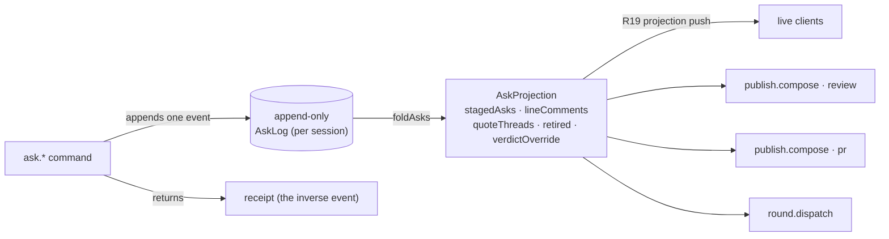

A review ends by leaving through an exit: the posted GitHub review, a
dispatched work-order round, or the pull request. Everything the reviewer
concludes along the way gathers as asks, and the orchestrator keeps every
outbound document drafted as it goes.

## The session is the durable root

A review lives in a **session** — the first-class durable object that owns the
harness cursor, the anchored threads, and the **claim** on the target. Entering
a New-chat row that resolves to a branch or PR **mints a session and claims the
target in one act**; the branch and its pull request are one claimed thing, and
every other New-chat row resolving to that same target disappears while the
claim holds. Re-entering a row whose session is already live **reattaches** to
it — it never mints a second — and the drafting pipeline starts idempotently per
session, so a re-entry mid-generation never double-starts a round.

The claim **locks once boards exist**. A session with no target upgrades in
place when one binds, but once a generation has been minted the claim is
immutable — a new target requires a **new session**, not a rebind. A merged
target keeps its claim. **Archive is the only release**, a soft delete: nothing
else frees a claimed target, so one target has one session, and it persists
across restarts from its cursor rather than being re-minted per review.

Anchored threads keep their content in the session transcript; the boards and
the diff hold only anchor→thread references, so a code-line comment, a
prose-quote thread, and Explain all ride one mechanism.

## Asks

Everything gathers as **asks**: typed messages carrying an anchor, text, an
intent, and an exit lane, minted from findings, code-line comments, quote
threads, or plain conversation, each with provenance back to its source.

The orchestrator stages asks as they arise. When the reviewer states the
conclusion or presses a shortcut, it stages directly; when it infers one, it
drops a one-tap offer pill instead. Every staging act leaves an undecorated
receipt at its source — a transcript line or a chip on the thread — and the
receipt is also the undo. Findings never auto-stage; staging records the
reviewer's judgment, not the lens output. The stage-versus-offer boundary
lives in a versioned orchestrator prompt beside the lens prompts.

The **Hand off button is the live basket**: its count ticks as asks land, and
it carries a derived working state while a draft rework runs.

## The durable-asks backend

Asks are **durable host-side, per session**, and there is exactly **one write
path**: a command appends **one event** to an append-only per-session log, and
the current ask state is the pure **fold** of that log — never a second stored
copy.

- **The log is the only mutation.** `ask.stage` / `edit` / `retire` / `restore`
  / `quoteOpen` / `quoteReply` / `quoteClose` / `setVerdictOverride` /
  `setLineComment` / `clearLineComment` / `unstage` each append one event; the
  `ask.*` dispatch handlers are the sole writers. No handler edits a projection
  in place. `ask.read` is the projection, and reads never write.
- **Receipt-is-undo.** Every write returns a **receipt** that is the inverse
  event — applying it restores the prior projection (stage↔unstage, edit↔the
  prior body, quote-reply↔drop-last, override-set↔the prior value). Undo is
  just the next append, so it survives reload like any other write.
- **Reload survival.** The projection is `foldAsks(read())` over the on-disk
  log; a restarted host reads the same log and folds the identical projection.
  Staged asks, line comments, quote threads, the retired ledger, and the verdict
  override all survive a kill. Nothing is client-derived — a reconnecting client
  reads the current projection, pushed on every append through the R19
  projection (host paths routed through `toRepoReference`, prose through the
  blanket scrub; the ask projection adds no new leak).

The projection is the single source every exit composes from.

## Selection is the steering wheel

Board prose selection offers **Comment / Request changes / Explain**. Draft
prose selection offers **Revise / Drop / Explain** — revise takes a free-text
instruction anchored to the span, drop retires it, explain answers with
provenance (which comment or finding produced the sentence). Same highlight
mechanics and thread tooltips everywhere; steering instructions become the
span's inspectable history.

## The Hand off view

Hand off toggles a view over the main surface. The toggle itself is
target-aware and carries the staged-ask count: on a teammate PR it reads
**Write Review** (the review concludes, under the reviewer's name); on one's
own branch or PR it reads **Continue** (the rounds loop keeps going). Its
lanes depend on the entry mode:

- **Teammate PR** — one lane: *Post review*. Work orders are own-branch only.
- **Own branch** — one goal with two states, and the page's shape states
  which one holds: while asks remain the surface is **Changes** (one entry per
  ask, Dispatch Round) and the pull request is a single muted destination
  line; when nothing is left to ask, the surface IS the pull request — title,
  drafted description, Open Pull Request. Primacy flips with the state;
  nothing explains the flip.
- **Retrospective** — no exits.

## Living drafts

The orchestrator continuously redrafts every outbound document — the review
text, the work order, the PR description — as the review progresses. Each
comment, dismissal, or thread conclusion queues a rework. A rework runs as a
**one-shot worker outside the interactive session**, and reworks are
**serialized per document** — two edits to one board queue behind each other so
their writes never race, while edits to different documents run in parallel. The
reviewer never types into a draft; steering happens by talking or by
highlighting a span.

- Folding a staged ask into a draft is near-instant assembly; its only
  visibility is the affected block streaming in place. The **drafting
  activity feed** — a collapsed line expanding into full turn anatomy with
  the trigger queue — belongs to the long-running regeneration after a
  work-order round returns, and appears only there. The surface never locks.
- Stale content is removed and ledgered, never left and never silently
  dropped: a **Retired** drawer holds every retired block with its reason and
  round receipt, restorable with a click; a **Detached** list holds threads
  whose anchoring prose no longer exists.

A **span rework** (`review.reviseSpan`) is the concrete backing: a one-shot
worker reworks one staged ask's body per the reviewer's instruction, then lands
the result through the **same ask log** — it is an `ask.edit`, not a second
writer — so a reworked ask survives reload for free and its receipt reverses it
like any hand edit. The reworked span **re-anchors** across the regenerated body
by matching its quoted text (the shared lineage matcher, fail-closed: a span
that did not survive regeneration carries a null anchor rather than a wrong one).
Reworks on one review serialize behind a per-review promise tail; reworks on
different reviews overlap.

## The review's two strata

A GitHub review is one **review body** plus **line comments** pinned to diff
positions, and the draft mirrors that shape rather than flattening it. An ask
whose provenance carries a diff position — a finding's anchor, a code-line
comment — becomes a line comment, grouped by file with its citation. An ask
without one (a quote of board prose has no diff line to pin to) travels in
the review body, woven in by the orchestrator — its placement under the body
header is the whole statement, never an explanatory label. A path-only ask has
no diff position either, so it folds into the body the same way; the conversion
is recorded in a ledger returned to the client rather than happening silently.
The preview renders exactly this structure, because it is exactly what posts.

## Verdict and the approving review

The orchestrator proposes the verdict from the reviewer's acts and asks in
chat when those acts are ambiguous; the reviewer can always flip it. An
approving review is a first-class flow, not an empty state: a drafted Approve
whose body is grounded in what the reviewer actually walked, raised, and
cleared. Publication keeps the accepted contract: an exact-payload preview
and one direct Post — no holds, no consent ceremony.

The GitHub review event follows the outbound set: any outbound request-change
ask makes it `REQUEST_CHANGES`; comments and questions alone make it `COMMENT`.
An empty outbound set posts nothing at all.

## One payload, one source

The preview and the post are the same object. Before any egress the server
reconstructs the canonical payload in `@rennet/core`, so the renderer cannot
construct a different body after preview. A daemon-composed payload carries a
`compositionId` bound to the review, the active patchset, the mode, and the
payload itself — a stale preview cannot apply.

The post carries a deterministic idempotency marker. The GitHub adapter checks
for that marker before creating anything, so a retry returns the review that
already landed instead of posting a second one.

The outbound payload holds only what the reviewer sent. Internal conversation,
model traces, and draft history never enter it unless their text became
outbound draft content. There is no hosted Rennet backend: of the exit
payload, GitHub receives the review or the pull request, and the harness
provider receives model-turn context.

## The three exits, as built

Each exit composes from the durable ask projection, never from a private copy:

- **The GitHub review** — `publish.compose(mode:"review")` folds the projection
  into the two strata: staged line asks and bare line comments become line
  comments in deterministic `(path, line)` order (an ask on a line wins over a
  bare comment there); pathless and retired asks fall out. The verdict follows
  the outbound set, and a set **verdict override wins** over the derived event.
  The composed bytes re-derive the same `publish.review` exact-preview payload,
  so preview and post stay the same object.
- **The round work-order** — `round.dispatch` folds the addressed asks into
  **exactly one** work-order and hands it to the rounds runtime **serialized per
  session** (one round in flight; the second dispatch of the same asks coalesces
  onto the first rather than racing a second). A failed kick is evicted so an
  identical re-dispatch retries. (Board regeneration on a round's return is the
  planned continuation of this loop and is not yet wired to a production caller;
  what ships today is the dispatch → one work-order → serialized run.)
- **The pull request** — `publish.compose(mode:"pr")` feeds the ask set plus the
  verdict override into the PR body draft, with a **stable derived
  `compositionId`** so an unchanged draft re-raises the *same* publish-ready.
  As each round lands, the own-branch PR draft **re-composes and re-raises
  publish-ready idempotently** (PR-lane ripening). `publish.submitPr`'s push +
  open-PR is idempotent by head: one PR per head, reused on re-submit.

Nothing here posts. Every exit drafts and previews; the branch push that opens a
PR is not publication, and a GitHub review egresses only when Rai clicks Post.

## Opening the pull request

The own-branch exit is one action. The server verifies that the previewed head
matches the branch recorded on the active patchset, resolves the single GitHub
remote, and pushes the named branch. If an open pull request already exists for
that head and base it is reused; otherwise one is created from the previewed
title and body. A detached HEAD fails before the push rather than pushing
something the preview did not describe.

## Rounds: the own-branch loop

1. Gather asks into *Changes*.
2. Dispatch — one round at a time, one worker in a detached worktree; asks
   gathered mid-run queue for the next round.
3. Watch the run live. Dispatch takes over a dedicated run view (`/s/:slug/run`)
   that streams the prep, worker, and gate/commit lines as the round advances.
   The view is deep-linkable and cold: opening it mid-round reattaches to the
   live progress and never re-dispatches, and when the round reaches its report
   phase the view hands back to the board surface where the report greets.
4. On completion the **round report** drafts first — its own seat on its own
   prompt (`packages/prompts`, `src/prompts/report.md`), through the
   same post-process pass as every draft. It verifies each ask against the
   round's diff rather than taking the worker's word, and classifies the
   outcome: addressed / partial / untouched / beyond the asks, each item
   anchored. The report is one artifact with two consumers: the reviewer's
   greeting, and the successor account the lens drafters receive — which is
   why it must draft before they start.
5. The reviewer reads the report while the lens drafters regenerate in the
   background, their progress live beneath it (carried lenses complete as
   carry-forwards; touched lenses re-draft). The surface never locks. When
   the new generation composes, the way to it appears — a control that
   exists only once it is ready, never a disabled button.
6. Each round mints a **new generation** of lens boards, drafted delta-aware:
   unchanged sections carry forward, and the composition step stamps what it
   touched (`new` / `reworked`; absence = carried). The marks read as unread
   state: touched sections open expanded while carried sections fold to
   their gists — the board's own shape states the change — with a small
   transient accent dot per touched section that rolls up to the lens
   segment, clears on interaction, and is replaced wholesale next round.
   Generations are append-then-freeze: the prior generation's status moves
   from live to frozen and stays as drill-down while the successor is minted.
   Asks, threads, and highlights re-anchor by quote match; casualties land in
   the Detached list.
7. Every completed round stays readable in the **rounds ledger** (`?view=rounds`)
   — a header control beside Map · Diff that exists exactly when a round has
   completed, never a disabled tab. One row per round; each opens that round's
   report, and each round pins its asks, worker commits, frozen board
   generation, and the patchset generation it minted. Because #457 appends the
   new generation and freezes the old rather than overwriting, that frozen
   generation stays reachable through the generation switcher and its diff
   through `?view=diff`, so earlier reports and diffs never vanish.
8. Repeat until nothing is left to ask. The surface becomes the pull
   request — one action pushes the branch and opens it, idempotently. After
   the PR exists, rounds continue identically; there is no self-review lane
   on one's own pull request.

### What a round measures itself against

A round's diff comes from checkpoints, not from the worker's account of itself.
`GitCheckpointStore` snapshots tracked, deleted, and non-ignored untracked files
through a temporary Git index and hidden `refs/rennet/checkpoints/*` refs; HEAD
and the user's own index are never touched, and the temporary refs are cleaned
up once the diff has been collected. The changed-path list comes from
`git diff --name-only -z`, separate from the diff rendered for display.

The after-checkpoint is captured on either terminal outcome, so a failed turn
still returns its diff and changed paths — a crashed worker is not an empty
round. The round never modifies the patchset under review; that patchset stays
the baseline the successor is compared against.

The worker runs at the repository root with the harness's default tool set. The
round commits its work — the rounds ledger pins those commits — while pushing
and opening the pull request remain the pull-request exit's job.
Repositories containing submodules are unsupported
here — a gitlink can escape the checkpoint diff — and the run fails before it
starts rather than reporting a diff it cannot trust.
