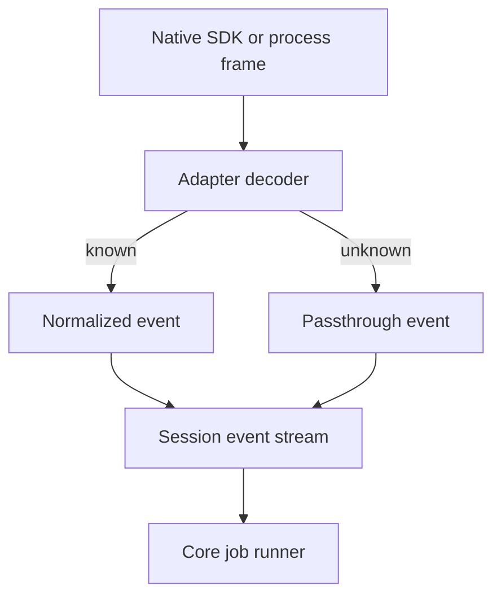

Rennet runs the coding harnesses already installed for the repository's
execution locus. The adapter boundary gives core review code one session model
for Claude Code, Codex, and omp without copying provider credentials or bundling
a Rennet harness executable.

## Ownership

```mermaid
flowchart LR
  client[Desktop, browser, or mobile client] -->|typed command| server[@rennet/server]
  server --> core[@rennet/core HarnessPort]
  server --> adapters[@rennet/adapters]
  adapters --> claude[Installed claude]
  adapters --> codex[Installed codex]
  adapters --> omp[Installed omp through Bun]
  claude --> provider[Harness provider]
  codex --> provider
  omp --> provider
```

`HarnessPort` and its event types live in `packages/core/src/harness.ts`. The
interface has no Node or Electron dependency. `@rennet/adapters` owns binary
discovery, process and SDK integration, native-frame decoding, and provider
errors. `@rennet/server` discovers and memoizes harnesses for each project locus,
then injects the selected adapter into core jobs.

The desktop and browser shells reach the daemon through `@rennet/client`. The
React app does not spawn harnesses, and the Electron main process does not own
model routing.

### Scripted owner-loop proof stays outside production

The owner-loop integration proof uses a lane-unique JSON plan to implement a
`HarnessPort` in tests. The plan is schema-validated before the test server is
created, writes one JSONL invocation record per turn, and applies coding edits
as exact replacements under `SessionSpec.cwd`. Reloading the plan reloads the
ledger, so a restarted daemon cannot replay a consumed coding step.

This is a test composition, not a daemon mode. The production daemon never reads
the plan and has no environment variable or command-line flag that selects canned
harness responses. The Electron journey starts an E2E-owned daemon process,
injects the test port through `RennetServerOptions.testHarnessPort`, and then
launches the unchanged desktop client against the daemon claim. The client still
uses the real WebSocket protocol, persistence stores, capture path, board runtime,
round coordinator, and restart behavior. The spec is committed as a launched
journey but is not part of the browser-free local gate.

## The normalized session

The current port exposes descriptor and health information plus one operation:
`createSession(spec)`. A session then provides one event stream and the `send`,
`interrupt`, and `close` methods. `SessionSpec` now carries an optional
`resume?: { harnessSessionId: string }`: a spec with it continues a prior
harness conversation, one without it starts fresh. Fork is still not part of the
interface.

Every event carries the same envelope:

```ts
interface HarnessEventBase {
  seq: number
  harness: "claude-code" | "codex" | "omp"
  sessionId: string
  turnId: string | null
  receivedAt: number
  native: unknown
}
```

The adapter assigns the monotonically increasing `seq`. It also retains the
native frame. Known frames become session, text, tool, error, or metered-key
events. Unknown frames become `passthrough` events rather than disappearing.



Tool results keep both structured output and readable text. Terminal outcomes
are a discriminated union of `completed`, `cancelled`, and `failed`, so missing
usage or structured output cannot be mistaken for a successful empty value.
Codex output schemas are normalized at the transport boundary to its strict
structured-output subset: object fields become required and nullable, object
extras are closed, and Zod's unsupported `oneOf` projection becomes `anyOf` for
generation. A root union of object outcomes becomes one required-nullable object
envelope, then emitted null fields are removed. Board jobs still parse the result
through their original schema in core, so this normalization cannot weaken an
accepted board.

## Cursor-resume and the turn loop

Interactive turns run **fresh process per turn plus resume**, the pattern the
harness CLIs are built for: the CLI owns the transcript, the compaction, and the
prompt cache; Rennet persists only a pointer into that transcript — the
`HarnessCursor` (`harnessSessionId` plus the last-assistant anchor and a turn
count) — and re-passes it on the next turn through `SessionSpec.resume`. Rennet
owns the turn loop (`packages/server/src/session/turn-loop.ts`) and holds two
rules over it: **serialize turns per harness id** — one turn in flight per
session at a time, a second queues rather than racing the same transcript — and
**re-pass the options every turn**, because each turn is a fresh process and
nothing (model, tools, cwd, system prompt) is sticky across it. After each turn
the loop persists the updated cursor to the `SessionStore`.

The loop is instantiated in the composition root (`packages/server/src/
create-server.ts`), one per repository root and selected harness. The first coding
round resolves one enabled installed harness on the repository's execution host,
preferring Claude when both are enabled, and pins that harness and version to the
session before the worker starts. Later rounds resolve that exact provider or fail
plainly; they never switch providers because one disappeared. Claude rounds resume
the conversation the previous round left off at, while Codex rounds start a fresh
Codex thread because its resume capability remains unverified. Both paths capture
normalized events for the display transcript. The loop does not add
serialization — the rounds runtime already enqueues each dispatch per session,
including the checkpoint bracket, so the loop's own per-session queue is a
redundant inner lock on this path. The issue-#18 checkpoint bracket is unchanged
around it: pre-checkpoint, turn, post-checkpoint, diff.

The loop is where the **display transcript** is captured because it is the single
reader of every harness event. Its `recordTranscript` sink projects those events
onto the transcript rows the chat dock renders (`harnessEventsToRows`) and
appends them to the durable `TranscriptStore` that `session.transcript` reads.
Each row preserves the harness event order as typed blocks — prose, thought,
action, code, and lifecycle markers — instead of flattening activity into a
preface string. Thought duration is derived only from harness `receivedAt`
boundaries and remains absent when no honest end boundary exists. A caller may
supply a stable public turn id; retries keep that id for the successful public
turn while a failed resume attempt receives a distinct id, so durable merge and
reload cannot collapse two attempts. The rows are a display read-model, additive
to the cursor: the CLI still owns the conversation. A session whose turns have
not run reads back empty because it genuinely has no rows, and a transcript log
that cannot be written never fails the coding turn that produced it.

The rows are stored **verbatim**, host paths and all. R19 is a rule about what
crosses the wire to a *remote* client, and the daemon applies it at that
boundary: a projected connection's `session.transcript` response has known roots
and the home directory replaced with display tokens and any remaining absolute
path redacted, while a loopback connection reads the row exactly as it was
stored. Scrubbing at write time instead would destroy the reviewer's own paths on
the reviewer's own disk and buy nothing, since every read already crosses that
boundary.

The `context_rebuilt` marker takes the loop's other sink, `emit`, because it is
not a harness event — the loop synthesizes it when a resume vanishes, so no
projection of the event stream can produce it. It is filed on the session it
happened to, between the lost turn and the rebuilt one. Dropping it would leave
the transcript reading as one unbroken conversation across a context loss, which
is a surface claiming something it cannot know. Compaction rows do **not** go
through `emit`: those are real harness events, so the projector already emits
them and a second append would double every compaction.

Resume is a Claude capability, honestly. The Claude adapter implements it end to
end: `SessionSpec.resume` maps to the SDK's resume option, and a completed turn
surfaces the harness session id so the durable session persists a real cursor —
so the Claude adapter advertises the `resume` capability. The **Codex adapter
does not**. Its app-server thread-resume path and returned cursor cannot be
verified against the live binary offline, and wiring a durable Codex cursor by
guess would be a broken path, not a capability. So Codex leaves `resume`
unimplemented (capability flag `false`): a resume spec against Codex simply
never surfaces a cursor, the loop never builds one for it, and each Codex turn
starts fresh — the honest degrade, no fabricated cursor.

When a persisted cursor points at a harness session the CLI no longer has (the
transcript is gone), the loop does not fail and does not pretend. It surfaces a
**`context_rebuilt`** turn-stream row, starts a fresh harness session, and keeps
the **boards canonical** — the reconstructed session re-reads them from the
event log and never drops or re-drafts them. The transcript is the harness's to
lose; the boards are Rennet's, and they survive.

## Compaction, surfaced not estimated

When the harness compacts its own context, Rennet shows that it happened rather
than hiding or guessing it. A harness compaction event becomes exactly one
**`compact_boundary`** row in the turn stream. The row carries the harness's own
structured `compact_metadata` — the `trigger` (`manual` or `auto`) and its
pre/post token counts, each present only when the harness reported it, never a
substituted zero. The live SDK frame carries **no free-text summary** (the
compacted conversation summary goes to the CLI's own transcript, which the live
stream filters out), so Rennet forwards the structured metadata verbatim and
never attributes a fabricated prose sentence to the harness.

The context meter follows the same rule: it **asks, it does not estimate**. It
reports only what the harness states about its context window, and is absent —
not zero, not a computed percentage — when the harness gives no figure. An
invented budget would be a lie in the UI; an honest gap is the truth.

## Claude Code

The Claude adapter uses `@anthropic-ai/claude-agent-sdk` and sets
`pathToClaudeCodeExecutable` to the discovered `claude` binary. Packaging removes
the SDK's bundled platform executables. The resulting app uses the user's
installed CLI and its existing authentication.

The query adapter passes the child environment explicitly because the SDK's
`env` option replaces rather than merges it. Session frames are normalized in
`packages/adapters/src/claude-adapter.ts`.

Claude sessions can accept an output schema and an optional tool list. The
coding-agent handoff does not narrow the default tool set, so the agent can edit
files and run project commands. Read-oriented review jobs may supply a smaller
tool set for that workload.

## Codex

The Codex adapter speaks newline-delimited JSON-RPC with `codex app-server`.
`packages/adapters/src/codex-app-server.ts` owns the wire protocol, and
`codex-turn-transport.ts` exposes it to `CodexAdapter`.

One turn-scoped child runs this sequence:

```text
initialize
initialized
thread/start
turn/start
item/* notifications
turn/completed
```

`turn/start` carries the prompt, repository working directory, model, sandbox
policy, approval policy, and optional output schema. Structured output returns
through the app-server protocol. The adapter does not use an output scratch file
for this path.

The same agentic port runs write-enabled work-order rounds when Codex is the
session's selected harness. It receives the full-access sandbox and never-ask
approval posture used by the acting path, so it can edit, run the configured gate,
and return checkpoint-measured changes. The durable worker and round receipts record
the exact Codex version that executed the turn.

The transport maps assistant deltas, completed messages, tool lifecycle events,
token usage, failures, and interrupts into `HarnessEvent`. It terminates the
turn child after the terminal event. Codex does not report per-turn dollar cost
through this integration, so the capability remains absent.

For a WSL project, discovery and process execution run inside the selected
distro and pass a distro-native working directory. The
[Codex app-server reference](../reference/codex-app-server.md) records the full
method mapping and discovery candidates. The
[Windows and WSL guide](../../using/guides/windows-and-wsl.md) covers the
user-facing setup.

## omp

The omp adapter runs the `omp` binary from `@oh-my-pi/pi-coding-agent` through a
proven Bun runtime. Its transport uses `omp --mode rpc --auto-approve
--no-session` and sends the prompt as an RPC command on standard input.

Rennet gives omp a temporary extension directory containing its loopback MCP
configuration, then removes the directory when the turn ends. The decoder bounds
frames and captured standard error. Malformed, oversized, rejected, or unfinished
RPC frames end the session as a protocol failure even if the child exits with
status zero.

The adapter and hermetic transport tests are present. No real omp conformance run
has recorded a tested version range, so discovery reports it as untested and its
capability evidence stops at `implementedByAdapter`. The orchestrator uses omp
only when neither Claude nor Codex supplies the seat.

## Discovery follows the project locus

A graphical app may inherit a different `PATH` from an interactive shell, and a
shell command may resolve to a function rather than an executable. Discovery
therefore reads the login-shell path, combines it with the process path and known
install locations, probes absolute executable candidates, and records the chosen
binary and health result.

Codex discovery includes the executable bundled in ChatGPT on macOS after
user-installed candidates. WSL discovery searches inside the selected distro.
omp discovery verifies both its script and the Bun runtime that will execute it.
`RENNET_DISABLE_HARNESS=1` disables discovery for hermetic tests.

Discovery proves that a candidate can start and answer its probe. It does not
read the harness's credential files.

## Capabilities require evidence

Each capability has three layers:

| Layer | Meaning |
| --- | --- |
| `implementedByAdapter` | Rennet contains the native-to-normalized mapping |
| `advertisedByHarness` | The installed harness version reports support |
| `availableInSession` | A live session demonstrated the behavior |

`buildCapabilities()` starts every layer at `false` and turns on only the entries
supplied by a passing check. The shared conformance suite in
`packages/core/src/harness-conformance.ts` drives the same named behaviors through
any `HarnessPort`. Hermetic tests can prove adapter implementation. Real runs are
required for the outer layers and for the recorded `testedRange`.

## Authentication, usage, and egress

The harness authenticates itself. Rennet does not copy OAuth tokens or API keys
into an adapter. Claude's session-start frame reports `apiKeySource`; metered key
sources produce a visible warning without stopping the turn.

Usage is optional on a normalized session outcome. An adapter omits it when the
harness supplied no token record. RSP documents require a token block, and the
current document producers substitute an all-zero block when a model turn has no
usage record. Those zeros therefore do not prove that the turn consumed no
tokens. Provider-reported and derived dollar values remain separate and stay
`null` when no amount is available.

There is no hosted Rennet backend. The daemon starts local harness processes on a
loopback transport where a subprocess needs MCP access. Review context still
reaches the provider used by the selected harness.

## Code map

| Concern | Owner |
| --- | --- |
| Port, events, errors, health, and capability types | `packages/core/src/harness.ts` |
| Shared conformance checks | `packages/core/src/harness-conformance.ts` |
| Binary discovery | `packages/adapters/src/harness-discovery.ts` |
| Claude adapter and query integration | `packages/adapters/src/claude-adapter.ts`, `packages/adapters/src/claude-query.ts` |
| Codex adapter and app-server transport | `packages/adapters/src/codex-adapter.ts`, `packages/adapters/src/codex-app-server.ts` |
| omp adapter and RPC transport | `packages/adapters/src/omp-adapter.ts`, `packages/adapters/src/omp-turn-transport.ts` |
| Per-project harness composition | `packages/server/src/create-server.ts` |
| Client-to-daemon connection | `packages/client/src/ws-bridge.ts` |

See [hand off and the exits](./handoff-and-exits.md) for the write-enabled
consumer and [model council](./model-council.md) for job assignment.
