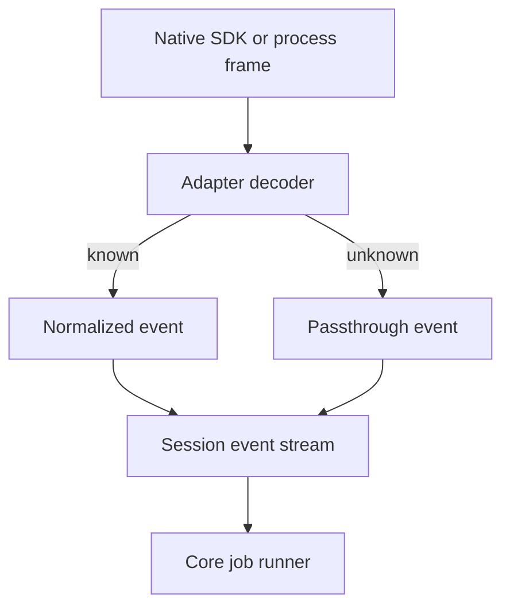

Rennet runs the coding harnesses already installed for the repository's
execution locus. The adapter boundary gives core review code one session model
for Claude Code, Codex, and omp without copying provider credentials or bundling
a Rennet harness executable.

## Ownership

```mermaid
flowchart LR
  client[Desktop, browser, or mobile client] -->|typed command| server[@rennet/server]
  server --> core[@rennet/core HarnessPort]
  server --> adapters[@rennet/adapters]
  adapters --> claude[Installed claude]
  adapters --> codex[Installed codex]
  adapters --> omp[Installed omp through Bun]
  claude --> provider[Harness provider]
  codex --> provider
  omp --> provider
```

`HarnessPort` and its event types live in `packages/core/src/harness.ts`. The
interface has no Node or Electron dependency. `@rennet/adapters` owns binary
discovery, process and SDK integration, native-frame decoding, and provider
errors. `@rennet/server` discovers and memoizes harnesses for each project locus,
then injects the selected adapter into core jobs.

The desktop and browser shells reach the daemon through `@rennet/client`. The
React app does not spawn harnesses, and the Electron main process does not own
model routing.

## The normalized session

The current port exposes descriptor and health information plus one operation:
`createSession(spec)`. A session then provides one event stream and the `send`,
`interrupt`, and `close` methods. Resume and fork are not part of the interface.

Every event carries the same envelope:

```ts
interface HarnessEventBase {
  seq: number
  harness: "claude-code" | "codex" | "omp"
  sessionId: string
  turnId: string | null
  receivedAt: number
  native: unknown
}
```

The adapter assigns the monotonically increasing `seq`. It also retains the
native frame. Known frames become session, text, tool, error, or metered-key
events. Unknown frames become `passthrough` events rather than disappearing.



Tool results keep both structured output and readable text. Terminal outcomes
are a discriminated union of `completed`, `cancelled`, and `failed`, so missing
usage or structured output cannot be mistaken for a successful empty value.

## Claude Code

The Claude adapter uses `@anthropic-ai/claude-agent-sdk` and sets
`pathToClaudeCodeExecutable` to the discovered `claude` binary. Packaging removes
the SDK's bundled platform executables. The resulting app uses the user's
installed CLI and its existing authentication.

The query adapter passes the child environment explicitly because the SDK's
`env` option replaces rather than merges it. Session frames are normalized in
`packages/adapters/src/claude-adapter.ts`.

Claude sessions can accept an output schema and an optional tool list. The
coding-agent handoff does not narrow the default tool set, so the agent can edit
files and run project commands. Read-oriented review jobs may supply a smaller
tool set for that workload.

## Codex

The Codex adapter speaks newline-delimited JSON-RPC with `codex app-server`.
`packages/adapters/src/codex-app-server.ts` owns the wire protocol, and
`codex-turn-transport.ts` exposes it to `CodexAdapter`.

One turn-scoped child runs this sequence:

```text
initialize
initialized
thread/start
turn/start
item/* notifications
turn/completed
```

`turn/start` carries the prompt, repository working directory, model, sandbox
policy, approval policy, and optional output schema. Structured output returns
through the app-server protocol. The adapter does not use an output scratch file
for this path.

The transport maps assistant deltas, completed messages, tool lifecycle events,
token usage, failures, and interrupts into `HarnessEvent`. It terminates the
turn child after the terminal event. Codex does not report per-turn dollar cost
through this integration, so the capability remains absent.

For a WSL project, discovery and process execution run inside the selected
distro and pass a distro-native working directory. The
[Codex app-server reference](../reference/codex-app-server.md) records the full
method mapping and discovery candidates. The
[Windows and WSL guide](../../using/guides/windows-and-wsl.md) covers the
user-facing setup.

## omp

The omp adapter runs the `omp` binary from `@oh-my-pi/pi-coding-agent` through a
proven Bun runtime. Its transport uses `omp --mode rpc --auto-approve
--no-session` and sends the prompt as an RPC command on standard input.

Rennet gives omp a temporary extension directory containing the `canvasOps` MCP
configuration, then removes the directory when the turn ends. The decoder bounds
frames and captured standard error. Malformed, oversized, rejected, or unfinished
RPC frames end the session as a protocol failure even if the child exits with
status zero.

The adapter and hermetic transport tests are present. No real omp conformance run
has recorded a tested version range, so discovery reports it as untested and its
capability evidence stops at `implementedByAdapter`. The orchestrator uses omp
only when neither Claude nor Codex supplies the seat.

## Discovery follows the project locus

A graphical app may inherit a different `PATH` from an interactive shell, and a
shell command may resolve to a function rather than an executable. Discovery
therefore reads the login-shell path, combines it with the process path and known
install locations, probes absolute executable candidates, and records the chosen
binary and health result.

Codex discovery includes the executable bundled in ChatGPT on macOS after
user-installed candidates. WSL discovery searches inside the selected distro.
omp discovery verifies both its script and the Bun runtime that will execute it.
`RENNET_DISABLE_HARNESS=1` disables discovery for hermetic tests.

Discovery proves that a candidate can start and answer its probe. It does not
read the harness's credential files.

## Capabilities require evidence

Each capability has three layers:

| Layer | Meaning |
| --- | --- |
| `implementedByAdapter` | Rennet contains the native-to-normalized mapping |
| `advertisedByHarness` | The installed harness version reports support |
| `availableInSession` | A live session demonstrated the behavior |

`buildCapabilities()` starts every layer at `false` and turns on only the entries
supplied by a passing check. The shared conformance suite in
`packages/core/src/harness-conformance.ts` drives the same named behaviors through
any `HarnessPort`. Hermetic tests can prove adapter implementation. Real runs are
required for the outer layers and for the recorded `testedRange`.

## Authentication, usage, and egress

The harness authenticates itself. Rennet does not copy OAuth tokens or API keys
into an adapter. Claude's session-start frame reports `apiKeySource`; metered key
sources produce a visible warning without stopping the turn.

Usage is optional on a normalized session outcome. An adapter omits it when the
harness supplied no token record. RSP documents require a token block, and the
current document producers substitute an all-zero block when a model turn has no
usage record. Those zeros therefore do not prove that the turn consumed no
tokens. Provider-reported and derived dollar values remain separate and stay
`null` when no amount is available.

There is no hosted Rennet backend. The daemon starts local harness processes and
serves `canvasOps` on a loopback transport where a subprocess needs MCP access.
Review context still reaches the provider used by the selected harness.

## Code map

| Concern | Owner |
| --- | --- |
| Port, events, errors, health, and capability types | `packages/core/src/harness.ts` |
| Shared conformance checks | `packages/core/src/harness-conformance.ts` |
| Binary discovery | `packages/adapters/src/harness-discovery.ts` |
| Claude adapter and query integration | `packages/adapters/src/claude-adapter.ts`, `packages/adapters/src/claude-query.ts` |
| Codex adapter and app-server transport | `packages/adapters/src/codex-adapter.ts`, `packages/adapters/src/codex-app-server.ts` |
| omp adapter and RPC transport | `packages/adapters/src/omp-adapter.ts`, `packages/adapters/src/omp-turn-transport.ts` |
| Per-project harness composition | `packages/server/src/create-server.ts` |
| Client-to-daemon connection | `packages/client/src/ws-bridge.ts` |

See [agent handoff](./agent-handoff.md) for the write-enabled consumer and
[model council](./model-council.md) for job assignment.
