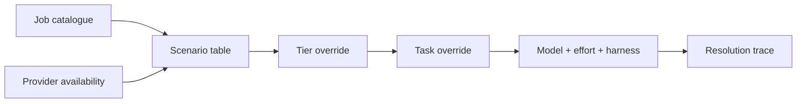

The Model Council is a pure assignment layer. It classifies each registered job,
selects a model and effort from provider availability and user overrides, and
records why that assignment won. The feature that requested the job remains
responsible for execution and its input budget.

## Tiers

| Tier | Use | Execution shape |
|---|---|---|
| Deterministic | Code can produce the result directly | No model call |
| Light | The complete input fits in one bounded request | Usually batched structured output |
| Heavy | The model must inspect code, use tools, or sustain a session | Coding-harness session |

The catalogue records a stable job ID, tier, batching shape, label, optional
council row, and whether the job is a session rider. A session rider belongs to
the surrounding heavy analysis session instead of requiring an independent seat.

A catalogue entry is assignment metadata, not proof that a feature currently
calls it. Live call sites include review-pipeline jobs, selection-aware context
questions, CI analysis, delta digests, pull-request body drafting, handoff
composition, comment refinement, orchestration, and adjudication.

## Availability tables

The council has three versioned default tables:

- both Claude and Codex available;
- Claude only; and
- Codex only.

The council recognises these model identifiers, in the tables and in overrides:

| Provider | Models |
|---|---|
| Claude | `haiku`, `sonnet-5`, `opus-4.8` |
| Codex | `gpt-5.5`, `gpt-5.6-sol`, `gpt-5.6-terra`, `gpt-5.6-luna` |

The resolved model determines the harness: Claude models use `claude-code` and
Codex models use `codex`. An override cannot select an incoherent model and
harness pair.

OMP is outside the council tables. The server selects it as an orchestrator
fallback only when neither Claude nor Codex is available and an OMP harness is
available.

## Resolution order

`resolveAssignment()` starts with the availability table, or the configured
harness default when no council provider is available. It then applies the tier
override and finally the task override. An override changes only the model or
effort fields it supplies.

The effective precedence is:

1. Task override
2. Tier override
3. Availability table
4. Harness default or degraded fallback

Deterministic jobs stop before model selection.

With both providers available, a light job may resolve to a Codex harness while
the review's heavy session runs on Claude. The resolution trace marks that
cross-harness choice.

## The dual-model second seat

Flagged can run the same finding lens on both providers and reconcile the two
results. Only one seat is a council assignment; the other is the second opinion
the council never picked, so it carries no resolution trace. That second seat is
deliberately strong rather than cheap: a Codex second seat that the council did
not assign runs `gpt-5.6-sol` at effort `high`. A second opinion is only worth
reading if it can disagree with the drafter on the merits.

The light-tier utility default (`gpt-5.6-luna` at effort `low`) still applies to
genuine light-tier Codex calls such as formatting and narration. It is not the
second seat.

## Trace and ledger

Every resolution returns a trace containing:

- job ID and tier;
- availability scenario;
- winning source, such as the council table or an override;
- council row where one exists;
- whether a light job crossed harnesses; and
- a plain summary of the selected model, effort, and harness.

The caller records the trace with the run ledger. This makes assignment decisions
inspectable in stored run data. There is no dedicated council diagnostics screen;
the current product exposes the result through run and provenance data.

## Invocation budgets

The resolver does not consume a model-call budget. Live runners consult a shared
invocation budget before each turn. This separation keeps assignment pure while
letting the execution path account for retries, multiple seats, reconciliation,
and follow-up turns against one shared allowance. Review-generation runners use
a refused grant to stop that runner and expose degraded output. `context.ask`
records the refusal as an overage and continues the requested answer under Rule
Zero.

## Changing an assignment

Default model changes belong in the versioned tables in
`packages/core/src/model-council.ts`. Feature code should request a stable job ID
rather than naming a provider model. User configuration can override a tier or a
specific task without changing the catalogue.

Adding a job requires both catalogue metadata and a default assignment for each
availability scenario if the job is model-facing. It also requires a real caller
before documentation can describe the job as live product behavior.

See [Context assembly](./context-assembly.md) for orchestrator context and
[Architecture contracts](./architecture-contracts.md) for harness and provenance
boundaries.
