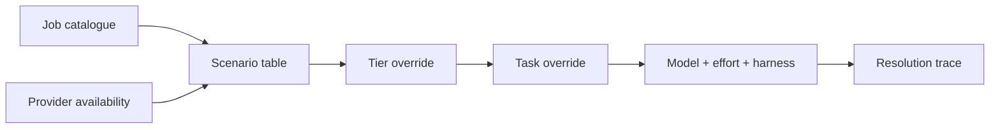

The Model Council is a pure assignment layer. It classifies each registered job,
selects a model and effort from provider availability and user overrides, and
records why that assignment won. The feature that requested the job remains
responsible for execution and its input budget.

## Tiers

| Tier | Use | Execution shape |
|---|---|---|
| Deterministic | Code can produce the result directly | No model call |
| Light | The complete input fits in one bounded request | Usually batched structured output |
| Heavy | The model must inspect code, use tools, or sustain a session | Coding-harness session |

The catalogue records a stable job ID, tier, batching shape, label, optional
council row, and whether the job is a session rider. A session rider belongs to
the surrounding heavy analysis session instead of requiring an independent seat.

A catalogue entry is assignment metadata, not proof that a feature currently
calls it. Live call sites include review-pipeline jobs, selection-aware context
questions, CI analysis, delta digests, pull-request body drafting, handoff
composition, comment refinement, orchestration, adjudication, and knowledge
generation.

Knowledge generation runs two council jobs: `partition-worker`, a light batched
job that reads one [module batch](./code-intelligence.md#module-batching) and
emits anchored claims, and `map-verify`,
a heavy seat that confirms hypotheses against their cited spans and mints
cross-cutting claims.

The lens drafting pipeline runs five: `lens-draft` (the drafting seat for the
Design, Sequence, and Decisions lenses), `lens-draft-flagged` (the dual seat —
Claude and Codex on the same instructions, reconciled by cross-model
concurrence), `lens-draft-noise` (the noise lens), `board-post-process` (the
editor pass that reshapes and de-slops board prose between the lint loop and the
immutability gate), and `round-report` (the per-round seat that drafts first on
a re-review). The Flagged dual-seat merge routes through `finding-reconcile`.

Every model path in the product resolves through the council.

## Availability tables

The council has three versioned default tables:

- both Claude and Codex available;
- Claude only; and
- Codex only.

The council recognises these model identifiers, in the tables and in overrides:

| Provider | Models |
|---|---|
| Claude | `haiku`, `sonnet-5`, `opus-4.8` |
| Codex | `gpt-5.5`, `gpt-5.6-sol`, `gpt-5.6-terra`, `gpt-5.6-luna` |

The resolved model determines the harness: Claude models use `claude-code` and
Codex models use `codex`. An override cannot select an incoherent model and
harness pair.

OMP is outside the council tables. The server selects it as an orchestrator
fallback only when neither Claude nor Codex is available and an OMP harness is
available.

## Resolution order

`resolveAssignment()` starts with the availability table, or the configured
harness default when no council provider is available. It then applies the tier
override and finally the task override. An override changes only the model or
effort fields it supplies.

The effective precedence is:

1. Task override
2. Tier override
3. Availability table
4. Harness default or degraded fallback

Deterministic jobs stop before model selection.

With both providers available, a light job may resolve to a Codex harness while
the review's heavy session runs on Claude. The resolution trace marks that
cross-harness choice.

## The dual-model second seat

Flagged can run the same finding lens on both providers and reconcile the two
results. Only one seat is a council assignment; the other is the second opinion
the council never picked, so it carries no resolution trace. That second seat is
deliberately strong rather than cheap: a Codex second seat that the council did
not assign runs `gpt-5.6-sol` at effort `high`. A second opinion is only worth
reading if it can disagree with the drafter on the merits.

The light-tier utility default (`gpt-5.6-luna` at effort `low`) still applies to
genuine light-tier Codex calls such as formatting and narration. It is not the
second seat.

## Trace and ledger

Every resolution returns a trace containing:

- job ID and tier;
- availability scenario;
- winning source, such as the council table or an override;
- council row where one exists;
- whether a light job crossed harnesses; and
- a plain summary of the selected model, effort, and harness.

The caller records the trace with the run ledger. This makes assignment decisions
inspectable in stored run data. There is no dedicated council diagnostics screen
for traces; the current product exposes trace detail through run and provenance
data. The *assignments themselves* are readable and editable on the Environments
page — see [Review roles in Settings](#review-roles-in-settings).

## Invocation budgets

The resolver does not consume a model-call budget. Live runners consult a shared
invocation budget before each turn. This separation keeps assignment pure while
letting the execution path account for retries, multiple seats, reconciliation,
and follow-up turns against one shared allowance. Review-generation runners use
a refused grant to stop that runner and expose degraded output. `context.ask`
records the refusal as an overage and continues the requested answer under Rule
Zero. The knowledge swarm takes no invocation budget at all: complete map
coverage is the decided behavior, so its runners have no budget parameter to
consult.

## Review roles in Settings

The council routes jobs; the settings surface shows **review roles** — eight
user-legible names, each mapped to a council job that already exists in the
catalogue. The mapping adds no job IDs and changes no table value; it is a reading
of the tables, not a second source of truth.

| Review role | Council job |
|---|---|
| Orchestrator | `orchestrator-chat` |
| Context-Map Workers | `partition-worker` |
| Confirmation Worker | `self-consistency` |
| Lens Drafters | `lens-draft` |
| Flagged Second Seat | `lens-draft-flagged` |
| Adjudication | `adjudication` |
| Post-Process | `board-post-process` |
| Utility | `context-ask-fetch` |

Settings → Environments → *(host card)* → **Edit Mappings** resolves every role in
all three availability scenarios and shows the result in two columns: **Dual
Harness**, and a **Single Harness** column that resolves to whichever provider is
enabled on that host. The read is
**honest-present**: the tables are static, so the eight roles are always there with
real values, even on an install that has never been configured. A role that does
not run in a scenario resolves to a null cell and renders an em dash — the Flagged
Second Seat is the case that matters, since it exists only when both providers are
available. Nothing is ever filled in with a guess.

Each cell carries the layer it came from, so the surface says where the value came
from rather than inferring it: the council table, or a task override that won.

### Editing a mapping

Changing a cell writes a **task override** — the top rung of the resolution order
above — into the viewer's `client-settings.json` under
`routing.task[jobId][scenario]`. It stores **model and effort only**. The harness is
never stored: it derives from the resolved model's provider, which is why an
override cannot select an incoherent model/harness pair.

Overrides are keyed by **(job, scenario)**, not by job alone. Rai ruled this on
2026-08-28: editing one scenario must never move a sibling scenario, because the
columns read as independent and it would be a lie in the UI for one edit to change
values the reviewer did not touch. So an override in `codexOnly` leaves `dual` and
`claudeOnly` resolving from their own council-table defaults, and each scenario can
hold its own override at the same time. Each *write* touches exactly one cell; the
role's **Reset to default** control clears every column that role has actually
overridden, one write per column, and leaves its un-overridden columns untouched.
A clear drops the layer rather than writing a copy of the default back, so a later
table change still reaches that cell. Clearing a job's last cell drops the job entry, and clearing the
last job drops the `routing` slice entirely: an install that reset everything is
byte-identical to one that never overrode anything.

What the surface deliberately does **not** do: add council job IDs, edit the
versioned default tables, or persist provider availability. Availability is
detected — which harnesses are installed and enabled on that host — not a stored
override.

## Changing an assignment

Default model changes belong in the versioned tables in
`packages/core/src/model-council.ts`. Feature code should request a stable job ID
rather than naming a provider model. User configuration can override a tier or a
specific task without changing the catalogue; the Environments Review section is the
in-product path for the task override, described above.

Adding a job requires both catalogue metadata and a default assignment for each
availability scenario if the job is model-facing. It also requires a real caller
before documentation can describe the job as live product behavior.

See [Context assembly](./context-assembly.md) for orchestrator context and
[Architecture contracts](./architecture-contracts.md) for harness and provenance
boundaries.
