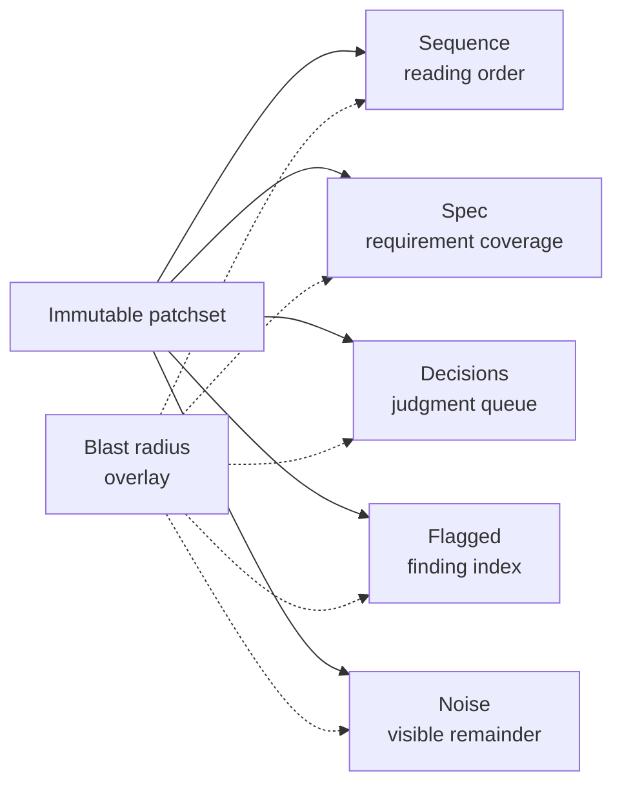

The five review lenses share one immutable patchset and give it five useful
shapes. Changing lenses never changes occurrence identity, evidence, or a
recorded disposition.

## Sequence

Sequence answers "what should I read next?" A decomposition proposal can group
hunks into semantic cohorts and order those cohorts for comprehension. The
sequence is independent of commit chronology and file order.

The proposal is admitted only after validation against the offered hunk set. If
it is absent or invalid, a deterministic decomposition floor covers every hunk.
The floor also fills any uncovered residue, so a model-produced sequence cannot
make captured code disappear.

Each cohort carries its source anchors. Opening a cohort reveals the same
occurrences used by the other lenses.

## Spec

Spec answers "did the implementation satisfy its stated intent?" The server
captures available OpenSpec material with the patchset and builds a structured
spec model from that frozen input. Coverage mapping connects requirements to
implementation occurrences and preserves unmatched requirements as visible
gaps.

The lens distinguishes the requirement text, its implementation evidence, and
the model's coverage judgment. A coverage claim does not replace the underlying
source anchors.

## Decisions

Decisions answers "which choices deserve judgment?" Its runner receives the
offered hunks and frozen intent from the pull-request title, pull-request body,
and captured specification material. It records decision candidates with
evidence and a reconstructed rationale where the source does not state one.

The reconstruction is labeled as model analysis. It is not presented as an
author quote or repository fact. The reviewer can inspect the anchored code and
record a disposition without accepting the proposed rationale.

## Flagged

Flagged is the finding index. Independent Claude and Codex seats inspect the
patchset, then reconciliation groups overlapping findings. Disagreements can
move to adjudication without discarding either seat's evidence.

Findings are ordered by severity: high, medium, then low. Each finding retains
its source seat, provenance, affected occurrence, and evidence. A failed seat is
shown as failed rather than being treated as an empty result.

Capture limitations are also visible. A file with a `truncated`, `binary`, or
`submodule` blocking state remains represented so the review cannot imply full
inspection of bytes that were not available to a runner.

CI signals appear alongside findings as informational evidence. They do not
become model-authored findings and do not hide code that remains unread.

## Noise

Noise is the visible remainder, not a discard bin. The noise runner proposes
patterns and classifies matching occurrences. Items that deviate from a proposed
pattern are ejected back into ordinary review attention.

Noise groups identify whether their source is a rule or a noise job. The UI
distinguishes a successful empty result from a failed analysis. Every item keeps
its occurrence identity and can still receive a disposition or question.

## Blast radius

Blast radius paints related impact over all five lenses. The overlay is
explainable: it points to the dependency, reference, ownership, or other evidence
that made an occurrence relevant. It does not reorder or duplicate the substrate.

## Read coverage

The live workspace derives read coverage from dispositions. Recording a
disposition marks the associated occurrence as read; clearing it returns the
occurrence to unread. Coverage summaries and the unread residue use those same
occurrence identities.

This is deliberately narrower than scroll tracking. The current application does
not turn scrolling past code into a durable read event, so documentation and UI
must not claim that passive viewport movement proves review coverage.

## Shared invariants

Every lens preserves these rules:

1. Every visible item resolves to the captured patchset or a captured
   requirement.
2. Every captured hunk remains represented even when model output is absent,
   invalid, or incomplete.
3. Switching lenses preserves comments, evidence, and dispositions through
   stable occurrence identity.
4. Model failure and capture truncation remain visible.
5. Blast radius adds evidence-backed emphasis without becoming a separate review
   queue.

See [The canvas model](./canvas-model.md) for layers and element identities and
[Architecture contracts](./architecture-contracts.md) for patchset and lineage
rules.
