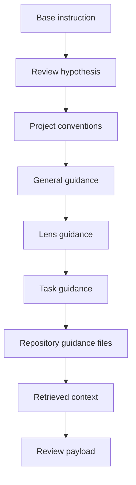

Models do not write directly into a Rennet review surface. A review job supplies a
versioned instruction and offered anchors, a harness returns structured output,
and deterministic code decides what the product may use.

## The path from job to review surface


Three modules own distinct decisions:

1. `@rennet/protocol` defines Rennet Surfacing Protocol, anchors, schemas, and
   validation.
2. `@rennet/prompts` defines the base instruction for each implemented
   model job and assembles prompt layers.
3. `@rennet/core` resolves Model Council assignments and runs review logic over
   injected harness ports.

`@rennet/server` supplies the live adapters and composes those portable modules
into daemon commands. Client applications receive validated review state through
`@rennet/protocol`; they do not parse native harness output.

## RSP documents

RSP is JSON with a versioned envelope and a document-specific body. The envelope
binds output to its patchset and records how the document was produced. This
abridged shape is for orientation; `rspEnvelopeSchema` defines every required
provenance field.

```jsonc
{
  "rsp": 1,
  "docType": "finding",
  "schemaVersion": 1,
  "docId": "01J9X4Q2K7ZC3M0R8T5V6WYA1B",
  "reviewId": "review-id",
  "patchsetId": "patchset-id",
  "provenance": {
    "harness": "claude-code",
    "model": "reported-model",
    "tier": "heavy",
    "route": "agentic",
    "runId": "run-id",
    "inputDigest": "sha256:...",
    "capability": {},
    "tokens": {},
    "reportedUsd": null,
    "derivedUsd": null
  },
  "body": {},
  "x": {}
}
```

The full provenance schema also records harness and adapter versions, how the
model name was obtained, capability evidence, and optional council resolution
data. Producers mint document IDs. Models receive anchor IDs and refer to them;
they do not create durable occurrence identities.

The registry in `packages/protocol/src/rsp.ts` recognizes every protocol document
type. Recognition alone does not mean that a live review job produces the type.
`BODY_SCHEMAS` in `packages/protocol/src/bodies.ts` currently supplies full body
validation for decomposition skeletons and proposals, ordering, roll-up
narration, findings, decision records, noise, and review hypotheses.

## Anchors bind claims to offered material

RSP uses `rennet:` anchors instead of unstructured file and line prose.

```text
rennet:hunk/h_2MMD02
rennet:hunk/h_2MMD02#L14-L31@additions
rennet:chunk/c2^01J9X4Q2K7ZC3M0R8T5V6WYA1B
rennet:symbol/f_CTRL01/FlightsController.ByAirport
rennet:requirement/req_ba31c7d0
```

`parseAnchor()` checks the grammar. `resolveAnchor()` then compares the parsed
anchor with the offered manifest and returns `resolved`, `unresolved`,
`superseded`, or `orphaned`. Span anchors resolve against a named diff side.
Evidence quotes are normalized and compared with the resolved text.

Lineage may map an older occurrence to a successor. Only an `exact` lineage has
`carriesState: true`; other mappings can explain where material went without
claiming that prior review state remains valid.

## Validation is deterministic

`validateDocument()` depends only on the submitted document, a patchset
reference, the offered occurrence manifest, and validator settings. It checks:

- the RSP version, document type, schema version, and envelope;
- provenance capabilities and the input digest;
- document and quote byte limits;
- anchor resolution and evidence quotes;
- the body schema and document-specific semantic rules.

Atomic documents pass or fail as a unit. Item-wise documents may retain valid
items, but the report names every rejected item and its errors. An envelope error
always rejects the whole document.

Decomposition validation also checks that offered hunks are accounted for once,
edges form a directed acyclic graph, and reading order covers the produced
chunks. Other implemented bodies have their own rules in `bodies.ts`.

## Instructions and context

`@rennet/prompts` owns the base contracts used by implemented review jobs.
The base instruction names the role, expected document, evidence rules, and
failure shape. The JSON schema remains the wire authority.

Prompt assembly uses this fixed order:



The base layer is always included. When a byte budget is set, lower-priority
layers drop from the end. `assemblePrompt()` reports the included and dropped
layers so the caller can record what the model actually received.

## Routing stays separate

RSP does not name provider models, effort levels, or harness processes. The
Model Council catalog in `packages/core/src/model-council.ts` assigns those
details to named jobs. This keeps one document contract usable across Claude
Code, Codex, omp, deterministic jobs, and test ports.

The live server resolves an assignment against installed harnesses, runs the
matching adapter, and records the observed result. A registered job or protocol
type without a composed producer remains an available contract, not shipped
review behavior.

## Code map

| Concern | Owner |
| --- | --- |
| RSP envelope, registry, anchors, and validator | `packages/protocol/src/rsp.ts` |
| Body schemas and semantic checks | `packages/protocol/src/bodies.ts` |
| Shared RSP and lineage types | `packages/protocol/src/index.ts` |
| Base instructions and prompt assembly | `packages/prompts/src/index.ts` |
| Harness-turn adapter used by core jobs | `packages/core/src/harness-run-turn.ts` |
| Model Council catalog and resolution | `packages/core/src/model-council.ts` |
| Live daemon composition | `packages/server/src/create-server.ts` |

See [review lenses](./review-lenses.md) for the admitted review surfaces and
[context assembly](./context-assembly.md) for retrieved repository context.
