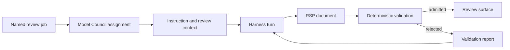
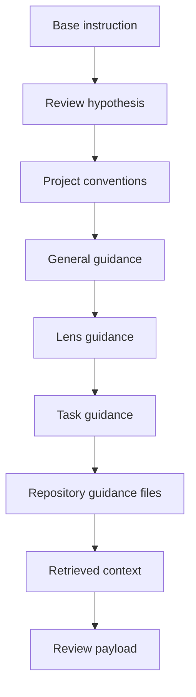
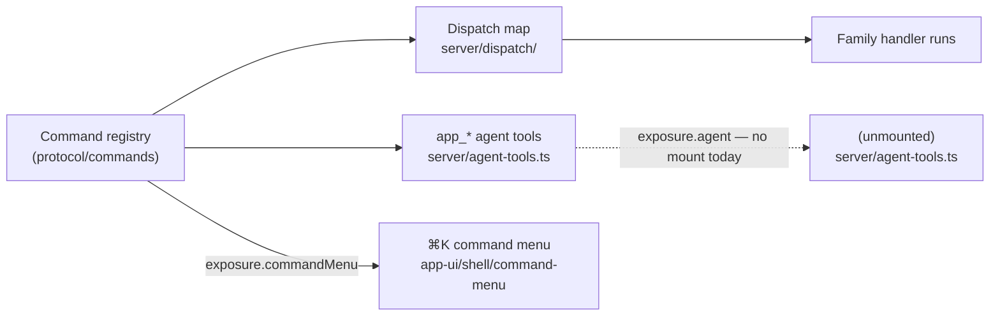

Models do not write directly into a Rennet review surface. A review job supplies a
versioned instruction and offered anchors, a harness returns structured output,
and deterministic code decides what the product may use.

## The path from job to review surface



Three modules own distinct decisions:

1. `@rennet/protocol` defines Rennet Surfacing Protocol, anchors, schemas, and
   validation.
2. `@rennet/prompts` defines the base instruction for each implemented
   model job and assembles prompt layers.
3. `@rennet/core` resolves Model Council assignments and runs review logic over
   injected harness ports.

`@rennet/server` supplies the live adapters and composes those portable modules
into daemon commands. Client applications receive validated review state through
`@rennet/protocol`; they do not parse native harness output.

## RSP documents

RSP is JSON with a versioned envelope and a document-specific body. The envelope
binds output to its patchset and records how the document was produced. This
abridged shape is for orientation; `rspEnvelopeSchema` defines every required
provenance field.

```jsonc
{
  "rsp": 1,
  "docType": "finding",
  "schemaVersion": 1,
  "docId": "01J9X4Q2K7ZC3M0R8T5V6WYA1B",
  "reviewId": "review-id",
  "patchsetId": "patchset-id",
  "provenance": {
    "harness": "claude-code",
    "model": "reported-model",
    "tier": "heavy",
    "route": "agentic",
    "runId": "run-id",
    "inputDigest": "sha256:...",
    "capability": {},
    "tokens": {},
    "reportedUsd": null,
    "derivedUsd": null
  },
  "body": {},
  "x": {}
}
```

The full provenance schema also records harness and adapter versions, how the
model name was obtained, capability evidence, and optional council resolution
data. Producers mint document IDs. Models receive anchor IDs and refer to them;
they do not create durable occurrence identities.

The registry in `packages/protocol/src/delta/rsp.ts` recognizes every protocol document
type. Recognition alone does not mean that a live review job produces the type.
`BODY_SCHEMAS` in `packages/protocol/src/delta/bodies.ts` currently supplies full body
validation for decomposition skeletons and proposals, ordering, roll-up
narration, findings, decision records, noise, and review hypotheses.

## Anchors bind claims to offered material

RSP uses `rennet:` anchors instead of unstructured file and line prose.

```text
rennet:hunk/h_2MMD02
rennet:hunk/h_2MMD02#L14-L31@additions
rennet:chunk/c2^01J9X4Q2K7ZC3M0R8T5V6WYA1B
rennet:symbol/f_CTRL01/FlightsController.ByAirport
rennet:requirement/req_ba31c7d0
```

`parseAnchor()` checks the grammar. `resolveAnchor()` then compares the parsed
anchor with the offered manifest and returns `resolved`, `unresolved`,
`superseded`, or `orphaned`. Span anchors resolve against a named diff side.
Evidence quotes are normalized and compared with the resolved text.

Lineage may map an older occurrence to a successor. Only an `exact` lineage has
`carriesState: true`; other mappings can explain where material went without
claiming that prior review state remains valid.

## Validation is deterministic

`validateDocument()` depends only on the submitted document, a patchset
reference, the offered occurrence manifest, and validator settings. It checks:

- the RSP version, document type, schema version, and envelope;
- provenance capabilities and the input digest;
- document and quote byte limits;
- anchor resolution and evidence quotes;
- the body schema and document-specific semantic rules.

Atomic documents pass or fail as a unit. Item-wise documents may retain valid
items, but the report names every rejected item and its errors. An envelope error
always rejects the whole document.

Decomposition validation also checks that offered hunks are accounted for once,
edges form a directed acyclic graph, and reading order covers the produced
chunks. Other implemented bodies have their own rules in `bodies.ts`.

## Instructions and context

`@rennet/prompts` owns the base contracts used by implemented review jobs.
The base instruction names the role, expected document, evidence rules, and
failure shape. The JSON schema remains the wire authority.

Prompt assembly uses this fixed order:



The base layer is always included. When a byte budget is set, lower-priority
layers drop from the end. `assemblePrompt()` reports the included and dropped
layers so the caller can record what the model actually received.

## Routing stays separate

RSP does not name provider models, effort levels, or harness processes. The
Model Council catalog in `packages/core/src/model-council.ts` assigns those
details to named jobs. This keeps one document contract usable across Claude
Code, Codex, omp, deterministic jobs, and test ports.

The live server resolves an assignment against installed harnesses, runs the
matching adapter, and records the observed result. A registered job or protocol
type without a composed producer remains an available contract, not shipped
review behavior.

## Command routing reads one registry

The review path above surfaces model output. A second kind of routing decides
which command runs when a client or the ⌘K menu asks for one.
That routing reads a single table: the command registry in
`packages/protocol/src/commands/index.ts`. Every row is keyed by a stable command
id and carries the id's argument schema, output schema, label, and an `exposure`
record. All three consumers read it: the dispatch map, the `app_*` agent
projection, and the ⌘K command menu, which filters the table by
`exposure.commandMenu` and runs the surviving rows live through the client's data
seam. That flag is decided command by command — the row-by-row walk of all 104 is
[command menu exposure](../reference/command-menu-exposure.md). The menu's
navigation entries (sessions, projects, settings pages, dialog actions) come from
the same projections the sidebar reads, not from the registry.



**Nothing mounts these tools today.** A session's conversation is its
[T3 Code thread](./t3code-sidecar.md), and Rennet does not expose `app_*` tools to a
T3 thread, so `exposure.agent` gates a surface with no mount. `buildAppTools` and its
registry contract stay — re-mounting them as an MCP server on T3 threads is its own
change. What follows describes that contract, not a live path.

A mounted turn would receive the current `app_*` projection as in-process tools,
rebuilt for every turn, so removing `exposure.agent` from a registry row would remove
the tool from the next turn without a second allow-list. A turn asked to act in Rennet
would call the matching tool once and receive the command's durable result or undo
receipt, and that observed result — never the model's account of it — would be what
the transcript reports.

**Dispatch map.** `packages/server/src/dispatch/` binds a
`Map<commandId, handler>` from the registry, one module per command family
(`app`, `ask`, `attention`, `board`, `daemon`, `device`, `flagged`, `forge`, `fs`,
`github`, `harness`, `noise`, `openspec`, `pairing`, `patchset`, `project`,
`projects`, `publish`, `repository`, `review`, `rework`, `round`, `session`,
`settings`). The map is the only router; it replaced a single
2,357-line `switch (name)`. A compile-time exhaustiveness check fails to type-check
if any registry command has no handler, and a runtime test enumerates the map's
keys against the registry's command ids and asserts the two sets diff empty — the
map serves every command the switch did. An unregistered id fails exactly as the
switch's `default` did; there is no new gate on the path.

**Agent tools.** `packages/server/src/agent-tools.ts` derives the
`app_*` in-process SDK tools by iterating the registry for rows where
`exposure.agent` is true. One row yields one tool: name `app_<id>` (dots
flattened to underscores), args schema and description from the row, and a `run`
that dispatches the command id. The surface is a pure projection of the flag —
flipping a row into `AGENT_EXPOSED` (in `protocol/commands`) makes its tool appear
with no edit here. There is no per-tool allow or deny list (Rule Zero). The
whiteboard five stay HTTP MCP tools (`WhiteboardClient`, #455-locked names); they
are not registry ids, so they are structurally absent from this loop.

`buildAppTools` derives the tools from the live registry and passes them through the
harness-neutral turn contract, which the Claude adapter mounts in its per-turn
in-process MCP server alongside any configured HTTP MCP servers. Nothing calls it at
the composition root today. Tool output is captured as an ordered transcript action,
including the returned command receipt, and the underlying command remains the sole
writer of durable app state.

`exposure.agent` is the only per-row datum that gates the agent surface. The inventory
covers staging a review ask, project add and list, review capture and
open-PR, and the settings ops. Session-scoped tools stay unexposed by choice: `session.list` and
its rename / pin / archive writes exist (C18), but they are client-surface reads
and writes, not app tools. A client-locus `navigate` command does not exist in
the registry yet, so it is left unbound rather than stubbed.

## Code map

| Concern | Owner |
| --- | --- |
| RSP envelope, registry, anchors, and validator | `packages/protocol/src/delta/rsp.ts` |
| Body schemas and semantic checks | `packages/protocol/src/delta/bodies.ts` |
| Shared RSP and lineage types | `packages/protocol/src/delta/` and `packages/protocol/src/domain.ts` |
| Command registry (one table, three readers) | `packages/protocol/src/commands/index.ts` |
| Dispatch map (per-family command modules) | `packages/server/src/dispatch/` |
| `app_*` agent tool surface | `packages/server/src/agent-tools.ts` |
| Base instructions and prompt assembly | `packages/prompts/src/index.ts` |
| Harness-turn adapter used by core jobs | `packages/core/src/harness-run-turn.ts` |
| Model Council catalog and resolution | `packages/core/src/model-council.ts` |
| Live daemon composition | `packages/server/src/create-server.ts` |

See [the lens pipeline](./lens-pipeline.md) for the admitted review surfaces and
[context assembly](./context-assembly.md) for retrieved repository context.
