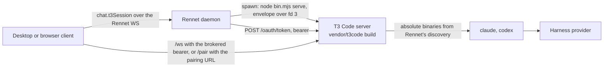

The Rennet daemon runs a T3 Code server, built from the [vendored snapshot](./t3code-vendoring.md),
as a second local process it owns. Interactive coding sessions get T3's session model
(long-lived provider processes, inline approvals, agent questions, per-turn diffs) without
Rennet re-implementing it, and without touching a T3 Code install the user may have of
their own.

## Shape



The daemon composes one supervisor per data directory. Nothing runs until a client asks:
the first `chat.t3Session` adopts a sidecar a previous daemon left running, or spawns
one. Quitting the daemon stops it.

## Private base directory

The sidecar's state lives under `<dataDir>/t3` (by default `~/.rennet/t3`): T3's own
`userdata` with its SQLite state, secrets, logs, and settings. It is never `~/.t3`. A
standalone T3 Code install on the same machine is neither read nor written, and the
sidecar's harness sessions use the user's normal `claude` and `codex` logins because the
provider home paths are left empty.

## Spawn contract

The daemon spawns the vendored bundle with its own Node executable:

```text
node vendor/t3code/apps/server/dist/bin.mjs serve \
  --mode desktop --host 127.0.0.1 --port <free port> --no-browser \
  --base-dir <dataDir>/t3 --bootstrap-fd 3
```

T3 validates `--port` as 1 to 65535, so the daemon binds port 0 on loopback, reads the
number back, releases it, and passes that. The credential never rides on argv or in the
environment. The daemon mints a random bootstrap token and writes T3's desktop bootstrap
envelope (`mode`, `port`, `host`, `t3Home`, `desktopBootstrapToken`) as one JSON line to
file descriptor 3, which T3 reads once at startup and seeds as an unbounded 24-hour grant.

Readiness is T3's own `userdata/server-runtime.json`, which it writes only after its
listener has a real address, cross-checked on pid and port, plus a `200` from the
unauthenticated `/.well-known/t3/environment`. The daemon then exchanges the bootstrap
token at `POST /oauth/token` (form-encoded token exchange, subject type
`urn:t3:params:oauth:token-type:environment-bootstrap`) for a 30-day bearer, and stores
both tokens in `<dataDir>/t3/rennet-credentials.json` with owner-only permissions.

Before the spawn, the daemon writes `userdata/settings.json` with the absolute `claude`
and `codex` paths Rennet's own discovery resolved, merging into whatever the user changed
through T3's settings. A daemon launched by the desktop app inherits launchd's minimal
PATH, and T3 resolves a bare `claude` on the server's PATH, so the absolute paths are
what make the sidecar's providers report ready.

The environment handed to the sidecar drops every `T3CODE_*` key the parent shell
carried and sets `T3CODE_TELEMETRY_ENABLED=false`. No relay URL and no Clerk keys are
passed, so T3 Connect is unavailable in the sidecar and nothing leaves the machine
except the harness's own provider traffic and any MCP servers the user configured.

## Claim and adoption

`<dataDir>/t3-sidecar.json` records the sidecar's pid, port, base directory, the daemon
pid that spawned it, and the vendored snapshot's upstream commit. Like `daemon.json`, it
is a claim to verify. A daemon adopts a claimed sidecar only when the well-known probe
answers, T3's runtime record agrees on pid and port, the snapshot commit matches the
bundle this daemon would spawn, and the stored bearer still opens an authenticated
route (re-exchanged from the bootstrap grant when it does not). Anything less is stale:
the claim is removed and a fresh sidecar is spawned.

## Access for clients

`chat.t3Session` returns the sidecar's origin, its `/ws` URL, the bearer to open that
socket with, the sidecar's environment id, and a pairing URL. Called with a review id, it
also binds that review's thread: one T3 project per repository checkout (created on first
use), one thread per repository root and review id, full access, with `worktreePath`
null so the thread's working directory is the checkout itself. The binding is persisted
beside the sidecar's state and returned as `threadId` plus the sidecar UI's `threadUrl`. The bearer is what the
vendored client runtime needs; the pairing URL (`<origin>/pair#token=…`, minted through
`POST /api/auth/pairing-token`) is what an embedded copy of T3's own UI consumes to set its
session cookie. The command is loopback-only and never remote-exposed. Clients do not
read the credential file.

## The chat slot

A project's chat engine is a per-project setting (`chatEngine`, `rennet` or `t3`, default
`rennet`, stored in the project's `config.json` and edited on the Projects settings page,
where the persistence, usage and hidden-ref facts sit beside the control). With `t3`
selected, the review workspace's chat slot renders T3's thread view for the review's
bound thread. Two rungs exist, and the host decides which one mounts:

- **Rung two, the desktop app.** `@rennet/t3-chat` mounts T3's `ChatView` natively:
  the vendored web app is imported by module (the desktop Vite config aliases `~/` into
  `vendor/t3code/apps/web/src`, dedupes React, and defines the two `import.meta.env`
  values the source reads at module scope), wrapped in T3's atom registry, toast and
  confirm hosts, and a TanStack router over memory history carrying the four routes
  `ChatView` navigates to. The sidecar is registered in T3's environment catalog as a
  bearer environment built from `chat.t3Session` (the brokered origin, the websocket
  base and the 30-day bearer); T3's client runtime then does what it does for any remote
  environment: bearer HTTP, a short-lived `wsTicket` for `/ws`, thread subscriptions.
  The renderer runs the vendored app in its hosted-static mode, so no primary
  environment is ever looked for at Rennet's own origin. A second Tailwind entry
  (`packages/t3-chat/src/t3.css`, no preflight) scans only the vendored source and maps
  every T3 semantic variable onto Rennet's `--rn-*` palette; the names both kits share
  mirror `packages/theme/src/theme.css` exactly, because a utility rule is one rule for
  the whole document. The mount is a lazy chunk: a project on the `rennet` engine never
  downloads it. The desktop provides the components through `T3ChatSlotProvider`;
  `app-ui` itself never imports the vendored app.
- **Rung one, every other host.** An Electron `<webview>` of the sidecar's own served
  UI, first at the pairing URL (which sets T3's session cookie inside the guest) and
  then at the bound thread's route. The bearer never enters the guest.

Rung two's environment registration persists in the renderer's IndexedDB under T3's
catalog (the same store T3's hosted app uses for paired machines), keyed by one stable
connection id, so a refreshed bearer replaces the entry rather than adding one.

### Reading a lens seat's transcript

Rung two provides two views, not one, and the slot shows whichever the workspace asked
for. `T3NativeChat` is the review's own bound thread with its composer. `T3ThreadView`
is any other thread on the same sidecar environment — in practice a lens seat's, since
every board seat runs as its own thread — mounted read-only: the same providers, the
same routes and the same `ChatView`, with the initial route built from the `{
environmentId, threadId }` ref the lane carries rather than from the session. Both
register the same bearer environment under the same connection id, so opening a
transcript adds no connection.

Read-only is one CSS rule. `t3.css` hides `[data-chat-composer-overlay]` — upstream's own
attribute on the whole input bar — inside `[data-slot="t3-thread-view"]`, which also
zeroes the clearance `ChatView` measures from that element, so the timeline runs to the
bottom instead of reserving a gap. No vendored file is edited and there is no
`PATCHES.md` row; a Tailwind class string would not have survived a fold. It is not a
gate either: it hides a composer that would otherwise start a turn on a seat's thread,
which is confusing rather than dangerous.

The workspace opens one by writing the lane's thread ref into the store
(`uiActions.openLensThread(ref)`); `T3ChatDock` then renders `T3ThreadView` for it with a
"Back to the session" control that clears it. The transcript keeps streaming while the
seat runs — that is upstream's thread subscription, nothing Rennet drives — and stays
readable after the seat settles and after the boards reveal.

Measured on 2026-09-03 (renderer production build, raw bytes before gzip): the chunks
loaded at startup grew from 1,822 KB to 1,846 KB, the lazy T3 payload is 3,122 KB of
script plus a 380 KB stylesheet, and the on-disk renderer grew from 2.4 MB to 21.6 MB
because `@pierre/diffs` splits every Shiki grammar into its own on-demand chunk and
`heic-to` (2.9 MB, loaded only when a HEIC image is attached) rides along.

## The handoff exit

"Hand to coding agent" on a project whose engine is `t3` dispatches the composed work
order as one turn on the review's bound thread, full access, cwd the checkout, instead
of Rennet's session turn loop. The daemon waits for the turn to settle, reads T3's
checkpoint diff for that turn, and returns the same outcome shape the Rennet engine
returns (final text, unified diff, files touched, or a failure reason from T3's
session). `review.handoff.run` then recaptures the checkout and offers the delta
re-review exactly as before; nothing downstream knows which engine ran the turn. The
engine is read from the repository's own config, never from a project id.

## Status

`daemon.status` carries a `t3Sidecar` field: `off` until something asked for it,
`starting`, `ready` with the port, or `degraded` with the reason (bundle not built,
spawn failed, exited). The field also states `telemetry: "off"` and the upstream commit
the bundle was built from. The set of RPC methods Rennet calls is checked at build time,
not at boot: the daemon-side client and the sidecar are built from the same vendored
snapshot, so a fold that removes a method fails the typecheck before it can ship.

## Stopping

The daemon's own shutdown sends SIGTERM to the sidecar it spawned and clears the claim.
`rennet stop` and the tray's Quit then run a sidecar step after the daemon step: verify
the claim, SIGTERM only a pid T3's runtime record vouches for, wait a bounded five
seconds, clear the claim. A sidecar that will not exit is logged and left for the next
start to reap; the app still exits.

T3 has no SIGTERM handler of its own. A turn that was streaming when the sidecar stops is
reconciled on the sidecar's next start as an errored session ("Provider session did not
survive a server restart"), not as an interrupted one. Sending `thread.turn.interrupt`
over RPC before the signal is the daemon-side client's job and lands with it.

## Code map

- `packages/server/src/t3/sidecar.ts`: claim, probe, free port, provider seeding, environment, spawn, adopt, stop.
- `packages/server/src/t3/supervisor.ts`: one supervisor per data dir; `ensure`, `session`, `client`, `threadFor`, `status`, `stopSync`.
- `packages/server/src/t3/client.ts`: the daemon-side RPC client, the one Rennet module importing `effect` and `@t3tools/contracts`.
- `packages/server/src/t3/threads.ts`: the (repository root, session id) → thread binding.
- `packages/server/src/t3/handoff.ts`: the handoff exit; `create-server.ts` routes by the repository's `chatEngine`.
- `packages/app-ui/src/settings/projects/chat-engine.tsx`: the engine control and its disclosure; `packages/app-ui/src/chat/engine-chat-dock.tsx`: the slot switch, the rung-one `<webview>`, the session-or-lens choice and the hand-off to the host-provided components (`chat/t3-chat-slot.tsx`); `packages/app-ui/src/store/ui.ts`: `lensThread` and `openLensThread`.
- `packages/t3-chat/src/native-chat.tsx`: rung two (routes, providers, environment registration, the thread and draft route views mirrored from upstream's route files, and `T3ThreadView`); `session.ts`: the session-to-registration mapping and the route builder both views share; `t3.css`: the theme bridge and the read-only composer rule. `apps/desktop/vite.renderer.config.ts` carries the alias, dedupe and defines; `apps/desktop/src/renderer/index.tsx` provides both components.
- `packages/server/src/dispatch/chat.ts`: `chat.t3Session`; `dispatch/daemon.ts` adds `t3Sidecar` to `daemon.status`.
- `packages/protocol/src/wire.ts`: `t3SidecarStatusSchema`, `t3SessionSchema`.
- `packages/server/src/daemon-main.ts`: resolves the bundle (`RENNET_T3_BUNDLE` overrides); in the packaged app the main process sets that variable to `Resources/t3code/apps/server/dist/bin.mjs`, staged by `scripts/stage-t3-sidecar.mjs` at desktop build time (see `apps/desktop/PACKAGING.md`).
- `apps/desktop/src/main/daemon-supervisor.ts` and `packages/server/src/cli.ts`: the sidecar step in both stop paths.
