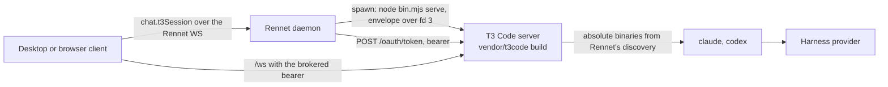

The Rennet daemon runs a T3 Code server, built from the [vendored snapshot](./t3code-vendoring.md),
as a second local process it owns. Interactive coding sessions get T3's session model
(long-lived provider processes, inline approvals, agent questions, per-turn diffs) without
Rennet re-implementing it, and without touching a T3 Code install the user may have of
their own.

## Shape



The daemon composes one supervisor per data directory. Nothing runs until a client asks:
the first `chat.t3Session` adopts a sidecar a previous daemon left running, or spawns
one. Quitting the daemon stops it.

## Private base directory

The sidecar's state lives under `<dataDir>/t3` (by default `~/.rennet/t3`): T3's own
`userdata` with its SQLite state, secrets, logs, and settings. It is never `~/.t3`. A
standalone T3 Code install on the same machine is neither read nor written, and the
sidecar's harness sessions use the user's normal `claude` and `codex` logins because the
provider home paths are left empty.

## Spawn contract

The daemon spawns the vendored bundle with its own Node executable:

```text
node vendor/t3code/apps/server/dist/bin.mjs serve \
  --mode desktop --host 127.0.0.1 --port <free port> --no-browser \
  --base-dir <dataDir>/t3 --bootstrap-fd 3
```

T3 validates `--port` as 1 to 65535, so the daemon binds port 0 on loopback, reads the
number back, releases it, and passes that. The credential never rides on argv or in the
environment. The daemon mints a random bootstrap token and writes T3's desktop bootstrap
envelope (`mode`, `port`, `host`, `t3Home`, `desktopBootstrapToken`) as one JSON line to
file descriptor 3, which T3 reads once at startup and seeds as an unbounded 24-hour grant.

Readiness is T3's own `userdata/server-runtime.json`, which it writes only after its
listener has a real address, cross-checked on pid and port, plus a `200` from the
unauthenticated `/.well-known/t3/environment`. The daemon then exchanges the bootstrap
token at `POST /oauth/token` (form-encoded token exchange, subject type
`urn:t3:params:oauth:token-type:environment-bootstrap`) for a 30-day bearer, and stores
both tokens in `<dataDir>/t3/rennet-credentials.json` with owner-only permissions.

Before the spawn, the daemon writes `userdata/settings.json` with the absolute `claude`
and `codex` paths Rennet's own discovery resolved, merging into whatever the user changed
through T3's settings. A daemon launched by the desktop app inherits launchd's minimal
PATH, and T3 resolves a bare `claude` on the server's PATH, so the absolute paths are
what make the sidecar's providers report ready.

The environment handed to the sidecar drops every `T3CODE_*` key the parent shell
carried and sets `T3CODE_TELEMETRY_ENABLED=false`. No relay URL and no Clerk keys are
passed, so T3 Connect is unavailable in the sidecar and nothing leaves the machine
except the harness's own provider traffic and any MCP servers the user configured.

## Claim and adoption

`<dataDir>/t3-sidecar.json` records the sidecar's pid, port, base directory, the daemon
pid that spawned it, and the vendored snapshot's upstream commit. Like `daemon.json`, it
is a claim to verify. A daemon adopts a claimed sidecar only when the well-known probe
answers, T3's runtime record agrees on pid and port, the snapshot commit matches the
bundle this daemon would spawn, and the stored bearer still opens an authenticated
route (re-exchanged from the bootstrap grant when it does not). Anything less is stale:
the claim is removed and a fresh sidecar is spawned.

## Access for clients

`chat.t3Session` returns the sidecar's origin, its `/ws` URL, the bearer to open that
socket with, and the sidecar's environment id. Called with a review id, it
also binds that review's thread: one T3 project per repository checkout (created on first
use), one thread per repository root and review id, full access, with `worktreePath`
null so the thread's working directory is the checkout itself. The binding is persisted
beside the sidecar's state and returned as `threadId` plus the sidecar UI's `threadUrl`.
The bearer is what the vendored client runtime needs. The command is loopback-only and
never remote-exposed. Clients do not read the credential file.

## The chat slot

There is no engine choice and no second rung: the review workspace's chat slot always
renders T3's thread view for the review's bound thread, mounted natively by the host.

`@rennet/t3-chat` mounts T3's `ChatView` natively:
  the vendored web app is imported by module (both desktop Vite configs — the Electron
  renderer and the served browser tab — alias `~/` into `vendor/t3code/apps/web/src`,
  dedupe React, and define the two `import.meta.env`
  values the source reads at module scope), wrapped in T3's atom registry, toast and
  confirm hosts, and a TanStack router over memory history carrying the four routes
  `ChatView` navigates to. The sidecar is registered in T3's environment catalog as a
  bearer environment built from `chat.t3Session` (the brokered origin, the websocket
  base and the 30-day bearer); T3's client runtime then does what it does for any remote
  environment: bearer HTTP, a short-lived `wsTicket` for `/ws`, thread subscriptions.
  Each host runs the vendored app in its hosted-static mode, so no primary
  environment is ever looked for at Rennet's own origin. A second Tailwind entry
  (`packages/t3-chat/src/t3.css`, no preflight) scans only the vendored source and maps
  every T3 semantic variable onto Rennet's `--rn-*` palette; the names both kits share
  mirror `packages/theme/src/theme.css` exactly, because a utility rule is one rule for
  the whole document. The mount is a lazy chunk, fetched when a session's slot opens.
  Both `apps/desktop` entries provide the components through `T3ChatSlotProvider`;
  `app-ui` itself never imports the vendored app, and a host that provides nothing shows
  a line saying so rather than an empty box.

The slot's other caller is **the bench** — the review workspace's first frame while
capture and the first board generation run (`packages/app-ui/src/app/preparation-bench.tsx`,
mounted by `SessionScreen` in the session outlet, so the sidebar, top bar and chat slot
stay around it). The bench draws the change as its centrepiece with one reader per lens,
each showing that seat's `latest` line from `SessionPreparation` — the daemon's plain-words
projection of the seat's newest thread activity — and capture as the first beat of the same
scene rather than a separate screen. Each reader is a control: activating one writes the
lane's `thread` (`{ environmentId, threadId }`) through `uiActions.openLensThread` and
opens the dock, and the slot renders that transcript read-only (below). A lane with no
`thread` yet is disabled rather than offered as a transcript that does not exist.

The mount's environment registration persists in each host's IndexedDB under T3's
catalog (the same store T3's hosted app uses for paired machines), keyed by one stable
connection id, so a refreshed bearer replaces the entry rather than adding one.

### Reading a lens seat's transcript

The mount provides two views, not one, and the slot shows whichever the workspace asked
for. `T3NativeChat` is the review's own bound thread with its composer. `T3ThreadView`
is any other thread on the same sidecar environment — in practice a lens seat's, since
every board seat runs as its own thread — mounted read-only: the same providers, the
same routes and the same `ChatView`, with the initial route built from the `{
environmentId, threadId }` ref the lane carries rather than from the session. Both
register the same bearer environment under the same connection id, so opening a
transcript adds no connection.

Read-only is one CSS rule. `t3.css` hides `[data-chat-composer-overlay]` — upstream's own
attribute on the whole input bar — inside `[data-slot="t3-thread-view"]`, which also
zeroes the clearance `ChatView` measures from that element, so the timeline runs to the
bottom instead of reserving a gap. No vendored file is edited and there is no
`PATCHES.md` row; a Tailwind class string would not have survived a fold. It is not a
gate either: it hides a composer that would otherwise start a turn on a seat's thread,
which is confusing rather than dangerous.

The workspace opens one by writing a seat's thread ref into the store
(`uiActions.openLensThread(ref)`) — on the bench every seat's line of speech is its own
control, so Flagged offers two, one per provider; `T3ChatDock` then renders `T3ThreadView` for it with a
"Back to the session" control that clears it. The transcript keeps streaming while the
seat runs — that is upstream's thread subscription, nothing Rennet drives — and stays
readable after the seat settles and after the boards reveal.

Measured on 2026-09-03 (renderer production build, raw bytes before gzip): the chunks
loaded at startup grew from 1,822 KB to 1,846 KB, the lazy T3 payload is 3,122 KB of
script plus a 380 KB stylesheet, and the on-disk renderer grew from 2.4 MB to 21.6 MB
because `@pierre/diffs` splits every Shiki grammar into its own on-demand chunk and
`heic-to` (2.9 MB, loaded only when a HEIC image is attached) rides along.

## Seats as threads

Every board seat of a review generation — Design, Sequence, Decisions, both Flagged seats,
Noise, and the round report — runs as one persistent thread in this sidecar, on the
review's checkout, instead of a cold ephemeral harness session per attempt. The binding is
`(repository root, generation id, seat)` in the same `thread-bindings.json` as the session
bindings, and the thread's title names the branch and the lens (`feat/x — Design`), so the
sidecar's own thread list reads sensibly. Two repositories in one workspace on the same
branch get two threads, because the key starts at the checkout and never at a project id.

The council still routes each seat: a Claude seat is a thread on T3's `claudeAgent`
instance at the council's model, a Codex seat one on `codex`. Flagged runs both, on two
threads.

Three things follow from the thread being persistent.

- **A repair is the next turn, not a new session.** When a draft fails lint, the seat is
  sent `renderRepairTurn(pointers, frozenIds)` from `@rennet/prompts`: the lint pointers,
  the frozen element ids, and the instruction. The base drafting prompt and the failing
  draft are already in the conversation, so neither is re-sent. Measured on the repair
  fixture in `lens-pipeline.test.ts` against the shipped Flagged prompt, a repair turn
  fell from 7,107 bytes to 469 — the base prompt is 6,359 of the bytes that no longer
  travel, and a production base prompt also carries the change inventory, so the real
  saving is larger. Both interpolations declare a byte bound with an honest omission
  marker.
- **The output schema is the turn's contract, once.** `startTurn` takes an `outputSchema`
  and T3 attaches it to the turn; it is never restated in prompt text. A settled turn's
  structured result, duration, usage and cost come back on a `turn.settled` activity the
  sidecar appends to the thread, which `waitForTurnSettled` reads. A Claude turn that
  settles without structured output is an honest turn failure, not a guess at the final
  message. Codex is the documented exception: T3 forwards the schema to Codex as
  `V2TurnStartParams.outputSchema`, but its runtime does not surface a settled turn's
  structured result, so the daemon parses the board out of the Codex seat's final message
  — for that provider only.
- **Spend is per turn, and it is a delta.** Claude's SDK reports usage cumulatively over a
  streaming session's turns, so the seat leg records each turn's own usage as the
  difference against the previous turn's total. One `TurnMetric` per turn reaches the
  generation's collector, labelled `board.<jobId>`, and a repair therefore never bills the
  drafting turn twice.

Because the SDK fixes `outputFormat` when a query is constructed and offers no in-session
setter, a seat thread's contract is decided by its first turn. A later turn asking for a
different schema is refused by name rather than answered in the wrong shape; Rennet never
sends one, since a seat drafts and repairs against a single board schema.

The seam is two functions. `packages/adapters/src/t3-seat-turn.ts` builds the seat's
`runTurn` and knows nothing about `effect`; `create-server.ts` fills it from the
supervisor. A daemon with no vendored bundle resolves no seat runtime and the board seats
fall back to the ephemeral Claude/Codex legs unchanged.

**Archiving a session is how threads are pruned.** Transcripts are the product while a
review is live, so nothing expires on a timer; `session.archive` is the act that ends
them. After the archive persists, the daemon deletes the session's own thread and every
seat thread its generations left behind (`thread.delete` over RPC) and drops those
bindings. Un-archiving restores nothing — the next use creates fresh threads. A sidecar
that is off still leaves the bindings dropped, because a binding pointing at a thread
nobody can reach is worse than none, and a thread the sidecar no longer has does not fail
the archive. The sweep is keyed on the session and review ids rather than on a repository
root: a session's own thread is bound under the review id at the review's checkout, while
its seat threads are bound under the session id at the drafting worktree, so a root-scoped
sweep would leave every seat thread behind. Seat rows written before the owner field
existed carry no session id and are matched by nothing — silence never sweeps.

Nine vendored files carry this: the three contract modules that gained `outputSchema` /
`structuredOutput`, the decider and the provider command reactor that thread it, the
Claude and Codex adapters that hand it to their runtimes, and the runtime-ingestion layer
that projects the `turn.settled` activity. Each has its row in `vendor/t3code/PATCHES.md`,
all upstreamable.

## The live line on a lane

While a seat's lane runs, the daemon holds one subscription to that seat's thread and
publishes what the seat is doing through the lane. `packages/server/src/t3/latest-event.ts`
is the projector: a pure function from a thread projection to the protocol's `LaneLatest`.
A tool call in flight becomes plain words naming what it is acting on — `reading
src/foo.ts`, `running git diff --stat`, `editing a.ts`, `searching createSession` — a tool
with no plain word for it keeps T3's own summary rather than being given an invented verb,
and assistant prose becomes its last sentence. Every line is capped at 120 characters with
an honest `…`. When nothing new has arrived for twenty seconds the line becomes `idle` and
says how long it has been quiet, rather than freezing on a stale one.

`t3/seat-progress.ts` holds the subscription. Thread events do not carry the whole
projection, so a re-read is an RPC and is throttled to at most four publications a second
per lane; the idle tick re-projects the last snapshot against a fresh clock and costs no
RPC at all. A lane holds one entry per seat (`LensLane.seats`: seat id, provider, thread,
latest line), addressed by seat id, because Flagged runs a Claude seat and a Codex seat on
one lane and each has its own transcript and its own line. The lane's top-level `thread`
and `latest` mirror the first seat to register (`seats[0]`) so pre-seats readers keep
working for one release. A seat's thread is recorded from the moment it exists and kept
through every later state, so a settled or failed reader still opens its transcripts. The
subscription is dropped when the generation settles.

## The handoff exit

"Hand to coding agent" dispatches the composed work order as one turn on the review's
bound thread, full access, cwd the checkout. The daemon waits for the turn to settle,
reads T3's checkpoint diff for that turn, and returns a final text, a unified diff and
the files touched — or a failure reason from T3's session. `review.handoff.run` then
recaptures the checkout and offers the delta re-review exactly as before. There is no
second engine to fall back to.

## What a thread costs and where it is kept

Three facts about running every session's chat and every work order inside the sidecar,
stated here and on the local host card in Settings rather than beside a choice, because
there is no choice:

- Threads are persisted harness sessions, so they appear in the harness's own history.
- Their token usage is reported by T3 Code's usage view, not by Rennet's seat usage.
- T3 Code records a hidden checkpoint ref in the reviewed repository per turn. An
  ordinary push does not send it.

## Status

`daemon.status` carries a `t3Sidecar` field: `off` until something asked for it,
`starting`, `ready` with the port, or `degraded` with the reason (bundle not built,
spawn failed, exited). The field also states `telemetry: "off"` and the upstream commit
the bundle was built from. The set of RPC methods Rennet calls is checked at build time,
not at boot: the daemon-side client and the sidecar are built from the same vendored
snapshot, so a fold that removes a method fails the typecheck before it can ship.

## Stopping

The daemon's own shutdown sends SIGTERM to the sidecar it spawned and clears the claim.
`rennet stop` and the tray's Quit then run a sidecar step after the daemon step: verify
the claim, SIGTERM only a pid T3's runtime record vouches for, wait a bounded five
seconds, clear the claim. A sidecar that will not exit is logged and left for the next
start to reap; the app still exits.

T3 has no SIGTERM handler of its own. A turn that was streaming when the sidecar stops is
reconciled on the sidecar's next start as an errored session ("Provider session did not
survive a server restart"), not as an interrupted one. Sending `thread.turn.interrupt`
over RPC before the signal is the daemon-side client's job and lands with it.

## Code map

- `packages/server/src/t3/sidecar.ts`: claim, probe, free port, provider seeding, environment, spawn, adopt, stop.
- `packages/server/src/t3/supervisor.ts`: one supervisor per data dir; `ensure`, `session`, `client`, `threadFor`, `forgetSession`, `status`, `stopSync`.
- `packages/server/src/t3/client.ts`: the daemon-side RPC client, the one Rennet module importing `effect` and `@t3tools/contracts`.
- `packages/server/src/t3/threads.ts`: the (repository root, session id) and (repository root, generation id, seat) → thread bindings, and `seatThreadTitle`.
- `packages/server/src/t3/latest-event.ts`: the pure thread → `LaneLatest` projector; `t3/seat-progress.ts`: the throttled subscription that feeds a lane.
- `packages/adapters/src/t3-seat-turn.ts`: the seat leg (`createT3SeatTurn`); `council-seat-turn.ts` routes board jobs to it when the seam is present, and `runtime/rounds.ts` builds the seam per generation.
- `packages/server/src/t3/handoff.ts`: the handoff exit, which `create-server.ts` runs for every work order that names a review.
- `packages/app-ui/src/chat/t3-chat-dock.tsx`: the slot, its header trail, the session-or-lens choice and the hand-off to the host-provided components (`chat/t3-chat-slot.tsx`); `packages/app-ui/src/store/ui.ts`: `lensThread` and `openLensThread`.
- `packages/t3-chat/src/native-chat.tsx`: the native mount (routes, providers, environment registration, the thread and draft route views mirrored from upstream's route files, and `T3ThreadView`); `session.ts`: the session-to-registration mapping and the route builder both views share; `t3.css`: the theme bridge and the read-only composer rule. `apps/desktop/vite.renderer.config.ts` and `vite.browser.config.ts` each carry the alias, dedupe and defines; `apps/desktop/src/renderer/index.tsx` and `src/browser/entry.tsx` each provide both components.
- `packages/server/src/dispatch/chat.ts`: `chat.t3Session`; `dispatch/daemon.ts` adds `t3Sidecar` to `daemon.status`.
- `packages/protocol/src/wire.ts`: `t3SidecarStatusSchema`, `t3SessionSchema`.
- `packages/server/src/daemon-main.ts`: resolves the bundle (`RENNET_T3_BUNDLE` overrides); in the packaged app the main process sets that variable to `Resources/t3code/apps/server/dist/bin.mjs`, staged by `scripts/stage-t3-sidecar.mjs` at desktop build time (see `apps/desktop/PACKAGING.md`).
- `apps/desktop/src/main/daemon-supervisor.ts` and `packages/server/src/cli.ts`: the sidecar step in both stop paths.
