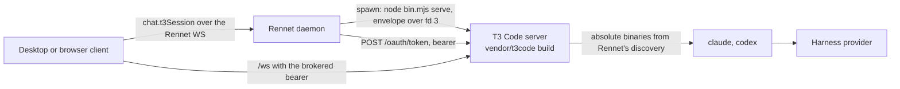
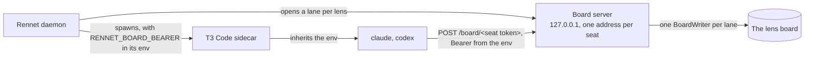

The Rennet daemon runs a T3 Code server, built from the [vendored snapshot](./t3code-vendoring.md),
as a second local process it owns. Interactive coding sessions get T3's session model
(long-lived provider processes, inline approvals, agent questions, per-turn diffs) without
Rennet re-implementing it, and without touching a T3 Code install the user may have of
their own.

## Shape



The daemon composes one supervisor per data directory and starts it at launch: composition
calls `T3SidecarSupervisor.start()`, which adopts a sidecar a previous daemon left running
or spawns one. Quitting the daemon stops it.

`start()` is synchronous and returns nothing. The bring-up runs detached, so the daemon
finishes composing, binds its listener and serves clients while the sidecar is still
coming up — and a sidecar that cannot start never fails the daemon. The supervisor is left
`degraded` with the reason (`daemon.status` carries it to the connection bar, and the chat
dock renders it), and the next `chat.t3Session` retries from scratch. A build with no
vendored bundle starts nothing at all and stays `off` until something asks, which is when
`ensure()` names the missing bundle.

The reason it is eager is time-to-first-message. Measured on an M-series laptop against
the real vendored bundle: a cold bring-up costs about 830&nbsp;ms to spawn plus the host
binary discovery it feeds the sidecar, and a review's first thread another ~46&nbsp;ms to
create. Paid at the first `chat.t3Session`, that was about a second of the reviewer
watching an empty dock; paid at launch, it overlaps everything else the daemon and the
window do, and the dock's first ask resolves in about a millisecond. A second daemon
finding the first one's sidecar alive adopts it in about 7&nbsp;ms.

## Private base directory

The sidecar's state lives under `<dataDir>/t3` (by default `~/.rennet/t3`): T3's own
`userdata` with its SQLite state, secrets, logs, and settings. It is never `~/.t3`. A
standalone T3 Code install on the same machine is neither read nor written, and the
sidecar's harness sessions use the user's normal `claude` and `codex` logins because the
provider home paths are left empty.

## Which bundle, and which process entry

Two processes run the daemon, and both must find the same bundle: `daemon-main.ts`, which
the desktop shell spawns detached, and `rennet serve`, which runs it in the foreground.
Each resolves `t3BundlePath` the same way, in this order:

1. `--t3-bundle <file>` on the command line.
2. `RENNET_T3_BUNDLE`. The packaged app sets it to `Resources/t3code/apps/server/dist/bin.mjs`
   (staged by `scripts/stage-t3-sidecar.mjs`; see `apps/desktop/PACKAGING.md`).
3. A walk up from the running bundle's own directory looking for
   `vendor/t3code/apps/server/dist/bin.mjs`. From a built checkout this finds the vendored
   build with no flag and no variable; an installed CLI is outside any checkout and finds
   nothing.

`rennet serve` had none of this until #875 — it built its `DaemonConfig` without
`t3BundlePath` at all. The daemon came up, reported healthy and served the command surface,
and then every board seat of every review it captured failed on the missing bundle, because
[a seat's only backend is this sidecar](#seats-as-threads). The desktop app was unaffected,
which is why it went unnoticed: the app worked and the CLI did not.

**A `serve` that cannot find a bundle still starts, and says so.** It writes a warning to
stderr naming the two ways to supply one and the build that produces it, and then serves.
It does not refuse: `status`, `pair`, `devices`, the browser UI and every already-captured
review need no sidecar, and taking all of them away to protect a reviewer from one
subsystem would be a lockdown rather than a fix. What was actually wrong with #875 was
never that the daemon ran — it was that nobody was told until five lanes had failed, twenty
minutes into a generation. On the wire that daemon's `t3Sidecar` reads `off`, the same
thing the desktop entry reports with no bundle.

## Spawn contract

The daemon spawns the vendored bundle with its own Node executable:

```text
node vendor/t3code/apps/server/dist/bin.mjs serve \
  --mode desktop --host 127.0.0.1 --port <free port> --no-browser \
  --base-dir <dataDir>/t3 --bootstrap-fd 3
```

T3 validates `--port` as 1 to 65535, so the daemon binds port 0 on loopback, reads the
number back, releases it, and passes that. The credential never rides on argv or in the
environment. The daemon mints a random bootstrap token and writes T3's desktop bootstrap
envelope (`mode`, `port`, `host`, `t3Home`, `desktopBootstrapToken`) as one JSON line to
file descriptor 3, which T3 reads once at startup and seeds as an unbounded 24-hour grant.

Readiness is T3's own `userdata/server-runtime.json`, which it writes only after its
listener has a real address, cross-checked on pid and port, plus a `200` from the
unauthenticated `/.well-known/t3/environment`. The daemon then exchanges the bootstrap
token at `POST /oauth/token` (form-encoded token exchange, subject type
`urn:t3:params:oauth:token-type:environment-bootstrap`) for a 30-day bearer, and stores
both tokens in `<dataDir>/t3/rennet-credentials.json` with owner-only permissions.

That readiness is sufficient for commands: T3's orchestration reactors are live before the
listener has an address, so a `thread.turn.start` dispatched the moment the sidecar reports
ready is processed, not dropped. The daemon does not wait for anything further. What a
command dispatched that early *can* meet is a refusal, described under [Seats as
threads](#seats-as-threads): the sidecar accepts the dispatch and validates the provider
request afterwards, and the answer to that is reading the refusal, not waiting longer.

Before the spawn, the daemon writes `userdata/settings.json` with the absolute `claude`
and `codex` paths Rennet's own discovery resolved, merging into whatever the user changed
through T3's settings. A daemon launched by the desktop app inherits launchd's minimal
PATH, and T3 resolves a bare `claude` on the server's PATH, so the absolute paths are
what make the sidecar's providers report ready.

The environment handed to the sidecar drops every `T3CODE_*` key the parent shell
carried and sets `T3CODE_TELEMETRY_ENABLED=false`. No relay URL and no Clerk keys are
passed, so T3 Connect is unavailable in the sidecar and nothing leaves the machine
except the harness's own provider traffic and any MCP servers the user configured.
Rennet's own board server is reached over loopback and is not egress; it is described
under [The board server](#the-board-server) below.

**The health report says so, and only once it is true.** `daemon.status` carries the
sidecar's state, its telemetry setting, and — once a board lane is actually open —
`localToolServers`: the daemon's own tool servers, each with its loopback origin and how
many boards it is serving. A reader can therefore tell a loopback tool call from egress
without inferring it. The field is absent rather than empty when nothing is serving, and
that is deliberate: a status field naming a running loopback server while none runs is a
lie in the UI, which is why the clause was left unmet until lanes were opened eagerly.
What makes the count move is one hand-over — the round runtime passes the generation's
`boards` to the drafting pipeline, which opens all five lens lanes before it dispatches a
lens seat. Without it the pipeline's lane-opening loop is unreachable, every board is
minted only when a seat first writes to it, and this field can never report anything.
This is disclosure, not a consent step: no dialog is shown.

One variable is also SET on that environment: `RENNET_BOARD_BEARER`, the daemon-minted
credential for that board server. It is set rather than inherited — a value the parent
shell happened to carry under that name is dropped like a `T3CODE_*` key — and it is the
one credential that travels by environment, because a caller-supplied MCP server names an
environment variable and the harness child reads the value out of the environment it
inherited from here. It is on no argument list.

## Claim and adoption

`<dataDir>/t3-sidecar.json` records the sidecar's pid, port, base directory, the daemon
pid that spawned it, and the vendored snapshot's upstream commit. Like `daemon.json`, it
is a claim to verify. A daemon adopts a claimed sidecar only when the well-known probe
answers, T3's runtime record agrees on pid and port, the snapshot commit matches the
bundle this daemon would spawn, and the stored bearer still opens an authenticated
route (re-exchanged from the bootstrap grant when it does not). Anything less is stale:
the claim is removed and a fresh sidecar is spawned.

The stored credentials also carry the board-server bearer, and adoption requires it. That
value is fixed in an environment already handed to running children, so an adopting daemon
cannot re-mint it — it reads it back. A sidecar spawned before the board server existed
carries no such variable and its seats could never reach a board, so it is refused for the
same reason a snapshot mismatch is, and respawned.

## Access for clients

`chat.t3Session` returns the sidecar's origin, its `/ws` URL, the bearer to open that
socket with, and the sidecar's environment id. Called with a review id, it
also binds that review's thread: one T3 project per repository (created on first use), one
thread per repository root and review id, full access, with the session's **bound workspace**
as the thread's `worktreePath`. T3 resolves a turn's cwd as `worktreePath ?? project.workspaceRoot`,
so that field is what puts every turn of the thread in the tree the session is bound to —
the reviewer's own checkout for a branch review they are standing on, a Rennet-created
worktree for a branch they are not, the detached worktree at the reviewed head for a
pull-request snapshot. The binding is persisted beside the sidecar's state and returned as
the output's `thread` field.

That field is an **arm, never an optional id**. Called with a review, `chat.t3Session`
answers `{ status: "bound", threadId, threadUrl }` or `{ status: "unavailable", reason }`;
it is absent only when the caller named no review, which is a fact about the ask rather than
about the sidecar. A failed bind does **not** reject the read: the origin, the bearer and the
environment id are good whatever the bind did, and rejecting threw them away — a healthy
sidecar with one missing workspace used to surface in the dock as "T3 Code sidecar
unavailable" and the mount never rendered at all. The reason travels instead, and the dock
prints it.

The same is true of every seat thread and of the handoff thread: they are created with the
session's bound workspace, never the project root alone, so all six lens seats, the chat and
the work order read one tree. A thread whose bound workspace no longer exists on disk is
refused with a message naming the missing path rather than created in the project root,
which is a different tree a seat would draft from happily. See
[Session-bound workspace](#session-bound-workspace) below.
The bearer is what the vendored client runtime needs. The command is loopback-only and
never remote-exposed. Clients do not read the credential file.

The review usually binds that thread before the dock ever asks. `review.capture`,
`review.openPr` and `review.regenerate` each kick the same binding — the one assembly
point, `bindReviewThread` in `dispatch/chat.ts`, so no caller can key a second thread for
the same review — fire-and-forget, so a capture never waits on the sidecar and never fails
on it. By the time a reviewer opens the dock, `chat.t3Session` reads the row that is
already there. Fire-and-forget has no caller to reject, so the catch **warns** with the
review id and the reason rather than swallowing: it is the one bind whose failure nothing
else would record.

### What the mount rests on when there is no thread yet

The mount is pinned to exactly one thread and **never navigates away from it**. Upstream's
thread route redirects to the thread list when the environment snapshot does not carry the
thread the URL names; that is right in T3 Code, where the reader navigated there and the
list is somewhere to land, and wrong inside Rennet's dock, which has no list. The redirect
fired on the first frame whenever the snapshot predated a thread the daemon had just made —
which is every session opened after the environment has already bootstrapped — and the
mount's `FollowPath` re-asserts its path only when the *path* changes, so nothing ever came
back. One frame of a race left a dead dock for the rest of the session.

So the route waits, and names which wait it is in (`resolvePinnedThreadView`, in
`packages/t3-chat/src/session.ts`):

| state | when | what the reviewer reads |
| --- | --- | --- |
| `chat` | the thread's detail or shell is here | the thread |
| `syncing` | the snapshot has not delivered it yet | *Connecting to the T3 Code sidecar…* |
| `gone` | the sidecar positively reports it **deleted** | *This review's thread is no longer in the T3 Code sidecar. Nothing is being written to it.* |

The home route is now reachable one way only — the daemon said `unavailable` — so it states
that flatly and carries the daemon's reason: *This review has no thread, and none is being
opened. Rennet could not open one: …*. It does not promise an arrival, because in that state
there is none. `gone` exists so `syncing` cannot become a permanent wait for something that
will never come.

Off a review entirely — a chat-only session, which is what a New Chat mint is until its
capture attaches — the dock renders none of this and asks the daemon nothing. It says *No
review is attached to this session, so there is no thread to open.*

## The chat slot

There is no engine choice and no second rung: the review workspace's chat slot always
renders T3's thread view for the review's bound thread, mounted natively by the host. T3's own thread top bar (project breadcrumb, new-thread, editor and GitHub openers, layout toggles) is hidden in both mounts by a rule in `packages/t3-chat/src/t3.css` keyed on the bar's `data-chat-header` hook: Rennet's frame already names the review, the branch and the diff, so the bar is workspace chrome the review does not need, and hiding it from the mount's stylesheet keeps the vendored `ChatView` unedited.

### Fitting the chat to Rennet

T3's chat is a whole workspace's UI docked inside another application, so three things about it are re-cut in `t3.css`, all of them scoped to the two mounts and none of them a vendored edit. Each leans on a `data-slot` or a CSS variable upstream already writes.

- **Corners.** T3's composer is a 22px stack (20px on its inner surface). Rennet's largest surface step is 12px and a chat box is a surface, so `composer-host`, both composer surfaces and `composer-shell`'s glass `::before` move to `--radius-surface`, with the inner surface one step down at `--radius-control`.
- **Type.** T3's rem steps sit one notch above Rennet's desktop ramp throughout, which is most of why the chat reads as a different application. Each moves down to its neighbouring Rennet size — base 16→14, sm 14→13, xs 12→11, lg 18→16, xl 20→18 — and the composer's prompt takes 13px through `--font-size-prompt`, the variable `ComposerPromptEditor` already reads. T3's own fixed px steps of 11px and below are left alone; they are already at or under Rennet's 10px floor. These are scoped *overrides* of utilities, never redefinitions: a `.text-sm` redefined in this build would win for the whole document, Rennet's own screens included.
- **The composer's context strip** — the environment, project and branch pickers on the bar under the chat box — is hidden with the thread header above it, for the same reason: the review is bound to one workspace the reader cannot switch from here. Hiding it alone is not enough, because upstream carves the composer's outline and its glass `::before` to leave a seam for the strip's corners, keyed on `data-with-context`; both clip-paths are cleared in the same rule, or the strip's absence leaves a notch bitten out of the composer for a control that is not there.

Styling a vendored app from outside it has exactly one failure mode, and it is silent: a fold renames a hook, the selector stops matching, and the composer quietly returns to 22px corners with the branch strip back under it. `packages/t3-chat/src/t3-css-hooks.test.ts` is the tripwire — it reads the real stylesheet and the real vendored source and fails when a hook the stylesheet leans on is gone. It cannot see a hook that survived on an element that *moved*; presence is checkable from a string and position is not.

### A file reference opens Rennet's Diff view

Clicking a file in the chat opens the file in **Rennet's** Diff view rather than T3's right panel, so there is one file viewer in the window instead of two. Upstream routes every such click through one action — `useRightPanelStore.openFile(ref, path, line?)` — which is the narrowest seam available and needs no vendored edit: the store is zustand, its actions live in its state, and `packages/t3-chat`'s `RouteFileOpens` swaps one with `setState` and restores it on unmount.

Rennet takes the click only when it owns the answer. The mount's `onOpenFile` prop comes from `useOpenCapturedPath` in `packages/app-ui/src/review/code-destination.tsx`, which navigates to `?view=diff&file=…` for a path in the active patchset and returns `false` for anything else — and on `false` the original T3 action runs, so a reference to a file outside the review still opens T3's own viewer rather than doing nothing. It is wired in `T3ChatDock`, which is already inside `CodeDestinationProvider` and already knows which review the route names, so both desktop entries inherit it by mounting the dock.

`@rennet/t3-chat` mounts T3's `ChatView` natively:
  the vendored web app is imported by module (both desktop Vite configs — the Electron
  renderer and the served browser tab — alias `~/` into `vendor/t3code/apps/web/src`,
  dedupe React, and define the two `import.meta.env`
  values the source reads at module scope), wrapped in T3's atom registry, toast and
  confirm hosts, and a TanStack router over memory history carrying the four routes
  `ChatView` navigates to. The sidecar is registered in T3's environment catalog as a
  bearer environment built from `chat.t3Session` (the brokered origin, the websocket
  base and the 30-day bearer); T3's client runtime then does what it does for any remote
  environment: bearer HTTP, a short-lived `wsTicket` for `/ws`, thread subscriptions.
  Each host runs the vendored app in its hosted-static mode, so no primary
  environment is ever looked for at Rennet's own origin. A second Tailwind entry
  (`packages/t3-chat/src/t3.css`, no preflight) scans only the vendored source and maps
  every T3 semantic variable onto Rennet's `--rn-*` palette; the names both kits share
  mirror `packages/theme/src/theme.css` exactly, because a utility rule is one rule for
  the whole document. The mount is a lazy chunk, fetched when a session's slot opens.
  Both `apps/desktop` entries provide the components through `T3ChatSlotProvider`;
  `app-ui` itself never imports the vendored app, and a host that provides nothing shows
  a line saying so rather than an empty box.

The slot's other caller is **the board workspace**. A review opens on its boards from the
first frame; there is no separate preparation screen and no waiting stage of any kind
between the reviewer and their boards.

- The **lens rail** (`packages/app-ui/src/board/lens-switcher.tsx`) lists all five lenses
  for the generation from the moment it starts, each carrying its seat's state — waiting,
  working, settled, failed or absent — read from the generation's lanes through
  `board/lens-seats.ts`. A running lens is selectable, never a disabled segment, and
  Flagged carries one indicator per voice because it runs two seats. The register rides
  the stop under each tab as a `data-cut` (`unstarted` / `open` / `clean` / `seamed` /
  `snapped` / `empty`), so it survives the colour being ignored — the hue says which lens
  this is, so a failed Design lane is a snapped blue stop and never a red one.
- The **seat widget** (`board/seat-widget.tsx`) sits directly above the selected board and
  names the seat writing it: its lens, its provider, how long this window has watched it,
  its `latest` line from `SessionPreparation` in the daemon's plain words, and what the
  board holds so far. Flagged shows both voices side by side, each with its own control. A
  failed seat shows its failure in place. When the lane settles the widget collapses to a
  one-line receipt, which is still the way back into the seat's transcript.
- The **workspace header** (`board/workspace-header.tsx`) reports capture over the boards
  — its two named beats and its cancel — and carries the generation-wide retry. Once
  nothing is being prepared it renders nothing.
- The **board itself** renders each element as the seat writes it, through the same
  per-lens `board.read` seam the settled workspace uses. While the lane is unsettled the
  board says so in three independent ways: the rail entry shows its seat working, the
  board header carries an `in progress` mark and states that the board is still being
  written, and the last row is a placeholder saying where the next element lands. All
  three clear together at settle, and the round-delta marks are withheld until then — a
  partial board would mark every section new. Nothing navigates: the drafting view and the
  finished view are the same view at the same route.

The board region is its own primary scroller (`chrome-scroll-clearance min-h-0 flex-1
overflow-y-auto`, the repo-wide idiom), because the outlet is a flex column inside a
`fixed inset-0 overflow-hidden` shell and a surface that does not declare it is simply
clipped at the fold, and a board on a ninety-five-file change is far taller than a pane.
A session whose review does not exist yet (capture is still running, so there is no board
to read) takes `app/preparing-workspace.tsx`, which is the same board view with an empty
review id: the rail still lists five lenses, all waiting.

The mount's environment registration persists in each host's IndexedDB under T3's
catalog (the same store T3's hosted app uses for paired machines), keyed by one stable
connection id, so a refreshed bearer replaces the entry rather than adding one.

### Reading a lens seat's transcript

The mount provides two views, not one, and the slot shows whichever the workspace asked
for. `T3NativeChat` is the review's own bound thread with its composer. `T3ThreadView`
is any other thread on the same sidecar environment — in practice a lens seat's, since
every board seat runs as its own thread — mounted read-only: the same providers, the
same routes and the same `ChatView`, with the initial route built from the `{
environmentId, threadId }` ref the lane carries rather than from the session. Both
register the same bearer environment under the same connection id, so opening a
transcript adds no connection.

Read-only is one CSS rule. `t3.css` hides `[data-chat-composer-overlay]` — upstream's own
attribute on the whole input bar — inside `[data-slot="t3-thread-view"]`, which also
zeroes the clearance `ChatView` measures from that element, so the timeline runs to the
bottom instead of reserving a gap. No vendored file is edited and there is no
`PATCHES.md` row; a Tailwind class string would not have survived a fold. It is not a
gate either: it hides a composer that would otherwise start a turn on a seat's thread,
which is confusing rather than dangerous.

**The transcript never takes the chat slot** (#823). The chat dock shows the session's own
thread in every state of every lane, and there is no control anywhere that points it
elsewhere; `T3ThreadView` is mounted a SECOND time instead, by the board region's own
transcript drawer (`packages/app-ui/src/board/seat-transcript-drawer.tsx`). Rai, 2026-09-04:
*"we take over the orchestrator's chat with the lens agent's chat thread.. thats a big nono
and should be removed or reworked. i'd want a right sidebar or something or a drawer or
something like that, but the orchestrator chat should always be there."*

The workspace opens one by writing a seat's ref into the store
(`uiActions.openSeatTranscript({ reviewId, lens, seat, thread })`) from the seat widget —
Flagged offers two controls, one per voice — and the drawer renders `T3ThreadView`
read-only, right-aligned inside the board region. The drawer and the diff view share one
slot: opening the diff closes the transcript. Selecting another lens moves the board, the
widget and the transcript together, so the three cannot describe different lenses. Below the
board region's minimum width the drawer takes the whole region, and it never touches the
dock, which is mounted outside the outlet entirely. The transcript keeps streaming while the
seat runs — that is upstream's thread subscription, nothing Rennet drives — and stays
readable after the seat settles and after the boards reveal.

Measured on 2026-09-03 (renderer production build, raw bytes before gzip): the chunks
loaded at startup grew from 1,822 KB to 1,846 KB, the lazy T3 payload is 3,122 KB of
script plus a 380 KB stylesheet, and the on-disk renderer grew from 2.4 MB to 21.6 MB
because `@pierre/diffs` splits every Shiki grammar into its own on-demand chunk and
`heic-to` (2.9 MB, loaded only when a HEIC image is attached) rides along.

## Seats as threads

Every board seat of a review generation — Design, Sequence, Decisions, both Flagged seats,
Noise, and the round report — runs as one persistent thread in this sidecar, on the
review's checkout. That is the only way a board seat runs: the ephemeral Claude and Codex
board legs are deleted, so a generation with no sidecar drafts no board and says why. The
binding is
`(repository root, generation id, seat)` in the same `thread-bindings.json` as the session
bindings, and the thread's title names the branch and the lens (`feat/x — Design`), so the
sidecar's own thread list reads sensibly. Two repositories in one workspace on the same
branch get two threads, because the key starts at the checkout and never at a project id.

The council still routes each seat: a Claude seat is a thread on T3's `claudeAgent`
instance at the council's model, a Codex seat one on `codex`. Flagged runs both, on two
threads. A lane holds its seats in provider order — Claude first, Codex second, never the
order the two threads happened to bind in — so the lane's own `thread` and `latest` always
mirror the Claude seat, and the rail and the widget list the two voices the same way on
every run.

Three things follow from the thread being persistent.

- **A repair is the next turn, not a new session.** When a draft fails lint, the seat is
  sent `renderRepairTurn(pointers, frozenIds)` from `@rennet/prompts`: the lint pointers,
  the frozen element ids, and the instruction. The base drafting prompt and the failing
  draft are already in the conversation, so neither is re-sent. Measured on the repair
  fixture in `lens-pipeline.test.ts` against the shipped Flagged prompt, a repair turn
  fell from 7,107 bytes to 469 — the base prompt is 6,359 of the bytes that no longer
  travel, and a production base prompt is larger than the fixture's, so the real
  saving is larger. Both interpolations declare a byte bound with an honest omission
  marker. Every turn leg — this T3 turn and the ephemeral Claude and Codex legs that still
  serve the utility jobs — measures the prompt it actually sends for inline context (every
  JSON literal and fenced block, summed) and stamps the total on the turn metric beside its
  tokens when it is over 2,048 bytes, so a payload that crept back into a prompt is
  visible in the same sink as the spend it caused. The scan crosses newlines, so a
  pretty-printed `JSON.stringify(value, null, 2)` payload — the shape the harness rules
  forbid — is measured in full rather than summing to nothing; a `{` in prose that never
  closes is abandoned at its opener and the scan resumes, so it cannot swallow the
  literal after it. The measurement reaches the metric even when the turn THREW after its
  prompt was sent: those tokens are spent and there is no frame to read, which is exactly
  when recording nothing would hide the spend. The one-off utility turns behind a command
  — the delta digest, refine-comment, PR-body, review-opener and handoff-compose seats —
  drive `codex exec` rather than a session; their executor is wrapped once at composition
  so each of those sends records a `TurnMetric` too, labelled with its job. They belong to
  no generation, so that metric lands in the daemon log rather than a durable `usage`
  record.
- **The output schema is the turn's contract, once.** `startTurn` takes an `outputSchema`
  and T3 attaches it to the turn; it is never restated in prompt text. A settled turn's
  structured result, duration, usage and cost come back on a `turn.settled` activity the
  sidecar appends to the thread, which `waitForTurnSettled` reads. A Claude turn that
  settles without structured output is an honest turn failure, not a guess at the final
  message. Codex is the documented exception: T3 forwards the schema to Codex as
  `V2TurnStartParams.outputSchema`, but its runtime does not surface a settled turn's
  structured result, so the daemon parses the board out of the Codex seat's final message
  — for that provider only.
- **A turn carries the MCP servers its caller gives it, and names their credentials
  rather than carrying them.** `startTurn` also takes an `mcpServers` record of
  `name → { url, bearerTokenEnvVar? }`, on the same seam and in the same shape as the
  output schema: the two `thread.turn.start` command shapes, the
  `thread.turn-start-requested` payload, and both provider inputs. **The field names an
  environment variable; it never carries a token.** That is the only shape that can be
  true here, because a command is written to the sidecar's event store and replayed from
  it, and because Claude's SDK serialises its entire MCP option into one
  `--mcp-config <json>` argument — a token placed here would be both a durable database
  row and a string on a child process's command line. The daemon puts the secret in the
  sidecar's environment, which the harness child inherits, and names it on the turn:
  Codex reads the name as `bearer_token_env_var`, and `claude` expands `${VAR}` when it
  resolves an MCP header, so only the name is ever serialised. Server names must be TOML
  bare keys, because Codex writes them into a dotted config path where a dot silently
  becomes a nested table.

  The guarantee is about that field and no other: `url` is any trimmed string, so a caller
  that puts a token in a query parameter has put it in the event store and on the argument
  list. The dedicated credential field is the one that cannot carry a secret.

  The adapters MERGE these with whatever the sidecar configured for that thread and with
  whatever the user configured for the provider — nothing is substituted, and
  `strictMcpConfig` stays unset. A NAME COLLISION IS REFUSED rather than resolved: a
  caller server under a name the sidecar owns, or under a name the user's own Codex config
  already declares, fails the session start naming the server. That is the cheap correct
  answer rather than a restriction. Codex's `-c` is a deep merge into the user's config at
  every depth and nothing detaches a same-named server from theirs — not a leaf override,
  not an inline table, not replacing the whole `mcp_servers` table (verified against
  codex-cli 0.148.0) — so two servers sharing a name trade credentials and headers, and
  a caller endpoint receives the user's `X-Ambient-Secret` along with its own bearer.
  Nobody asked for their own server to be merged into ours, the caller mints its own
  names, and a collision is a visible config quirk with a one-word fix.

  Both providers fix their MCP configuration when the session process is created, exactly
  as Claude fixes `outputFormat` at `query()` construction, so the thread's FIRST turn
  decides the set and a later turn asking for a different one is refused with the names it
  disagrees on rather than run against the wrong tools. A same-name server pointed at a
  new endpoint, or reading a new credential variable, counts as a different server: the
  session was opened against the old one and cannot serve the new one. Nothing is filtered
  out of the caller's set on the way in, because a session that stored one set and
  compared another rejected the very turn it had just been opened for.

  Whether the sidecar's own browser server is attached now travels as an explicit fact
  (`sidecarMcpServerConfigured`) rather than being read back off the argument list.
  `hasConfiguredMcpServer` still answers the tool-catalog reload for any inline server,
  but it cannot answer the browser question, because a caller can name its own server
  `t3-code` and a name is not provenance — and a Codex prompt describing browser tools the
  session does not have is a lie in the prompt.

  A caller server that declares no credential gets no credential key written at all. An
  empty `bearer_token_env_var` was tried and is worse than nothing: Codex then expects a
  bearer it can never resolve, and against a real local MCP server that is zero requests
  where omitting the key handshakes normally.

  Nothing supplies a server yet — the field is carried, and the daemon's own board server
  is the next change.
- **Spend is per turn, and it is a delta read off the thread.** Claude's SDK reports usage
  cumulatively over a streaming session's turns, so the seat leg records each turn's own
  usage as the difference against the previous settled turn's total — which
  `waitForTurnSettled` reads from the thread's own earlier `turn.settled` activity, so a
  runner recreated for the thread (a whole-board restart) or a daemon restarted under it
  subtracts the same as one that watched every turn. A total below the previous one means
  the session restarted and its counter began again, and the whole figure is the turn's.
  Codex reports nothing on its settlement: its tokens ride T3's `context-window.updated`
  snapshot for the turn, which is the last request's own figures (a turn with several
  tool round-trips under-reports until T3 projects the running total's breakdown). One
  `TurnMetric` per turn reaches the generation's collector, labelled `board.<jobId>`, with
  the provider's own duration when it reported one; a repair therefore never bills the
  drafting turn twice.
- **A cancelled seat stops the model.** An abort reaches the sidecar as
  `thread.turn.interrupt`, and the seat leg then waits a bounded moment for the interrupted
  settlement so the usage that turn had already billed is recorded rather than booked as
  zero. Each wait is scoped to the start it belongs to: `startTurn` returns what the thread
  showed before dispatch, and the wait ignores that earlier turn's settlement and any
  session error recorded before the request, because T3 only flips `latestTurn` to running
  once the provider reports the new turn.
- **A seat whose turn never registers settles as a failure, on a clock.** A provider
  stream that dies before its turn exists leaves the session stopped or errored with
  `lastError` and no turn row, and T3 emits no turn lifecycle for it; the wait settles
  that as a failed turn carrying the session error. A session that simply stays `ready`
  with no turn row and no stream item at all is given two minutes by a timer that runs
  independently of the stream, then the wait gives up naming the session state. The timer
  is not checked behind the next stream item, because a silent stream has none. The start
  itself is held to the same bound: the pre-read and the `thread.turn.start` dispatch race
  the seat's abort signal and a two-minute deadline, so a sidecar whose socket is up but
  whose command handling has stalled releases the seat with a reason instead of holding it
  on an RPC that never answers.
- **A turn the sidecar refuses after accepting it settles at once, on the refusal.** T3
  accepts `thread.turn.start` at the socket and validates the provider request later, on
  its reactor's fiber; a refusal there — `ProviderService.sendTurn` rejecting an input over
  its cap, a message it cannot find, an adapter that will not take the request — is
  recorded as a `provider.turn.start.failed` activity with no turn id, beside a session
  `error` that the session start it had just kicked off overwrites with `ready` a moment
  later. So the dispatch resolves, the session reads healthy with no `lastError`, and no
  turn row ever appears (the Design seat, drive 1.6, both runs). The wait reads the
  activity: one stamped at or after its request settles the turn as failed, carrying the
  sidecar's own message with its stack frames dropped, instead of the two-minute timeout.
- **The prompt fits the transport.** T3 caps a turn's input at
  `PROVIDER_SEND_TURN_MAX_INPUT_CHARS` (120,000 characters), exported through the seam as
  `T3_TURN_INPUT_MAX_CHARS`. On the drive of 2026-09-03 the Design prompt was 241,848
  characters — 103k of hunk inventory plus a 126k design-artifact bundle — while the five
  bundle-less seats sat at 110k and ran. Both payloads are gone: citations by path and
  line removed the inventory, and the Design seat now finds the specification itself in
  the checkout instead of being handed one (session-bound-workspace D5, D6). No seat
  interpolates a bundle, so nothing needs re-fitting to the cap.

Because the SDK fixes `outputFormat` when a query is constructed and offers no in-session
setter, a *live* session's contract is decided by the turn that started it. A later turn
asking for a different schema is refused by name rather than answered in the wrong shape;
Rennet never sends one, since a seat drafts and repairs against a single board schema. A
turn whose session is gone is a different case and starts a new one on the turn's own
schema — including the session T3 recovers from a persisted resume cursor, which is the
path a seat takes when its first turn killed the provider.

The seam is two functions. `packages/adapters/src/t3-seat-turn.ts` builds the seat's
`runTurn` and knows nothing about `effect`; `create-server.ts` fills it from the
supervisor.

**T3 is a board seat's only backend, structurally.** A daemon that cannot bring the sidecar
up — no vendored bundle, a spawn failure — answers with the reason instead of a runtime, and
every board seat of that generation fails as `T3 sidecar unavailable: <detail>`, which the
seat widget speaks in that lens's own voice. A caller that composed no sidecar at all
fails the same way, naming that instead. There is nothing to fall back to: the board
pipeline holds no harness port, and `councilSeatTurn` refuses a board job without a seam
before it reaches either ephemeral leg. Those legs still run every non-board job — the
project scout, the repo map, the delta digest, the compose turn — but a lens drafted on one
would have no thread, no transcript, no live line and no same-thread repair, and nothing on
screen would say so.

The **Flagged lane still holds two seats**, Claude and Codex, both of them sidecar threads:
`t3-seat-turn.ts` binds a thread with `provider: "claudeAgent" | "codex"` through T3's model
selection, so cross-model concurrence survives the deletion intact. What decides whether
each seat can run is the council's installed-harness answer plus the seam — never a port the
pipeline holds. With only one harness installed the lane degrades to a single seat and says
so, exactly as before.

One consequence worth naming: the round-report classifier's raw-response caps
(`outputByteCap`, `outputTokenCap`) were enforced by the ephemeral legs at their own
transport boundary, and T3's `startTurn` has no equivalent knob. They no longer travel. The
report's shape is bounded by its output schema and its evidence manifest by
`ROUND_EVIDENCE_MANIFEST_MAX_BYTES`; nothing pretends a response-size cap is applied when
it is not.

**Archiving a session is how threads are pruned, and it is a deletion boundary.** Transcripts
are the product while a review is live, so nothing expires on a timer; `session.archive` is
the act that ends them. Archiving first ABORTS AND AWAITS the session's own preparation —
anything still able to bind a thread has to be finished before the sweep, or a seat mid-flight
binds a fresh thread behind it and the archive leaves exactly the orphan it exists to prevent.
Then, once the archive has persisted, one serialized sweep deletes the session's own thread,
every seat thread its generations left behind, and every round thread its dispatches created
(`thread.delete` over RPC), and drops those bindings. Un-archiving restores nothing — the next use creates fresh threads.

A round in flight is covered too, from the other side. A round is driven by the durable
round coordinator, takes no abort signal and is not waited on, so a returned generation
drafting through an archive would bind its five seat threads after the sweep had passed.
Instead of cancelling it, the round re-runs the identical sweep on its way out whenever
the session it drafted for is archived by then — idempotent, and no sidecar call at all
for the ordinary live session.

A sidecar that is off still leaves the bindings dropped, because a binding pointing at a
thread nobody can reach is worse than none, and neither an off sidecar nor a thread it no
longer has may fail the archive. The handle is not thrown away with the binding, though: a
thread whose delete failed moves to `pendingDeletions` in the same bindings file — out of the
live bindings, so an un-archived session still gets a fresh thread — and is retried on the
next sweep or the next successful `ensure`, up to five attempts, after which a thread the
sidecar genuinely lost stops pinning the list.

The sweep is keyed on the session and review ids rather than on a repository
root: a session's own thread is bound under the review id and its seat threads under the
session id, so a root-scoped sweep would leave every seat thread behind. Seat rows written before the owner field
existed carry no session id and are matched by nothing — silence never sweeps.

Ten vendored files carry this: the three contract modules that gained `outputSchema` /
`structuredOutput`, the decider and the provider command reactor that thread it, the
Claude and Codex adapters that hand it to their runtimes, the provider service that
carries the turn's schema into a session it recovers, and the runtime-ingestion layer
that projects the `turn.settled` activity. Each has its row in `vendor/t3code/PATCHES.md`,
all upstreamable.

The per-turn `mcpServers` seam widens that surface by little, because it sits mostly on the
same files: the two contract modules, the decider, the provider command reactor, the
provider service, and the two adapters, plus the Codex session runtime for the provenance
option, six test files and the scripted app-server fixture. `McpProviderSession` is
untouched — the caller's servers ride alongside it and merge at the adapter, so a session
re-prepare (runtime mode, cwd, model) cannot clobber them and turning off agent browser
access cannot clear them.

**A dead `claude` must not take the sidecar with it.** The SDK's process transport writes
the prompt to the child's stdin and never listens for that socket's `error` event, so a
`claude` that dies before the first write — a bad install, an immediate auth failure —
raised an unhandled `write EPIPE` that killed the whole server process and every other
seat's thread with it. The Claude adapter now spawns the child through the SDK's
`spawnClaudeCodeProcess` hook and handles that error, terminating a child whose transport
is broken so the failure arrives on the query stream, where the session settles the turn
as failed like any other runtime failure. One thing that crash was hiding is still open:
when the write loses that race against a `claude` that exits immediately, the turn can be
left unsettled instead — about one run in ten against a stand-in that exits at once. The
sidecar now survives it, so the blast radius is one thread rather than every seat, but a
turn that never settles is its own defect and is not fixed here.

## The board server

A lens seat writes its board by CALLING TOOLS, and the tools live on a second listener the
daemon owns: an HTTP MCP server bound to `127.0.0.1`, with one address per seat
(`lens-board-tools` D8). It is not mounted inside the sidecar's own `/mcp`, whose comment
records that it sits outside T3's environment auth stack; this one is Rennet's, and its only
client is a harness child on the same machine. The listener starts when a generation opens
its first board lane, and a daemon that never drafts a board binds no port.



**The address names the board, and that is all it does.** A seat writes its own board
because that is what its endpoint is for, exactly as a file handle names a file. Nothing
is being withheld from a seat and nothing here is a consent step. Flagged's two seats get
TWO addresses onto ONE board: one lane, one writer, one element list, two voices, one mint
counter — which is why the ids the two are handed cannot collide, and why either voice can
cite an element the other created.

**A seat's credential has two halves, and the seam decides that it must.** A caller-supplied
MCP server carries the NAME of an environment variable and never a value, and the harness
child reads that variable out of the environment it inherited from the sidecar — so a
variable's value is fixed for the sidecar's life and cannot be per seat, while a value
delivered any other way is on the child's argument list. Therefore:

- The **seat token** is per seat: HMAC-SHA256 of the sidecar's own 32-byte secret over the
  generation, the board and the seat, of which only the SHA-256 is held in the live
  registry, revoked the moment its lane settles. It travels in the address path, which is
  on the harness child's argument list, because a url is.
- The **process bearer** is the sidecar's: placed in its environment as
  `RENNET_BOARD_BEARER`, and on no argument list, because only the variable's name is ever
  serialised. It is read from whatever sidecar is running at the moment of the call, never
  captured once — the sidecar respawns within one daemon's life, and a listener holding a
  dead sidecar's bearer would refuse every later seat while it ran and billed.

Both are required on every call, so reading `ps` yields an address and not access, and a
lane that settles stops its seats writing at once rather than at the end of a window.

Two consequences worth stating rather than leaving implicit. The seat token rides the turn
command the sidecar **persists**, so a per-seat secret does land in a durable event row;
eager revocation is what answers that, because a token replayed after its lane settled
reaches nothing. And the token is **derived rather than randomly minted** because a seat's
address has to be reproducible: both providers fix a session's MCP configuration when the
harness child is created, so a url that moved under a live session — after a daemon restart
beneath a surviving sidecar, or when a settled lane is re-opened for a retry — is refused by
the adapter as a mismatch. For the same reason the listener remembers the port it bound, in
`board-server.json` beside the sidecar's own state, and the daemon reuses a recorded bearer
when it respawns a sidecar on the same base dir rather than rotating it.

**The protocol is MCP over Streamable HTTP, hand-rolled**: `initialize`,
`notifications/initialized`, `tools/list`, `tools/call`, `ping`. Requests are answered as
`application/json`, which the transport permits in place of an SSE stream, and no
`Mcp-Session-Id` is issued, because session management is optional and the address already
identifies the seat. `GET` — the server-to-client stream — is answered `405`, which the
transport also permits. A tool REFUSAL comes back as a tool result marked `isError`, never
as a JSON-RPC error: the seat reads it and fixes the call inside the same turn, and a
protocol error would never reach it as words it can act on.

Every served `inputSchema` has its top-level `$schema`/`$id` stamps dropped through the
same `normalizeOutputSchema` choke point Rennet's own adapter routes provider-bound schemas
through. It matters more here than there: an MCP `inputSchema` is carried by the harness
child into the provider's tool definitions with nothing on that path to strip it, and a
meta declaration a validator does not recognise is what #810 was — a schema refused before
the turn ran. The schema body is untouched.

The tools themselves are derived per lens from the kind tables
(`packages/protocol/src/board/tool-schemas.ts`) and applied by the board writer
(`packages/core/src/board/board-writer.ts`). Measured 2026-09-05, the served tool surface is
8,005 B (Sequence) to 12,892 B (Design) per seat, against the output schema it is on course
to replace in the next group — 9,618 B as a Claude seat receives it, 9,640 B for Design's
board-or-absence shape, and 10,874 B for the Flagged Codex seat, whose schema is
`sanitizeSchemaForCodex`'d on the way out. Both figures are taken from the modules that
ship them, not rebuilt for the measurement. Across one generation's seven seats — Flagged
counted twice — that is **65,633 B of tools against 68,604 B of schema, 4.3% less**; Design
is the one seat that costs more than it saves, at 1.34x, because it authors two typed kinds
no other lens does. `board-tool-surface.measure.test.ts` prints this table on every run and
asserts the aggregate at parity, so re-run it rather than reading a figure that has moved:
after #869 it reads 65,081 B against 68,582 B.

**One seat is given a verb the others are not: Noise's `write_board`**, which carries every
call the seat would otherwise have made, applies them in order through the same tools and
the same boundary tier, and finishes the board. The payload is one flat `string` scalar, so
the API never sees the board's tree and #810's class is unconstructible through this door
rather than merely absent; the host parses it after the call and answers **in-turn**, with
the same refusals and the same finish pointers, so a rejected board costs a few hundred
bytes of tool result rather than a whole repair turn. A payload names an element it creates
with `local_id` and uses that name wherever an id goes.

It is Noise-only because batching pays when the writing is bulk and costs when it is
thought: the Noise seat groups host-placed members it did not choose (961 calls and 317.8 s
on the 95-file drive, both read from that drive's own record; the `4 calls and 108.7 s`
after the change was reported by the #878 spike and has no surviving data behind it, so it
is a claim rather than a measurement), and the four reasoning lenses were measured
slightly slower with the verb. The scoping is derived from the host-derived membership table
(`writesWholeBoard`), and it costs the Noise seat 486 B of tool surface once per session and
every other seat nothing.

A refused entry does not roll the batch back — one bad entry in a hundred would otherwise
cost the seat the whole payload again, which is the round-trip cost the verb exists to
remove. What it does instead is report a **cascade as a cascade**: an entry naming an id an
earlier refused entry would have created is not applied at all, and its refusal carries the
position of the entry that actually failed, at any depth. Applying it would send a local name
to the boundary tier and come back "This board holds no `sec-cap-lbd`" — true, useless, and
indistinguishable from an invented id, which is how one refused `add_section` became eight
refusal sentences on the spike's drive. Every list the result renders is bounded, and so is
every payload-supplied name it quotes back: a tool result is billed like a prompt and gets
the same byte discipline (#871).

### The board's element stream

The board reaches the reviewer as it is written, not only when it settles. Every write the
board writer ACCEPTS reaches an observer the lane was opened with, and that observer
publishes one `lensDraft` frame per call, keyed by review. What travels is the write: the
elements that call touched and the index each holds, the ids it removed, the document when
it set one. A whole-board snapshot per call would be quadratic in the board's own size.

Four kinds of frame. `opened` when the lane creates its empty board — before any seat thread
exists, and also the reset marker, so a re-drafted board starts a reader from nothing.
`elements` for a write. `state` when the board's own settlement moves (`drafting`,
`settled`, `absent`). `closed` when the lane settles, carrying how the board finally stood —
which on a failed lane is still `drafting`, because the lane's own status is what says
whether the LANE succeeded and restating it here would be one fact with two sources.

Every frame carries its generation and a revision monotonic within `(generation, lens)`. The
generation is the load-bearing half: a superseded drafting attempt owns a different one, so
a reader rendering the live generation drops its frames rather than merging two attempts'
boards. A refused call publishes nothing — the seat reads the refusal and fixes it inside
the same turn — and a `finish` that came back with pointers publishes nothing either,
because the board did not move.

One lane can have more than one watcher, and it really does. Nothing deletes a lane —
settling one revokes its seats and keeps its writer — and a generation id is
`gen:<patchsetId>` over a content-addressed patchset, which is global across sessions and
reviews. So a lane re-opened for a retry, or opened a second time by another review of
identical content, hands back the board that is already there. The lane therefore keeps a
SET of observers and every opener hears every write, and the `opened` frame carries the
board the lane HOLDS rather than claiming an empty one. Binding a single observer at the
writer's construction left the second reviewer watching a board that opened, never filled
and closed; claiming an empty board left every later element's index — computed against the
board's own list — pointing past the end of the reader's copy.

The frames are live only. A reader that joins mid-draft takes `board.draft` for the board as
it stands plus the revision it is current with, and folds from exactly there. The hub keeps
a closed board rather than dropping it, because a lane that FAILED persisted no board at all
and the elements its seat did write would otherwise be readable only by whoever happened to
be watching; the record leaves when the review's next generation opens a lane, which bounds
the hub to five boards per review.

The durable copy is still written whole, at settle, through the whiteboard. A drafting
element carries no patchset stamp and no round-delta mark — both are stamped where the board
is persisted, and the marks are withheld until the lane settles — so the stream is the live
view and the whiteboard is the durable one, neither pretending to be the other.

## The live line on a lane

While a seat's lane runs, the daemon holds one subscription to that seat's thread and
publishes what the seat is doing through the lane. `packages/server/src/t3/latest-event.ts`
is the projector: a pure function from a thread projection to the protocol's `LaneLatest`.
A tool call in flight becomes plain words naming what it is acting on — `reading
src/foo.ts`, `running git diff --stat`, `editing a.ts`, `searching createSession` — a tool
with no plain word for it keeps T3's own detail rather than being given an invented verb,
and assistant prose becomes its last sentence. Every line is capped at 120 characters with
an honest `…`.

A line is the seat's SPEECH, so the call's JSON input never becomes one. A structured-output
call — the seat handing its board back — reads `returning the board`; an unrecognised tool
whose detail is its own JSON input reads as the tool's name; a detail that is nothing but a
payload falls back to T3's summary, and contributes no line at all when the summary is a
payload too, leaving the seat's own prose to speak. A known verb whose subject is a JSON blob
keeps the verb alone (`reading`), which is also what a call still streaming its
`input_json_delta` reads as until the input closes.

A call onto the seat's own board is read as a RECEIPT rather than as a status, and it is the
one arm ahead of everything above. `add_step` reads `added step 3`, `cite` reads ``cited
`src/foo.ts:41-58` ``, `finish` reads `finished the board` or `finish returned 1 pointer`,
`write_board` reads `wrote the board — 615 elements` or `wrote 123, 16 refused`, and a
refusal reads the sentence the board wrote to be read. `write_board`'s line is read off
Rennet's own result sentence for exactly the reason `finish`'s is: its input is a whole
board as JSON, which is the one thing this line must never show (#819). Nothing in a board
call's input
reaches the line except the two fields that are addresses rather than payload — a citation's
path and the element id a revision or a removal names. `packages/server/src/t3/board-receipt.ts`
owns it, and the tool table it recognises is derived from the same `boardToolsByName` the
served catalog is built from, so a verb added to a lens appears here with nothing edited. A
call is read as a board call only when the tool name carries this daemon's own server name:
a seat inherits the user's own MCP servers, and a bare `finish` from somebody else's must
not read as this board settling.

A board call also keeps speaking after it has finished, which every other tool does not. The
daemon answers one in microseconds, so its in-flight window is invisible to a reviewer; what
they want from the line is not what the seat is waiting on but what it just put on the
board. The ordinal in `added step 3` is the seat's own count of that verb within the turn,
grouped by the runtime's call id so one call's three lifecycle rows share one number — and
omitted entirely when the activity carries no call id, because a number derived from rows
would be wrong and would look right.

A tool call is only "in flight" until it finishes. T3 emits started, updated and completed
tool activities with the same `tool` tone, so the projector reads the lifecycle — the
activity's `kind` and the runtime's item status — and a completed, failed or denied call
falls back to whatever the seat is saying instead of freezing the lane on a read that is
over. When nothing new has arrived for twenty seconds the line becomes `idle` and says how
long it has been quiet, counted in ten-second steps: the lane's line is republished by
re-sending the whole preparation snapshot, and a one-second counter would push five
snapshots a second to change one digit.

`t3/seat-progress.ts` holds the subscription. Thread events do not carry the whole
projection, so a re-read is an RPC and is throttled to at most four publications a second
per lane. The throttle is TRAILING: events inside a busy window are deferred to one read at
the end of it, never dropped, so the last thing a seat did before going quiet is what the
lane shows. The read throttle keeps its own clock, separate from the publish one — a
re-read that produces an unchanged line publishes nothing, and keying the read on the
publish time made a run of identical events re-read the thread on every one of them. The
idle tick re-projects the last snapshot against a fresh clock and costs no RPC at all. A
publish that throws (the lane store or its persistence refusing the line) is contained in
the watcher and reported through its error sink, because that publish also runs from the
idle interval and the trailing timer, where an uncaught throw is a daemon crash.

A lane holds one entry per seat (`LensLane.seats`: seat id, provider, thread, latest
line), addressed by seat id, because Flagged runs a Claude seat and a Codex seat on one
lane and each has its own transcript and its own line. The lane's top-level `thread` and
`latest` mirror the first seat to register (`seats[0]`) so pre-seats readers keep working
for one release. A seat's thread is recorded from the moment it exists and kept through
every later state, so a settled or failed reader still opens its transcripts. The
subscription is dropped when THAT LANE settles — not when the generation does, so the
seats that finish first stop costing a socket and an idle tick while the slowest lens
runs on.

## Session-bound workspace

A session binds to exactly **one** workspace when it is created, and keeps it for its whole
life. Which one is decided from the review target, once:

| Review target | Bound workspace |
| --- | --- |
| A branch some worktree of the repository already has checked out (usually the reviewer's own) | that checkout — nothing is created |
| A branch nothing has checked out | a Rennet-created worktree at `~/.rennet/worktrees/<repoKey>/<branch>`, with the branch checked out |
| A pull-request snapshot | the detached worktree at the reviewed head, the one the pull-request front door already indexes |

"Some worktree already has it out" is asked of `git worktree list`, not assumed: git refuses
`worktree add` for a branch checked out elsewhere, so binding blind would fail on exactly the
tree that should have been bound to. Git answers in **its** spelling, which for a WSL project
driven from a Windows host is the distro's (`/home/u/repo`), so the answer is re-spelled into
the one the daemon addresses the repository by before it becomes `boundRoot`.

A workspace that cannot be created **fails the bind** rather than falling back to the clone.
The clone sits on whatever ref it sits on — usually the default branch — so a recorded fallback
would run every later turn of the session against a tree the review is not about. Nothing is
recorded, and the next use retries.

The decision is recorded as `boundRoot` on the session record, and every later read is that
field. A session with none — minted before the binding existed, or one whose first bind threw —
**binds on the next use and records it**: `holdingReviewContext`, which every review-scoped turn
already passes through, and the review-keyed read the chat and handoff threads are created from
both bind before they answer. That is what makes "the next use retries" real rather than a
sentence: a synchronous read of the empty field would answer the clone, and a thread's cwd is
fixed at creation, so answering the clone once leaves a thread in the wrong tree for its life.

When git names a directory Rennet already has a name for — the repository itself, or the
worktree Rennet created — **Rennet's own spelling wins**. `git worktree list` prints a realpath,
and a `boundRoot` that differs from the previous one by spelling alone reads downstream as "this
session moved", which retires the session's threads and re-keys the new ones.

Nothing re-decides a binding — but a pull-request binding is **re-pinned**
on every read, because it is a detached checkout and a landed round advances the reviewed head;
`ensurePrWorktree` replaces the checkout at the same path, so the recorded root does not move.

The session's children run there because the thread's `worktreePath` and the turn's `cwd` are
both that root: the six lens seats, the chat thread, the handoff thread and every cold utility
turn (scout, repo map, delta digest, opener, pull-request body, refine, CI classification,
finding verification). The coding round runs in that root too, and its worker commits on the
session's branch there — but on a thread of its own (see [Rounds as threads](#rounds-as-threads)
below), not the one the chat and handoff share.

On WSL the bound root reaches the child as `wsl.exe --cd <distro path>`: the adapter bakes that
argument at construction and `transportCwd` wins over a session's `cwd`, so a harness is
resolved from the **turn root**, never from the repository root, or the cwd is silently ignored.

A thread's cwd is fixed when the thread is created, so a binding row records the workspace it
was created with, and the workspace is half the binding KEY — which is what puts the chat and
the handoff on ONE thread (the round gets its own, keyed on its operation, below). A row keyed on the repository while a workspace is
being asked for is superseded: it carries no workspace (written before this wave) or the clone
root (written by a read that preceded any bind), and either way its thread is rooted in the
wrong tree. It is moved to the sidecar's pending deletions, so the existing sweep DELETES that
thread rather than leaving an orphan transcript with no handle.

The reviewer sees it: the chat header's trail names the bound workspace beside the branch, so
"which tree did the seat read" is not invisible when it is a worktree rather than their own
checkout.

Worktrees earlier versions created per round operation (`~/.rennet/round-worktrees/`) and per
review (`~/.rennet/worktrees/review/`) are removed by a sweep at daemon start, which leaves any
directory a live session is bound to (compared through `realpath`, and re-read before every
removal) and logs how many it removed. Nothing creates either directory any more: two full
drives of the packaged v0.7.0 app, one of them running a coding round, produced neither at any
point (the drive below watched for both every two seconds and never saw one).

## The handoff exit

"Hand to coding agent" dispatches the composed work order as one turn on the review's
bound thread, full access, cwd the session's bound workspace. The daemon waits for the turn to settle,
reads T3's checkpoint diff for that turn, and returns a final text, a unified diff and
the files touched — or a failure reason from T3's session. `review.handoff.run` then
recaptures the checkout and offers the delta re-review exactly as before. There is no
second engine to fall back to.

## Rounds as threads

A coding **round** does not run on that thread. It gets one of its own, bound to
`(repository root, session id, operation id)` — a third binding kind beside `session` and
`seat` — created with the session's bound workspace as its worktree and titled
`<branch> — round <n>`. The session's chat thread is the reviewer's conversation with
Rennet; a coding agent's tool calls do not belong in the same scroll (Rai, 2026-09-04:
"we should hand off the round to a subagent not to the main orchestrator"). The key is
the **operation**, not the dispatch: a dispatch attempted while a round is live is
coalesced, and when the live round settles it is replaced by a fresh operation that keeps
the same dispatch id but takes a new operation id — so a dispatch key would put two
operations' turns on one thread. The row carries the session id in the same field a seat row does, so
archiving the session deletes the round threads with the rest, and the round account's
checkpoint names the thread so the greeting can point a reviewer at the transcript.

Reading that checkpoint **waits**. T3 writes a turn's checkpoint on the CheckpointReactor's
own fiber, after the turn's lifecycle has settled — two writes, and the settle wait returns
on the first. Issue #811: a round that had genuinely committed came back with an empty diff,
no changed paths and no checkpoint at all, while the sidecar's projection held
`checkpoint_status ready` for that exact turn. The read is now retried inside a bound, so a
projection that has not caught up is not read as a turn that did nothing.

A checkpoint also diffs the **working tree**, which a worker that committed leaves clean. So
when the checkpoint's diff is empty and the bound root's `sourceHead..HEAD` carries commits,
the round's receipt takes its diff and its changed paths from that commit range. A turn that
edited without committing keeps the checkpoint's diff and still fails.

## What a thread costs and where it is kept

Three facts about running every session's chat and every work order inside the sidecar,
stated here and on the local host card in Settings rather than beside a choice, because
there is no choice:

- Threads are persisted harness sessions, so they appear in the harness's own history.
- Their token usage is reported by T3 Code's usage view, not by Rennet's seat usage.
- T3 Code records a hidden checkpoint ref in the reviewed repository per turn. An
  ordinary push does not send it.

## Status

`daemon.status` carries a `t3Sidecar` field: `off` until something asked for it,
`starting`, `ready` with the port, or `degraded` with the reason (bundle not built,
spawn failed, exited). The field also states `telemetry: "off"` and the upstream commit
the bundle was built from. The set of RPC methods Rennet calls is checked at build time,
not at boot: the daemon-side client and the sidecar are built from the same vendored
snapshot, so a fold that removes a method fails the typecheck before it can ship.

## Measured: one generation on a 74-file branch

Task 1.6 of `t3-lens-threads`, run three times on 2026-09-03 against Rennet's own
`feat/cm-w1-import-edges` (74 files) from the packaged app with an isolated data dir, all
six seats on the sidecar, Claude seats on Opus 4.8 at high effort, Codex seats on GPT-5.6.
The numbers below are the third run (v0.6.9, the first build carrying the scoped waits of
#764), read from the generation record's `timings.phases`; the earlier runs are in the
same shape for comparison. Wall clock from branch pick to the last board was fourteen
minutes, of which the capture and scout took about ninety seconds.

| Seat | Draft (v0.6.9) | Repair (v0.6.9) | Draft (v0.6.8, run 2) |
| --- | --- | --- | --- |
| Noise (Codex, low) | 62 s | 11 s | 66 s |
| Flagged / Codex (high) | 310 s | 10 s | 267 s |
| Flagged / Claude (Opus, high) | 325 s | 9 s | 400 s |
| Sequence (Opus, high) | 316 s | 51 s | 278 s |
| Decisions (Opus, high) | 309 s | 232 s | 452 s |
| Design (Opus, high) | start dropped, 120 s timeout | 1 s (no draft to repair) | start dropped, never settled |

The first core board (Flagged) reached the surface at 336 s; the whole generation settled at
541 s. On v0.6.8 every repair "settled" in tens of milliseconds because the wait answered
with the previous turn; on v0.6.9 the repairs are real follow-up turns on the same thread,
which is what the pointer-only repair was built for.

Two things the run found. The Design seat, the first of six to dispatch, had its
`thread.turn.start` accepted and dropped by a sidecar that had come up two hundred
milliseconds earlier, in both runs that used a fresh sidecar; the two-minute start timer
settled the lane honestly and the repair turn on the same thread ran fine, so the thread
was healthy and only the first command was lost. It was not a startup race: the sidecar
had accepted a 241,848-character prompt and refused it afterwards on its reactor's fiber,
over its 120,000-character input cap; the refusal read and the bundle fit under
[Seats as threads](#seats-as-threads) are the fix. And the Decisions seat drafted a board with no
reachable `decision` element even after a repair, which the pipeline reports as a lens
failure rather than an empty board.

The ephemeral-session baseline the task named (`benchmarks.jsonl` on Rai's machine) was
not available on the host these runs used; the comparison here is between the two
sidecar builds. On the same branch the ephemeral legs ran on 2026-09-03 the core lenses
were still drafting past eight minutes, so the thread-backed seats are not slower, and
their repairs no longer re-send the base prompt.

## Measured: the same six seats after the payloads left

Group 6 of `session-bound-workspace`, driven on 2026-09-04 against the signed **v0.7.0**
release build with an isolated data directory, two reviews in one sitting on a clone of
Rennet itself. All four Claude seats ran on Opus 4.8 at high effort, both Codex seats on
GPT-5.6.

- **`drive/group5`** — the whole group 5 wave against a `main` reset to `cff9b9f1c`.
  95 files, +6,320 −10,219. Its checkout holds `openspec/changes/session-bound-workspace/`
  and its commit messages name it, so the Design seat had a specification to find.
- **`drive/no-spec`** — one unrelated documentation commit off the same `main`. 1 file.

Where each number below was read, so a later reader can take the same measurement:

| Figure | Read from |
| --- | --- |
| Prompt bytes | `projection_thread_messages` in the sidecar's projection database, `<dataDir>/t3/userdata/state.sqlite` — the user-role row of each seat thread, `length(cast(text as blob))` |
| Draft and repair timings | `timings.phases` on the generation record, `<dataDir>/generations/<generationId>.json` |
| Token usage | the `usage` block on that same generation record |
| Wall clock | the `startedAtMs`/`durationMs` span of those phases, against the clock times of the branch pick and the reveal |
| Bound roots and binding rows | `boundRoot` on the session records under `<dataDir>/sessions/`, and every row of `<dataDir>/t3/thread-bindings.json` |
| Thread deletion on archive | `deleted_at` in `projection_threads`, same projection database |
| Round workspace, worker receipt and gate | the durable envelope in `<dataDir>/round-operations/round-operations.sqlite` |
| The round's commit | `git show --stat` in the bound worktree, and `git worktree list` in the clone |
| The absent round worktrees | a shell watcher polling both paths every two seconds for the length of both drives |

| Seat | Prompt (bytes) | Draft, 95 files | Repair, 95 files | Draft, 1 file | Repair, 1 file |
| --- | --- | --- | --- | --- | --- |
| Design (Opus, high) | 12,441 | 33.3 s, refused | 1.3 s, refused | 35.5 s, refused | 0.8 s, refused |
| Sequence (Opus, high) | 6,577 | 314.9 s | 84.3 s | 70.0 s | 5.3 s |
| Decisions (Opus, high) | 6,293 | 315.6 s | 182.8 s | 54.1 s | — |
| Flagged / Claude (Opus, high) | 6,962 | 336.2 s | 22.9 s | 53.2 s | — |
| Flagged / Codex (high) | 6,962 | 294.9 s | 15.2 s | 40.3 s | — |
| Noise (Codex, low) | 6,377 | 69.4 s | — | 39.3 s | — |

**The prompt sizes are the result.** They are byte-identical across the two branches — the
same 6,293 bytes reach the Decisions seat whether the change is one file or ninety-five —
because no seat is handed the change any more. On 2026-09-03 the five non-Design prompts were
about 110,000 characters each and Design was 241,848; the five bundle-less seats are now 6.3–7.0 KB
and Design is 12.4 KB, which is the range the constants of #800 predicted. A repair is
smaller still: the Design repair turn carried **133 bytes** of lint pointers, against a
12,441-byte drafting turn on the same thread.

Wall clock from branch pick to the last board was **9 min 32 s** on the 95-file branch (capture
and scout took 72 s of it; the first core board reached the surface at 360 s and the generation
settled at 499 s) and **1 min 35 s** on the one-file branch (19 s of capture and scout, reveal
at 76 s). The 95-file generation billed 6,687,639 tokens across 11 turns, of which 6,231,962
were cache reads; the one-file generation billed 617,178 across 8.

### What the two drives established about the binding

Neither review ran in the clone. The clone's working tree stayed on `main` throughout, and
each session bound to a Rennet-created worktree under the data directory:

```
<dataDir>/worktrees/-Volumes-ExternalNVMe-tmp-rennet-g6-repo/drive/group5
<dataDir>/worktrees/-Volumes-ExternalNVMe-tmp-rennet-g6-repo/drive/no-spec
```

Both are `branchWorktreePath(dataDir, repoKey, branch)` with the branch laid down as path
segments, both had their branch checked out, and `git worktree list` in the clone showed all
three trees with `main` still at `cff9b9f1c`. All fourteen `thread-bindings.json` rows written
across the two sessions — six seats and one session thread each — carried `worktreePath` equal
to its session's bound root. The file holds seven at a time: archiving the first session removed
its rows, which is the same sweep that deletes its threads. The chat header's trail named it beside the
branch, and the chat composer's footer read `Rennet sidecar · Worktree · drive/group5`.

`.rennet/context/<sessionId>/` appeared under the bound root with its `README.md` index and its
`.owner` stamp, `context/` was in the repository's managed `.rennet/.gitignore` block before the
first file landed, and `git status` in the bound worktree stayed clean — nothing was ever staged.
On archive the whole directory was gone and all seven of that session's threads carried a
`deleted_at` in the sidecar's projection, within 200 ms.

No directory ever appeared under `round-worktrees/` or `worktrees/review/`. A watcher polled
both paths every two seconds for the length of both drives, including the round, and recorded
nothing.

### The Design lens is refused before it drafts

Design failed on **both** branches, identically, and the failure has nothing to do with whether
a specification exists. Its seat turns are rejected by the API:

```
API Error: 400 tools.9.custom.input_schema.type: Field required
```

`designDraftOutputSchema()` derives its schema from `z.union([DraftBoardSchema,
DesignNoSpecSchema])`, and `z.toJSONSchema` renders a union as `{ $schema, anyOf }` with no
top-level `type`; `normalizeOutputSchema` then strips `$schema`. A custom tool needs `type`,
so the request never reaches the model. Both boards recorded the honest failure — "This lens
failed to generate." — rather than an empty board, which is the behaviour the wave asked for,
but the `no-spec` absence of task 4.3 travels on that same union and is therefore unreachable
in production: the branch with no specification produced the same refusal, not "No spec found
for this branch." Filed as [#810](https://github.com/rbutera/Rennet/issues/810). **The Design
lens is not proven by this drive**, in either direction.

While the seat was dead the surface went on reading *"Design — quiet for 320 s"*, and the durable
lane stayed `running`, for the five minutes after its last attempt failed at 33 s
([#813](https://github.com/rbutera/Rennet/issues/813), fixed in
[#816](https://github.com/rbutera/Rennet/pull/816): a lens failure is published on the same
settlement tail as an arrival, so the lane leaves `running` when the seat does, not when the
slowest sibling finishes).

### The round: right workspace, empty receipt

One round ran on the `drive/group5` session. The reviewer staged one finding as an ask
("Request This Change"), and the work order reached the worker as a **path**, not a payload —
`.rennet/context/<sessionId>/work-order.md`, 3,080 bytes, present under the bound root for the
whole run and gone after archive.

The worker did the work in the right place. It committed on the session's branch, in the bound
worktree:

```
fe2520976 sweep a legacy round worktree only once git status proves it clean
 packages/server/src/legacy-worktrees.test.ts | 14 ++++++++++++++
 packages/server/src/legacy-worktrees.ts      | 16 ++++++++++++++++
```

on top of the recorded `sourceHead` `f5279d0f0`, and the clone's `main` did not move. The
durable operation's workspace receipt is `{"kind": "bound-root", "root": "<bound
worktree>", "sourceHead": "f5279d0f0…"}` — a bound root, never a detached per-round tree — and
the round card said so on screen: *"Opened the session's workspace · drive/group5 @ round-1"*.

Two things then went wrong, and both are why group 6's second task is not ticked.

The worker's receipt came back **empty**: `diff: ""`, `changedPaths: []`, no `checkpoint`, and
the round card told the reviewer *"Ran the round worker · 0 files changed"* while their branch
had moved by two files and thirty lines. The checkpoint itself exists — the sidecar's
`projection_turns` has turn 2 on the bound thread with `checkpoint_status: ready` — so the
checkpoint read is what came back with nothing usable, and the round lost both the delta and
the handle a revert would take. The drive shows that much and no more; the diagnosis is
[#811](https://github.com/rbutera/Rennet/issues/811).

Then the gate ran `pnpm check` over 14 projects in the bound worktree for **391 s** and exited
1 — the worktree has no installed dependencies, and nothing offered to install them. The round
failed at the gate, so it never advanced the review to a successor patchset. The failure state
carries `{"outcome": "failed", "termination": {"kind": "exit", "exitCode": 1}}` and nothing
else: **the gate's stdout and stderr are persisted nowhere a reviewer can read them**, not in
the operation, not in `daemon.log`. A reviewer is told a 6½-minute command failed and is given
no way to learn why. `openspec/changes/round-worker-thread/` answers both: Rennet stops running
the gate, the round prompt tells the worker to run the project's check command before it
commits, and the round runs on its own sidecar thread — a subagent of the session, bound to the
same worktree — instead of sharing the session's chat thread as it did here.

On the drive the app's own copy had not caught up with the binding either: the Dispatch coach
mark said a round runs "in a detached worktree", the scout recorded `worktreeBaseDir` with the
hint "coding rounds create worktrees here", and Settings → Projects → Worktrees previewed
`~/.rennet/worktrees/{project}-{branch}`, which is not the path anything bound to
([#812](https://github.com/rbutera/Rennet/issues/812), fixed in
[#816](https://github.com/rbutera/Rennet/pull/816): the mark names the session's workspace,
the scout's hint names the repository's own convention and the answer left the questionnaire,
and the Worktrees card states the binding instead of previewing a path).

### What the drive found that the tests could not

Every defect above is invisible from the suite, and each is invisible for its own reason.

The Design refusal is a **provider** rejection of a schema the tests never send: the dom and
pipeline tests exercise the `no-spec` absence by handing the pipeline a parsed value, so the
union that cannot cross the wire is never asked to. A green `no-spec` test and a lens that can
never return `no-spec` coexisted happily until something ran it against the real API.

The empty round receipt is the reverse: a fake seam hands the round a diff, so every test sees
a receipt. Only a real agent, really committing in a real worktree against the real sidecar,
produces the case where the checkpoint read comes back with nothing to record.

The stale copy was a third kind again. Nothing asserted the three shipped strings — the
Dispatch coach mark, the scout's `worktreeBaseDir` hint, the Settings worktree preview —
against the binding contract they describe, so they stayed true-sounding and wrong through the
change that falsified them. A string only a person reads is only caught by a person reading
it. Each of the three now has a dom test over the rendered surface, which closes these three
and not the class: a fourth string nobody thought to assert would go the same way.

The surface's "quiet for 320 s" and the round's "0 files changed" are both true sentences about
the wrong quantity, which no assertion about the same quantity would catch. You find them by
watching a screen while knowing what the disk says.

And the prompt-size result — the one thing that went right — is the same shape of evidence in
reverse. No test asserts "the Decisions prompt does not grow with the change"; two drives
against a 1-file branch and a 95-file branch, reading the bytes the sidecar actually received,
do.

## Measured: v0.7.1 — Design drafts, and the round settles a checkpointed account

The same six seats, re-driven on 2026-09-04 against the signed **v0.7.1** release build with a
fresh isolated data directory on a new clone (`rennet-g6-redrive`). Two branches, chosen to
exercise both arms of the binding and both directions of the Design lens:

- **`withspec`** — the clone's own checked-out branch, carrying
  `openspec/changes/session-bound-workspace/` with its commit messages naming it, so the Design
  seat has a specification to find. Because the branch *is* the checkout, the session binds to
  the clone root itself, not to a Rennet-created worktree.
- **`nospec-big`** — a large branch off the same clone with no specification of any kind. It is
  not the checkout, so the session binds to a Rennet-created worktree under the data directory,
  `<dataDir>/worktrees/-Volumes-ExternalNVMe-tmp-rennet-g6-redrive/nospec-big`.

Every figure is read from the same sources as the v0.7.0 table above. Claude seats on Opus 4.8
at high effort, Codex seats on GPT-5.6.

| Seat | Prompt (bytes) | Draft, withspec | Repair, withspec | Draft, nospec-big | Repair, nospec-big |
| --- | --- | --- | --- | --- | --- |
| Design (Opus, high) | 12,441 | 441.0 s → board | 22.3 s | 72.3 s → `no-spec` | — |
| Sequence (Opus, high) | 6,577 | 247.7 s | 110.4 s | 608.8 s | 68.2 s |
| Decisions (Opus, high) | 6,293 | 246.4 s | 205.6 s | 208.5 s | 201.2 s |
| Flagged / Claude (Opus, high) | 6,962 | 289.2 s | — | 201.2 s | — |
| Flagged / Codex (high) | 6,962 | 214.5 s | 37.1 s | 265.5 s | 14.8 s |
| Noise (Codex, low) | 6,377 | 104.4 s | 48.2 s | 153.5 s | 9.5 s |

**Design crosses the wire now, both ways.** On `withspec` it drafted a board in 441.0 s and
its repair turn on the same thread carried 2,776 bytes of lint pointers; the generation settled
with all five lens boards present. On `nospec-big` the seat returned the `no-spec` absence in
72.3 s, the generation recorded `absentLenses: { design: "no-spec" }`, four boards, and the
switcher omitted the Design tab. This is the pair the v0.7.0 drive could not produce: the
`400 tools.9.custom.input_schema.type` refusal of [#810](https://github.com/rbutera/Rennet/issues/810)
is fixed by holding the lens's two returns apart at the host instead of on the wire, so the
board draft and the `no-spec` absence each travel as an API-admissible schema. The prompt sizes
are byte-identical to v0.7.0 — nothing about assembly changed — so the only difference in this
table is that the Design row now holds timings instead of "refused".

Wall clock from branch pick to the last board was **7 min 43 s** on `withspec` (first core
board at 290.5 s, reveal at 463.4 s) and **11 min 17 s** on `nospec-big` (first core board at
281.5 s, reveal at 677.0 s). The `withspec` generation billed 4,514,108 tokens across 11 turns,
3,965,816 of them cache reads; `nospec-big` billed 3,995,145 across 10.

One thing the drive surfaces for later work: on a branch that *has* a spec, the Design draft
(441.0 s) is the single slowest lens, because the seat reproduces the OpenSpec change by hand
before it drafts. Rennet already parses that change deterministically to check the board, so the
draft is the strongest candidate for a deterministic assembly that skips the hand-reproduction;
on `nospec-big`, where the hunt finds nothing, the same seat settles in 72.3 s.

### The round: a checkpointed account on the bound branch

One round ran on the `nospec-big` session. The reviewer staged one finding, and the work order
reached the worker as a **path**, `.rennet/context/<sessionId>/work-order.md` under the bound
root, never a payload. The worker committed on the session's branch, in the bound worktree:

```
59ed8f555 fix: pin round commit settlement to worker's attributed HEAD
 5 files changed, 191 insertions(+), 34 deletions(-)
```

on top of the recorded `sourceHead` `1388fb9df`, and the clone stayed on `withspec`. This time
the durable account is not empty. The operation's worker record carries a real checkpoint —
`{ threadId, turnId, turnCount: 1 }`, `outcome: "completed"` — and its commit record names the
range the reviewer's branch actually moved through, `{ from: 1388fb9df, to: 59ed8f555, count:
1 }`, pinned to the worker's attributed HEAD rather than a re-derived tip. Pinning that range to
the worker's own HEAD is exactly what commit `59ed8f555` above does; the empty receipt of
[#811](https://github.com/rbutera/Rennet/issues/811) — `diff: ""`, `changedPaths: []`, no
checkpoint — is gone. No directory appeared under `round-worktrees/` or `worktrees/review/`, and
on archive the session's whole `.rennet/context/<sessionId>/` directory went from six files to
empty.

Two things this drive does **not** settle, named because a green result is only honest with its
frontier:

- The receipt's `worker.diff` snapshot still carries 50 of its 55 paths from `.nx-isolated/cache/`.
  The worker ran the project's gate, and the cache artifacts landed in the uncommitted working
  tree that the receipt snapshots; the commit itself is the clean five files above. Pinning the
  receipt's *diff* to the commit range, the way its commit record already is, is the remaining
  half of the story.
- The operation's terminal phase is `failed`, at `report-drafting`: the post-commit re-review
  generation's Sequence lens drafted a board with no reachable `order_step`. That is a lens-draft
  flake in the follow-up generation, downstream of and independent from the four round-mechanics
  facts above — the round landed its commit and its checkpointed account first.

The stale-copy strings of [#812](https://github.com/rbutera/Rennet/issues/812) and the
still-`running` lane of [#813](https://github.com/rbutera/Rennet/issues/813) are both fixed in
[#816](https://github.com/rbutera/Rennet/pull/816): the surfaces state the session's binding,
and a lens failure leaves `running` when the seat does. So of the four defects the v0.7.0 drive
named, the Design refusal, the empty round receipt, the stale copy and the stuck lane are all
answered; the two caveats above are what this drive leaves for the next one.

## Measured: v0.8.2 — the seats write their boards with tools

Driven on 2026-09-05 against a development build of `447ec8eb` (v0.8.2 plus
[#863](https://github.com/rbutera/Rennet/pull/863)) — a `nx run rennet-desktop:build` and a
direct `Electron apps/desktop` launch, not a packaged app — on the same
`rennet-g6` clone and the same two branches the v0.7.0 table above used: **`drive/group5`**
(95 files, carrying `openspec/changes/session-bound-workspace/`) and **`drive/no-spec`**
(1 file, +1 −1 in `docs/README.md`, no specification of any kind). Claude seats on Opus 4.8
at high effort; the Flagged Codex seat on GPT-5.6-sol at high, the Noise seat on
GPT-5.6-luna at low. Figures are read from the same sources as the two tables above, plus
two new ones:

| Figure | Read from |
| --- | --- |
| Tool-surface bytes | `servedToolCatalog(target)` through `packages/server/src/board/board-tool-surface.measure.test.ts` — the catalog `tools/list` actually answers with |
| Tool calls per seat | the daemon's own per-seat line, `[seat] board.lens-draft.<lens> emitted attempt=N seat=<seat> in <ms> ms tools=<n>` (task 4.3's collector figure) |
| Time to first element | the `first-element` phase on the generation record, beside `first-core-board` (task 4.4) |

### What a seat is sent

The tool surface is a per-session cost that replaced a per-turn one. Measured live on this
build, per seat, against the output schema each seat no longer carries:

| Seat | Tools | Tool surface (B) | Output schema it replaced (B) |
| --- | --- | --- | --- |
| Design | 18 | 12,892 | 9,618 |
| Sequence | 15 | 8,005 | 9,618 |
| Decisions | 16 | 9,842 | 9,618 |
| Flagged / Claude | 16 | 8,737 | 9,618 |
| Flagged / Codex | 16 | 8,737 | 10,874 |
| Noise | 14 | 7,693 | 9,618 |
| Round report | 15 | 8,879 | 9,618 |
| **Seven seats** | | **64,785** | **68,582** |

A generation's seven seats carry 0.94× the bytes of the schema they replace, and the
surface travels once per session where the schema travelled once per turn.

**The prompts grew, and this is where the growth went.** The seat prompt is 2.0–2.6 KB
larger than the v0.7.0/v0.7.1 figure on every seat, because task 3.6 rewrote every lens
instruction from "your output is a draft board of typed blocks in the schema supplied with
your task" into the tool vocabulary — naming each verb by the job it does — and added the
investigate-before-you-draft walk. Nothing about assembly changed; no payload came back.

| Seat | Prompt, v0.7.0 | Prompt, v0.8.2 | Δ |
| --- | --- | --- | --- |
| Design | 12,441 | 14,512 | +2,071 |
| Sequence | 6,577 | 8,792 | +2,215 |
| Decisions | 6,293 | 8,583 | +2,290 |
| Flagged / Claude | 6,962 | 9,515 | +2,553 |
| Flagged / Codex | 6,962 | 9,515 | +2,553 |
| Noise | 6,377 | 8,392 | +2,015 |

Prompt bytes remain byte-identical across the 1-file and the 95-file branch, which is the
property the payload removal bought and this change does not spend. Measured: the Design
seat's thread carried 14,512 bytes on both branches, Sequence 8,792 on both, Decisions
8,583 on both, each Flagged voice 9,515 on both.

### What the seats did, and what the writing cost

| Seat | Draft, 95 files | Tool calls | Draft, 1 file | Tool calls | v0.7.0 draft, 95 files |
| --- | --- | --- | --- | --- | --- |
| Design (Opus, high) | 933.5 s → board | 121 | 135.6 s → `no-spec` | 1 | 33.3 s, refused |
| Sequence (Opus, high) | 524.4 s | 60 | 104.0 s | 8 | 314.9 s |
| Decisions (Opus, high) | 670.8 s | 67 | 78.9 s → `no-decisions` | 1 | 315.6 s |
| Flagged / Claude (Opus, high) | 675.6 s | 7 | 86.6 s → `no-findings` | 1 | 336.2 s |
| Flagged / Codex (GPT-5.6-sol, high) | 1,632.9 s | 15 | 131.3 s | 2 | 294.9 s |
| Noise (GPT-5.6-luna, low) | 255.6 s, cancelled unsettled | 258 writes | 75.4 s | 7 | 69.4 s |

**The seats got slower and the generation got much more expensive, and the tool calls are
why.** The 95-file generation billed **27,581,248 tokens** — 138,460 output, 26,977,425 of
them cache reads, 464,819 cache creation — against the v0.7.0 baseline of **6,687,639**
across 11 turns. That is 4.1x the tokens on fewer *turns*, and it is the question the
hermetic byte counts above could not answer: a tool-writing seat pays one provider round
trip per accepted call, and every round trip re-reads the whole conversation prefix. At 60,
67 and 121 calls per seat the prefix re-reads dominate everything else. **Writing costs
more than returning**, by about 4x on a 95-file change, and the tool surface being 0.94x the
output schema does not touch that: the surface is what travels, the round trips are what
bill. On the one-file branch, where the seats made 1–8 calls each, the same generation
billed 1,428,952 tokens across 6 turns against 617,178 across 8 on v0.7.0 — 2.3x, on the
same mechanism at a smaller multiple.

**Which 95-file total to quote.** The 27,581,248 above is a *live* reading taken while the
generation was still running. The settled record for that same generation reads
**27,854,531** tokens, 138,781 output and 27,248,273 cache reads, and it carries
`unmeasuredTurns: 1` — so even that total is a floor, not the whole bill. One generation
read twice, not two results: quote the record for the number, the live reading only for
what the reviewer saw while it ran. A second trap sits behind that one — the generation id
derives from the patchset, not the run, so the same id appears in another drive directory
with its own bill: 12,760,225 tokens with Noise settled at 317.8 s, against this run's
27,854,531 with Noise cancelled at 255.6 s. Same cut, two runs, one id, and the id does not
tell them apart.

**Two counting traps, both of which produced a confident wrong number before they were
caught.** Anyone measuring round trips from these logs walks into both.

*A `claude/assistant` frame is not a message.* The SDK emits one frame per content block as
the message streams, so a single message arrives as `[thinking]`, `[text]`, `[tool_use]`,
`[tool_use]` — four frames. Counting `tool_use` blocks **per frame** therefore returns
exactly 1.000 no matter what the model did; it is a statistic that cannot report any other
value. That is where "every assistant message carries exactly one tool call" came from, and
it was false. Group by `message.id` and dedupe on the `tool_use` block's own id. Re-measured
that way across every drive still on disk — 2,862 calls — the fleet mean is **1.33 calls per
message, not 1.00**, with single messages carrying as many as 25. The seats were always
batching some calls; nobody could see it.

*`num_turns` does not count round trips.* On every clean single-session seat it equals
**main-session tool calls plus one**, exactly: 69→70, 78→79, 76→77, 60→61. It is insensitive
to batching by construction — a seat that made 60 calls in 19 messages still reports 61. Use
it as a tool-call count, never as a round-trip count, and note that it excludes sub-agent
calls (a seat with `Agent` sub-sessions reports 37 while 106 calls appear in its log). **The
number of distinct assistant message ids is the round-trip count.**

Timings on the 95-file branch, from the drafting kickoff: **time to first element 339.8 s**,
**time to first core board 555.7 s** (Sequence). Against the v0.7.0 figure of 360 s to first
core board, the reader now sees the first *element* at about the moment they used to see the
first whole board, and the first settled board 3.3 minutes later. Capture took 233.7 s of
wall clock before drafting began. On the one-file branch: first element 144.1 s, first core
board 172.2 s, reveal 211.2 s, capture 137.5 s.

Two environment facts the timings above carry, stated so a later reader does not read them
as product regressions. The fixture clone sits on an **SMB mount**, so capture is dominated
by git over the network — the repo watcher logged `git could not report the ignore rules for
<repo>`, and the project scout's own turn took 159.6 s. And the T3 sidecar **cannot run with
its base directory on that mount at all**: `environment-id` persistence uses `link(2)`, the
share answers `ENOTSUP: operation not supported on socket`, and the sidecar exits 1 before
readiness with the daemon reporting "T3 sidecar unavailable". The data directory has to be
on a local filesystem; the repository does not.

### The Noise tail

Noise runs last now, on its four siblings' settlements, so whatever it takes is added to the
generation rather than hidden inside it. On the **one-file** branch the last sibling
(Design) settled 341.4 s after the branch pick and the Noise board settled at 417.0 s: a
**75.6 s tail**, matching the seat's own 75.4 s draft. Against the 2026-09-04 baseline, where
Noise ran in parallel at 39.3 s and added nothing, **the one-file generation is 75.6 s longer
for this reason alone.** Its prompt is 8,392 bytes (was 6,377).

That 75.6 s was spent on the defect below: the one-file branch's only hunk had been cited by
Sequence, and the tail is the seat writing a board about it anyway. With the complement fixed
that branch settles `no-noise` with no seat and no tail at all — the number stands as a
measurement of the drive, not of the shipped path.

On the **95-file** branch the tail did not terminate, and that is the drive's most important
number. The four core lanes revealed 1,633.1 s after the drafting kickoff (31 min 7 s from the
branch pick, against 9 min 32 s on v0.7.0). The Noise lane then started, and the host had
placed **1,259 `code_ref` + 1,259 `noise_verdict` elements** on its board before the seat's
first turn — one per uncited changed region, roughly half of them the base-side twins of
regions a sibling had already cited on the head side (see the side-matching defect below).
The seat's first `finish` came back with **1,259 pointers**, because the finish-tier rule
wants every member parented into a group and every group carrying a reason, and the only verb
it has for a member is a one-at-a-time `update_noise_verdict`. It was still working through
them, one call every two-ish seconds, **255.6 s in and 258 revisions deep**, when the drive
cancelled it. A tail proportional to the *hunk count* of the change, paid one provider round
trip per hunk, is not a tail; the one-file branch's 75.6 s is the shape of it only because
that branch has one hunk.

The side-matching defect that inflated that number, **since fixed in
[#864](https://github.com/rbutera/Rennet/issues/864)**: the complement subtracted per SIDE,
and a citation's side had to equal the region's. A seat citing `head 3-6` therefore left
`base 1-6` uncited and the host filed it as noise. Hand-checked on the one-file branch,
whose entire change is `@@ -1,6 +1,6 @@` in `docs/README.md`: Sequence cited `head 3-6`, and
the Noise board still opened with `base 1-6` as its single member and a Codex seat turn spent
calling it noise. The empty complement — the `no-noise` settlement with no seat turn at all —
was therefore unreachable for any change containing a modification.

The complement now subtracts per HUNK and files an uncited hunk once, on its head side (see
`lens-pipeline.md`) — or on its base side when the change is a pure deletion with no head
side to file.

#### Re-measured after the fix, 2026-09-05

Same two branches, same clone, a dev build of `dd0b0c28`.

**The member count halved, and this figure is measured rather than inferred.** On the 95-file
branch the host placed **626** `code_ref` + 626 `noise_verdict` elements, against 1,259 + 1,259
the day before. Re-deriving the old per-side algorithm over *this drive's own* four settled
boards gives 1,261, so the reduction on an identical citation set is **635 members, 50.4%** —
and 1,261 landing within two of the 1,259 that was actually observed cross-checks both numbers.
The board's own arithmetic is total: the patchset holds 649 hunks, the four settled boards cite
23 of them, the Noise board carries the other 626, the two sets do not intersect, nothing is
filed twice and nothing is left out. 620 members sit on the head side and 6 on the base side,
the 6 being whole-file deletions.

**The tail terminates now, and it costs 318.0 s on 95 files.** The four core lanes settled
883.0 s after the drafting kickoff, the Noise seat ran **317.8 s over 961 tool calls**, and the
generation revealed at 1,201.0 s — so running Noise last makes that generation **36% longer**,
which is the honest price of the sequencing. What changed is the halved membership: the seat's
`finish` came back with **6** pointers rather than 1,259, and it wrote 6 sections and 6 prose
blocks over the 626 members instead of stalling.

**On the one-file branch the tail is 0 s.** Its single hunk is cited by Sequence, so the lane
settles `no-noise` with no board and no seat dispatched, and the `reveal` phase ends 29 ms
after the last sibling's post-process. The 75.6 s measured on 2026-09-04 was the seat writing
a board about a hunk a sibling had already read; it is gone with the defect.

**The remaining half is unchanged.** The seat still spends one `update_noise_verdict` round
trip per member, so the tail is still proportional to the uncited hunk count — 626 of them here.
A grouping verb that takes several members at once is what would remove that, and it is not in
#864.

### A lane that waits, and said it was working

While the four core seats drafted, the Noise lane had no thread and no seat — and all three
surfaces said otherwise: a travelling lamp on the rail, *"DRAFTING · Noise seat · watching
0:01 · under way"* on the widget, and *"IN PROGRESS · This board is still being written"* on
the board. Seen on both branches. The lens kickoff promoted every queued lane to `running`,
Noise included, and the wire carried no state between "not started" and "in progress", so the
honest rendering — which the client can draw, and does — existed only in the window before
kickoff.

This is the third of one family in two days, after a failed lane reading as quiet
([#813](https://github.com/rbutera/Rennet/issues/813)) and a cancelled generation still
"being written" ([#863](https://github.com/rbutera/Rennet/pull/863)). Each time a status
could not tell "not started" from "in progress", and each time the fixture held the state the
daemon does not publish. Fixed in
[#865](https://github.com/rbutera/Rennet/issues/865) by giving the lane a `waiting` status;
see `lens-pipeline.md`.

Re-driven 2026-09-05 on `dd0b0c28`, after kickoff, on both branches. The daemon publishes
`design=running sequence=running decisions=running flagged=running noise=waiting`; the rail
carries `data-waiting-on="design,sequence,decisions,flagged"` and reads *"Noise, waiting on
Design, Sequence, Decisions and Flagged"* with **no travelling lamp on that stop** while the
other four have one; the widget reads *"WAITING · Noise seat · waiting on Design, Sequence,
Decisions and Flagged · nothing written yet"* with no watch timer; and the board reads *"This
board has not started."* with the string "still being written" absent from the document. When
the siblings settle the three move together — the lane goes `running`, the lamp appears, and
the in-progress line becomes true because a seat is now writing. The waiting list is also
live: with Design failed and Decisions settled it read *"waiting on Sequence and Flagged"*.

### A failed sibling stops the board rather than mis-filing it

The `unknowable` arm, driven live for the first time on 2026-09-05. Killing the Design seat's
provider process on an 8-file branch failed that lane over both attempts; the other three
settled normally; and the Noise lane settled as a typed failure rather than a board:

> noise lens: the design lane did not settle, so what it cites is unknown and the remainder
> cannot be taken. A board built over it would file un-reviewed regions as skippable. Retry
> the design lane and this board follows.

No Noise board was minted and no Noise seat was dispatched, so the failed lane's hunks were
never presented as noise. This is the harm D16 exists to prevent, and it is the arm that had
only unit controls behind it until this drive.

### Cancel, checked live

A generation cancelled mid-draft leaves no board claiming to be written. Cancelled on the
95-file branch while the Noise seat was writing: within **3 seconds** the workspace header
read *"Board generation cancelled — The review is still here. Retry when you're ready."*, the
in-progress mark and the placeholder row were both gone, the strings "still being written"
and "The seat is still writing" were absent from the whole document, **no rail stop carried a
working lamp**, and the seat widget collapsed to `failed` with its last receipt and a "Draft
the boards again" control. Still true at 51 s. This is the first live check of the repair in
[#863](https://github.com/rbutera/Rennet/pull/863); the defect it fixed was live in v0.8.2.

## Stopping

The daemon's own shutdown sends SIGTERM to the sidecar it spawned and clears the claim.
`rennet stop` and the tray's Quit then run a sidecar step after the daemon step: verify
the claim, SIGTERM only a pid T3's runtime record vouches for, wait a bounded five
seconds, clear the claim. A sidecar that will not exit is logged and left for the next
start to reap; the app still exits. The sidecar still takes a signal rather than the
daemon's `POST /shutdown` command, because the vendored T3 server exposes no shutdown
route of its own — but the liveness test is the daemon's: an exited, unreaped sidecar
counts as stopped instead of timing out the wait.

T3 has no SIGTERM handler of its own. A turn that was streaming when the sidecar stops is
reconciled on the sidecar's next start as an errored session ("Provider session did not
survive a server restart"), not as an interrupted one. Sending `thread.turn.interrupt`
over RPC before the signal is the daemon-side client's job and lands with it.

## Session context files

A turn is never sent its context. Anything it may need beyond its instructions is written
as a file under `<bound root>/.rennet/context/<sessionId>/`, and the prompt names the path;
the agent reads what it decides it needs with its own tools, the way it reads the checkout.
`packages/server/src/context-files.ts` is the only writer and the only purge. Each write
puts a `README.md` in that directory listing every file, what it holds and when to read it,
stamps an `.owner` file naming the *incarnation* of the daemon that wrote it — its data
dir, its pid and its start time — and ensures
`context/` is in the repository's Rennet-managed `.rennet/.gitignore` block before the first
file lands — so a round committing in the reviewer's own checkout cannot stage it. The block
is composed at the repository's *own* recorded visibility, so ensuring it never re-ignores
`map/ overlays/ knowledge/` on a repository the reviewer set to `git-visible`; `context/` is
in the block at either visibility, because it is Rennet's scratch rather than derived data
the reviewer might commit.

The purge is at archive, not at settle: a reopened transcript or a resumed round still finds
its files. Four callers remove a directory, and nothing else does.

- `session.archive` purges beside the thread sweep, on the same deletion boundary — unless a
  turn holds a **lease** on that session, in which case the purge is remembered and the last
  release performs it. Archive awaits the session's *preparation* and nothing else, so
  without the lease an archive landing mid-turn deletes the directory the seat is reading.
  Every context-consuming turn holds one for its whole life: the round, the opener, the
  PR-body draft, compose, the handoff run, verification, refine, CI classification, noise,
  the scout and related-context retrieval.
- The round's `sweepIfArchived` re-sweep purges on its way out, for a round that wrote
  context after an archive had already passed.
- A daemon start sweeps context directories **it owns** — matched on the `.owner`
  incarnation, because a second daemon over the same repository (a dev daemon beside the
  packaged app, any isolated data dir) has its own session store in which every one of the
  first daemon's live sessions is absent, and would otherwise delete them mid-turn. The data
  dir alone was not enough, since two daemons can share one and then each reads the other's
  live directories as its own; a directory is reclaimed only when it carries this exact
  incarnation, or a **provably dead** one of this data dir (its pid resolves to no running
  process). Another data dir's, a live sibling's and an unparseable stamp are all left, with
  a log line. Of the directories it owns it removes those whose id is absent from
  the store's **raw persisted ids** — not the parsed list, since a record that will not parse
  is skipped by `list()` and reading that silence as "the session is gone" deletes live
  files — and those whose session the store already marks archived, which is what a crash
  between `setArchived` and the purge leaves behind. The roots it looks under are each
  project's `openPath` and every one of its `includedRepoPaths` (a workspace's other repos
  are invisible from `openPath` alone), every `boundRoot` a session recorded, and any
  recorded pull-request worktree.
- The project scout purges its own run (below).

The session record carries `boundRoot`: the one workspace the session is bound to, which is
also where its context directory lives, and which the purge prefers over `repositoryRoot`.
They differ exactly when they must — an off-branch or pull-request session's turns run in a
worktree, not the reviewer's checkout, so a purge aimed at `repositoryRoot` would leave those
files behind forever.

One turn runs before any session exists: the project scout, which fires at project add. It
writes through the same writer under an id of its own, `project-scout-<uuid>`, one per run,
so its facts land at `<repo>/.rennet/context/project-scout-<uuid>/scout-detected.json` and
the run purges that directory when it returns — including a failed run. A fixed id was never
a session id, so every daemon start read it as an orphan, and two scouts on one root raced
purge-then-write over each other's files. That directory is what pays for the scout's prompt:
it used to carry `CLAUDE.md`, `AGENTS.md` and `CONTRIBUTING.md` at 8 kB each plus the detected
facts as JSON — 19,166 bytes on Rennet's own checkout — and now names the three documents by
path, for a seat whose `cwd` is already the repository root, at 706 bytes.

Related-context retrieval is the same shape with the same lifecycle: its candidate dossier is
a run-scoped file under the review's session context directory, and the enrichment prompt
names that path — relative to the repository root, which *is* the seat's `cwd`, because an
absolute daemon-locus path is unopenable from a WSL seat inside the distro — and the item
count instead of carrying the items (27,543 → 414 bytes
on the frozen PR #514 fixture). It is written run-scoped and under the session rather than as
a `candidates.json` in the global dossier store, so a concurrent open of the same target
cannot overwrite the file the first seat is mid-read of, and so the archive purge covers it if
the turn never returns; the kick discards it as soon as the turn does. It is deliberately not
`record.json`, because a readable record is what gates a refire and a candidate list is not a
finished retrieval.

The five review-side utility turns are the same shape, keyed — like every other context
write — on the **session id**, which is the id `session.archive` purges and the id the
daemon-start sweep knows. They used to be keyed on the review id instead, which meant an
archived review's work order was never purged and a *live* review's was deleted as an orphan
at the next start. Each writes through `writeReviewContext`, takes the directory that write
returns rather than deriving one, writes immediately before it sends, and names only what it
wrote: the **review opener** writes `opener/boards/<lens>.json`,
`opener/asks.json`, `opener/dispositions.json`, `opener/review-facts.json` and
`opener/voice-rules.md` (the voice rules travel as a file because they live inside the
installed `@rennet/prompts` bundle, which the seat's `cwd` cannot reach); the **PR-body
drafter** writes `pr-body/narration.json`, `pr-body/dispositions.json`,
`pr-body/requirements.json` and `pr-body/decisions.json`, and writes only the ones the input
actually carries, so the prompt still never invites an invented section; **handoff compose**
writes `compose/asks.json` and gets back a partition over the ids in it; the **handoff run**
writes `work-order.md`; the **delta digest** writes `digest-input.json`.

Board drafting writes `change-index.md` before the first seat turn, and names it to every
seat. It is the change's **orientation index**: one row per changed file carrying the status,
the added and deleted counts, and the new-side line span of each hunk, over a header giving
the reviewed range and the totals. The seats were deriving all of it themselves — on a
26-turn sample, 25 opened with `git diff --stat` over the range followed by
`git log --oneline`, a fifth of all their Bash traffic, and each of those is a provider round
trip for a fact the host had already computed into the delta packet. The file carries the
shape and never the content: no hunk bodies, no file text, so the seat still reads what it
decides it needs from the checkout. A packet naming no changed file writes no index rather
than an empty one, the same honest absence `pr.md` makes. It is rendered under a declared
24 KiB bound (`CHANGE_INDEX_MAX_BYTES` in `@rennet/core`), and a change that overruns it ends
on `… truncated, N more files` rather than trailing off, because an index that stops without
saying so lies about the change it indexes.

Board drafting writes one more before the first seat turn: `pr.md`, the reviewed pull
request's own title and description, for a review that has a post target and a capture that
recorded one. The Design seat is told the pull request body is its strongest clue to which
specification the branch was written against, and a PR-snapshot review drafts in a detached
worktree where `gh pr view` has no branch to resolve — so the clue the prompt calls strongest
was the one it could not reach. A working-tree capture, and a PR whose author wrote nothing,
write no file rather than an empty one. Measured on the
packages' own fixtures at branch scale — 40 asks, 40 beyond-ask hunks, four boards — the five
prompts go 10,623 → 1,253, 7,222 → 1,600, 8,582 → 1,237, 15,598 → 771 and 6,250 → 1,035
bytes. Every one of them is now **constant in the material**: the enumeration caps those
prompts needed (the digest's ten-hunk "and N more", among them) are gone with the
enumeration, so a large delta costs the turn nothing and the file stays complete.

## Code map

- `packages/server/src/t3/sidecar.ts`: claim, probe, free port, provider seeding, environment, spawn, adopt, stop.
- `packages/server/src/t3/supervisor.ts`: one supervisor per data dir; `ensure`, `session`, `client`, `threadFor`, `forgetSession`, `status`, `stopSync`.
- `packages/server/src/t3/client.ts`: the daemon-side RPC client, the one Rennet module importing `effect` and `@t3tools/contracts`.
- `packages/server/src/t3/threads.ts`: the (repository root, session id) and (repository root, generation id, seat) → thread bindings, `seatThreadTitle`, and the seat → board target and seat → voice tables.
- `packages/server/src/board/board-mcp-server.ts`: the loopback MCP board server — lanes, per-seat addresses, liveness and revocation, and the MCP wire; `board/board-credentials.ts` is the leaf the sidecar spawn shares with it (the variable name, the server name, the seat-token derivation); `board/seat-address.ts` maps a seat thread onto its lane's board. `create-server.ts` starts the listener on the first lane and closes it on shutdown.
- `packages/server/src/t3/latest-event.ts`: the pure thread → `LaneLatest` projector; `t3/board-receipt.ts`: its board arm, which reads a board call back as a receipt; `t3/seat-progress.ts`: the throttled subscription that feeds a lane.
- `packages/server/src/runtime/lens-draft-hub.ts`: the board element stream's fold and its `board.draft` snapshot; `runtime/lens-pipeline.ts` opens each lane with the observer that feeds it, `runtime/rounds.ts` stamps the generation and records `first-element`, and `ws-listener.ts` fans the `lensDraft` frame out per connection class.
- `packages/adapters/src/t3-seat-turn.ts`: the seat leg (`createT3SeatTurn`); `council-seat-turn.ts` routes board jobs to it when the seam is present, and `runtime/rounds.ts` builds the seam per generation.
- `packages/server/src/t3/handoff.ts`: the handoff exit, which `create-server.ts` runs for every work order that names a review.
- `packages/server/src/bound-workspace.ts`: the one binding decision (`decideBoundWorkspace`); `create-server.ts` records it on the session as `boundRoot` and reads it back through `boundRootForSession` / `boundWorkspaceForReview`.
- `packages/server/src/legacy-worktrees.ts`: the daemon-start sweep of the retired round and review worktrees.
- `packages/adapters/src/pr-worktree.ts`: `worktreeForBranch`, `ensureBranchWorktree`, `branchWorktreePath` beside the pull-request worktree helpers.
- `packages/app-ui/src/chat/t3-chat-dock.tsx`: the slot, its header trail and the hand-off to the host-provided components (`chat/t3-chat-slot.tsx`) — it shows the session's thread and nothing else; `packages/app-ui/src/board/seat-transcript-drawer.tsx`: the second mount, for a seat's transcript; `packages/app-ui/src/store/ui.ts`: `seatTranscript` and `openSeatTranscript`.
- `packages/t3-chat/src/native-chat.tsx`: the native mount (routes, providers, environment registration, the thread and draft route views mirrored from upstream's route files, and `T3ThreadView`); `session.ts`: the session-to-registration mapping and the route builder both views share; `t3.css`: the theme bridge and the read-only composer rule. `apps/desktop/vite.renderer.config.ts` and `vite.browser.config.ts` each carry the alias, dedupe and defines; `apps/desktop/src/renderer/index.tsx` and `src/browser/entry.tsx` each provide both components.
- `packages/server/src/dispatch/chat.ts`: `chat.t3Session`; `dispatch/daemon.ts` adds `t3Sidecar` to `daemon.status`.
- `packages/protocol/src/wire.ts`: `t3SidecarStatusSchema`, `t3SessionSchema`.
- `packages/server/src/daemon-main.ts` and the `serve` subcommand in `packages/server/src/cli.ts`: the two process entries, each resolving the bundle through `--t3-bundle`, then `RENNET_T3_BUNDLE`, then `resolveSidecarBundle`'s walk (see [Which bundle, and which process entry](#which-bundle-and-which-process-entry)). In the packaged app the main process sets that variable to `Resources/t3code/apps/server/dist/bin.mjs`, staged by `scripts/stage-t3-sidecar.mjs` at desktop build time (see `apps/desktop/PACKAGING.md`).
- `apps/desktop/src/main/daemon-supervisor.ts` and `packages/server/src/cli.ts`: the sidecar step in both stop paths.
