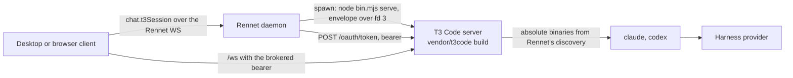

The Rennet daemon runs a T3 Code server, built from the [vendored snapshot](./t3code-vendoring.md),
as a second local process it owns. Interactive coding sessions get T3's session model
(long-lived provider processes, inline approvals, agent questions, per-turn diffs) without
Rennet re-implementing it, and without touching a T3 Code install the user may have of
their own.

## Shape



The daemon composes one supervisor per data directory. Nothing runs until a client asks:
the first `chat.t3Session` adopts a sidecar a previous daemon left running, or spawns
one. Quitting the daemon stops it.

## Private base directory

The sidecar's state lives under `<dataDir>/t3` (by default `~/.rennet/t3`): T3's own
`userdata` with its SQLite state, secrets, logs, and settings. It is never `~/.t3`. A
standalone T3 Code install on the same machine is neither read nor written, and the
sidecar's harness sessions use the user's normal `claude` and `codex` logins because the
provider home paths are left empty.

## Spawn contract

The daemon spawns the vendored bundle with its own Node executable:

```text
node vendor/t3code/apps/server/dist/bin.mjs serve \
  --mode desktop --host 127.0.0.1 --port <free port> --no-browser \
  --base-dir <dataDir>/t3 --bootstrap-fd 3
```

T3 validates `--port` as 1 to 65535, so the daemon binds port 0 on loopback, reads the
number back, releases it, and passes that. The credential never rides on argv or in the
environment. The daemon mints a random bootstrap token and writes T3's desktop bootstrap
envelope (`mode`, `port`, `host`, `t3Home`, `desktopBootstrapToken`) as one JSON line to
file descriptor 3, which T3 reads once at startup and seeds as an unbounded 24-hour grant.

Readiness is T3's own `userdata/server-runtime.json`, which it writes only after its
listener has a real address, cross-checked on pid and port, plus a `200` from the
unauthenticated `/.well-known/t3/environment`. The daemon then exchanges the bootstrap
token at `POST /oauth/token` (form-encoded token exchange, subject type
`urn:t3:params:oauth:token-type:environment-bootstrap`) for a 30-day bearer, and stores
both tokens in `<dataDir>/t3/rennet-credentials.json` with owner-only permissions.

That readiness is sufficient for commands: T3's orchestration reactors are live before the
listener has an address, so a `thread.turn.start` dispatched the moment the sidecar reports
ready is processed, not dropped. The daemon does not wait for anything further. What a
command dispatched that early *can* meet is a refusal, described under [Seats as
threads](#seats-as-threads): the sidecar accepts the dispatch and validates the provider
request afterwards, and the answer to that is reading the refusal, not waiting longer.

Before the spawn, the daemon writes `userdata/settings.json` with the absolute `claude`
and `codex` paths Rennet's own discovery resolved, merging into whatever the user changed
through T3's settings. A daemon launched by the desktop app inherits launchd's minimal
PATH, and T3 resolves a bare `claude` on the server's PATH, so the absolute paths are
what make the sidecar's providers report ready.

The environment handed to the sidecar drops every `T3CODE_*` key the parent shell
carried and sets `T3CODE_TELEMETRY_ENABLED=false`. No relay URL and no Clerk keys are
passed, so T3 Connect is unavailable in the sidecar and nothing leaves the machine
except the harness's own provider traffic and any MCP servers the user configured.

## Claim and adoption

`<dataDir>/t3-sidecar.json` records the sidecar's pid, port, base directory, the daemon
pid that spawned it, and the vendored snapshot's upstream commit. Like `daemon.json`, it
is a claim to verify. A daemon adopts a claimed sidecar only when the well-known probe
answers, T3's runtime record agrees on pid and port, the snapshot commit matches the
bundle this daemon would spawn, and the stored bearer still opens an authenticated
route (re-exchanged from the bootstrap grant when it does not). Anything less is stale:
the claim is removed and a fresh sidecar is spawned.

## Access for clients

`chat.t3Session` returns the sidecar's origin, its `/ws` URL, the bearer to open that
socket with, and the sidecar's environment id. Called with a review id, it
also binds that review's thread: one T3 project per repository (created on first use), one
thread per repository root and review id, full access, with the session's **bound workspace**
as the thread's `worktreePath`. T3 resolves a turn's cwd as `worktreePath ?? project.workspaceRoot`,
so that field is what puts every turn of the thread in the tree the session is bound to —
the reviewer's own checkout for a branch review they are standing on, a Rennet-created
worktree for a branch they are not, the detached worktree at the reviewed head for a
pull-request snapshot. The binding is persisted beside the sidecar's state and returned as
`threadId` plus the sidecar UI's `threadUrl`.

The same is true of every seat thread and of the handoff thread: they are created with the
session's bound workspace, never the project root alone, so all six lens seats, the chat and
the work order read one tree. A thread whose bound workspace no longer exists on disk is
refused with a message naming the missing path rather than created in the project root,
which is a different tree a seat would draft from happily. See
[Session-bound workspace](#session-bound-workspace) below.
The bearer is what the vendored client runtime needs. The command is loopback-only and
never remote-exposed. Clients do not read the credential file.

## The chat slot

There is no engine choice and no second rung: the review workspace's chat slot always
renders T3's thread view for the review's bound thread, mounted natively by the host. T3's own thread top bar (project breadcrumb, new-thread, editor and GitHub openers, layout toggles) is hidden in both mounts by a rule in `packages/t3-chat/src/t3.css` keyed on the bar's `data-chat-header` hook: Rennet's frame already names the review, the branch and the diff, so the bar is workspace chrome the review does not need, and hiding it from the mount's stylesheet keeps the vendored `ChatView` unedited.

`@rennet/t3-chat` mounts T3's `ChatView` natively:
  the vendored web app is imported by module (both desktop Vite configs — the Electron
  renderer and the served browser tab — alias `~/` into `vendor/t3code/apps/web/src`,
  dedupe React, and define the two `import.meta.env`
  values the source reads at module scope), wrapped in T3's atom registry, toast and
  confirm hosts, and a TanStack router over memory history carrying the four routes
  `ChatView` navigates to. The sidecar is registered in T3's environment catalog as a
  bearer environment built from `chat.t3Session` (the brokered origin, the websocket
  base and the 30-day bearer); T3's client runtime then does what it does for any remote
  environment: bearer HTTP, a short-lived `wsTicket` for `/ws`, thread subscriptions.
  Each host runs the vendored app in its hosted-static mode, so no primary
  environment is ever looked for at Rennet's own origin. A second Tailwind entry
  (`packages/t3-chat/src/t3.css`, no preflight) scans only the vendored source and maps
  every T3 semantic variable onto Rennet's `--rn-*` palette; the names both kits share
  mirror `packages/theme/src/theme.css` exactly, because a utility rule is one rule for
  the whole document. The mount is a lazy chunk, fetched when a session's slot opens.
  Both `apps/desktop` entries provide the components through `T3ChatSlotProvider`;
  `app-ui` itself never imports the vendored app, and a host that provides nothing shows
  a line saying so rather than an empty box.

The slot's other caller is **the bench** — the review workspace's first frame while
capture and the first board generation run (`packages/app-ui/src/app/preparation-bench.tsx`,
mounted by `SessionScreen` in the session outlet, so the sidebar, top bar and chat slot
stay around it). The bench draws the change as its centrepiece with one reader per lens,
each showing its seats' `latest` lines from `SessionPreparation` — the daemon's plain-words
projection of each seat's newest thread activity — and capture as the first beat of the same
scene rather than a separate screen. Each seat's line is a control: activating one writes
that seat's `thread` (`{ environmentId, threadId }`) through `uiActions.openLensThread` and
opens the dock, and the slot renders that transcript read-only (below). As a lane settles
(`drafted`/`done`) its board opens on the bench beneath the readers through
`LensBoardDocument`, read off the same per-lens `board.read` seam the workspace uses
(`useLensBoardResolutions` at the initial generation), so three settled lanes and two
running ones show three boards and two live readers. A settled lane whose read answered
with something other than a board — malformed, for another generation, unreadable, or a
lens that failed to draft — shows that account in the board's place, in the same words the
workspace uses, rather than an empty space under a reader that says "drafted". A lane with no
`thread` yet is disabled rather than offered as a transcript that does not exist.

The mount's environment registration persists in each host's IndexedDB under T3's
catalog (the same store T3's hosted app uses for paired machines), keyed by one stable
connection id, so a refreshed bearer replaces the entry rather than adding one.

### Reading a lens seat's transcript

The mount provides two views, not one, and the slot shows whichever the workspace asked
for. `T3NativeChat` is the review's own bound thread with its composer. `T3ThreadView`
is any other thread on the same sidecar environment — in practice a lens seat's, since
every board seat runs as its own thread — mounted read-only: the same providers, the
same routes and the same `ChatView`, with the initial route built from the `{
environmentId, threadId }` ref the lane carries rather than from the session. Both
register the same bearer environment under the same connection id, so opening a
transcript adds no connection.

Read-only is one CSS rule. `t3.css` hides `[data-chat-composer-overlay]` — upstream's own
attribute on the whole input bar — inside `[data-slot="t3-thread-view"]`, which also
zeroes the clearance `ChatView` measures from that element, so the timeline runs to the
bottom instead of reserving a gap. No vendored file is edited and there is no
`PATCHES.md` row; a Tailwind class string would not have survived a fold. It is not a
gate either: it hides a composer that would otherwise start a turn on a seat's thread,
which is confusing rather than dangerous.

The workspace opens one by writing a seat's thread ref into the store
(`uiActions.openLensThread(ref)`) — on the bench every seat's line of speech is its own
control, so Flagged offers two, one per provider; `T3ChatDock` then renders `T3ThreadView` for it with a
"Back to the session" control that clears it. The transcript keeps streaming while the
seat runs — that is upstream's thread subscription, nothing Rennet drives — and stays
readable after the seat settles and after the boards reveal.

Measured on 2026-09-03 (renderer production build, raw bytes before gzip): the chunks
loaded at startup grew from 1,822 KB to 1,846 KB, the lazy T3 payload is 3,122 KB of
script plus a 380 KB stylesheet, and the on-disk renderer grew from 2.4 MB to 21.6 MB
because `@pierre/diffs` splits every Shiki grammar into its own on-demand chunk and
`heic-to` (2.9 MB, loaded only when a HEIC image is attached) rides along.

## Seats as threads

Every board seat of a review generation — Design, Sequence, Decisions, both Flagged seats,
Noise, and the round report — runs as one persistent thread in this sidecar, on the
review's checkout. That is the only way a board seat runs: the ephemeral Claude and Codex
board legs are deleted, so a generation with no sidecar drafts no board and says why. The
binding is
`(repository root, generation id, seat)` in the same `thread-bindings.json` as the session
bindings, and the thread's title names the branch and the lens (`feat/x — Design`), so the
sidecar's own thread list reads sensibly. Two repositories in one workspace on the same
branch get two threads, because the key starts at the checkout and never at a project id.

The council still routes each seat: a Claude seat is a thread on T3's `claudeAgent`
instance at the council's model, a Codex seat one on `codex`. Flagged runs both, on two
threads. A lane holds its seats in provider order — Claude first, Codex second, never the
order the two threads happened to bind in — so the lane's own `thread` and `latest` always
mirror the Claude seat, and the bench lists the two voices the same way on every run.

Three things follow from the thread being persistent.

- **A repair is the next turn, not a new session.** When a draft fails lint, the seat is
  sent `renderRepairTurn(pointers, frozenIds)` from `@rennet/prompts`: the lint pointers,
  the frozen element ids, and the instruction. The base drafting prompt and the failing
  draft are already in the conversation, so neither is re-sent. Measured on the repair
  fixture in `lens-pipeline.test.ts` against the shipped Flagged prompt, a repair turn
  fell from 7,107 bytes to 469 — the base prompt is 6,359 of the bytes that no longer
  travel, and a production base prompt is larger than the fixture's, so the real
  saving is larger. Both interpolations declare a byte bound with an honest omission
  marker. Every turn leg — this T3 turn and the ephemeral Claude and Codex legs that still
  serve the utility jobs — measures the prompt it actually sends for inline context (every
  JSON literal and fenced block, summed) and stamps the total on the turn metric beside its
  tokens when it is over 2,048 bytes, so a payload that crept back into a prompt is
  visible in the same sink as the spend it caused. The scan crosses newlines, so a
  pretty-printed `JSON.stringify(value, null, 2)` payload — the shape the harness rules
  forbid — is measured in full rather than summing to nothing; a `{` in prose that never
  closes is abandoned at its opener and the scan resumes, so it cannot swallow the
  literal after it. The measurement reaches the metric even when the turn THREW after its
  prompt was sent: those tokens are spent and there is no frame to read, which is exactly
  when recording nothing would hide the spend. The one-off utility turns behind a command
  — the delta digest, refine-comment, PR-body, review-opener and handoff-compose seats —
  drive `codex exec` rather than a session; their executor is wrapped once at composition
  so each of those sends records a `TurnMetric` too, labelled with its job. They belong to
  no generation, so that metric lands in the daemon log rather than a durable `usage`
  record.
- **The output schema is the turn's contract, once.** `startTurn` takes an `outputSchema`
  and T3 attaches it to the turn; it is never restated in prompt text. A settled turn's
  structured result, duration, usage and cost come back on a `turn.settled` activity the
  sidecar appends to the thread, which `waitForTurnSettled` reads. A Claude turn that
  settles without structured output is an honest turn failure, not a guess at the final
  message. Codex is the documented exception: T3 forwards the schema to Codex as
  `V2TurnStartParams.outputSchema`, but its runtime does not surface a settled turn's
  structured result, so the daemon parses the board out of the Codex seat's final message
  — for that provider only.
- **Spend is per turn, and it is a delta read off the thread.** Claude's SDK reports usage
  cumulatively over a streaming session's turns, so the seat leg records each turn's own
  usage as the difference against the previous settled turn's total — which
  `waitForTurnSettled` reads from the thread's own earlier `turn.settled` activity, so a
  runner recreated for the thread (a whole-board restart) or a daemon restarted under it
  subtracts the same as one that watched every turn. A total below the previous one means
  the session restarted and its counter began again, and the whole figure is the turn's.
  Codex reports nothing on its settlement: its tokens ride T3's `context-window.updated`
  snapshot for the turn, which is the last request's own figures (a turn with several
  tool round-trips under-reports until T3 projects the running total's breakdown). One
  `TurnMetric` per turn reaches the generation's collector, labelled `board.<jobId>`, with
  the provider's own duration when it reported one; a repair therefore never bills the
  drafting turn twice.
- **A cancelled seat stops the model.** An abort reaches the sidecar as
  `thread.turn.interrupt`, and the seat leg then waits a bounded moment for the interrupted
  settlement so the usage that turn had already billed is recorded rather than booked as
  zero. Each wait is scoped to the start it belongs to: `startTurn` returns what the thread
  showed before dispatch, and the wait ignores that earlier turn's settlement and any
  session error recorded before the request, because T3 only flips `latestTurn` to running
  once the provider reports the new turn.
- **A seat whose turn never registers settles as a failure, on a clock.** A provider
  stream that dies before its turn exists leaves the session stopped or errored with
  `lastError` and no turn row, and T3 emits no turn lifecycle for it; the wait settles
  that as a failed turn carrying the session error. A session that simply stays `ready`
  with no turn row and no stream item at all is given two minutes by a timer that runs
  independently of the stream, then the wait gives up naming the session state. The timer
  is not checked behind the next stream item, because a silent stream has none. The start
  itself is held to the same bound: the pre-read and the `thread.turn.start` dispatch race
  the seat's abort signal and a two-minute deadline, so a sidecar whose socket is up but
  whose command handling has stalled releases the seat with a reason instead of holding it
  on an RPC that never answers.
- **A turn the sidecar refuses after accepting it settles at once, on the refusal.** T3
  accepts `thread.turn.start` at the socket and validates the provider request later, on
  its reactor's fiber; a refusal there — `ProviderService.sendTurn` rejecting an input over
  its cap, a message it cannot find, an adapter that will not take the request — is
  recorded as a `provider.turn.start.failed` activity with no turn id, beside a session
  `error` that the session start it had just kicked off overwrites with `ready` a moment
  later. So the dispatch resolves, the session reads healthy with no `lastError`, and no
  turn row ever appears (the Design seat, drive 1.6, both runs). The wait reads the
  activity: one stamped at or after its request settles the turn as failed, carrying the
  sidecar's own message with its stack frames dropped, instead of the two-minute timeout.
- **The prompt fits the transport.** T3 caps a turn's input at
  `PROVIDER_SEND_TURN_MAX_INPUT_CHARS` (120,000 characters), exported through the seam as
  `T3_TURN_INPUT_MAX_CHARS`. On the drive of 2026-09-03 the Design prompt was 241,848
  characters — 103k of hunk inventory plus a 126k design-artifact bundle — while the five
  bundle-less seats sat at 110k and ran. Both payloads are gone: citations by path and
  line removed the inventory, and the Design seat now finds the specification itself in
  the checkout instead of being handed one (session-bound-workspace D5, D6). No seat
  interpolates a bundle, so nothing needs re-fitting to the cap.

Because the SDK fixes `outputFormat` when a query is constructed and offers no in-session
setter, a *live* session's contract is decided by the turn that started it. A later turn
asking for a different schema is refused by name rather than answered in the wrong shape;
Rennet never sends one, since a seat drafts and repairs against a single board schema. A
turn whose session is gone is a different case and starts a new one on the turn's own
schema — including the session T3 recovers from a persisted resume cursor, which is the
path a seat takes when its first turn killed the provider.

The seam is two functions. `packages/adapters/src/t3-seat-turn.ts` builds the seat's
`runTurn` and knows nothing about `effect`; `create-server.ts` fills it from the
supervisor.

**T3 is a board seat's only backend, structurally.** A daemon that cannot bring the sidecar
up — no vendored bundle, a spawn failure — answers with the reason instead of a runtime, and
every board seat of that generation fails as `T3 sidecar unavailable: <detail>`, which the
bench speaks in the failed reader's own voice. A caller that composed no sidecar at all
fails the same way, naming that instead. There is nothing to fall back to: the board
pipeline holds no harness port, and `councilSeatTurn` refuses a board job without a seam
before it reaches either ephemeral leg. Those legs still run every non-board job — the
project scout, the repo map, the delta digest, the compose turn — but a lens drafted on one
would have no thread, no transcript, no live line and no same-thread repair, and nothing on
screen would say so.

The **Flagged lane still holds two seats**, Claude and Codex, both of them sidecar threads:
`t3-seat-turn.ts` binds a thread with `provider: "claudeAgent" | "codex"` through T3's model
selection, so cross-model concurrence survives the deletion intact. What decides whether
each seat can run is the council's installed-harness answer plus the seam — never a port the
pipeline holds. With only one harness installed the lane degrades to a single seat and says
so, exactly as before.

One consequence worth naming: the round-report classifier's raw-response caps
(`outputByteCap`, `outputTokenCap`) were enforced by the ephemeral legs at their own
transport boundary, and T3's `startTurn` has no equivalent knob. They no longer travel. The
report's shape is bounded by its output schema and its evidence manifest by
`ROUND_EVIDENCE_MANIFEST_MAX_BYTES`; nothing pretends a response-size cap is applied when
it is not.

**Archiving a session is how threads are pruned, and it is a deletion boundary.** Transcripts
are the product while a review is live, so nothing expires on a timer; `session.archive` is
the act that ends them. Archiving first ABORTS AND AWAITS the session's own preparation —
anything still able to bind a thread has to be finished before the sweep, or a seat mid-flight
binds a fresh thread behind it and the archive leaves exactly the orphan it exists to prevent.
Then, once the archive has persisted, one serialized sweep deletes the session's own thread
and every seat thread its generations left behind (`thread.delete` over RPC) and drops those
bindings. Un-archiving restores nothing — the next use creates fresh threads.

A round in flight is covered too, from the other side. A round is driven by the durable
round coordinator, takes no abort signal and is not waited on, so a returned generation
drafting through an archive would bind its five seat threads after the sweep had passed.
Instead of cancelling it, the round re-runs the identical sweep on its way out whenever
the session it drafted for is archived by then — idempotent, and no sidecar call at all
for the ordinary live session.

A sidecar that is off still leaves the bindings dropped, because a binding pointing at a
thread nobody can reach is worse than none, and neither an off sidecar nor a thread it no
longer has may fail the archive. The handle is not thrown away with the binding, though: a
thread whose delete failed moves to `pendingDeletions` in the same bindings file — out of the
live bindings, so an un-archived session still gets a fresh thread — and is retried on the
next sweep or the next successful `ensure`, up to five attempts, after which a thread the
sidecar genuinely lost stops pinning the list.

The sweep is keyed on the session and review ids rather than on a repository
root: a session's own thread is bound under the review id and its seat threads under the
session id, so a root-scoped sweep would leave every seat thread behind. Seat rows written before the owner field
existed carry no session id and are matched by nothing — silence never sweeps.

Ten vendored files carry this: the three contract modules that gained `outputSchema` /
`structuredOutput`, the decider and the provider command reactor that thread it, the
Claude and Codex adapters that hand it to their runtimes, the provider service that
carries the turn's schema into a session it recovers, and the runtime-ingestion layer
that projects the `turn.settled` activity. Each has its row in `vendor/t3code/PATCHES.md`,
all upstreamable.

**A dead `claude` must not take the sidecar with it.** The SDK's process transport writes
the prompt to the child's stdin and never listens for that socket's `error` event, so a
`claude` that dies before the first write — a bad install, an immediate auth failure —
raised an unhandled `write EPIPE` that killed the whole server process and every other
seat's thread with it. The Claude adapter now spawns the child through the SDK's
`spawnClaudeCodeProcess` hook and handles that error, terminating a child whose transport
is broken so the failure arrives on the query stream, where the session settles the turn
as failed like any other runtime failure. One thing that crash was hiding is still open:
when the write loses that race against a `claude` that exits immediately, the turn can be
left unsettled instead — about one run in ten against a stand-in that exits at once. The
sidecar now survives it, so the blast radius is one thread rather than every seat, but a
turn that never settles is its own defect and is not fixed here.

## The live line on a lane

While a seat's lane runs, the daemon holds one subscription to that seat's thread and
publishes what the seat is doing through the lane. `packages/server/src/t3/latest-event.ts`
is the projector: a pure function from a thread projection to the protocol's `LaneLatest`.
A tool call in flight becomes plain words naming what it is acting on — `reading
src/foo.ts`, `running git diff --stat`, `editing a.ts`, `searching createSession` — a tool
with no plain word for it keeps T3's own summary rather than being given an invented verb,
and assistant prose becomes its last sentence. Every line is capped at 120 characters with
an honest `…`.

A tool call is only "in flight" until it finishes. T3 emits started, updated and completed
tool activities with the same `tool` tone, so the projector reads the lifecycle — the
activity's `kind` and the runtime's item status — and a completed, failed or denied call
falls back to whatever the seat is saying instead of freezing the lane on a read that is
over. When nothing new has arrived for twenty seconds the line becomes `idle` and says how
long it has been quiet, counted in ten-second steps: the lane's line is republished by
re-sending the whole preparation snapshot, and a one-second counter would push five
snapshots a second to change one digit.

`t3/seat-progress.ts` holds the subscription. Thread events do not carry the whole
projection, so a re-read is an RPC and is throttled to at most four publications a second
per lane. The throttle is TRAILING: events inside a busy window are deferred to one read at
the end of it, never dropped, so the last thing a seat did before going quiet is what the
lane shows. The read throttle keeps its own clock, separate from the publish one — a
re-read that produces an unchanged line publishes nothing, and keying the read on the
publish time made a run of identical events re-read the thread on every one of them. The
idle tick re-projects the last snapshot against a fresh clock and costs no RPC at all. A
publish that throws (the lane store or its persistence refusing the line) is contained in
the watcher and reported through its error sink, because that publish also runs from the
idle interval and the trailing timer, where an uncaught throw is a daemon crash.

A lane holds one entry per seat (`LensLane.seats`: seat id, provider, thread, latest
line), addressed by seat id, because Flagged runs a Claude seat and a Codex seat on one
lane and each has its own transcript and its own line. The lane's top-level `thread` and
`latest` mirror the first seat to register (`seats[0]`) so pre-seats readers keep working
for one release. A seat's thread is recorded from the moment it exists and kept through
every later state, so a settled or failed reader still opens its transcripts. The
subscription is dropped when THAT LANE settles — not when the generation does, so the
seats that finish first stop costing a socket and an idle tick while the slowest lens
runs on.

## Session-bound workspace

A session binds to exactly **one** workspace when it is created, and keeps it for its whole
life. Which one is decided from the review target, once:

| Review target | Bound workspace |
| --- | --- |
| A branch some worktree of the repository already has checked out (usually the reviewer's own) | that checkout — nothing is created |
| A branch nothing has checked out | a Rennet-created worktree at `~/.rennet/worktrees/<repoKey>/<branch>`, with the branch checked out |
| A pull-request snapshot | the detached worktree at the reviewed head, the one the pull-request front door already indexes |

"Some worktree already has it out" is asked of `git worktree list`, not assumed: git refuses
`worktree add` for a branch checked out elsewhere, so binding blind would fail on exactly the
tree that should have been bound to. Git answers in **its** spelling, which for a WSL project
driven from a Windows host is the distro's (`/home/u/repo`), so the answer is re-spelled into
the one the daemon addresses the repository by before it becomes `boundRoot`.

A workspace that cannot be created **fails the bind** rather than falling back to the clone.
The clone sits on whatever ref it sits on — usually the default branch — so a recorded fallback
would run every later turn of the session against a tree the review is not about. Nothing is
recorded, and the next use retries.

The decision is recorded as `boundRoot` on the session record, and every later read is that
field. A session with none — minted before the binding existed, or one whose first bind threw —
**binds on the next use and records it**: `holdingReviewContext`, which every review-scoped turn
already passes through, and the review-keyed read the chat and handoff threads are created from
both bind before they answer. That is what makes "the next use retries" real rather than a
sentence: a synchronous read of the empty field would answer the clone, and a thread's cwd is
fixed at creation, so answering the clone once leaves a thread in the wrong tree for its life.

When git names a directory Rennet already has a name for — the repository itself, or the
worktree Rennet created — **Rennet's own spelling wins**. `git worktree list` prints a realpath,
and a `boundRoot` that differs from the previous one by spelling alone reads downstream as "this
session moved", which retires the session's threads and re-keys the new ones.

Nothing re-decides a binding — but a pull-request binding is **re-pinned**
on every read, because it is a detached checkout and a landed round advances the reviewed head;
`ensurePrWorktree` replaces the checkout at the same path, so the recorded root does not move.

The session's children run there because the thread's `worktreePath` and the turn's `cwd` are
both that root: the six lens seats, the chat thread, the handoff thread and every cold utility
turn (scout, repo map, delta digest, opener, pull-request body, refine, CI classification,
finding verification). The coding round is Lane B's remaining work and still runs its own
detached worktree per operation until [task 5.3](https://github.com/rbutera/rennet) lands.

On WSL the bound root reaches the child as `wsl.exe --cd <distro path>`: the adapter bakes that
argument at construction and `transportCwd` wins over a session's `cwd`, so a harness is
resolved from the **turn root**, never from the repository root, or the cwd is silently ignored.

A thread's cwd is fixed when the thread is created, so a binding row records the workspace it
was created with, and the workspace is half the binding KEY — which is what puts the chat, the
handoff and the round's turn on ONE thread. A row keyed on the repository while a workspace is
being asked for is superseded: it carries no workspace (written before this wave) or the clone
root (written by a read that preceded any bind), and either way its thread is rooted in the
wrong tree. It is moved to the sidecar's pending deletions, so the existing sweep DELETES that
thread rather than leaving an orphan transcript with no handle.

The reviewer sees it: the chat header's trail names the bound workspace beside the branch, so
"which tree did the seat read" is not invisible when it is a worktree rather than their own
checkout.

Worktrees earlier versions created per round operation (`~/.rennet/round-worktrees/`) and per
review (`~/.rennet/worktrees/review/`) are removed by a sweep at daemon start, which leaves any
directory a live session is bound to (compared through `realpath`, and re-read before every
removal) and logs how many it removed. Nothing creates a `worktrees/review/` directory any
more; the round worktrees come back until Lane B's task 5.4 deletes the planner that makes
them.

## The handoff exit

"Hand to coding agent" dispatches the composed work order as one turn on the review's
bound thread, full access, cwd the session's bound workspace. The daemon waits for the turn to settle,
reads T3's checkpoint diff for that turn, and returns a final text, a unified diff and
the files touched — or a failure reason from T3's session. `review.handoff.run` then
recaptures the checkout and offers the delta re-review exactly as before. There is no
second engine to fall back to.

## What a thread costs and where it is kept

Three facts about running every session's chat and every work order inside the sidecar,
stated here and on the local host card in Settings rather than beside a choice, because
there is no choice:

- Threads are persisted harness sessions, so they appear in the harness's own history.
- Their token usage is reported by T3 Code's usage view, not by Rennet's seat usage.
- T3 Code records a hidden checkpoint ref in the reviewed repository per turn. An
  ordinary push does not send it.

## Status

`daemon.status` carries a `t3Sidecar` field: `off` until something asked for it,
`starting`, `ready` with the port, or `degraded` with the reason (bundle not built,
spawn failed, exited). The field also states `telemetry: "off"` and the upstream commit
the bundle was built from. The set of RPC methods Rennet calls is checked at build time,
not at boot: the daemon-side client and the sidecar are built from the same vendored
snapshot, so a fold that removes a method fails the typecheck before it can ship.

## Measured: one generation on a 74-file branch

Task 1.6 of `t3-lens-threads`, run three times on 2026-09-03 against Rennet's own
`feat/cm-w1-import-edges` (74 files) from the packaged app with an isolated data dir, all
six seats on the sidecar, Claude seats on Opus 4.8 at high effort, Codex seats on GPT-5.6.
The numbers below are the third run (v0.6.9, the first build carrying the scoped waits of
#764), read from the generation record's `timings.phases`; the earlier runs are in the
same shape for comparison. Wall clock from branch pick to the last board was fourteen
minutes, of which the capture and scout took about ninety seconds.

| Seat | Draft (v0.6.9) | Repair (v0.6.9) | Draft (v0.6.8, run 2) |
| --- | --- | --- | --- |
| Noise (Codex, low) | 62 s | 11 s | 66 s |
| Flagged / Codex (high) | 310 s | 10 s | 267 s |
| Flagged / Claude (Opus, high) | 325 s | 9 s | 400 s |
| Sequence (Opus, high) | 316 s | 51 s | 278 s |
| Decisions (Opus, high) | 309 s | 232 s | 452 s |
| Design (Opus, high) | start dropped, 120 s timeout | 1 s (no draft to repair) | start dropped, never settled |

The first core board (Flagged) reached the bench at 336 s; the whole generation settled at
541 s. On v0.6.8 every repair "settled" in tens of milliseconds because the wait answered
with the previous turn; on v0.6.9 the repairs are real follow-up turns on the same thread,
which is what the pointer-only repair was built for.

Two things the run found. The Design seat, the first of six to dispatch, had its
`thread.turn.start` accepted and dropped by a sidecar that had come up two hundred
milliseconds earlier, in both runs that used a fresh sidecar; the two-minute start timer
settled the lane honestly and the repair turn on the same thread ran fine, so the thread
was healthy and only the first command was lost. It was not a startup race: the sidecar
had accepted a 241,848-character prompt and refused it afterwards on its reactor's fiber,
over its 120,000-character input cap; the refusal read and the bundle fit under
[Seats as threads](#seats-as-threads) are the fix. And the Decisions seat drafted a board with no
reachable `decision` element even after a repair, which the pipeline reports as a lens
failure rather than an empty board.

The ephemeral-session baseline the task named (`benchmarks.jsonl` on Rai's machine) was
not available on the host these runs used; the comparison here is between the two
sidecar builds. On the same branch the ephemeral legs ran on 2026-09-03 the core lenses
were still drafting past eight minutes, so the thread-backed seats are not slower, and
their repairs no longer re-send the base prompt.

## Stopping

The daemon's own shutdown sends SIGTERM to the sidecar it spawned and clears the claim.
`rennet stop` and the tray's Quit then run a sidecar step after the daemon step: verify
the claim, SIGTERM only a pid T3's runtime record vouches for, wait a bounded five
seconds, clear the claim. A sidecar that will not exit is logged and left for the next
start to reap; the app still exits.

T3 has no SIGTERM handler of its own. A turn that was streaming when the sidecar stops is
reconciled on the sidecar's next start as an errored session ("Provider session did not
survive a server restart"), not as an interrupted one. Sending `thread.turn.interrupt`
over RPC before the signal is the daemon-side client's job and lands with it.

## Session context files

A turn is never sent its context. Anything it may need beyond its instructions is written
as a file under `<bound root>/.rennet/context/<sessionId>/`, and the prompt names the path;
the agent reads what it decides it needs with its own tools, the way it reads the checkout.
`packages/server/src/context-files.ts` is the only writer and the only purge. Each write
puts a `README.md` in that directory listing every file, what it holds and when to read it,
stamps an `.owner` file naming the *incarnation* of the daemon that wrote it — its data
dir, its pid and its start time — and ensures
`context/` is in the repository's Rennet-managed `.rennet/.gitignore` block before the first
file lands — so a round committing in the reviewer's own checkout cannot stage it. The block
is composed at the repository's *own* recorded visibility, so ensuring it never re-ignores
`map/ overlays/ knowledge/` on a repository the reviewer set to `git-visible`; `context/` is
in the block at either visibility, because it is Rennet's scratch rather than derived data
the reviewer might commit.

The purge is at archive, not at settle: a reopened transcript or a resumed round still finds
its files. Four callers remove a directory, and nothing else does.

- `session.archive` purges beside the thread sweep, on the same deletion boundary — unless a
  turn holds a **lease** on that session, in which case the purge is remembered and the last
  release performs it. Archive awaits the session's *preparation* and nothing else, so
  without the lease an archive landing mid-turn deletes the directory the seat is reading.
  Every context-consuming turn holds one for its whole life: the round, the opener, the
  PR-body draft, compose, the handoff run, verification, refine, CI classification, noise,
  the scout and related-context retrieval.
- The round's `sweepIfArchived` re-sweep purges on its way out, for a round that wrote
  context after an archive had already passed.
- A daemon start sweeps context directories **it owns** — matched on the `.owner`
  incarnation, because a second daemon over the same repository (a dev daemon beside the
  packaged app, any isolated data dir) has its own session store in which every one of the
  first daemon's live sessions is absent, and would otherwise delete them mid-turn. The data
  dir alone was not enough, since two daemons can share one and then each reads the other's
  live directories as its own; a directory is reclaimed only when it carries this exact
  incarnation, or a **provably dead** one of this data dir (its pid resolves to no running
  process). Another data dir's, a live sibling's and an unparseable stamp are all left, with
  a log line. Of the directories it owns it removes those whose id is absent from
  the store's **raw persisted ids** — not the parsed list, since a record that will not parse
  is skipped by `list()` and reading that silence as "the session is gone" deletes live
  files — and those whose session the store already marks archived, which is what a crash
  between `setArchived` and the purge leaves behind. The roots it looks under are each
  project's `openPath` and every one of its `includedRepoPaths` (a workspace's other repos
  are invisible from `openPath` alone), every `boundRoot` a session recorded, and any
  recorded pull-request worktree.
- The project scout purges its own run (below).

The session record carries `boundRoot`: the one workspace the session is bound to, which is
also where its context directory lives, and which the purge prefers over `repositoryRoot`.
They differ exactly when they must — an off-branch or pull-request session's turns run in a
worktree, not the reviewer's checkout, so a purge aimed at `repositoryRoot` would leave those
files behind forever.

One turn runs before any session exists: the project scout, which fires at project add. It
writes through the same writer under an id of its own, `project-scout-<uuid>`, one per run,
so its facts land at `<repo>/.rennet/context/project-scout-<uuid>/scout-detected.json` and
the run purges that directory when it returns — including a failed run. A fixed id was never
a session id, so every daemon start read it as an orphan, and two scouts on one root raced
purge-then-write over each other's files. That directory is what pays for the scout's prompt:
it used to carry `CLAUDE.md`, `AGENTS.md` and `CONTRIBUTING.md` at 8 kB each plus the detected
facts as JSON — 19,166 bytes on Rennet's own checkout — and now names the three documents by
path, for a seat whose `cwd` is already the repository root, at 706 bytes.

Related-context retrieval is the same shape with the same lifecycle: its candidate dossier is
a run-scoped file under the review's session context directory, and the enrichment prompt
names that path — relative to the repository root, which *is* the seat's `cwd`, because an
absolute daemon-locus path is unopenable from a WSL seat inside the distro — and the item
count instead of carrying the items (27,543 → 414 bytes
on the frozen PR #514 fixture). It is written run-scoped and under the session rather than as
a `candidates.json` in the global dossier store, so a concurrent open of the same target
cannot overwrite the file the first seat is mid-read of, and so the archive purge covers it if
the turn never returns; the kick discards it as soon as the turn does. It is deliberately not
`record.json`, because a readable record is what gates a refire and a candidate list is not a
finished retrieval.

The five review-side utility turns are the same shape, keyed — like every other context
write — on the **session id**, which is the id `session.archive` purges and the id the
daemon-start sweep knows. They used to be keyed on the review id instead, which meant an
archived review's work order was never purged and a *live* review's was deleted as an orphan
at the next start. Each writes through `writeReviewContext`, takes the directory that write
returns rather than deriving one, writes immediately before it sends, and names only what it
wrote: the **review opener** writes `opener/boards/<lens>.json`,
`opener/asks.json`, `opener/dispositions.json`, `opener/review-facts.json` and
`opener/voice-rules.md` (the voice rules travel as a file because they live inside the
installed `@rennet/prompts` bundle, which the seat's `cwd` cannot reach); the **PR-body
drafter** writes `pr-body/narration.json`, `pr-body/dispositions.json`,
`pr-body/requirements.json` and `pr-body/decisions.json`, and writes only the ones the input
actually carries, so the prompt still never invites an invented section; **handoff compose**
writes `compose/asks.json` and gets back a partition over the ids in it; the **handoff run**
writes `work-order.md`; the **delta digest** writes `digest-input.json`.

Board drafting writes one more before the first seat turn: `pr.md`, the reviewed pull
request's own title and description, for a review that has a post target and a capture that
recorded one. The Design seat is told the pull request body is its strongest clue to which
specification the branch was written against, and a PR-snapshot review drafts in a detached
worktree where `gh pr view` has no branch to resolve — so the clue the prompt calls strongest
was the one it could not reach. A working-tree capture, and a PR whose author wrote nothing,
write no file rather than an empty one. Measured on the
packages' own fixtures at branch scale — 40 asks, 40 beyond-ask hunks, four boards — the five
prompts go 10,623 → 1,253, 7,222 → 1,600, 8,582 → 1,237, 15,598 → 771 and 6,250 → 1,035
bytes. Every one of them is now **constant in the material**: the enumeration caps those
prompts needed (the digest's ten-hunk "and N more", among them) are gone with the
enumeration, so a large delta costs the turn nothing and the file stays complete.

## Code map

- `packages/server/src/t3/sidecar.ts`: claim, probe, free port, provider seeding, environment, spawn, adopt, stop.
- `packages/server/src/t3/supervisor.ts`: one supervisor per data dir; `ensure`, `session`, `client`, `threadFor`, `forgetSession`, `status`, `stopSync`.
- `packages/server/src/t3/client.ts`: the daemon-side RPC client, the one Rennet module importing `effect` and `@t3tools/contracts`.
- `packages/server/src/t3/threads.ts`: the (repository root, session id) and (repository root, generation id, seat) → thread bindings, and `seatThreadTitle`.
- `packages/server/src/t3/latest-event.ts`: the pure thread → `LaneLatest` projector; `t3/seat-progress.ts`: the throttled subscription that feeds a lane.
- `packages/adapters/src/t3-seat-turn.ts`: the seat leg (`createT3SeatTurn`); `council-seat-turn.ts` routes board jobs to it when the seam is present, and `runtime/rounds.ts` builds the seam per generation.
- `packages/server/src/t3/handoff.ts`: the handoff exit, which `create-server.ts` runs for every work order that names a review.
- `packages/server/src/bound-workspace.ts`: the one binding decision (`decideBoundWorkspace`); `create-server.ts` records it on the session as `boundRoot` and reads it back through `boundRootForSession` / `boundWorkspaceForReview`.
- `packages/server/src/legacy-worktrees.ts`: the daemon-start sweep of the retired round and review worktrees.
- `packages/adapters/src/pr-worktree.ts`: `worktreeForBranch`, `ensureBranchWorktree`, `branchWorktreePath` beside the pull-request worktree helpers.
- `packages/app-ui/src/chat/t3-chat-dock.tsx`: the slot, its header trail, the session-or-lens choice and the hand-off to the host-provided components (`chat/t3-chat-slot.tsx`); `packages/app-ui/src/store/ui.ts`: `lensThread` and `openLensThread`.
- `packages/t3-chat/src/native-chat.tsx`: the native mount (routes, providers, environment registration, the thread and draft route views mirrored from upstream's route files, and `T3ThreadView`); `session.ts`: the session-to-registration mapping and the route builder both views share; `t3.css`: the theme bridge and the read-only composer rule. `apps/desktop/vite.renderer.config.ts` and `vite.browser.config.ts` each carry the alias, dedupe and defines; `apps/desktop/src/renderer/index.tsx` and `src/browser/entry.tsx` each provide both components.
- `packages/server/src/dispatch/chat.ts`: `chat.t3Session`; `dispatch/daemon.ts` adds `t3Sidecar` to `daemon.status`.
- `packages/protocol/src/wire.ts`: `t3SidecarStatusSchema`, `t3SessionSchema`.
- `packages/server/src/daemon-main.ts`: resolves the bundle (`RENNET_T3_BUNDLE` overrides); in the packaged app the main process sets that variable to `Resources/t3code/apps/server/dist/bin.mjs`, staged by `scripts/stage-t3-sidecar.mjs` at desktop build time (see `apps/desktop/PACKAGING.md`).
- `apps/desktop/src/main/daemon-supervisor.ts` and `packages/server/src/cli.ts`: the sidecar step in both stop paths.
