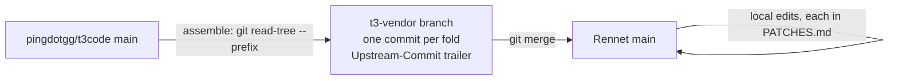

Rennet reuses T3 Code's server, provider layer, and thread UI by vendoring a
selected snapshot of its source under `vendor/t3code/` rather than forking the
repository or depending on its npm binary. The snapshot keeps upstream's
formatting and toolchain, builds inside Rennet's pnpm workspace, and advances
through ordinary three-way merges from a pristine vendor branch. Every local
edit to a vendored file is recorded in a ledger that the gate enforces.

T3 Code is MIT licensed by T3 Tools Inc. The upstream `LICENSE` travels with the
snapshot unchanged. Rennet's own packages stay FSL-1.1-MIT; the vendored tree is
a dependency with an inbound MIT licence, not Rennet source.

## What is vendored

`vendor/t3code/UPSTREAM.json` is the one record of the upstream repository, the
exact commit the snapshot was taken from, the date, and the upstream-relative
paths that are vendored:

| Upstream path | Why it is here |
|---|---|
| `apps/server` | The T3 Code server: Effect RPC over WebSocket, orchestration, provider drivers, persistence, CLI |
| `apps/web` | The thread UI, composer, diff panel, and the client runtime's React bindings |
| `packages/contracts`, `packages/shared`, `packages/client-runtime` | The typed RPC contract, shared helpers, and the framework-free client state the web app and Rennet's daemon module both consume |
| `packages/effect-codex-app-server`, `packages/effect-acp`, `packages/tailscale` | Provider transports the server imports |
| `package.json`, `tsconfig.base.json`, `vite.config.ts`, `scripts/lib` | The root manifest (`"type": "module"`), base compiler options, the root Vite Plus config, and the build helpers `apps/server` and `apps/web` import by relative path |
| `patches` | Upstream's pnpm patches; only those for installed versions are declared in `pnpm-workspace.yaml` |
| `LICENSE` | The MIT licence and copyright notice |

Nothing else from upstream is present: no desktop shell, mobile client,
marketing site, infrastructure, native code, or reference repositories.

## Layout

```text
vendor/t3code/
  UPSTREAM.json        upstream repo, commit, date, vendored paths
  PATCHES.md           the patch ledger: every locally edited vendored file
  digests/<date>.md    inspect output, one per run
  LICENSE              upstream MIT licence, unchanged
  apps/, packages/, scripts/lib/, patches/, package.json, tsconfig.base.json, vite.config.ts
```

Four kinds of file inside the tree are Rennet's, not upstream's, and never need
a ledger row: `UPSTREAM.json`, `PATCHES.md`, `digests/`, any `project.json`,
and any `tsconfig.rennet.json`.

## The vendor branch and folds



The `t3-vendor` branch contains only `vendor/t3code/` as upstream has it. Each
fold adds one commit to that branch built from the selected paths of the chosen
upstream commit, carrying an `Upstream-Commit:` trailer, and merges it into the
working branch. Because Rennet's branch already contains the previous snapshot
commit as an ancestor, git's three-way merge lands upstream changes to untouched
files cleanly and stops with conflict markers only in files Rennet edited, which
are exactly the files in the ledger. `git subtree` relies on the same mechanism;
this version adds path selection so the workspace holds only what the product
uses.

The branch is never rebased or edited by hand. It is pushed to the working
remote so a fold PR carries its history.

## Commands

All four live in `scripts/t3-upstream.mjs` and read `UPSTREAM.json`.

| Command | What it does |
|---|---|
| `pnpm t3:inspect [--clone <path>]` | Fetches upstream, lists commits since the recorded base that touch a vendored path, groups them by area, marks any that touch a ledgered file as conflict risk, appends upstream's manifest diff (`pnpm-workspace.yaml`, `package.json`), and writes `vendor/t3code/digests/<date>.md`. Changes nothing else. |
| `pnpm t3:fold --to <sha> [--clone <path>]` | Requires a clean tree and a clean ledger. Assembles the next vendor commit, merges it with `--no-ff`, updates `UPSTREAM.json`, and commits. On conflicts it leaves the merge in progress, prints each conflicting file with its ledger entry, and exits 1; resolve, then `git commit`. |
| `pnpm t3:check-ledger` | Diffs the working tree's `vendor/t3code/` against the newest snapshot commit reachable from `HEAD`, fails on any differing file without a ledger row, and fails when `UPSTREAM.json` and the snapshot disagree about the base. Runs in `pnpm check` as the `vendor-ledger` target. |
| `node scripts/t3-upstream.mjs assemble --to <sha>` | Builds a vendor commit without merging. Used once to bootstrap, and by `fold`. |

`--clone` points at a local checkout of upstream (`/Volumes/ExternalNVMe/home/dev/t3code`
on Rai's machine) and reads its `origin/main`; without it the script fetches
from the upstream URL directly. The script's own tests are
`scripts/t3-upstream.test.mjs`, run by the root `test` target.

## Cadence

A fold lands weekly as its own pull request, run by an agent:

1. `pnpm t3:inspect` and read the digest. Commits marked conflict risk touch a
   ledgered file; the manifest diff shows catalog bumps and new patches.
2. `pnpm t3:fold --to <sha>` to the upstream commit the digest names.
3. Apply what the manifest diff asks for: catalog versions and patch entries in
   `pnpm-workspace.yaml`, then `pnpm install`.
4. Remove ledger rows for changes upstream has merged.
5. `pnpm check`. The PR description is the digest.

A fold that changes a vendored package's dependencies or toolchain versions says
so in the PR, the same way any change that grows the install does.

## Workspace integration

The vendored packages join the pnpm workspace through the
`vendor/t3code/apps/*` and `vendor/t3code/packages/*` globs. Rennet's
`pnpm-workspace.yaml` carries a `catalog:` block that repeats upstream's entries
the vendored manifests reference, the `patchedDependencies` for installed
versions, the package extensions Vite Plus and Effect's Vitest wrapper need, and
a small set of pins that reproduce upstream's lockfile where a fresh resolve
would change what the code compiles or generates against: the Claude Agent SDK
at 0.3.170 for the vendored server, the TanStack router plugin (which
regenerates `routeTree.gen.ts` on every build), and React at Rennet's version so
the hoisted store holds exactly one copy. Overrides also strip the Clerk wallet
adapters upstream strips.

Vendored code keeps upstream's formatting and lint. Biome and ESLint ignore
`vendor/`; the pre-commit hook does not rewrite it. Reformatting would turn every
fold into wall-to-wall conflicts.

Each vendored package is an Nx project named `t3code-<package>` with `typecheck`
(via `tsgo`), `test` (via `vp test run`), and, for the server and web app,
`build` (`vp pack` and `vp build`). Typecheck and build run in `pnpm check`; the
upstream test suites do not.

The upstream suites are not part of any gate — not `pnpm check`, not CI, not a
fold. They are T3 Code's tests of T3 Code's code, and Rennet is not responsible
for that verdict; running them cost about three minutes of every CI run for an
answer upstream already has. `pnpm t3:test` stays in the root `package.json` as a
manual tool for anyone who wants to run them by hand. What Rennet does gate is
the seam it owns: typecheck and build across the vendored projects, the patch
ledger, and Rennet's own tests of the code that imports them.

The suites' inputs include the `t3codeShared`
named input so a change to the vendored root config busts the cache. Two
projects typecheck through a `tsconfig.rennet.json` that extends upstream's
config with a narrower `include`: the server drops `../../scripts/lib` (its
build-tooling tests import an upstream workspace package that is not vendored)
and the web app drops `vite.config.ts` (two copies of Vite's types in the
hoisted store exceed the compiler's comparison depth; the build proves the
config runs). Four upstream tests are excluded by name because they read files
outside the vendored paths: the server's triage playbook, mobile activity feed,
and symlinked-entrypoint tests, and the web app's ghostty runtime ABI test.

## The patch ledger

`vendor/t3code/PATCHES.md` is a table with one row per edited vendored file:
the path relative to `vendor/t3code/`, the reason, whether the change is
upstreamable, and the upstream pull request once one exists. The rule is
extension over edit: Rennet code lives outside `vendor/` and imports vendored
modules; a file is edited in place only when no seam exists, and the edit is
sent upstream when it is general. The fold that brings an upstreamed change in
removes its row. `pnpm t3:check-ledger` fails the gate on any unlogged
difference, and warns on a row whose file no longer differs.

## Licence notes

The snapshot is MIT. Its dependency tree adds three items to Rennet's licence
gate: `jszip` (`MIT OR GPL-3.0-or-later`, the MIT arm applies) and `pako`
(`MIT AND Zlib`) join the general allowlist, and `heic-to` (LGPL-3.0, used by
the composer to convert HEIC attachments) is allowed by exact name and licence
as a named exception. LGPL binds the library, not Rennet's source, and the web
build emits it as a separate lazy chunk. The named exception is Rai's to keep or
replace with a stub of the HEIC path. See the
[dependency standard](../reference/dependency-standard.md#licence-policy).

## Code map

- `scripts/t3-upstream.mjs`, `scripts/t3-upstream.test.mjs`: the four commands and their tests.
- `vendor/t3code/UPSTREAM.json`, `vendor/t3code/PATCHES.md`, `vendor/t3code/digests/`.
- `pnpm-workspace.yaml`: the `catalog`, `patchedDependencies`, `packageExtensions`, peer rules, and pins under the vendored T3 Code comments.
- `nx.json`: the `t3codeShared` named input.
- `vendor/t3code/**/project.json`, `vendor/t3code/apps/{server,web}/tsconfig.rennet.json`.
- `scripts/check-licenses.mjs`: `allowedPackageLicences`.
