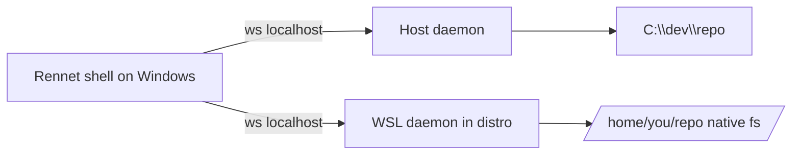

For a project stored inside WSL, Rennet runs its daemon **inside that distro**,
with native Linux `inotify`, `git`, and filesystem, instead of running the daemon
on Windows and reaching across the `\\wsl.localhost\…` (9P/UNC) bridge. This is
the same model VS Code Remote-WSL uses, and for the same reason: the bridge is
wrong for every file operation, not one subsystem.

## Why the bridge fails

A Windows daemon operating on `\\wsl.localhost\<distro>\…` pays the 9P tax on
every file operation, and some operations are simply broken over it:

- The repo watcher gets **no `inotify` events** across the boundary, so it falls
  back to polling, stat-storming tens of thousands of files each interval.
- `lstat` on the pnpm `.bin` symlinks (and intermittently on plain files) throws
  **`EISDIR`** over 9P. Observed live: about 500 `EISDIR` errors in a 7-second
  boot walk of one repo.
- That boot walk **saturates the daemon's libuv thread pool**, which is the same
  pool `undici`'s `dns.lookup` runs on, so GitHub connects time out during the
  storm (`UND_ERR_CONNECT_TIMEOUT`), even though GitHub is reachable (IPv4, about
  20 ms) the instant the storm clears.
- Git and file reads are slow for the same 9P reason.

Patching one symptom (pruning `node_modules` from the watcher) just queues the
next 9P band-aid. Moving the daemon to where the files live deletes the whole
class at once.

## Architecture

The shell keeps its host daemon for host-locus projects and spawns **one daemon
per WSL distro** for WSL-locus projects, routing each project to the daemon for
its [execution locus](../../using/guides/windows-and-wsl.md). Both are reached
over the same loopback WebSocket wire. A WSL2 listener on `127.0.0.1` is
reachable from Windows over `localhost` with no configuration (verified in NAT
networking mode).

## Spike proof (lancelot, 2026-08-20)

Every load-bearing assumption was verified end to end on the real host before any
production code:

| Assumption | Result |
| --- | --- |
| Windows shell to WSL daemon over `localhost` | `healthz` HTTP 200, NAT mode, zero config |
| The daemon runs natively in the distro | bound `127.0.0.1:<ephemeral>`, wrote `daemon.json`, healthy |
| Native watcher vs 9P | **0 `EISDIR`, event-driven** (the same repo threw about 500 `EISDIR`/7 s over 9P) |
| Production spawn via `wsl.exe` from Windows | daemon came up, Windows read the port, `healthz` 200 |
| The macOS-built bundle on WSL Node 24 | ran unchanged, **no native-dependency blocker** (portable CJS; `node:sqlite`) |

## Node detection (the one real gotcha)

The spike surfaced exactly one non-obvious cost: **finding Node in the distro.**
A version-managed Node (asdf/nvm/fnm) is on `PATH` only in an **interactive**
shell, because those managers hook the interactive rc (`.zshrc`/`.bashrc`), not
the login profile. So `wsl.exe -e bash -lc "node …"` finds nothing (proven:
empty output), while the user's login shell run interactively (`-ic`) finds it.

The detection, encoded in [`wsl-node.ts`](https://github.com/rbutera/rennet/blob/main/packages/core/src/wsl-node.ts)
(node-free, pure builders plus an injected runner):

1. Read the login shell: `sh -lc 'getent passwd "$(id -un)" | cut -d: -f7'`.
2. Ask it, **interactively**, for the real binary:
   `<login-shell> -ic 'node -e "process.stdout.write(process.execPath)"'`.
   `process.execPath` resolves a shim to the actual binary, so the daemon is
   later spawned by absolute path with no shell (and no version manager) in the
   hot path.
3. Parse the path out of the output, stripping the interactive shell's prompt
   escapes.

Every spawn goes through `locusCommand`'s byte-verbatim `wsl.exe … -e <program>
<argv…>` form, never the shell form, which `$`-expands and merges quoted args
(command-injection-grade). See [Windows and WSL](../../using/guides/windows-and-wsl.md)
for the user-facing locus setting.

## The runtime

The daemon-in-distro runtime is built, unit-tested behind the
`ensureDaemonForProject` seam, and wired into the desktop shell. Its scope is the
`wsl-daemon-runtime` capability in
[openspec/changes/wsl-daemon-runtime](https://github.com/rbutera/rennet/tree/main/openspec/changes/wsl-daemon-runtime),
landed across PRs [#437](https://github.com/rbutera/rennet/pull/437) (Node
resolution and launch descriptor) and
[#439](https://github.com/rbutera/rennet/pull/439) (delivery, lifecycle,
routing).

1. **Node detection** and the `wsl.exe -e <node> <bundle> serve --data-dir`
   launch descriptor (`resolveWslNode`, `buildWslDaemonLaunch` in
   `packages/core/src/wsl-node.ts`), reusing the existing locus argv/path
   primitives.
2. **Bundle delivery** into the distro's native filesystem, copied once per
   version (`~/.rennet/server/<version>/`), never run back over 9P
   (`ensureWslBundleDelivered` in `packages/core/src/wsl-bundle.ts`).
3. **Lifecycle** over `wsl.exe` (`packages/server/src/wsl-daemon.ts`): detached
   spawn, health polled on the port (not the claim file over 9P), version-skew
   restart (stop the old daemon by pid, wait for it to exit, respawn, and confirm
   the new version), and kill by pid.
4. **Routing orchestration**: `ensureWslDaemon`
   (`packages/server/src/wsl-supervisor.ts`) composes the above into one "ensure
   a healthy daemon for this distro" call, reusing a healthy same-version daemon
   or else delivering and spawning. `ensureDaemonForProject` selects host versus
   WSL locus and single-flights concurrent opens on the same distro. The desktop
   renderer routes each project through it: `apps/desktop/src/main/index.ts`
   detects the locus and calls `ensureDaemonForProject(path, hostDataDir)` for
   the serving port.
5. **Secret store** is distro-native: the daemon's `--data-dir` is
   `~/.local/share/rennet` inside the distro, so its `github-token` and all
   GitHub egress sit natively in the distro, never host-side.

Remaining before the openspec change archives: **live field validation** on
lancelot (the real Windows plus WSL host), confirming end to end the wiring the
unit tests exercise with injected effects.
