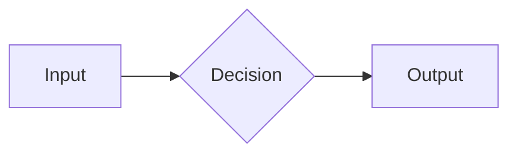

Every product change updates the documentation it affects. This guide shows contributors and agents how to write a page that belongs in the library.

## The two-audience split

Every page lives in exactly one of two areas:

- **Using Rennet**: for people who *run reviews* with Rennet. Task-first. Assume
  no knowledge of the codebase. Never leak an internal package name into a using
  page unless the reader would type it.
- **Developing Rennet**: for people who *build* Rennet. Concepts, guides,
  decisions, reference material, planned work, and contributing rules. Assume
  the reader has the repo open.

If you cannot tell which area a page belongs in, it is probably two pages.

## Voice

- Direct and concrete. Say what the thing does and how to do it.
- Present tense, active voice. "Rennet routes the change", not "the change is
  routed".
- No marketing or hedging. A page for unimplemented behavior declares `status: planned` and links its active tracker.
- Short sentences over long ones. Short paragraphs over walls.
- Keep authorship honest. Models **surface**, **suggest**, **reconstruct**, or
  **flag**. The reviewer **reviews**, **judges**, **approves**, and **publishes**. Do
  not say Rennet "found a bug" or "approved" work on the user's behalf.
- Prefer plain product language over AI clichés. Avoid "magic," "slop," and
  grand claims about intelligence; name the concrete input, output, or action.
- Say **pull request** in user-facing prose. Use **changeset** or **patchset** only
  when the internal distinction matters.

## Page structure

Every page opens with **one or two sentences that say what the page is for**,
before any heading. Then:

1. The shortest path to the thing (a guide) or the clearest statement of the
   idea (a concept).
2. Examples over description. Show the command, the config, the diagram.
3. A "where to go next" set of links when the page is a hub.

Use sentence case for headings. Keep the heading tree shallow. `##` and `###`
are usually enough.

## When to use a diagram

Reach for a mermaid diagram when a **flow** or an **architecture** is easier
seen than read: a pipeline with stages, a dependency graph, a state machine, a
sequence between components. Do not diagram a list.

Write diagrams as fenced `mermaid` code blocks. They render at build time to a themed
SVG that follows the site's light and dark themes. It needs no client-side JavaScript or
headless browser. Supported diagram types: flowchart, sequence, state, class,
ER.

Put each diagram under a specific heading and explain its important point in
nearby prose. The build uses that heading as the diagram's accessible name; the
prose keeps the page useful when a reader cannot see the SVG.

````markdown

````

## Links

- Link across areas when it helps the reader. A using page can point to the corresponding implementation concept.
- Prefer linking a concept once, where it is defined, over re-explaining it.

## The standing obligation

**A change to the monorepo updates the affected docs in the same change.** See the [good Rennet docs standard](./good-docs-standard.md) for the completion criteria and root `AGENTS.md` for the working agreement.
