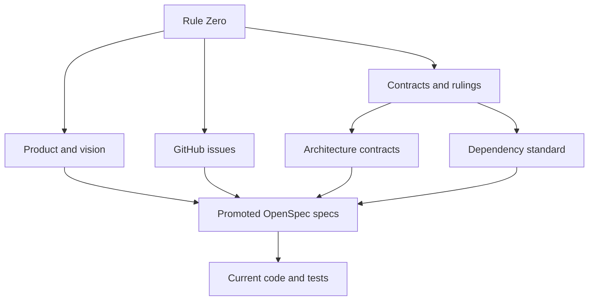
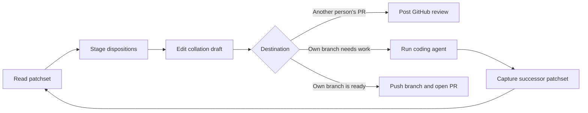
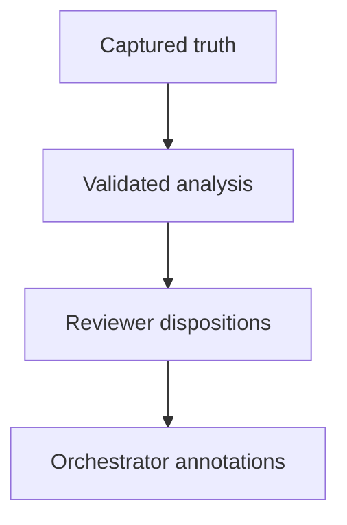

Use this page when two Rennet sources disagree. It assigns authority by subject
and keeps stable ruling IDs for current decisions.

## Authority map

Rule Zero outranks every product plan and engineering contract. It requires
capable agents and rejects permission ceremonies or capability restrictions that
make the product worse at review and coding work.

Apply the sources by scope:

1. Rule Zero decides capability and permission conflicts.
2. [Product and vision](../../using/concepts/product-and-vision.md) defines what Rennet is for.
3. [GitHub issues](https://github.com/rbutera/rennet/issues) own delivery priority and planned work.
4. This page settles general product and architecture conflicts.
5. [Architecture contracts](../concepts/architecture-contracts.md) own patchsets, context, persistence, privacy, and publication.
6. [Dependency standard](../reference/dependency-standard.md) owns packages, versions, licences, and tool overlap.
7. Promoted OpenSpec specs define accepted behavior for named capabilities.
8. Code and tests show observed implementation. A conflict with an authority is an implementation gap or a documentation defect.

## Product shape

| ID | Current ruling |
|---|---|
| **R1** | The product and package namespace are Rennet and `@rennet/*`. |
| **R2** | The Claude adapter uses `@anthropic-ai/claude-agent-sdk` with the user's installed `claude`. Packaging strips the SDK's platform executables. |
| **R3** | Every Rennet package uses the MIT licence. `types` and `protocol` remain separate for architecture, not licensing. |
| **R4** | Base instructions live in `@rennet/instructions`. They are product behavior, not part of the public RSP wire contract. |
| **R6** | Disagreement is a product data shape. It requires more than one real opinion; repeated concern is evidence, not a fixed model-call count. |
| **R7** | Review of another person's pull request and review of the user's own branch are first-class modes. |
| **R11** | The five canvases are Spec, Sequence, Decisions, Noise, and Flagged. Blast radius is an overlay. |
| **R23** | `omp` means `@oh-my-pi/pi-coding-agent`. |
| **R26** | Rennet's default interface is the opaque Affineur's Bench, and it is the theme Rennet ships screenshots of. Code and diff regions remain opaque. A viewer may select a bundled theme pack, which re-colours the same opaque interface under the same AA contract; packs never restore glass or alter type, spacing, or radius. |

## Review engine and data

| ID | Current ruling |
|---|---|
| **R8** | Occurrence IDs and an explicit lineage graph own identity. Similarity is evidence. Ambiguous, split, merged, or changed content reopens. |
| **R9** | Deterministic decomposition guarantees complete coverage and an offline floor. A harness may propose the human-facing graph; validation rejects omissions, duplicates, invalid anchors, and oversize units. |
| **R10** | Local code handles non-semantic work. Batched model jobs handle semantic work. Performance targets never justify skipping analysis or presenting the deterministic floor as a model review. |
| **R13** | Harness capability begins false and becomes available through conformance. Capabilities include model selection and advertised models. |
| **R17** | Commands produce receipts and events. Projections rebuild from durable history. Publication represents `outcome-unknown` and queries before retrying. |
| **R18** | Diff ingestion preserves bytes and represents binaries, submodules, mode-only changes, oversize splits, and incomplete capture explicitly. |
| **R19** | Public protocol is transport-neutral and JSON-Schema-first. Private commands and events are Zod-first. Remote clients receive recipient-specific projections without host paths. |
| **R20** | The UI splits in two: `@rennet/ui` (the vendored shadcn/Base UI component kit) imports only `types` and `theme`; `@rennet/app-ui` (Rennet's composites and screens) imports only `types`, `protocol`, `theme`, `ui`, and browser-safe dependencies. Neither imports `core`. |
| **R21** | Production packages are `types`, `theme`, `protocol`, `instructions`, `core`, `adapters`, `server`, `client`, `ui`, and `app-ui`, with apps as composition roots. CI checks the dependency arrows. |
| **R24** | Forge behavior sits behind capability-based `ForgePort`. Core does not contain scattered GitHub conditionals. |
| **R28** | A review edition is an immutable patchset. Source movement creates a successor patchset. |
| **R29** | Exact unaffected analysis may carry forward. Direct changes invalidate; dependency, context, and ambiguity changes become potentially invalid. |
| **R30** | Project context is fingerprinted by source, config, generator, schema, toolchain, and shards. Non-current context is rebuilt or omitted with explicit degradation. |
| **R31** | Harness runs receive assembled context and usable execution authority. The run ledger names provider egress, model source, authority, and non-enumerable ambient inputs. |
| **R32** | Event history lasts while the review is retained. Delete physically removes Rennet-controlled copies. Unknown events remain byte-identical and mark affected projections incomplete. |
| **R33** | Another person's pull request receives one idempotent GitHub review. The user's branch path pushes the named branch and opens the composed pull request. |
| **R35** | Harnesses stream through `AsyncIterable`; the event store owns durable truth; small injected-clock batchers own coalescing. Rennet does not use an RxJS dataflow layer. |

## Tooling and dependencies

| ID | Current ruling |
|---|---|
| **R22** | Repository contributions carry no AI attribution or co-author trailers. |
| **R34** | pnpm owns dependency resolution, Nx owns the project graph and local cache, Vite owns renderer builds, and Electron Forge owns desktop package and release tasks. |

The [dependency standard](../reference/dependency-standard.md) contains the exact
pins and admission rules.

## Dispositions and destinations

| ID | Current ruling |
|---|---|
| **R36** | Creating a disposition stages it immediately. |
| **R37** | Withdraw removes an item from the draft. Editing a staged item updates that draft item. |
| **R38** | Posting uses every item currently staged. Withdraw items that should not leave. |
| **R40** | The collation draft is editable. Preview renders the composed outbound artifact. |
| **R46** | Comments, change requests, questions, and discussions attach to the relevant line, range, chunk, fragment, or spec anchor. |
| **R52** | Conversation uses verbs and anchors. Threads and symbol inspection occupy the margin or right rail so the diff column does not reflow. |
| **R53** | OpenSpec requirements, scenarios, tasks, and rationale render as structured review material with coverage and implementation state. |

The same disposition model feeds two destinations. Another person's pull request
receives one GitHub review. The user's branch receives a coding-agent task bundle,
then a successor patchset and delta review. When the branch is ready, Rennet
pushes the named branch and opens the composed pull request.

Rennet composes the outbound artifact before the GitHub call. The preview and
post commands use the same canonical payload. Pushing a source branch is part of
the own-branch workflow; it is not the act that publishes review prose under the
user's identity.

The UI currently asks the user to press and hold its Post control, and the daemon
uses a short-lived consent token for `publish.review`. That implementation does
not satisfy Rule Zero. [The planned correction](https://github.com/rbutera/rennet/issues/435)
is one explicit Post action over the current canonical preview, with no second
confirmation or token.

## Routing and interaction

| ID | Current ruling |
|---|---|
| **R39** | The Model Council may route a job to another installed harness. Every run records its harness and model; the user can pin a job or tier. |
| **R41** | Product chrome is terse. Analysis, narration, and conversation may use the voice the work requires. |
| **R42** | Use icons when they remove chrome noise without removing meaning. Keep an accessible label or legend. |
| **R44** | Screens may scroll vertically. Do not truncate a stage to fit one viewport. |
| **R45** | Diff views provide implementation-to-test navigation and open-in-editor where the evidence exists. |
| **R47** | A patchset freezes review intent from the pull request or local branch, plus relevant spec snapshots and digests. |
| **R48** | Decisions derive from spec, stated intent, and diff evidence. They are grouped, uncapped, and not pre-judged by a user-facing taxonomy. |
| **R49** | Flagged indexes anchored findings and disagreements with severity and agreement state. Schema validation failures are malformed analysis, not findings. |
| **R50** | Noise provides visible total coverage. Mechanical rules classify unambiguous churn; model judgement handles the remainder; restoring an item returns it to review. |
| **R51** | `review.ask` returns one orchestrator answer by default. Ask both adds a separately labelled second opinion and no synthetic third answer. |

Read state is action-defined: approve, request a change, or ask a question. Scroll
position and dwell time do not mark content read.

## Repo Map

| ID | Current ruling |
|---|---|
| **R54** | Repo Map means a deterministic project snapshot, evidence-backed knowledge, and a small retrieval primer. Maps compose by reference and update incrementally. |
| **R55** | Derived maps are local-first under `~/.rennet/projects/<escaped-absolute-path>/`, with one entry per checkout or worktree. A deliberate promotion mirrors a validated map into `.rennet/`. |

Local state wins when both local and promoted maps exist. Rennet changes its own
visibility files but never stages or commits `.rennet/` content.

## Canvas contract

An angle is a view over review material. A canvas is one stateful angle instance
for a `(reviewId, patchsetId)` pair.

The engine owns capture, invalidation, carry, and ordering. Analysis jobs emit
RSP documents. The orchestrator uses `canvasOps@2` to describe, retrieve, focus,
annotate, propose, and recompute. Tool results include evidence, freshness,
totals, cursors, and truncation state.

Track product work and unresolved decisions in
[GitHub issues](https://github.com/rbutera/rennet/issues).
