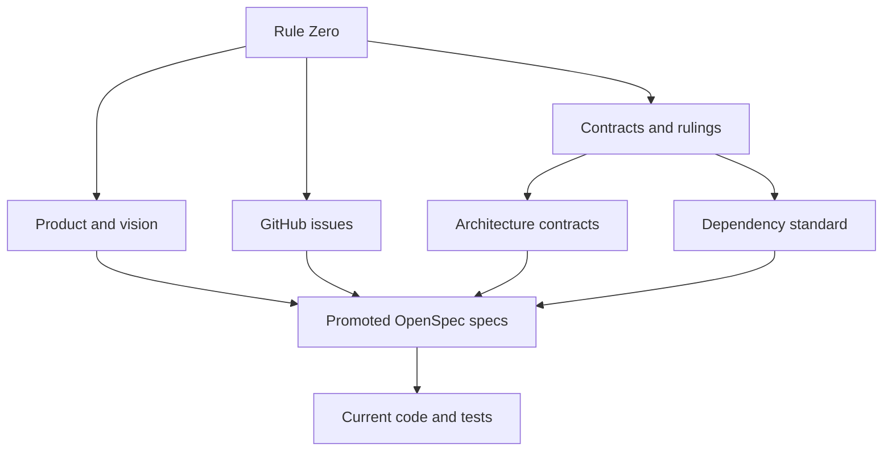
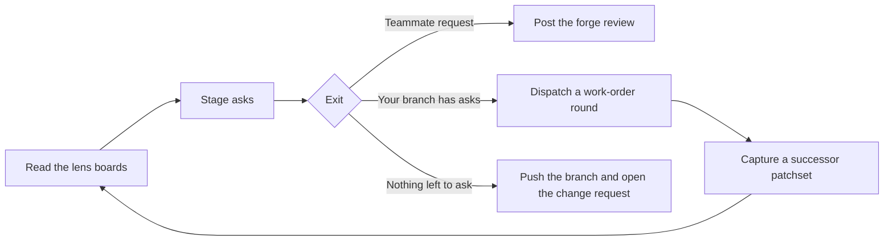
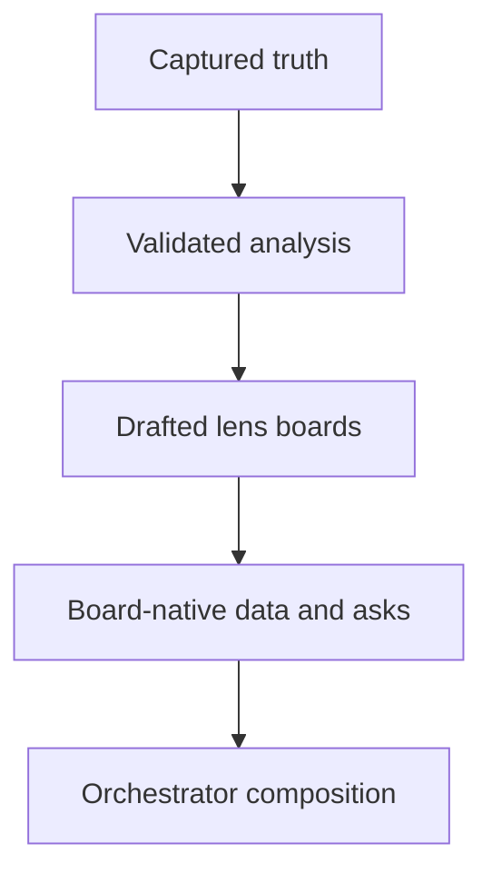

Use this page when two Rennet sources disagree. It assigns authority by subject
and keeps stable ruling IDs for current decisions.

## Authority map

Rule Zero outranks every product plan and engineering contract. It requires
capable agents and rejects permission ceremonies or capability restrictions that
make the product worse at review and coding work.

Apply the sources by scope:

1. Rule Zero decides capability and permission conflicts.
2. [Product and vision](../../using/concepts/product-and-vision.md) defines what Rennet is for.
3. [GitHub issues](https://github.com/rbutera/rennet/issues) own delivery priority and planned work.
4. This page settles general product and architecture conflicts.
5. [Architecture contracts](../concepts/architecture-contracts.md) own patchsets, context, persistence, privacy, and publication.
6. [Dependency standard](../reference/dependency-standard.md) owns packages, versions, licences, and tool overlap.
7. Promoted OpenSpec specs define accepted behavior for named capabilities.
8. Code and tests show observed implementation. A conflict with an authority is an implementation gap or a documentation defect.

## Product shape

| ID | Current ruling |
|---|---|
| **R1** | The product and package namespace are Rennet and `@rennet/*`. |
| **R2** | The Claude adapter uses `@anthropic-ai/claude-agent-sdk` with the user's installed `claude`. Packaging strips the SDK's platform executables. |
| **R3** | Every Rennet package uses the FSL-1.1-MIT licence (Functional Source License, MIT Future License): source-available, free for any non-competing use, with each release converting to MIT two years after publication. This is the outbound licence and is independent of dependencies' inbound licences. |
| **R4** | Base instructions live in `@rennet/prompts`. They are product behavior, not part of the public RSP wire contract. |
| **R6** | Disagreement is a product data shape. It requires more than one real opinion; repeated concern is evidence, not a fixed model-call count. |
| **R7** | Review of another person's pull request and review of the user's own branch are first-class modes. |
| **R11** | The five review lenses are Design, Sequence, Decisions, Flagged, and Noise, in that display order. Each lens is its own board. Blast radius is an overlay. |
| **R23** | `omp` means `@oh-my-pi/pi-coding-agent`. |
| **R26** | Rennet's default interface is the opaque Affineur's Bench, and it is the theme Rennet ships screenshots of. Code and diff regions remain opaque. A viewer may select a bundled theme pack, which re-colours the same opaque interface under the same AA contract; packs never restore glass or alter type, spacing, or radius. **Narrowly amended 2026-08-28 (#558):** chrome that floats over content in the desktop shell's full-bleed state — the corner-slot pill and the chip layer the session bar dissolves into — may use a translucent, blurred ground. Opaque remains the rule everywhere else, and theme packs still never restore glass. |

## Review engine and data

| ID | Current ruling |
|---|---|
| **R8** | Occurrence IDs and an explicit lineage graph own identity. Similarity is evidence. Ambiguous, split, merged, or changed content reopens. |
| **R9** | Deterministic decomposition guarantees complete coverage and an offline floor. A harness may propose the human-facing graph; validation rejects omissions, duplicates, invalid anchors, and oversize units. |
| **R10** | Local code handles non-semantic work. Batched model jobs handle semantic work. Performance targets never justify skipping analysis or presenting the deterministic floor as a model review. |
| **R13** | Harness capability begins false and becomes available through conformance. Capabilities include model selection and advertised models. |
| **R17** | Commands produce receipts and events. Projections rebuild from durable history. Publication represents `outcome-unknown` and queries before retrying. |
| **R18** | Diff ingestion preserves bytes and represents binaries, submodules, mode-only changes, oversize splits, and incomplete capture explicitly. |
| **R19** | Public protocol is transport-neutral and JSON-Schema-first. Private commands and events are Zod-first. Remote clients receive recipient-specific projections without host paths. |
| **R20** | The UI splits in two: `@rennet/ui` (the vendored shadcn/Base UI component kit) imports only `protocol` and `theme`; `@rennet/app-ui` (Rennet's composites and screens) imports only `protocol`, `theme`, `ui`, and browser-safe dependencies. Neither imports `core`. `@rennet/t3-chat` (the native T3 Code chat mount) imports `protocol` and the vendored `@t3tools/*` packages, and reaches `app-ui` only through the chat-slot context the desktop host provides. |
| **R21** | Production packages are `protocol`, `theme`, `prompts`, `core`, `adapters`, `server`, `client`, `ui`, and `app-ui`, with apps as composition roots. `protocol` is the base layer: its Zod schemas are the single source of truth for the wire types, which are `z.infer` exports. CI checks the dependency arrows. |
| **R24** | Forge behavior sits behind capability-based ports. Server-side consumers select a registered provider from the repository's forge identity; an unregistered provider never falls through to GitHub. Core does not contain scattered GitHub conditionals. |
| **R28** | A review edition is an immutable patchset. Source movement creates a successor patchset. |
| **R29** | Exact unaffected analysis may carry forward. Direct changes invalidate; dependency, context, and ambiguity changes become potentially invalid. |
| **R30** | Project context is fingerprinted by source, config, generator, schema, toolchain, and shards. Non-current context is rebuilt or omitted with explicit degradation. |
| **R31** | Harness runs receive assembled context and usable execution authority. The run ledger names provider egress, model source, authority, and non-enumerable ambient inputs. |
| **R32** | Event history lasts while the review is retained. Delete physically removes Rennet-controlled copies. Unknown events remain byte-identical and mark affected projections incomplete. |
| **R33** | Another person's GitHub pull request or GitLab.com merge request receives one idempotent forge review, flattened against the provider's capabilities. The user's branch path pushes the named branch and opens the composed GitHub pull request or GitLab.com merge request selected by its effective push remote. |
| **R35** | Harnesses stream through `AsyncIterable`; the event store owns durable truth; small injected-clock batchers own coalescing. Rennet does not use an RxJS dataflow layer. |

## Tooling and dependencies

| ID | Current ruling |
|---|---|
| **R22** | Repository contributions carry no AI attribution or co-author trailers. |
| **R34** | pnpm owns dependency resolution, Nx owns the project graph and local cache, Vite owns renderer builds, and Electron Forge owns desktop package and release tasks. |

The [dependency standard](../reference/dependency-standard.md) contains the exact
pins and admission rules.

## Asks and the exits

| ID | Current ruling |
|---|---|
| **R36** | Everything the review gathers is an ask: a typed message carrying an anchor, text, an intent, and an exit lane, with provenance back to the finding, comment, thread, or conversation it came from. The orchestrator stages it. It stages directly when the reviewer stated the conclusion, and offers a one-tap pill when it inferred one. Findings never auto-stage. |
| **R37** | Every staging act leaves an undecorated receipt at its source, and the receipt is the undo. |
| **R38** | An exit carries every ask currently staged for its lane. Undo the receipt of an ask that should not travel. |
| **R40** | Outbound documents are living drafts whose initial structure and model reworks belong to the orchestrator. The reviewer may save a direct block edit or steer by conversation and span selection. A saved edit replaces the canonical durable block consumed by every exit; it never becomes a client-only shadow. Retired content is ledgered with its reason and stays restorable. Preview renders the exact payload that posts. |
| **R46** | Findings, change requests, questions, and discussions attach to the relevant line, range, hunk, element, or spec anchor. |
| **R52** | Conversation uses verbs and anchors. Threads and symbol inspection occupy the margin or right rail so the reading column does not reflow. |
| **R53** | Spec requirements, scenarios, tasks, and rationale render as structured review material with coverage and implementation state. |

The same ask model feeds three exits. A teammate pull or merge request receives
one review on its forge.
Your branch receives a work-order round, then a successor patchset and a new
generation of boards. When nothing is left to ask, Rennet pushes the named
branch and opens the composed GitHub pull request or GitLab.com merge request.
Work orders exist only on your own branch.

Rennet composes the outbound artifact before the forge call. The preview and
post commands use the same canonical payload. An own-branch preview also names
and binds the provider-qualified repository resolved from the effective push
URL; the server resolves it again immediately before push and refuses a changed
destination. Pushing a source branch is part of the own-branch loop; it is not
the act that publishes review prose under the user's identity.

Publication is one explicit Post over the current canonical preview. There is no
press-and-hold control and no consent token: a second confirmation over a payload
the reviewer has already read in full is exactly the ceremony Rule Zero rejects.

## Routing and interaction

| ID | Current ruling |
|---|---|
| **R39** | The Model Council may route a job to another installed harness. Every run records its harness and model; the user can pin a job or tier. |
| **R41** | Product chrome is terse. Analysis, narration, and conversation may use the voice the work requires. |
| **R42** | Use icons when they remove chrome noise without removing meaning. Keep an accessible label or legend. |
| **R44** | Screens may scroll vertically. Do not truncate a stage to fit one viewport. |
| **R45** | Diff views provide implementation-to-test navigation and open-in-editor where the evidence exists. |
| **R47** | A patchset freezes review intent from the pull request or local branch, plus relevant spec snapshots and digests. |
| **R48** | Decisions derive from spec, stated intent, and diff evidence. They are grouped, uncapped, and not pre-judged by a user-facing taxonomy. |
| **R49** | Flagged indexes anchored findings and disagreements with severity and agreement state. Schema validation failures are malformed analysis, not findings. |
| **R50** | Noise provides visible total coverage. Mechanical rules classify unambiguous churn; model judgement handles the remainder; restoring an item returns it to review. |
| **R51** | *(Retired 2026-09-03.)* Rennet's own orchestrator chat is deleted; a session's conversation is its T3 Code thread, which answers on one model with no second-opinion mode. |

Read state is action-defined: the reviewer's own acts — staging an ask, marking a
section, concluding a thread — mark content read. Scroll position and dwell time
do not.

## Repo Map

| ID | Current ruling |
|---|---|
| **R54** | Repo Map means a deterministic project snapshot — what reading the tree at a pinned OID proves, and nothing a model asserted about the repository. Maps compose by reference and update incrementally. |
| **R55** | Derived maps are local-first under `~/.rennet/projects/<escaped-absolute-path>/`, with one entry per checkout or worktree. A deliberate promotion mirrors a validated map into `.rennet/`. |

Local state wins when both local and promoted maps exist. Rennet changes its own
visibility files but never stages or commits `.rennet/` content.

## Review lens contract

Each lens is a board over one immutable patchset. A generation is one immutable
board visit over that patchset. A later round may revisit the same content-addressed
patchset, but it gets a distinct generation id and the earlier visit stays frozen.

The engine owns capture, invalidation, carry, and ordering. Analysis jobs emit
RSP documents that project onto the lens boards. Retrieval replies carry
evidence, freshness, totals, cursors, and truncation state.

Track product work and unresolved decisions in
[GitHub issues](https://github.com/rbutera/rennet/issues).
