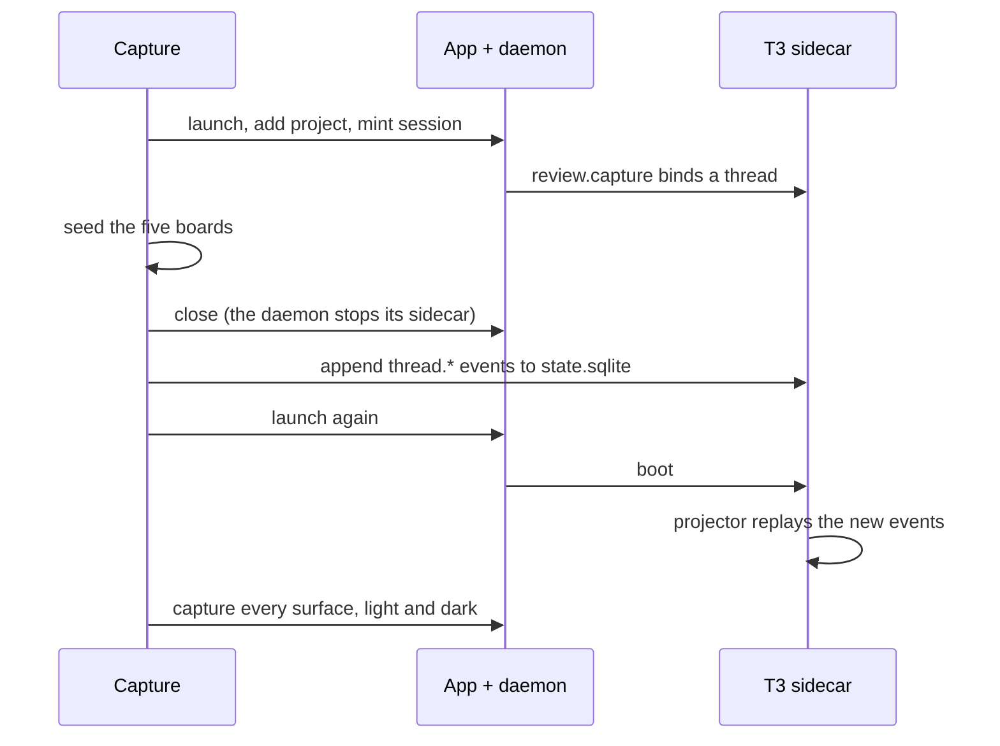

The product images on the marketing site are captures of the shipped desktop app reviewing an invented fixture branch, with a reviewer's conversation in the chat pane. This page says where they come from, what each one shows, and how to make them again after the app's chrome changes.

## Regenerate

```sh
pnpm nx run rennet-marketing:screenshots
```

The target is not cached. It builds the desktop app if it needs to, launches it under Playwright's Electron driver, seeds the fixture, captures every surface at a device scale factor of 2 in both colour schemes, and writes the optimised PNGs into `apps/marketing/public/product/`. Commit those. The raw captures land in `apps/marketing/.screenshots-raw/`, which git ignores.

Nothing model-backed runs. The app is launched with the same model-free environment the hermetic e2e specs use (`RENNET_DISABLE_HARNESS=1`, a throwaway `HOME`, a PATH holding only `node` and `git`), so no `claude` or `codex` binary is found and nothing leaves the machine. The drafting attempt fails honestly and the board is seeded in its place.

## What is in the picture

The fixture is `atlas`, a small TypeScript HTTP service written for this purpose, on a branch `feat/rate-limiting` that adds per-organisation rate limiting: a token bucket, a store interface with memory and Redis implementations behind a fail-open wrapper, middleware, config, an API-doc contract change, an OpenSpec change, a test file still uncommitted in the working tree, and the lockfile and import-order churn a real branch carries. The five lens boards read like a settled council run over that branch: a reading order with real code refs, five decisions, three findings (one high, with Claude and Codex disagreeing on its severity), a Design board grounded in the spec, and per-hunk noise verdicts. Every code ref is resolved by looking up the cited line in the fixture file, so a line number on the board cannot drift from the code.

The chat pane holds three turns of a reviewer questioning the branch: whether the limiter charges before auth, why the store wrapper fails open, and what the smallest change is that closes the visibility gap and fixes the 429 body. The orchestrator answers with the files and the Flagged findings; it surfaces and suggests, and it never claims to have staged, dispatched, pushed or posted anything. One request-change is staged, by the reviewer, on the 429 lines of the middleware.

It is a fixture, not a client repository, a real pull request, or anyone's data. The page caption says so.

## How the conversation gets into the pane

The chat pane is the vendored T3 Code thread view, mounted natively and reading the daemon-owned sidecar's own store. Nothing stands in for it. `review.capture` binds a real thread to the session, and once the board is seeded the capture closes the app, appends the conversation to that thread as the sidecar's own orchestration events, and launches the app again:



The events are the ones a real turn leaves behind, in the same order: the reviewer's `thread.message-sent` and `thread.turn-start-requested`, the session going running, a `thread.activity-appended` per tool call (`tool.completed`, shaped as the Claude adapter shapes them), the assistant's `thread.message-sent`, the turn settling, and the session going idle. The thread id comes from the daemon's `thread-bindings.json`, never invented; the store is `<userData>/t3/userdata/state.sqlite`, written with `node:sqlite` while the sidecar is down. At the sidecar's next boot its projector replays every event after its checkpoint, so the pane renders the thread exactly as it renders one a reviewer typed. Nothing under `vendor/` is edited.

The staged request-change goes through the durable ask log (`AskLogStore`), as the Request Changes popover writes it: a `quote-open` for the thread and a `stage` carrying the code ref.

## Where the pieces live

| Piece | Path |
| --- | --- |
| The repository and the board | `apps/desktop/e2e/marketing-fixture.ts` |
| The conversation and its seeding | `apps/desktop/e2e/marketing-conversation.ts` |
| The capture (launch, seed, relaunch, screenshot) | `apps/desktop/e2e/marketing-screenshots.capture.ts` |
| The Playwright config that runs only the capture | `apps/desktop/playwright.screenshots.config.ts` |
| PNG optimisation (palette quantisation through `sharp`) | `apps/marketing/scripts/optimize-screenshots.mjs` |
| The Nx target | `screenshots` in `apps/marketing/project.json` |
| The page that shows them | `apps/marketing/src/pages/index.astro` |

The capture file is not a `*.spec.ts`, so `pnpm nx run rennet-desktop:e2e` and `pnpm check` never run it; the desktop `lint` and `typecheck` targets still cover it.

## Captured surfaces

Every surface is captured at 1536×1024 CSS pixels (3072×2048 device pixels), once with `prefers-color-scheme: light` and once with `dark`, as `<name>-{light,dark}.png`. The chat pane with the conversation is in every frame. Wherever a cited span is on screen it is the app's own syntax-highlighted TypeScript.

| Name | What it shows |
| --- | --- |
| `lens-sequence` | The Sequence lens scrolled to its second step, the token bucket, with `take` from `src/rate-limit/bucket.ts` beneath the prose and the annotation on its clamp lines. The hero image on the page. |
| `lens-decisions` | The Decisions lens from its title: the first decision with its rationale, alternatives not taken, and the cited bucket lines. |
| `lens-flagged` | The Flagged lens from its title: the high finding open, with its lifted fix, the Dismiss / Discuss / Request This Change actions, and the `failOpen` evidence. |
| `lens-design` | The Design lens at its first requirement: the SHALL, its scenarios, the trace chips, and the bucket span revealed beneath them. |
| `diff-viewer` | The built-in Diff view on `src/rate-limit/middleware.ts`, with the changed-files rail and the staged ask's markers on the 429 lines. |
| `explain-request-changes` | The Flagged lens with lines of `failOpen` selected and the selection toolbar showing Comment, Request Changes and Explain. |
| `handoff-changes` | The hand-off lane in its Changes state: the reviewer's staged request-change with its cited lines revealed and its comment thread, and Dispatch Round beneath. |

Two surfaces are not captured, because they cannot be reached honestly without a model turn. The own-branch lane becomes the pull request only once no ask remains and `publish.compose` has drafted a body, and the body drafter is the live council-routed producer; without a harness the compose degrades to the branch name and an empty description. The teammate "Write Review" lane needs a captured pull request with a `postTarget` and an authored opener, which only the publish-proof fixture's in-process daemon can supply. Capture those when a lane has a way to draft the body without a harness, and add them to the table.

Only what the page uses, or a page section is about to use, is captured and committed: every PNG in `public/product/` ships with the site. To add a surface, add a `selectLens`, `route` or `openDiffView` step and a `capture(page, retina, name, scheme)` call inside the scheme loop of the capture file; the optimiser picks up every PNG in the raw directory. The device scale factor is set through a CDP session the capture keeps open, because Chromium on macOS ignores `--force-device-scale-factor` and Playwright's own viewport emulation pins the factor to 1. Each scheme gets a fresh render, and first-run coachmarks and the model-free provider banner are dismissed right before every screenshot because they arrive asynchronously.

## When to regenerate

Regenerate when the review board, the chat pane, the top bar, or the sidebar change shape, and when the fixture or the conversation changes. A capture that shows chrome the app no longer has is the same defect as copy that describes a feature the app no longer has. Look at the output before committing it: the PNGs are the claim, and the build does not check them.
