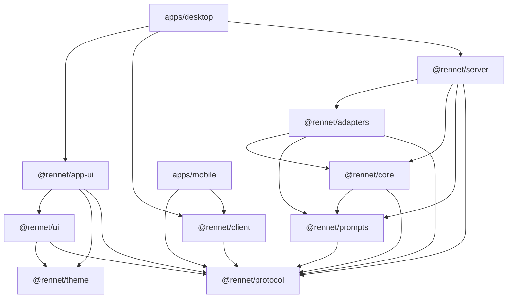

Use this guide for a fresh clone or worktree. The root manifest, lockfile, and Nx
configuration define the development environment.

## Install the toolchain

Rennet pins Node `24.18.0` in `.nvmrc` and pnpm `10.32.1` in `package.json`.
Select the pinned Node version, then install the committed dependency graph:

```sh
corepack enable
pnpm install --frozen-lockfile
```

Use the workspace copy of Nx through `pnpm nx`. A global Nx installation is not
part of the toolchain.

## Inspect the workspace

Ask Nx for project and target names before running them:

```sh
pnpm nx show projects
pnpm nx show project rennet-core --json
pnpm nx show project rennet-desktop --json
```

The production workspace contains four apps and nine packages:

| Area | Projects |
|---|---|
| Apps | `rennet-desktop`, `rennet-docs`, `rennet-marketing`, `rennet-mobile` |
| Product packages | `rennet-protocol`, `rennet-prompts`, `rennet-core`, `rennet-adapters`, `rennet-server`, `rennet-client`, `rennet-ui`, `rennet-app-ui`, `rennet-theme` |

`rennet-docs-content` represents the canonical Markdown library under `docs/`.
The root `rennet` project owns repository-wide checks. Spikes have their own Nx
projects but stay outside the pnpm workspace.

The [monorepo map](../reference/monorepo-map.md) lists each project and its role.

## Follow the package boundaries



An arrow means "imports." `protocol` and `theme` import no Rennet package. `core`
contains platform-neutral product logic. `adapters` owns Git, filesystem,
GitHub, harness, and process effects. `server` composes the daemon. `client`
implements the transport-neutral client. `ui` is the vendored component kit,
importing only `protocol` and `theme`. `app-ui` builds the Rennet interface on that
kit. Both stay browser-safe. The desktop and mobile apps are composition roots
for their platforms.

`scripts/check-boundaries.mjs` checks manifest dependencies and source imports.
See the [architecture overview](../concepts/architecture-overview.md) and
[architecture contracts](../concepts/architecture-contracts.md) for the full
ownership rules.

## Run repository tasks

Use Nx for builds, tests, lint, and type checks. The full local and CI gate is:

```sh
pnpm check
```

It runs `format`, `architecture`, `licenses`, `vendor-ledger`, `lint`,
`typecheck`, and `build` across the workspace, then `test` and `dogfood-test`
together. `dogfood-test` is the uncacheable suite that reads the live rennet
checkout; scheduling it in the same `run-many` keeps it off the critical path.
Use the affected gate while iterating:

```sh
pnpm nx affected -t lint,typecheck,test,build
```

Run the full gate before pushing. For a new regression test, prove that it fails
when the protected behavior is broken, then restore the implementation and prove
that it passes.

### Measure the project-snapshot build

The project snapshot is the slowest thing a user waits for when Rennet first
opens a repository, and the slowest suite in the gate. Measure it before
changing it:

```sh
pnpm nx run rennet-adapters:snapshot-profile
```

The harness builds a clean full snapshot of the current checkout three times and
prints a per-stage median — `resolve`, `tree`, `workspace`, `conventions`,
`symbols`, `build`, `verify`, `store` — alongside the count and wall time of
every `git` invocation, broken down by subcommand. It reads the live checkout,
so its target is uncacheable and its suite is skipped unless
`RENNET_SNAPSHOT_PROFILE=1` is set.

Set `RENNET_SNAPSHOT_CPUPROF=1` to also write a `.cpuprofile` for the last run,
and `RENNET_SNAPSHOT_PROFILE_RUNS`, `RENNET_SNAPSHOT_PROFILE_REPO` and
`RENNET_SNAPSHOT_PROFILE_OUT` to change the run count, the repository measured,
and where the report is written.

Blobs are read in batches through one `git cat-file --batch` process per chunk,
not one `git cat-file blob` process per file. A change that reads blob content
per file reintroduces a process spawn per file, which was 29 s of a 33 s
snapshot of this repository; the harness is how you see that before it ships.

## Keep Nx cache results meaningful

Cacheable targets declare the source, shared configuration, environment inputs,
and generated outputs that decide their results. Trust a matching local cache
hit. If a changed input can produce a stale pass, reproduce the fault and correct
the target inputs.

Do not run concurrent Nx processes in one worktree. Nx can race its task-history
database and report `FOREIGN KEY constraint failed` or `disk I/O error` after a
target succeeds. Nx 23.1 shares both halves of the cache through the main
worktree, so every worktree gates with the same command:

```sh
CI=true NX_DAEMON=false pnpm check
```

For that exact failure, wait for every Nx process in the worktree to exit, then
run `pnpm nx reset --onlyDaemon` without `NX_DAEMON=false`. The daemon-only reset
stops the daemon without a full reset; a bare `pnpm nx reset` from a worktree can
clear the main checkout's cache and workspace data. Long-running, interactive,
and end-to-end targets are not cacheable.

### Keep the two halves of the cache together

Nx stores a cache entry in two places. The artifact store holds the files a hit
restores and honours `NX_CACHE_DIRECTORY`. The metadata database decides whether
a task is a hit at all, lives in `.nx/workspace-data`, and does not honour that
variable — Nx resolves it against the main worktree so every worktree shares one
database. Nx declares a hit from the database alone and never checks that the
artifact store still holds the bytes.

Redirecting one store without the other therefore manufactures hits that restore
nothing: a build reports `Cache: 1/1 hit (100%)`, exits 0, writes no `dist/`, and
whatever depends on it fails on a missing bundle. Set both variables or neither:

```sh
# isolate a worktree's whole cache, both halves together
NX_CACHE_DIRECTORY="$PWD/.nx-isolated/cache" \
NX_WORKSPACE_DATA_DIRECTORY="$PWD/.nx-isolated/workspace-data" pnpm check
```

`pnpm check` runs `scripts/nx-cache-doctor.mjs` first. It refuses a split pair
with the corrected command, and it deletes any entry whose recorded byte count is
no longer on disk, which turns a silently wrong build back into an honest miss.
Run it on its own with `pnpm nx:doctor` after deleting cache files by hand.

Worktrees share one artifact store on purpose. A per-worktree store was tried, to
stop one worktree's cleanup deleting another's live artifacts, but that cleanup
existed only to remove the per-worktree store: removing both removes the hazard
too. What remains is a bare `pnpm nx reset` from a worktree, which the section
above already rules out, and which `pnpm nx:doctor` recovers from — the affected
worktrees rebuild rather than restore nothing. Reaching for `NX_CACHE_DIRECTORY`
the next time worktrees contend does not help, because it does not move the half
that decides a hit.

## Place new work

| Change | Owner |
|---|---|
| Shared wire type, schema, or command | `packages/protocol` |
| Product rule or pure transformation | `packages/core` |
| Git, filesystem, network, or process effect | `packages/adapters` |
| Daemon composition or dispatch | `packages/server` |
| Client transport and projection | `packages/client` |
| Vendored component primitive | `packages/ui` |
| Rennet review interface | `packages/app-ui` |
| Electron integration | `apps/desktop` |
| Expo integration | `apps/mobile` |

Define a core port when product logic needs a platform capability. Implement the
port in `adapters`, then compose it in the relevant app or server. Keep all
packages under the repository's FSL-1.1-MIT licence.

## Keep the checkout healthy

- Preserve unrelated work in a dirty tree and stage only files in your change.
- Keep spikes outside the pnpm workspace.
- Update affected documentation in the same change.
- Do not add AI attribution or co-author trailers.
- Track delivery priority in the [GitHub issue queue](https://github.com/rbutera/rennet/issues).
