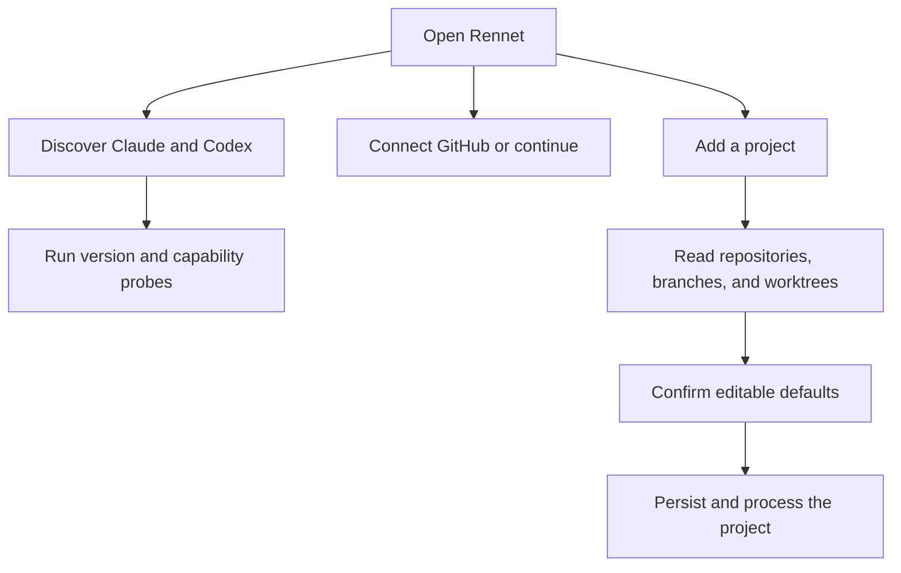

Rennet discovers local tools and repository facts, then stores only preferences
that have live consumers. Settings are split between machine-local files and the
selected repository's `.rennet/` directory.

## First run

The empty Projects screen is the first-run flow. It lets you connect GitHub, add
a project, and see which supported harnesses Rennet found.

Rennet discovers Claude and Codex executables by collecting candidate locations
and running version probes. It does not depend on `which`. GUI applications often
receive a different `PATH` from terminal sessions, so discovery also checks known
install locations. On macOS, the Codex binary bundled with ChatGPT desktop is a
candidate below a user-installed Codex CLI. Every selected Codex candidate must
complete an app-server handshake.

The Claude adapter starts the user's installed `claude` through
`@anthropic-ai/claude-agent-sdk`. The Codex adapter starts the user's installed
`codex app-server`. Each harness owns its authentication; Rennet does not ask for
provider credentials.

The Connect GitHub card signs in with Rennet's OAuth device flow, which needs no
`gh` CLI. Settings also accepts a personal access token and disconnects the
current account. Rennet stores the GitHub credential in an owner-only file under
its data directory and validates it when a GitHub operation needs it. See
[GitHub authentication](../../using/guides/github-auth.md) for the sign-in flow.



## Add a project or workspace

Choose either one repository or a directory containing several repositories.
Rennet reads the selected path and returns an editable draft containing the
detected repositories, worktrees, and primary branch. A workspace can include a
subset of the repositories it contains.

Discovery does not fetch, check out, or create `.rennet/`. Processing starts only
after the project draft is confirmed.

## Global settings

Global settings live in `~/.rennet/config.json`.

| Setting | Values | Behavior |
|---|---|---|
| Appearance | system, dark, light | Applies the selected color scheme to the app. |
| Keybindings | command ID to chord or explicit unbind | Overrides the command catalogue on this machine. |
| Daemon listener | host and optional port | Allows a configured non-loopback listener for remote clients. |

Settings has four tabs: Global, Repo, Keyboard, and Pairing. The Global tab
edits appearance; the Keyboard tab edits keybindings. The keybinding recorder
needs a platform primary modifier or a bare key and rejects Shift or Alt
combinations. It shows shortcut collisions but still stores them; the first
matching command wins. An invalid stored shortcut falls back to the catalogue
default or remains unbound.

If `~/.rennet/config.json` is malformed, Rennet uses built-in values and disables
writes that would replace the unreadable file. Fix or move the file, then reopen
Settings.

## Repository settings

Each included repository has its own row in Settings. Its local project config
lives under `~/.rennet/projects/<escaped-absolute-path>/config.json`.

| Setting | Values | Behavior |
|---|---|---|
| Map visibility | local, Git-visible | Updates Rennet's entry in `.rennet/.gitignore`. |
| Map promotion | promoted, not promoted | Reports whether a validated map is mirrored into the repository. |
| Execution locus | host or named WSL distribution | Chooses where Git and harness commands run. |
| Review guidance | rules from `.rennet/conventions.json` | Shows the same catalogue review runners consume. |

Map visibility and execution locus support pin and reset operations. A pinned
value is stored at the repository layer. Reset removes that layer's value and
returns to the inherited or detected value. Map promotion is read-only in
Settings; promotion is a separate project action.

Changing visibility never stages or commits files. Local visibility keeps the
promoted map out of ordinary Git status through Rennet's entry in
`.rennet/.gitignore`. Git-visible removes only that Rennet-owned exclusion.

Rennet detects a WSL locus from a WSL repository path. A repository-level choice
can select the host or a named distribution instead. Reset restores detection.

Malformed repository config resolves to defaults and disables writes for that
row. Invalid entries in `.rennet/conventions.json` are dropped individually and
reported in Settings; valid rules remain available to review runners.

## Provenance

Resolved settings carry the winning layer and every contribution. The current
precedence is:

```text
builtin < detected < global < repo
```

Appearance uses `builtin < global`. Map visibility uses `builtin < repo`.
Execution locus uses `detected < repo`. The UI renders the resolver's answer
instead of recalculating precedence in React.

## Device pairing

The Pairing tab creates a single-use code that expires after five minutes. A
remote device exchanges it for a device token and presents that token on future
connections. The same tab lists paired devices and revokes them.

A paired device connects directly to the configured daemon, normally over the
user's Tailscale network. There is no Rennet backend. Remote projections use
repository references rather than host paths.

## Local files

```text
~/.rennet/
├── config.json
├── devices.json
├── push-tokens.sqlite
└── projects/
    └── <escaped-absolute-path>/
        ├── config.json
        ├── map/
        └── knowledge/

<repo>/.rennet/
├── .gitignore
├── conventions.json
├── map/
└── knowledge/

<daemon data directory>/
├── daemon.json
├── daemon.log
├── github-token
├── projects.json
├── pr-worktrees.json
└── rennet.sqlite
```

The project-store key is the escaped real path of the checkout. Relocation
records and aliases can move local state when a checkout moves. A worktree has
its own local map entry.

## Daemon and CLI

The desktop app starts the daemon when necessary and connects over the same
protocol used by other clients. Closing the last window leaves the app resident
in the tray and the daemon running. Quitting completely stops the daemon owned by
that app instance.

The daemon data directory contains its discovery claim, log, GitHub credential,
project registry, pull-request worktree index, and review database.
`RENNET_USER_DATA` or `--data-dir` selects that directory for a development or
test daemon. It does not relocate the machine-wide `~/.rennet/config.json`,
device stores, or path-keyed Repo Maps.

The desktop launcher and `rennet serve` set `UV_THREADPOOL_SIZE` to `16` before
the daemon starts when the variable is absent. An explicit operator value wins.
The pool is shared by filesystem work and GitHub name resolution.

```text
rennet serve
rennet status
rennet stop
rennet map [path] [--base <ref>] [--json <file>] [--projects-dir <dir>] [--enrich] [--model <id>]
```

`serve`, `status`, and `stop` operate on the daemon. `map` runs without the
daemon, builds the same deterministic Repo Map used by project processing, and
stores it under the path-keyed local project directory. `--json` exports the map.
`--enrich` runs the model-backed knowledge pass after the deterministic map has
landed and exits non-zero when no usable Claude harness is available.

## Diagnose setup

- Open Global settings to inspect the GitHub account and reconnect or paste a token.
- Run `claude --version` or `codex --version` to check a user-installed harness.
- Fix malformed global or repository config before changing its settings.
- Check the chosen directory when discovery returns no repositories; Rennet does not search outside it.
- Use a separate `RENNET_USER_DATA` value for each development checkout's daemon state.

See [harness adapters](../concepts/harness-adapters.md) for provider process
boundaries and [architecture contracts](../concepts/architecture-contracts.md)
for project-map storage.
