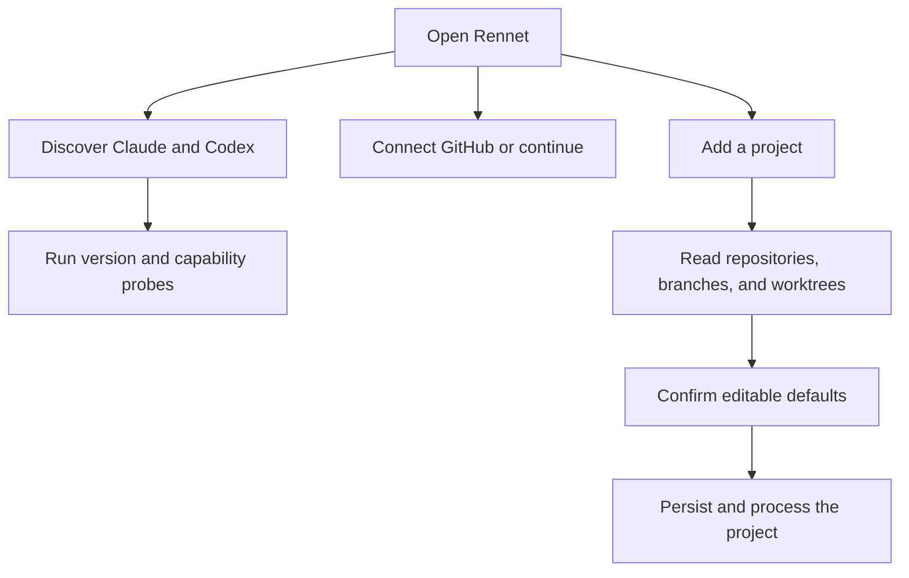

Rennet discovers local tools and repository facts, then stores only preferences
that have live consumers. Settings are split between machine-local files and the
selected repository's `.rennet/` directory.

## First run

The empty Projects screen is the first-run flow. It lets you connect GitHub, add
a project, and see which supported harnesses Rennet found.

Rennet discovers Claude and Codex executables by collecting candidate locations
and running version probes. It does not depend on `which`. GUI applications often
receive a different `PATH` from terminal sessions, so discovery also checks known
install locations. On macOS, the Codex binary bundled with ChatGPT desktop is a
candidate below a user-installed Codex CLI. Every selected Codex candidate must
complete an app-server handshake.

The Claude adapter starts the user's installed `claude` through
`@anthropic-ai/claude-agent-sdk`. The Codex adapter starts the user's installed
`codex app-server`. Each harness owns its authentication; Rennet does not ask for
provider credentials.

The Connect GitHub card signs in with Rennet's OAuth device flow, which needs no
`gh` CLI. Settings also accepts a personal access token and disconnects the
current account. Rennet stores the GitHub credential in an owner-only file under
its data directory and validates it when a GitHub operation needs it. See
[GitHub authentication](../../using/guides/github-auth.md) for the sign-in flow.



## Add a project or workspace

Choose either one repository or a directory containing several repositories.
Rennet reads the selected path and returns an editable draft containing the
detected repositories, worktrees, and primary branch. A workspace can include a
subset of the repositories it contains.

Discovery does not fetch, check out, or create `.rennet/`. Processing starts only
after the project draft is confirmed.

## Global settings

Global settings live in two machine-local files, split by who owns the value:

| File | Holds | Setting | Values | Behavior |
|---|---|---|---|---|
| `~/.rennet/client-settings.json` | Viewer preferences, **outside** the config ladder | Appearance | system, dark, light | Applies the selected color scheme to the app. |
| `~/.rennet/client-settings.json` | | Keybindings | command ID to chord or explicit unbind | Overrides the command catalogue on this machine. |
| `~/.rennet/client-settings.json` | | Coachmarks | `{ seen: MarkId[]; skipAll: boolean }` | Remembers which onboarding [coach marks](../../using/guides/onboarding-tour.md) you have seen and whether you skipped the tour; **Replay Tour** clears it. |
| `~/.rennet/client-settings.json` | | Council routing | `routing.task[jobId][scenario]` to model and effort | Overrides one [Model Council](../concepts/model-council.md) job's assignment in one availability scenario. Written by the Environments Review section; absent until you change a mapping. |
| `~/.rennet/daemon-settings.json` | The global ladder rung as it exists **on this host** | Daemon listener | host and optional port | Allows a configured non-loopback listener for remote clients. |

Appearance and keybindings are personal, app-side choices — never a repo fact,
never written into a working tree — so they sit outside the ladder in
`client-settings.json`. The daemon listener is the host's global rung and lives
in `daemon-settings.json`; the settings surface lists **every paired host's**
`daemon-settings` section, not just the local one. The local host's listener rung
is read directly; a remote or WSL host is listed so it is visible, but its rung
lives on that host and is not read from here.

Settings is a full-view takeover reached by route, not a set of tabs. The left
nav lists four pages — **Environments**, **Appearance**, **Keyboard Shortcuts**,
and **Projects** — each its own route (`/settings/:page`); the active page is read
from the URL, so a page deep-links and reloads directly. **Archived** is a
sibling main-surface route (`/archived`), not a settings page. Appearance edits
the color scheme, theme pack, and code theme; Keyboard Shortcuts edits
keybindings; Environments and Projects are described below.

The Keyboard Shortcuts page lists the app shortcuts that a single global key owner
fires: Search (⌘P), Command Menu (⌘K), New Chat (⌘N), Toggle Sidebar (⌘B), Toggle
Chat (⌘J), and Settings (⌘,). What the page advertises is exactly what fires —
the page and the key owner read one table, so there is no advertised-but-dead
shortcut. Remap a row and the action runs on the new chord right away (the remap
invalidates the settings read the live key owner shares, so it rearms without a
reload) and persists across launches. `⌘R` is bound to nothing, so the reload
chord stays the platform default.

The keybinding recorder needs a platform primary modifier or a bare key and
rejects Shift or Alt combinations. It shows shortcut collisions but still stores
them; the first matching command wins. An invalid stored shortcut falls back to
the catalogue default or remains unbound. A filter narrows the list; Escape clears
the filter before it can close Settings.

If either settings file is malformed, Rennet uses built-in values and disables
writes that would replace the unreadable file. Fix or move the file, then reopen
Settings.

### Migration from `config.json`

Earlier Rennet stored these values in one `~/.rennet/config.json` blob that mixed
viewer preferences with the host's daemon rung. On first read, Rennet migrates
that legacy file **mechanically and losslessly** into the two split files —
appearance and keybindings to `client-settings.json`, the daemon rung to
`daemon-settings.json`. The migration is one-way and deterministic: every field
lands in exactly one target and nothing is dropped. The legacy `config.json` is
left in place, and the presence of either split file means the migration has
already run, so it never repeats.

## Environments

The Environments page is a card per machine. **This Machine** is always present
and never removable — it is where Rennet runs. Remote and WSL hosts appear as
their own cards and can be removed; removing a card forgets the environment and
the projects and sessions Rennet tracked on it, and names those counts in the one
sanctioned confirmation, while stating the machine itself is untouched. Each card
header shows the OS glyph (a `WSL` chip for a WSL host), the environment name
(rename inline — Enter commits, Escape cancels, an emptied name keeps the old
one), and either the host address or a `Local` chip.

The daemon line is the resolver's honest answer: the version when the daemon is
reachable, "Not connected — last seen running Rennet daemon v<n>" for a
previously-seen host, or "Not connected — daemon unreachable, version unknown"
otherwise, never an invented current version. Reconnect appears only when a host
is unreachable; Update Daemon only when a reachable host has an update.

Reconnect performs a real re-handshake with that host's daemon. It reads
"Connecting…" and is disabled for exactly as long as the attempt is in flight,
then either the card turns reachable — because the refreshed status says the host
answered, never because the button was pressed — or the card stays unreachable and
shows the reason the handshake failed. Reconnect re-attempts the connection; it
does not install or start software that was not already there.

Update Daemon performs a real update of that host's daemon, and appears only when
the host reported an actual newer version to move to — where there is no update to
make, or no mechanism to make it with, the button is simply absent. It reads
"Updating the daemon…" while the update is genuinely in flight, then either the
daemon line shows the version the host answered with afterwards, or the card shows
the reason the update did not happen. The mechanism today is a WSL distribution:
Rennet delivers its own server bundle into the distro and restarts the daemon on
it. This machine's daemon ships with the Rennet app, so updating Rennet updates it;
a paired device runs its own Rennet and updates itself. Both say so plainly rather
than offering a button that would do nothing.

Each card carries a **Source Control** and an **Agents** section. Agents on This
Machine are live: Rennet lists the coding harnesses it discovered (Claude, Codex)
with their versions, and disabling one rules it out of reviews on that host
without uninstalling anything. Agent detection runs per host: the daemon asks each
paired machine the only way it can be asked, so a card shows that machine's own
harnesses, and a host the daemon cannot interrogate reads its honest not-detected
line rather than inheriting this machine's answers. The enable decision is stored
per host, so ruling an agent out survives a reload and leaves it running elsewhere.

Source Control lists the forge CLIs detected on that host — GitHub / `gh` only;
GitLab and Bitbucket are planned, not built. It is detected per host exactly as
agents are: the daemon runs the probes on each machine the only way it can, so a
WSL distribution shows its own `gh` and its own auth state, and a host the daemon
cannot interrogate reads its honest "Connect … to detect its tooling" line rather
than inheriting this machine's answer. Its enable toggle is stored per host the
same way. A forge whose binary is not on the host's `PATH` has no row at all,
rather than a stale hit.
When at least one agent is enabled, a Review section exposes Model Mappings — see
[Model Mappings](#model-mappings) below. GitHub sign-in is not a source-control row here — it lives on the front door and the project detail
(see [First run](#first-run)).

### Model Mappings

**Edit Mappings** on a host card opens the [Model Council](../concepts/model-council.md)'s
role-to-model table for that machine. The dialog is **honest-present**: the council's
assignment tables are static and always available, so it lists every review role with
a real model and effort on a fresh install — never a blank waiting on a backend. Values
come from `settings.get`, which resolves the tables live rather than shipping the
surface its own copy.

The column headers are the review-mode switch. **Dual Harness** needs both Claude and
Codex enabled (its hover names the missing one); **Single Harness** shows whichever
provider is enabled. A role that does not run in a scenario renders an em dash, never a
fabricated model — the Flagged Second Seat, for one, exists only under Dual.

Changing a cell writes an override through `settings.setRoleAssignment`. Three things
are true of that write:

- It is **model and effort only**. The harness is never a stored field: it derives from
  the resolved model's provider, so an override cannot pin an incoherent model/harness pair.
- It is **per (role, scenario)** — Rai's ruling of 2026-08-28. Editing a cell in Dual
  moves the `dual` scenario and nothing else; `claudeOnly` and `codexOnly` keep their
  own values, whether those are council defaults or their own overrides. Editing one
  scenario never moves a sibling.
- It is a plain config write. An overridden cell carries an **Overridden** chip, and
  **Reset to default** clears the override so the council table answers again. Nothing is
  copied back on reset — the layer is dropped, so a later table change reaches the cell.

Overrides live in the viewer's `client-settings.json` under `routing.task`, keyed by the
council job id and then the scenario. An install that never changed a mapping has no
`routing` key at all, and clearing the last override removes it again. A malformed
config refuses the write rather than overwriting unreadable bytes.

Model Mappings changes **which model carries a role**. It does not add council jobs,
change the versioned default tables, or persist which providers are available — provider
availability is detected, not configured.

Device pairing lives on the This Machine card, because a pairing bootstraps a
connection to this machine's daemon. See [Device pairing](#device-pairing).

## Repository settings

Repository settings are the **Projects** page, scoped to one project through an
inline picker grouped by environment and resolved from the `?project` URL scope.
Each included repository has its own local project config under
`~/.rennet/projects/<escaped-absolute-path>/config.json`.

| Setting | Values | Behavior |
|---|---|---|
| Map visibility | local, Git-visible | Updates Rennet's entry in `.rennet/.gitignore`. |
| Map promotion | promoted, not promoted | Reports whether a validated map is mirrored into the repository. |
| Runs on | detected host or named WSL distribution | Shows where Git and the harness run, detected from the repository path. Read-only. |
| Review guidance | rules from `.rennet/conventions.json` | Shows the same catalogue review runners consume. |
| Issue tracker | github, jira, linear, none | Names the tracker whose referenced tickets are fetched for review agents. |

Map visibility supports pin and reset operations. A pinned value is stored at
the repository layer. Reset removes that layer's value and returns to the
inherited value. Map promotion and "Runs on" are read-only in Settings;
promotion is a separate project action, and "Runs on" is a detected fact.

The Projects page also carries project **identity** (display name with the
`org/repo` default, and a glyph), **worktree** location and naming pattern, and
the issue tracker's fields — GitHub rides the host's `gh` CLI and exposes no
further fields; JIRA and Linear expose a project key, a base URL, and the *name*
of the environment variable holding the token (never the token itself). All of
these are wired to live commands. The display name writes through
`project.rename`, which the sidebar's own rename also calls, and an emptied name
restores the `org/repo` identity host-side. The glyph, worktree pair, and
issue-tracker fields write through `settings.setProjectValue`, which stores them
on the **repository rung** — the project's own `config.json`, the same layer map
visibility uses — so a per-project answer beats the host's global one, and an
emptied field drops the entry and falls back down the ladder. Guidance rules
write through `settings.setGuidance` into the repository's own
`.rennet/conventions.json`, the file the review runners read.

The per-project issue tracker reaches retrieval, not just the surface: the same
repository rung is what related-context retrieval resolves through, so two
projects on one machine can point at two different trackers. A rule the settings
surface authors keeps its statement and severity; the rationale and anti-pattern
already recorded for a rule survive an edit, and a newly authored rule takes its
own statement as its reason (the catalogue reader requires one).

A daemon that does not serve the per-project rung — an older version on a remote
or WSL host — returns rows without it, and those editors render DISABLED with a
line naming the gap rather than accepting edits that would vanish.

Changing visibility never stages or commits files. Local visibility keeps the
promoted map out of ordinary Git status through Rennet's entry in
`.rennet/.gitignore`. Git-visible removes only that Rennet-owned exclusion.

Rennet detects where a repository runs from its path — a WSL locus from a WSL
path, the host otherwise — and shows it as "Runs on". It is a detected fact, not
a setting: there is no override to choose the host or a distribution.

Malformed repository config resolves to defaults and disables writes for that
row. Invalid entries in `.rennet/conventions.json` are dropped individually and
reported in Settings; valid rules remain available to review runners.

## Provenance

Resolved settings carry the winning layer and every contribution. The current
precedence is:

```text
builtin < detected < global < repo
```

Appearance uses `builtin < global`. Map visibility uses `builtin < repo`. The
per-project preferences resolve through the layers that actually have a producer
today: the glyph and the worktree naming pattern are `builtin < repo`, the
worktree location is `builtin < detected < repo` (the project scout offers a
detected location), and the issue-tracker keys are `builtin < detected < global <
repo` — the tracker is the one section with a host-wide global rung, in
`daemon-settings.json`.

The tracker section resolves as a **unit**, not key by key. The layer that
supplies the effective *kind* is the floor for that tracker's project key, base
URL, and token environment variable: an endpoint offered lower down described a
different provider, so it is masked and the field reads honestly absent. A
project that picks JIRA on its own rung therefore never inherits the host's
Linear URL and token — an incomplete endpoint surfaces as missing config and
retrieval proceeds without it. An endpoint set at or above the kind's layer is a
refinement of the same choice and still applies. The settings surface and
retrieval share that one resolution, so a provenance chip cannot disagree with
the endpoint a review actually calls.
"Runs on" (execution locus) is a detected fact with no ladder layer to override.
The UI renders the resolver's answer instead of recalculating precedence in React.

## Device pairing

The Device Pairing section on the Environments **This Machine** card creates a
single-use code that expires after five minutes. A remote device exchanges it for
a device token and presents that token on future connections. The same section
lists paired devices and revokes them.

A paired device connects directly to the configured daemon, normally over the
user's Tailscale network. There is no Rennet backend. Remote projections use
repository references rather than host paths.

## Local files

```text
~/.rennet/
├── client-settings.json
├── daemon-settings.json
├── devices.json
├── push-tokens.sqlite
└── projects/
    └── <escaped-absolute-path>/
        ├── config.json
        ├── map/
        └── knowledge/

<repo>/.rennet/
├── .gitignore
├── conventions.json
├── map/
└── knowledge/

<daemon data directory>/
├── daemon.json
├── daemon.log
├── github-token
├── projects.json
├── pr-worktrees.json
└── rennet.sqlite
```

The project-store key is the escaped real path of the checkout. Relocation
records and aliases can move local state when a checkout moves. A worktree has
its own local map entry.

## Daemon and CLI

The desktop app starts the daemon when necessary and connects over the same
protocol used by other clients. Closing the last window leaves the app resident
in the tray and the daemon running. Quitting completely stops the daemon owned by
that app instance.

The daemon data directory contains its discovery claim, log, GitHub credential,
project registry, pull-request worktree index, and review database.
`RENNET_USER_DATA` or `--data-dir` selects that directory for a development or
test daemon. It does not relocate the machine-wide `~/.rennet/client-settings.json`,
`daemon-settings.json`, device stores, or path-keyed Repo Maps.

The desktop launcher and `rennet serve` set `UV_THREADPOOL_SIZE` to `16` before
the daemon starts when the variable is absent. An explicit operator value wins.
The pool is shared by filesystem work and GitHub name resolution.

```text
rennet serve
rennet status
rennet stop
rennet map [path] [--base <ref>] [--json <file>] [--projects-dir <dir>] [--enrich]
```

`serve`, `status`, and `stop` operate on the daemon. `map` runs without the
daemon, builds the same deterministic Repo Map used by project processing, and
stores it under the path-keyed local project directory. `--json` exports the map.
`--enrich` runs the model-backed knowledge swarm after the deterministic map has
landed. The Model Council assigns the worker and verify seats from the harnesses
the CLI discovers, and the command exits non-zero when no usable harness is
available.

## Diagnose setup

- Inspect the GitHub account, reconnect, or paste a token from the front door's Connect GitHub card (or a project's detail); it is not a Settings page.
- Run `claude --version` or `codex --version` to check a user-installed harness.
- Fix malformed global or repository config before changing its settings.
- Check the chosen directory when discovery returns no repositories; Rennet does not search outside it.
- Use a separate `RENNET_USER_DATA` value for each development checkout's daemon state.

See [harness adapters](../concepts/harness-adapters.md) for provider process
boundaries and [architecture contracts](../concepts/architecture-contracts.md)
for project-map storage.
