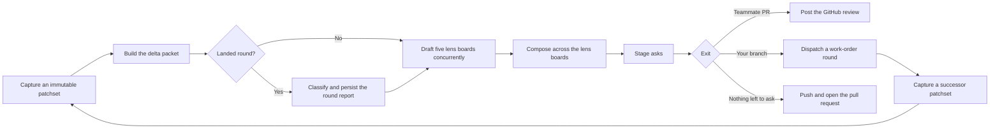

Use this section to find the code that owns a Rennet behavior and the contract it
must preserve. Start with the architecture pages, then follow the subsystem you
are changing.

## Architecture tour



Read these pages in order when you need the whole system:

1. [Architecture overview](./concepts/architecture-overview.md) maps the apps,
   packages, processes, and review loop.
2. [Architecture contracts](./concepts/architecture-contracts.md) defines the
   rules for patchsets, project context, persistence, and outbound work.
3. [The lens pipeline](./concepts/lens-pipeline.md) explains how the delta
   packet reaches the Design, Sequence, Decisions, Flagged, and Noise
   drafters concurrently after the round-report boundary, and how bounded
   repair and deterministic validation freeze their boards.
4. [Surfacing and routing](./concepts/surfacing-and-routing.md) covers model
   output, validation, instructions, and model assignment.
5. [Hand off and the exits](./concepts/handoff-and-exits.md) follows asks and
   the living drafts into a GitHub review, a work-order round, or a pull
   request.

## Find a subsystem

| Change | Read |
| --- | --- |
| Harness discovery, sessions, or events | [Harness adapters](./concepts/harness-adapters.md) and [surfacing and routing](./concepts/surfacing-and-routing.md) |
| Prompt context or model assignment | [Context assembly](./concepts/context-assembly.md) and [model council](./concepts/model-council.md) |
| Definitions, references, or symbol lookup | [Code intelligence](./concepts/code-intelligence.md) |
| Board drafting, lint, or lens lanes | [The lens pipeline](./concepts/lens-pipeline.md) |
| Board storage, elements, or the whiteboard protocol | [How Rennet consumes `@wboard/*`](./reference/whiteboard-consumption.md) |
| Asks, living drafts, or an exit | [Hand off and the exits](./concepts/handoff-and-exits.md) |
| Coding-agent rounds and successor patchsets | [Hand off and the exits](./concepts/handoff-and-exits.md) and [Delta and generations](./concepts/delta-rereview-and-lineage.md) |
| Repository discovery or settings | [Repository bootstrap](./guides/repository-bootstrap.md) and [settings and setup](./guides/settings-and-setup.md) |
| Interface behavior | [Design doctrine](./concepts/design-doctrine.md) and [the lens pipeline](./concepts/lens-pipeline.md) |
| Dependencies or build configuration | [Dependency standard](./reference/dependency-standard.md) and [monorepo map](./reference/monorepo-map.md) |
| How long a stage takes, and on which harness | [Benchmarks](./reference/benchmarks.md) |

## Source and authority

[Contracts and rulings](./decisions/contracts-and-rulings.md) owns cross-cutting
product decisions. [Documentation architecture](./reference/doc-architecture.md)
maps the narrower authorities. Promoted OpenSpec files define accepted behavior,
and [GitHub issues](https://github.com/rbutera/rennet/issues) track active work.

The runtime is split across portable packages and thin applications.
`@rennet/server` composes the daemon and command router. `@rennet/client` owns
browser-safe connections to that daemon. `@rennet/ui` is the vendored component
kit, and `@rennet/app-ui` owns the Rennet application interface built on it.
`apps/desktop` and `apps/mobile` supply platform shells.

## Work in the monorepo

Rennet uses pnpm and Nx. Query resolved configuration instead of guessing a
project name or target:

```sh
pnpm nx show project <name> --json
```

The full local check is:

```sh
pnpm check
```

It runs formatting, architecture, licence, lint, typecheck, test, and build
targets. The adapter build includes Rennet's first-party native executable and
therefore needs the host C toolchain described in the
[dependency standard](./reference/dependency-standard.md). Before editing documentation, read the
[docs style guide](./contributing/docs-style-guide.md) and the
[good docs standard](./contributing/good-docs-standard.md).
