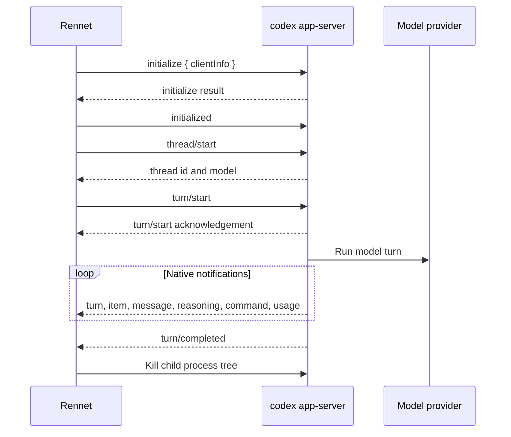

Rennet drives the user's Codex installation through `codex app-server`. The
adapter speaks newline-delimited JSON messages over stdio and maps native Codex
notifications into the common harness event stream.

See [harness adapters](../concepts/harness-adapters.md) for the shared adapter
contract.

## Process model

One `HarnessSession` owns one Codex turn and one child process. Rennet starts
`codex app-server`, initializes it, starts one thread and turn, waits for a
terminal notification, then kills the process tree. It does not pool app-server
children or reuse their threads.

The utility Codex executor uses the same turn runner. Agentic and structured
utility calls therefore share one native protocol implementation.



The wire uses one JSON object per line. Messages omit the `jsonrpc` member. The
transport parses stdout with `readline`, correlates responses by numeric ID, and
surfaces malformed lines as transport failures.

## Turn parameters

`thread/start` carries the working directory, optional model, approval policy
`never`, and sandbox string `danger-full-access`. `turn/start` carries:

- the thread ID and text input;
- the working directory and optional model;
- `sandboxPolicy: { type: "dangerFullAccess" }`;
- `approvalPolicy: "never"`;
- an optional effort value for utility calls;
- an optional structured-output schema.

The agentic `HarnessSession` does not carry an effort field. Structured output is
returned through the native turn protocol; the adapter does not use scratch
files.

`turn/start` is an acknowledgement, not a terminal result. The run ends only on
the matching `turn/completed` notification or a transport, process, parse, or
spawn failure.

## Native methods

| Direction | Method | Use |
|---|---|---|
| request | `initialize` | Identify Rennet and open the protocol session. |
| notification | `initialized` | Complete initialization before thread work. |
| request | `thread/start` | Create the turn-scoped thread. |
| request | `turn/start` | Submit input, policies, model, and optional output schema. |
| request | `turn/interrupt` | Interrupt the owned turn. |
| notification | `turn/started` | Capture the turn ID. |
| notification | `item/started`, `item/completed` | Track native item lifecycle and final agent text. |
| notification | `item/agentMessage/delta` | Stream assistant text. |
| notification | `item/commandExecution/outputDelta`, `item/reasoning/*` | Report command and reasoning activity. |
| notification | `thread/tokenUsage/updated` | Record input, output, cache-read, and reasoning usage. |
| notification | `turn/completed` | Produce the completed, failed, or cancelled outcome. |

The final message comes from the completed `agentMessage` item. The items on
`turn/completed` are a fallback when no streamed completion was captured. Token
usage comes from `thread/tokenUsage/updated`; the adapter does not read Codex log
files.

Foreign responses and notifications never mutate the owned turn. Rennet still
surfaces them as passthrough evidence. Unknown native notifications are also
preserved instead of being dropped.

## Cancellation and failures

An abort after `turn/started` sends `turn/interrupt` and waits up to two seconds
for `turn/completed` with status `interrupted`. It then kills the child. An abort
before the turn ID exists kills the child directly. Closing an already completed
turn sends no interrupt.

The synthetic terminal frame records one of `completed`, `failed`, or
`cancelled`. Failures identify their source as `turn`, `jsonrpc`, `exit`,
`spawn`, or `parse`, and preserve the provider message or process detail.

Rennet configures full access and never-ask approval behavior. Approval requests
that still arrive receive a method-specific response immediately. Command and
file-change requests are accepted. Permission requests receive an empty granted
profile. Unsupported dynamic tools and credential-minting requests receive a
JSON-RPC method error. No approval request is queued for a person.

## MCP configuration

Rennet can give a child an explicit Codex MCP policy:

```text
codex app-server --disable plugins -c mcp_servers=<inline TOML>
```

Codex deep-merges this value with the user's `mcp_servers` table; an empty
inline table does not clear configured entries. Before an explicit policy,
Rennet runs `codex mcp list --json` at the same locus and working directory,
validates the inventory, then writes one table containing the requested
loopback servers plus disabled transport-compatible placeholders for every
other configured server. It also disables Codex plugins for that child so
plugin discovery cannot start background refresh processes outside the explicit
MCP policy. A discovery or shape failure stops before the
app-server child starts. A requested name that already exists in the user's
table also stops before spawn because Codex retains nested transport and header
fields while merging. When Rennet supplies no policy, it skips discovery and the
child inherits the user's configured MCP servers and plugin behavior.

Context Map `partition-worker` turns are the narrow exception: they request an
explicitly empty policy because they read and inspect the repository through
Codex's native tools and do not call MCP tools. The rendered table disables all
ambient entries without removing repository or shell capability. Other Codex
utility jobs keep inheriting the user table. The app-server command does not
accept `--ignore-user-config`.

The installed-CLI control reads the current configured inventory and proves both
the empty and loopback-only policies without starting a model turn:

```sh
RENNET_CODEX_BIN=/path/to/codex pnpm nx run rennet-adapters:real-mcp-isolation
```

The worker fan-out policy follows the harness selected by the Model Council.
Codex partition workers default to 16 lanes with that empty policy; Claude
partition workers keep their separate 12-lane default. A run that supplies an
explicit concurrency overrides either default.

## Discovery

Rennet combines the login-shell `PATH`, the process `PATH`, and known install
directories. Each candidate must be executable, return a version, and complete
an app-server `initialize` handshake. An explicit `RENNET_CODEX_BIN` candidate
wins when it passes those probes.

On macOS the candidates also include:

```text
/Applications/ChatGPT.app/Contents/Resources/codex
~/Applications/ChatGPT.app/Contents/Resources/codex
```

A user-installed CLI ranks above the ChatGPT desktop bundle. Both use the user's
Codex home and authentication. Rennet reads no Codex credential.

On Windows, Rennet uses an installed Codex CLI. The Microsoft Store ChatGPT
package does not expose a spawnable Codex executable to other applications.

For WSL repositories, discovery and process launch run through the repository's
configured WSL locus. `turn/start.cwd` uses the distribution-native path. An asdf
Codex launcher can run through its sibling Node executable when the launcher is
not directly usable from the GUI environment.

Rennet marks Codex unavailable when no candidate passes the handshake. It does
not fall back to another Codex command mode.

## Schema source

The installed Codex binary is the source for the protocol version it speaks:

```sh
codex app-server generate-json-schema --out <directory>
```

Regenerate that schema when implementing or reviewing a native method or field.
The upstream reference is the
[Codex app-server README](https://github.com/openai/codex/blob/main/codex-rs/app-server/README.md).

Hermetic adapter tests use fake bidirectional stdio connections to cover the
handshake, streaming, structured output, usage, cancellation, request replies,
foreign frames, and each terminal failure source. Live tests for the macOS bundle
and WSL transport are opt-in because they spend a real model turn.
