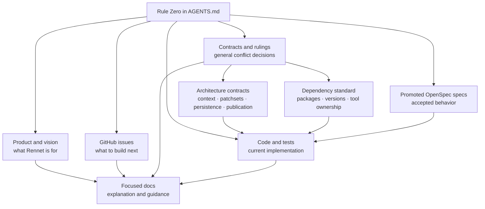

Rennet separates product intent, engineering contracts, accepted behavior, and planned work. This page names the authority for each kind of claim.

## Authority order

Authority is scoped. Rule Zero sits above every source. Product intent, accepted behavior, current implementation, planned work, and engineering registers each answer a different question. [Contracts and rulings](../decisions/contracts-and-rulings.md) owns this model if the two pages disagree.

Read authority by question, not by rank:

- For **what Rennet is for**, [Product and vision](../../using/concepts/product-and-vision.md)
  wins.
- For **what should land next**, the
  [GitHub issue queue](https://github.com/rbutera/rennet/issues) owns priority
  and scope.
- For **cross-cutting product and architecture decisions**,
  [Contracts and rulings](../decisions/contracts-and-rulings.md) wins, and
  it owns two narrower registers beneath it:
  - [Architecture contracts](../concepts/architecture-contracts.md) win on
    project context, immutable patchsets, invalidation, persistence, and
    publication mechanics.
  - [Dependency standard](./dependency-standard.md) wins on
    package choice, versions, licences, toolchain ownership, and dependency
    overlap.

If any register disagrees with the product's intent, that is a documentation bug
to reconcile rather than a reason to pick whichever sentence is convenient.

[Promoted OpenSpec specifications](https://github.com/rbutera/rennet/tree/main/openspec/specs) define accepted behavior. Code and tests show what the current implementation does. When they disagree, document the implementation as current and the accepted contract as planned, with an active tracking link.

## What each page is for

| Need | Source |
|---|---|
| What Rennet is for | [Product and vision](../../using/concepts/product-and-vision.md) |
| What to build or land next | [GitHub issues](https://github.com/rbutera/rennet/issues) |
| Stable product and architecture decisions | [Contracts and rulings](../decisions/contracts-and-rulings.md) |
| Runtime and persistence invariants | [Architecture contracts](../concepts/architecture-contracts.md) |
| Allowed packages and tool ownership | [Dependency standard](./dependency-standard.md) |
| The review interaction model | [Canvas model](../concepts/canvas-model.md) |
| How model jobs are assigned | [Model council](../concepts/model-council.md) |
| How context reaches models | [Context assembly](../concepts/context-assembly.md) |
| How a review becomes an outbound artifact | [Collation and publishing](../concepts/collation-and-publishing.md) |
| Accepted behavior for one capability | [Promoted OpenSpec specifications](https://github.com/rbutera/rennet/tree/main/openspec/specs) |
| What the product does now | Current code and tests |

## Separate current and planned claims

Before describing behavior, check the current code, relevant tests, and resolved Nx configuration. Keep these categories separate:

1. **Current:** the behavior implemented and tested on `main`.
2. **Accepted:** the contract in a promoted OpenSpec specification.
3. **Planned:** accepted behavior that is not implemented and has active tracking.

A planned page declares `status: planned` and a `tracking` URL in its frontmatter. Historical explanations do not belong in the documentation library.

## Maintaining the map

When code alters behavior or a boundary, update the page that owns the fact in the same change. Give each new authority a narrow scope here or fold it into an existing owner.

See the [docs style guide](../contributing/docs-style-guide.md) and the
[good docs standard](../contributing/good-docs-standard.md) before adding
a new section.
