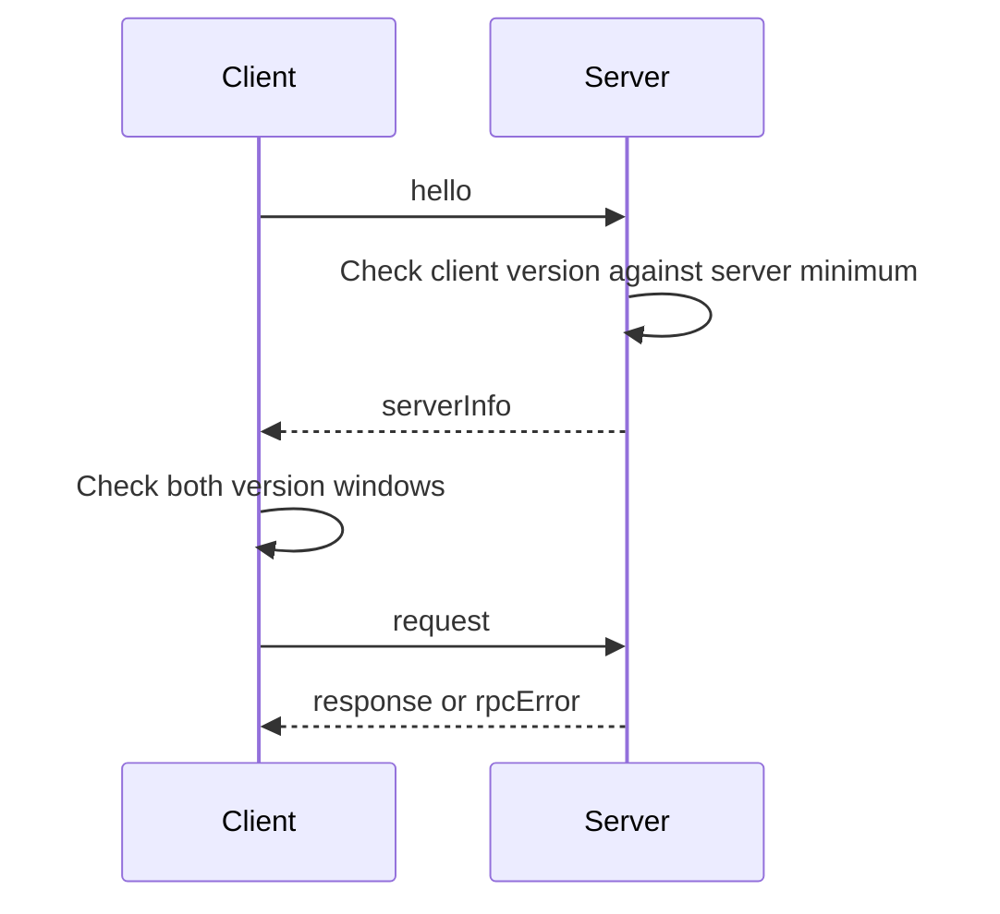

The desktop, mobile client, CLI, and daemon can run builds from different
commits. `packages/protocol/src/session/wire.ts` defines their shared wire
vocabulary and compatibility rules. It is one of the package's five contract
folders — `board/`, `commands/`, `session/`, `delta/`, and `manifests/` — each
exporting through a single seam that the root `index.ts` re-exports.

## Evolve schemas append-only

An existing frame or command payload may gain an optional field. It may not lose
a field, make an optional field required, narrow an accepted value, or change a
field's meaning within the same protocol version.

The `commands` registry (`packages/protocol/src/commands/`) is the single
validation authority for request inputs and response outputs: one table keyed by
command id, each row carrying its input and output schema alongside label,
exposure, and locus metadata. Session envelopes refer to those schemas rather
than copying command payload shapes. All wire payloads must be
JSON-representable.

Use a new protocol version for a change that cannot follow the append-only rule.

## Negotiate a version window

`PROTOCOL_VERSION` is the version this build speaks.
`MIN_COMPATIBLE_PROTOCOL_VERSION` is the oldest version it accepts. Both are
currently `1`.

Two peers are compatible when each version is at least the other peer's minimum:

```ts
import {
  checkProtocolCompatibility,
  MIN_COMPATIBLE_PROTOCOL_VERSION,
  PROTOCOL_VERSION,
} from "@rennet/protocol";

const result = checkProtocolCompatibility(
  {
    version: PROTOCOL_VERSION,
    minCompatible: MIN_COMPATIBLE_PROTOCOL_VERSION,
  },
  {
    version: serverInfo.protocolVersion,
    minCompatible: serverInfo.minCompatibleProtocolVersion,
  },
);
```

The helper returns either `{ compatible: true }` or
`{ compatible: false, reason }`. The reason identifies which side falls outside
the version window.

The server checks `hello.protocolVersion` against its minimum. The client runs
the symmetric check after `serverInfo` supplies the server's current and minimum
versions.



## Advertise optional capabilities

`serverInfo.features` is an open `Record<string, boolean>`. A client reads it
after the handshake and enables only the advertised protocol path. Adding a key
does not require changing the `serverInfo` schema.

| Key | Current meaning |
|---|---|
| `serverRequests` | The daemon can send `serverRequest` and `serverRequestResolved`, and accepts `serverResponse`. Current daemons always advertise it. |
| `attention` | The daemon accepts `presence`, publishes `attentionEvent`, and supports push registration and attention acknowledgement. It is advertised only when the attention system is composed. |
| `act` | The daemon implements `review.interrupt` and `publish.compose`. It is advertised only when those acting seams are composed. |

The client does not send feature-specific frames or commands when the daemon did
not advertise the matching key. A client without `act` disables Stop and publish
composition with update-required copy. A client without `attention` stays silent
on presence and push registration.

## Parse inbound frames tolerantly

Every session frame is a default, non-strict Zod object. Unknown keys are
stripped, so a peer can receive a frame with new optional fields. Tests clone
each frame schema as strict and prove that only the strict clone rejects the
additional field.

The checked-in public projection schema has a different contract. It uses
`additionalProperties: false`, so adding an optional projection field requires
regenerating the fixture in the same change:

```sh
UPDATE_PUBLIC_SCHEMA=1 pnpm nx test rennet-protocol
```

A consumer adopts the regenerated fixture when it adopts the new projection
shape.

## Track compatibility shims

A temporary translation or default for a protocol version uses a greppable
comment with a removal condition:

```ts
// COMPAT(example): explain the accepted shape and translation.
// Remove when MIN_COMPATIBLE_PROTOCOL_VERSION is at least N.
```

Remove the shim when the minimum compatible version makes it unreachable.

## Frame vocabulary

`sessionFrameSchema` is a discriminated union on `type`.

| Frame | Direction | Payload |
|---|---|---|
| `hello` | client to server | client ID, client type, protocol version, optional device token |
| `serverInfo` | server to client | app version, protocol window, feature flags |
| `request` | client to server | request ID, registered command, input |
| `response` | server to client | request ID, output |
| `rpcError` | server to client | request ID, code, message, optional details |
| `progressEvent` | server to client | command ID and project-processing or project-detail event |
| `askStreamEvent` | server to client | review ID and ask-stream event |
| `serverRequest` | server to client | server request ID, kind, payload |
| `serverResponse` | client to server | server request ID, payload |
| `serverRequestResolved` | server to client | server request ID |
| `presence` | client to server | focus, visibility, device class, optional focused review |
| `attentionEvent` | server to client | raised item or cleared IDs |
| `boardEvent` | server to client | board ID and newly appended board events |
| `askProjection` | server to client | session ID and the durable ask projection |
| `roundProgress` | server to client | review ID and one round-progress event |

`progressEvent.event` accepts the `ProjectProgressEvent` union. General project
processing uses `onProgress(commandId)`; per-repository pull-request loading for
project detail uses `onProjectDetailProgress(commandId)`. Both share the wire
frame and remain distinct bridge subscriptions.

`roundProgress` carries one live round-progress event, keyed by the review whose
round is running. It is a **snapshot** frame: each event re-states the whole of
its group's rows rather than a delta, and the client's run machine is a
forward-only fold, so a duplicated or re-ordered frame just restates rows the
fold already holds. The same events are readable as an ordered log through
`session.roundEvents`, which is what a client joining mid-round folds to catch
up — one reducer over one event vocabulary, so a late joiner and a live
subscriber can never disagree about the phase.

Each event carries a **`seq`**: its position in that review's progress log,
monotonic across rounds. The read and the push are two writers over one log and
neither is complete on its own, so the client merges them by `seq` rather than
letting the later arrival install itself wholesale — otherwise an event emitted
while the catch-up read was in flight is dropped, and a dropped terminal event
leaves the surface reading "still working" over a finished round. Because a
`dispatched` starts a round, everything before the newest one belongs to a round
that is over and is discarded, so a late frame from the previous round cannot
settle the round now running. `seq` is optional on the wire: a daemon that
predates it emits none, and those events fold in arrival order exactly as before.

A round's progress rows are two shapes, each a union on `status` so the illegal
states are unrepresentable rather than guarded at every read. A **step row** (a
prep line, the worker turn) settles `done` with its own account of itself, or
`failed` with a reason. A **lens lane** adds `drafted` — its board is written but
cross-lens coverage has not run — and its `done` state *requires* the
`carrying forward` / `reworked` verdict. There is no settled lane without a
verdict and no failed row without a reason.

A client can also outrun the daemon it is connected to. An older daemon does not
answer `session.rounds` or `session.roundEvents` at all, and the rounds surfaces
say so in the daemon's own words rather than rendering the empty ledger that
would read as "no rounds have completed". This is a statement, not a handshake:
there is no capability negotiation behind it and nothing for the reviewer to
clear.

`hello.deviceToken` carries a paired device's bearer token. Loopback clients omit
it. The daemon hashes stored device tokens and uses the presented value to
classify a projected connection. See [remote access](../../using/guides/remote-access.md).

Server requests use `serverRequestId` for correlation. The client answers with
`serverResponse`; `serverRequestResolved` removes a prompt that no longer needs an
answer. The wire and bridge are live even when no product flow raises a request.

`rpcError.code` accepts the known values `invalid_input`, `command_failed`,
`incompatible_protocol`, and `unknown_command`, plus other strings. New error
codes therefore remain append-only.

## Attention contract

The `attention` feature adds `presence` and `attentionEvent` frames. Presence
lets the daemon choose in-app delivery or push for each client. Attention raises
and clears are broadcast to authorized clients, so acknowledging an item clears
the corresponding state across connected surfaces.

The closed attention family set is:

| Family | Delivery class |
|---|---|
| `ask-pending` | high priority |
| `review-finished` | high priority |
| `turn-failed` | high priority |
| `handoff-completed` | normal |
| `publish-ready` | normal |
| `processing-finished` | in-app only |

An `ask-pending` item may carry up to four unique answer actions. Other families
may not carry actions. `device.registerPush.disabledFamilies` can mute normal
families for one device; high-priority families remain delivered.

Projected reviews may include `attention: { needsYou, running }`. The daemon
derives `needsYou` from active high-priority attention and `running` from its
in-flight review-turn registry. The field is optional because its availability
follows the advertised attention capability.

All WebSocket traffic uses this frame union. New transport behavior starts with
an append-only schema, a documented feature key when negotiation is required,
and compatibility tests for both sides of the version window.
