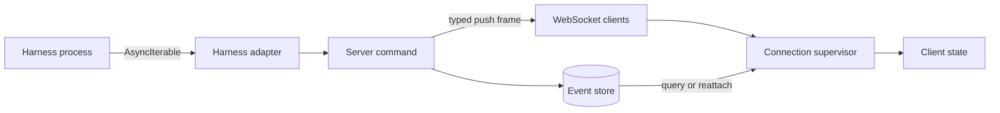

Rennet keeps durable review state separate from transient streams. Commands and append-only events own persisted truth; typed push channels update connected clients without becoming a second state store.

## Data flow

A client can reconstruct durable state by querying the daemon. Push frames carry progress, ask deltas, attention, and other session updates that matter while work is running.

## Mechanism ownership

| Situation | Mechanism | Contract |
| --- | --- | --- |
| Harness output | `AsyncIterable<HarnessEvent>` | One consumer receives adapter-ordered events with pull-based backpressure. |
| Cancellation | `AbortSignal` | One signal travels from the command to the harness process. |
| Durable review changes | Commands and append-only events | Transactions remain replayable and inspectable after restart. |
| Command progress | `onProgress(commandId)` | The server assigns order and sends terminal state that agrees with the command result. |
| Project-detail progress | `onProjectDetailProgress(commandId)` | Each completed forge repository advances the pull-request fetch count for one project-detail request. |
| Review conversation | T3's own thread subscription | The conversation is a T3 Code thread; its client runtime owns the subscription, and Rennet carries no parallel channel for it. |
| A board being written | `lensDraft` push frame, keyed by review | One frame per accepted board tool call, carrying the elements that call touched and the position each holds. Live only, never replayed: a reader that joins mid-draft reads `board.draft` for the board as it stands and folds from that snapshot's revision. |
| Connection state | `ConnectionSupervisor.subscribe` | Each client receives reachability changes from one supervisor. |
| Project-detail repository fetches | `mapLimit(..., 4, ...)` | At most four forge repositories fetch pull requests at once. A sibling semaphore (`MAX_CONCURRENT_LIST_FETCHES`) bounds pull-request list fetches the same way. |

Rennet does not use RxJS. These mechanisms cover one-pass harness streams, keyed WebSocket subscriptions, cancellation, and explicit concurrency without placing durable review state in an observable graph.

## Stream rules

Every push path has these properties:

1. One owner and an explicit disposal point.
2. A named backpressure, replay, or coalescing policy.
3. Source-assigned ordering.
4. One fan-out point per process.
5. A query or reattach path for state that must survive a disconnect.

The server owns progress terminal events, so the final pushed state agrees with the resolved command. It keeps a bounded progress replay suffix for a reconnecting client.

Project-detail progress uses `prs-start` followed by one `repo-prs` event for
each completed forge repository. This channel has no server replay buffer or
live-run registry; the resolved `project.detail` response is authoritative. The
client keeps the registration across bridge replacement so later frames still
reach the same listener, but it does not invent missed counts.

The board element stream is deliberately unthrottled, and the lane's live line
deliberately is not. They are different shapes: a live line republishes the whole
lane list on every tick, so five lanes once pushed five snapshots a second to
change one digit, and it is capped at four publications a second for that reason.
An element frame carries one call's worth of elements and stands alone, and its
rate is bounded by the seat's accepted writes — tens per board, over a turn that
runs for a minute. A refused call publishes nothing at all.

Element frames also stay out of the round-progress log. That log is capped at 200
events per review and replayed to a client that joins mid-round; a board's writes
are of the same order on their own, so folding them in would evict the round's own
phase events. The catch-up for a drafting board is the `board.draft` snapshot
instead of a replay.

Every element frame carries the generation it belongs to and a revision monotonic
within `(generation, lens)`. A superseded drafting attempt owns a different
generation, so a reader rendering the live one drops its frames rather than
merging two attempts' boards.

`ConnectionSupervisor` keeps `onProgress`, `onProjectDetailProgress`,
`onAskProjection`, `onRoundProgress`, and attention registrations above the
current socket. After reconnect, it attaches those listeners to the new bridge
and re-reads `ask.read` for subscribed reviews. Components do not create
transports or retry loops.

## Persistence boundary

Streams never replace the event store. A client that reconnects reads durable review state, then resumes eligible subscriptions. Persisted review events remain the restart boundary; a conversation's own durability belongs to its T3 thread.

## Where to go next

- [Architecture overview](../concepts/architecture-overview.md) maps the complete runtime.
- [Architecture contracts](../concepts/architecture-contracts.md) defines durable state and process boundaries.
- [Harness adapters](../concepts/harness-adapters.md) explains the `AsyncIterable` contract.
