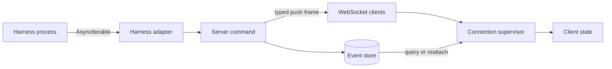

Rennet keeps durable review state separate from transient streams. Commands and append-only events own persisted truth; typed push channels update connected clients without becoming a second state store.

## Data flow

A client can reconstruct durable state by querying the daemon. Push frames carry progress, ask deltas, attention, and other session updates that matter while work is running.

## Mechanism ownership

| Situation | Mechanism | Contract |
| --- | --- | --- |
| Harness output | `AsyncIterable<HarnessEvent>` | One consumer receives adapter-ordered events with pull-based backpressure. |
| Cancellation | `AbortSignal` | One signal travels from the command to the harness process. |
| Durable review changes | Commands and append-only events | Transactions remain replayable and inspectable after restart. |
| Command progress | `onProgress(commandId)` | The server assigns order and sends terminal state that agrees with the command result. |
| Project-detail progress | `onProjectDetailProgress(commandId)` | Each completed forge repository advances the pull-request fetch count for one project-detail request. |
| Review conversation | `onAskStream(reviewId)` | The server broadcasts deltas by review and the client filters them by subscription. |
| Connection state | `ConnectionSupervisor.subscribe` | Each client receives reachability changes from one supervisor. |
| Bounded concurrent jobs | `p-queue` | Concurrency stays explicit at the scheduler that owns the work. |
| Project-detail repository fetches | `mapLimit(..., 4, ...)` | At most four forge repositories fetch pull requests at once. |

Rennet does not use RxJS. These mechanisms cover one-pass harness streams, keyed WebSocket subscriptions, cancellation, and explicit concurrency without placing durable review state in an observable graph.

## Stream rules

Every push path has these properties:

1. One owner and an explicit disposal point.
2. A named backpressure, replay, or coalescing policy.
3. Source-assigned ordering.
4. One fan-out point per process.
5. A query or reattach path for state that must survive a disconnect.

The server owns progress terminal events, so the final pushed state agrees with the resolved command. It keeps a bounded progress replay suffix for a reconnecting client. Ask deltas broadcast to every authorized socket subscribed to the review.

Project-detail progress uses `prs-start` followed by one `repo-prs` event for
each completed forge repository. This channel has no server replay buffer or
live-run registry; the resolved `project.detail` response is authoritative. The
client keeps the registration across bridge replacement so later frames still
reach the same listener, but it does not invent missed counts.

`ConnectionSupervisor` keeps `onProgress`, `onProjectDetailProgress`,
`onAskStream`, and attention registrations above the current socket. After
reconnect, it attaches those listeners to the new bridge and runs
`review.reattach` for subscribed reviews. Components do not create transports or
retry loops.

## Persistence boundary

Streams never replace the event store. A client that reconnects reads durable review state, then resumes eligible subscriptions. Transient model prose can continue over the ask stream, while persisted conversation and review events remain the restart boundary.

## Where to go next

- [Architecture overview](../concepts/architecture-overview.md) maps the complete runtime.
- [Architecture contracts](../concepts/architecture-contracts.md) defines durable state and process boundaries.
- [Harness adapters](../concepts/harness-adapters.md) explains the `AsyncIterable` contract.
