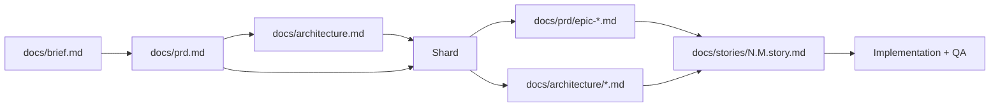

BMAD-METHOD (Breakthrough Method of Agile AI-Driven Development,
[bmad-code-org/BMAD-METHOD](https://github.com/bmad-code-org/BMAD-METHOD)) drives
a team of role agents — analyst, PM, architect, scrum master, dev, QA — through a
planning-to-code pipeline. Its output is a fixed set of Markdown documents under
`docs/`, generated from YAML templates that carry both the section tree and the
elicitation instructions. This page documents that artifact shape so the spec
lens can render it as structured objects rather than raw Markdown.

## Version note

Two lines exist. **v4** (`bmad-method` on npm, installs `.bmad-core/`) is the
mature, widely-deployed format and the one the machine's `zcf:bmad-init` skill
installs via `npx bmad-method@latest install -i claude-code`. Its artifacts are
clean structured Markdown — the richest target for a viewer, and what this page
documents in full. **v6** (the current major, the "BMM" module system) restructures
planning into stepped workflows and shifts some outputs to `.html` reports and an
`ARCHITECTURE-SPINE.md`; its differences are flagged in the [v6 section](#v6-differences).
Everything below is v4 unless marked.

## Artifact set and flow

The pipeline is a linear document chain. Each stage's agent reads the prior
document and writes the next.



| Stage | Agent | Output path | Template |
|---|---|---|---|
| Project brief | analyst | `docs/brief.md` | `project-brief-tmpl.yaml` |
| PRD | PM | `docs/prd.md` | `prd-tmpl.yaml` |
| Architecture | architect | `docs/architecture.md` | `architecture-tmpl.yaml` |
| Sharded epics | PO / `shard-doc` | `docs/prd/epic-{n}*.md` | — (split) |
| Sharded arch | PO / `shard-doc` | `docs/architecture/*.md` | — (split) |
| Story | scrum master | `docs/stories/{epic}.{story}.story.md` | `story-tmpl.yaml` |

Paths, sharding, and versions are declared in **`.bmad-core/core-config.yaml`**,
which a viewer should read first to locate everything:

```yaml
markdownExploder: true
prd:
  prdFile: docs/prd.md
  prdSharded: true
  prdShardedLocation: docs/prd
  epicFilePattern: epic-{n}*.md
architecture:
  architectureFile: docs/architecture.md
  architectureSharded: true
  architectureShardedLocation: docs/architecture
devStoryLocation: docs/stories
devLoadAlwaysFiles:
  - docs/architecture/coding-standards.md
  - docs/architecture/tech-stack.md
  - docs/architecture/source-tree.md
qa:
  qaLocation: docs/qa
slashPrefix: BMad
```

### Sharding convention

Large planning docs are split into smaller files so an agent loads only what a
story needs. Sharding splits a document on its level-2 (`##`) headings: each `##`
section becomes its own file in the sharded location, plus an `index.md`. `prd.md`
explodes into `docs/prd/epic-1-*.md`, `docs/prd/epic-2-*.md`, …;
`architecture.md` explodes into `docs/architecture/tech-stack.md`,
`coding-standards.md`, `source-tree.md`, and so on. With `markdownExploder: true`
this runs via the `@kayvan/markdown-tree-parser` (`md-tree explode`) tool;
otherwise the PO agent does it by hand. The three `devLoadAlwaysFiles` fragments
are the always-in-context architecture slices every dev story inherits.

## PRD template (`prd-tmpl.yaml` → `docs/prd.md`)

Template id `prd-template-v2`. Top-level sections, in order (exact `##` headings):

1. **Goals and Background Context** — `Goals` (bullet list of outcomes),
   `Background Context` (1–2 paragraphs), `Change Log` (table: Date, Version,
   Description, Author).
2. **Requirements** *(elicit)* — `Functional` as a numbered list prefixed **FR**
   (`FR6: The Todo List uses AI to detect duplicate items…`); `Non Functional`
   prefixed **NFR** (`NFR1: AWS usage must stay within free-tier limits…`).
3. **User Interface Design Goals** *(elicit, conditional on UX)* — `Overall UX
   Vision`, `Key Interaction Paradigms`, `Core Screens and Views`,
   `Accessibility: {None|WCAG AA|WCAG AAA}`, `Branding`, `Target Device and
   Platforms`.
4. **Technical Assumptions** *(elicit)* — `Repository Structure:
   {Monorepo|Polyrepo}`, `Service Architecture` (CRITICAL DECISION),
   `Testing Requirements` (CRITICAL DECISION), `Additional Technical Assumptions`.
5. **Epic List** *(elicit)* — one line per epic, sequential; Epic 1 must establish
   foundational infrastructure plus a first slice of functionality.
6. **Epic {{n}} {{title}}** *(elicit, repeatable)* — an epic goal, then nested
   `Story {{n}}.{{m}} {{title}}` blocks. Each story carries an
   `As a … / I want … / so that …` statement and an **Acceptance Criteria**
   numbered list (`{{criterion_number}}: {{criteria}}`).
7. **Checklist Results Report** — output of the pm-checklist.
8. **Next Steps** — `UX Expert Prompt`, `Architect Prompt` (handoff prompts).

The FR/NFR prefixes and the epic→story→AC nesting are the load-bearing structure:
requirements are a numbered registry, and epics inline their stories with
per-story numbered ACs before those stories are later extracted into standalone
files.

## Architecture template (`architecture-tmpl.yaml` → `docs/architecture.md`)

Template id `architecture-template-v2`. Seventeen top-level sections; sections
2–15 all set `elicit: true` (the agent must present options and get sign-off per
section):

1. Introduction (subsection `starter-template` elicits)
2. High Level Architecture
3. **Tech Stack** — the definitive selection table, declared the *single source
   of truth all other docs must reference*; versions pinned exactly, never "latest"
4. Data Models *(repeatable)*
5. Components
6. External APIs *(conditional, repeatable)*
7. Core Workflows
8. REST API Spec *(conditional)*
9. Database Schema
10. Source Tree
11. Infrastructure and Deployment
12. Error Handling Strategy
13. Coding Standards
14. Test Strategy and Standards
15. Security
16. Checklist Results Report
17. Next Steps

Sections 3, 10, and 13 (tech-stack, source-tree, coding-standards) are the ones
sharded out and force-loaded into every dev story via `devLoadAlwaysFiles`.

## Story template (`story-tmpl.yaml` → `docs/stories/{epic}.{story}.story.md`)

Template id `story-template-v2`, filename
`docs/stories/{{epic_num}}.{{story_num}}.{{story_title_short}}.md`. This is the
most machine-friendly artifact: a fixed section tree with per-section **owner**
and **editors** role locks, so a viewer knows which agent may touch what.

- **Status** — a `choice` field: `Draft → Approved → InProgress → Review → Done`.
  Owner scrum-master; editors scrum-master + dev-agent. This is an explicit state
  machine, not free text.
- **Story** *(elicit)* — the templated statement:
  `**As a** {{role}}, **I want** {{action}}, **so that** {{benefit}}`.
- **Acceptance Criteria** *(elicit)* — a numbered list copied from the epic file.
- **Tasks / Subtasks** *(elicit)* — a nested checkbox list; each task cites the AC
  numbers it satisfies: `- [ ] Task 1 (AC: 1, 3)` with indented `- [ ] Subtask`.
  Editors: scrum-master + dev-agent (the dev ticks boxes as it goes).
- **Dev Notes** *(elicit)* — context extracted from the sharded architecture so
  the dev agent "should NEVER need to read the architecture documents". Nested
  **Testing** subsection lists the test standards to follow.
- **Change Log** — table (Date, Version, Description, Author).
- **Dev Agent Record** — written only by the dev agent: `Agent Model Used`,
  `Debug Log References`, `Completion Notes List`, `File List`.
- **QA Results** — written only by the qa-agent, its review of the finished work.

The role-locked sections encode a handoff: the scrum-master authors the top half,
the dev fills `Dev Agent Record` and checks tasks, the QA writes `QA Results` — a
clean provenance boundary per section.

## v6 differences

v6 reorganizes planning into stepped workflow folders (`workflow.md` +
`step-01-init.md`, `step-02-discovery.md`, … + `templates/`) with menu-driven
elicitation per step (`[A] Advanced Elicitation [P] Party Mode [C] Continue`)
instead of one template with inline `elicit: true` flags. Phase outputs shift:
analysis and planning emit some `.html` reports and a `product-brief`/`PRD` pair;
architecture defaults to a single `ARCHITECTURE-SPINE.md` (hydratable to other
formats) rather than the 17-section document; epics and stories come from a
`create-epics-and-stories` workflow with an optional `stories.yaml` for autonomous
dispatch; and `bmad-build` converges implementation. The v4 story anatomy
(Status pipeline, AC, tasks) largely survives, but the clean per-section YAML
template with owner/editor locks is a v4 feature. Community reports note v4's
guided architecture output is often richer than v6's. For a viewer, **v4's
Markdown artifacts are the stabler, better-structured target**; detect the line
by the presence of `.bmad-core/core-config.yaml` (v4) versus the BMM module
layout (v6).

## Rendering affordances

What a spec lens can reliably exploit, because BMAD encodes it as structure
rather than prose:

- **Status pipeline.** The story `Status` is an enumerated choice
  (`Draft/Approved/InProgress/Review/Done`) — render it as a stage indicator and
  drive board columns off it directly.
- **FR/NFR registry.** PRD requirements are numbered lists with stable `FR`/`NFR`
  prefixes — parse into an addressable requirement table and deep-link `FR6`.
- **AC → task traceability.** Story tasks carry inline `(AC: n, m)` back-references
  to numbered acceptance criteria — render the coverage graph and flag any AC no
  task cites, or any task citing none.
- **Epic → story tree.** `epicFilePattern` + the story filename convention
  (`{epic}.{story}.*`) give an unambiguous two-level tree; group stories under
  epics and show per-epic status rollups from the status field.
- **Section provenance.** The story template's owner/editors locks map each
  section to the role that wrote it (SM header, dev record, QA results) — render
  author badges without inference.
- **Config-driven discovery.** `core-config.yaml` names every path and sharding
  choice, so a viewer resolves the whole artifact set deterministically instead of
  guessing directories.

Weaker targets: `Dev Notes`, `Background Context`, and prose subsections are
free-form Markdown — render as-is. Sharded files reduce to concatenation, so
reconstructing the full PRD or architecture means reading `index.md` plus its
siblings in heading order.

Source: [bmad-code-org/BMAD-METHOD](https://github.com/bmad-code-org/BMAD-METHOD)
(`bmad-core/templates/*.yaml`, `bmad-core/core-config.yaml`) and the
[v6 workflow map](https://docs.bmad-method.org/reference/workflow-map/).
