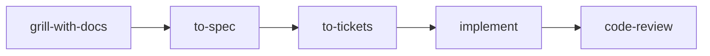

`grill-with-docs` is a Matt Pocock skill: a relentless interview that sharpens a
plan while writing the vocabulary and the hard decisions into the repo as they
resolve. This page records the exact shape of what it writes so Rennet's spec
lens can render those artifacts as objects rather than raw Markdown. It
describes the skill's artifacts, not Rennet behaviour.

**Read this first: `grill-with-docs` is not a spec format in the Kiro sense.**
It produces no fixed file triplet and no single spec document. Its `SKILL.md` is
one line — *"Call the Skill tool twice, for 'grilling' and 'domain-modeling'"* —
so the artifacts are entirely those of its `domain-modeling` companion: a
`CONTEXT.md` glossary and zero-or-more ADRs under `docs/adr/`. Most of what a
session decides is never written to a file at all. A lens targeting this skill
is really targeting `domain-modeling`'s two output formats plus the knowledge
that they appear incrementally, mid-conversation.

## What a session writes

Three things come out of a session, and only two of them touch disk:

| What resolved | Where it lands |
|---|---|
| A term — the project's own word for a thing | `CONTEXT.md`, inline, the moment it resolves |
| A decision that is hard to reverse, surprising, and a real trade-off | An ADR under `docs/adr/` |
| Everything else decided | The conversation only — no file |

Both file kinds are created **lazily**: nothing is scaffolded up front, and a
`CONTEXT.md` or `docs/adr/` directory appears only when the first term or ADR
crystallises. A well-run session commonly yields a sharper glossary and **zero**
ADRs — that is working as designed, not a failure.

## Directory layout

Most repos are single-context: one glossary at the root, ADRs beneath `docs/`.

```text
/
├── CONTEXT.md
├── docs/
│   └── adr/
│       ├── 0001-event-sourced-orders.md
│       └── 0002-postgres-for-write-model.md
└── src/
```

A `CONTEXT-MAP.md` at the root marks the repo as **multi-context**. The map
names each context, points at its own `CONTEXT.md`, and lists relationships;
root `docs/adr/` then holds system-wide decisions while each context keeps its
own:

```text
/
├── CONTEXT-MAP.md
├── docs/
│   └── adr/                     ← system-wide decisions
├── src/
│   ├── ordering/
│   │   ├── CONTEXT.md
│   │   └── docs/adr/            ← context-specific decisions
│   └── billing/
│       ├── CONTEXT.md
│       └── docs/adr/
```

The presence of `CONTEXT-MAP.md` is the single signal that decides which layout
applies.

## CONTEXT.md

A glossary and nothing else — deliberately devoid of implementation detail,
spec prose, or scratch notes. Fixed shape: a title, a one-or-two-sentence
framing, then a `## Language` list of terms. Each term is a bold key, a tight
definition, and an opinionated `_Avoid_` line naming the synonyms it displaces:

```markdown
# Ordering

Receives and tracks customer orders through to dispatch.

## Language

**Order**:
A customer's request for goods, from placement to dispatch.
_Avoid_: Purchase, transaction

**Invoice**:
A request for payment sent to a customer after delivery.
_Avoid_: Bill, payment request

**Customer**:
A person or organization that places orders.
_Avoid_: Client, buyer, account
```

Rules the format enforces: be opinionated (one canonical word per concept,
rivals under `_Avoid_`); keep definitions to one or two sentences, defining what
a thing *is*, not what it does; include only terms specific to this project's
domain (general programming concepts do not belong); group terms under `###`
subheadings only when natural clusters emerge, otherwise a flat list.

`CONTEXT-MAP.md` (multi-context only) is itself structured: a `## Contexts` list
of links with one-line summaries, and a `## Relationships` list of directional
edges between contexts.

## ADRs

ADRs live in `docs/adr/` with sequential numbering `0001-slug.md`,
`0002-slug.md` — scan the directory for the highest number and increment. The
template is intentionally almost nothing:

```markdown
# {Short title of the decision}

{1-3 sentences: what's the context, what did we decide, and why.}
```

That is the whole required body — an ADR can be a single paragraph, because the
value is recording *that* a decision was made and *why*, not filling sections.
Three optional additions appear only when they earn their place:

- **`Status` frontmatter** — `proposed | accepted | deprecated | superseded by
  ADR-NNNN`, used when decisions get revisited.
- **Considered Options** — only when the rejected alternatives are worth
  remembering.
- **Consequences** — only when non-obvious downstream effects need calling out.

An ADR is offered **only** when all three gates hold at once: the decision is
hard to reverse, surprising without context, and the result of a real trade-off.
Miss any one and no ADR is written. This gate is why most sessions produce none.

## The interview shape

The `grilling` primitive drives the questioning, and it has a structure a
reader can recognise even though it is never persisted. The agent models the
plan as a **design tree** and works it in **rounds**:

- The **frontier** is every decision whose prerequisites are already settled —
  the questions answerable *now* without guessing at still-open answers.
- Each round asks the whole frontier at once, numbered, each with a recommended
  answer, then waits for the user before the next round.
- Each answer reshapes the tree; settled decisions push the frontier outward.
  The session ends when the frontier is empty.
- Facts are the agent's job (dispatched to sub-agents against the filesystem or
  tools); decisions are the user's.

Questions follow a fixed on-screen format — an anchor a transcript renderer can
key on, though it is chat output, not a repo artifact:

```text
❓ **Q1** - **<question title>**: <question body, may include options>

➡️ <recommended answer>
```

`domain-modeling` runs concurrently with this interview: it challenges terms
that conflict with the existing glossary, sharpens fuzzy language into canonical
terms, stress-tests relationships with concrete edge-case scenarios,
cross-checks claims against the code, and writes each resolved term into
`CONTEXT.md` the instant it resolves rather than batching at the end.

## How it differs from plain grilling

`grilling` (and its no-repo sibling `grill-me`) is **stateless**: the interview
runs and the shared understanding lives only in the context window. The
`-with-docs` variant adds exactly one thing — **statefulness**. The same
interview, pointed at a repo, drives `domain-modeling` so that terms and
qualifying decisions land as real files *during* the session. There is no
extra format, no extra sections; the only difference is that a subset of the
conversation is now durable on disk.

## Where it sits



`grill-with-docs` is the head of the build chain and runs *before* anything is
written as a spec. This matters for a lens: the glossary and ADRs are **inputs
to** a later spec, not the spec itself. The documented, known-sharp edge of the
skill is that precise answers (ordering guarantees, negative requirements,
numeric defaults) that never qualify for an ADR exist only in the transcript,
so the artifacts on disk can look complete while missing the decision that was
actually made.

## Rendering affordances

What a spec lens can rely on, from most to least structured:

- **CONTEXT.md glossary entries as cards.** The `**Term**:` / definition /
  `_Avoid_: a, b` triple is a rigid, parseable shape — render each term as a
  card with its definition and its displaced synonyms badged separately. This is
  the highest-value parse a Markdown viewer cannot do, and the glossary is the
  skill's primary output.
- **CONTEXT-MAP relationships as a graph.** In a multi-context repo the
  `## Relationships` edges (`Ordering → Fulfillment`, `Ordering ↔ Billing`) are
  directional links between named contexts — a lens can draw the context map
  directly, and each `## Contexts` link resolves to that context's glossary.
- **ADR index and status.** `docs/adr/NNNN-slug.md` sequential filenames give a
  reliable ordered index and title for free. Where present, the optional
  `Status` frontmatter (`proposed`/`accepted`/`deprecated`/`superseded by`) is a
  parseable badge and a `superseded by ADR-NNNN` edge between records.
- **The three-gate provenance.** Every ADR that exists passed *hard to
  reverse + surprising + real trade-off*, so a lens can present ADRs as the
  repo's small set of load-bearing decisions rather than a change log.

Softer targets, parse defensively:

- **ADR bodies are near-free-form.** Below the title, most ADRs are one to three
  sentences of prose with no section structure; Considered Options and
  Consequences are optional and often absent. Do not expect fixed headings.
- **The decisions are mostly not on disk.** The design tree, the frontier, the
  numbered Q/A rounds, and the bulk of what a session settles live in the
  transcript, not in any file. A lens fed only the repo sees the glossary and
  the few ADRs, never the reasoning that produced them — surface that gap rather
  than implying the artifacts are the whole story.

## Sources

- Installed skill (Matt Pocock skills marketplace, v1.2.3):
  `~/.claude/plugins/cache/mattpocock/mattpocock-skills/1.2.3/skills/engineering/grill-with-docs/SKILL.md`
  (the one-line delegation).
- Companion formats:
  `.../engineering/domain-modeling/SKILL.md`,
  `.../domain-modeling/CONTEXT-FORMAT.md`,
  `.../domain-modeling/ADR-FORMAT.md`.
- Interview primitive:
  `.../productivity/grilling/SKILL.md` (design tree, rounds, frontier, question
  format).
- Skill reference page:
  `.../docs/engineering/grill-with-docs.md`, also published at
  [aihero.dev](https://aihero.dev) (behaviour, known failure modes, chain
  position).
- Upstream: [github.com/mattpocock](https://github.com/mattpocock) skills
  repository.
